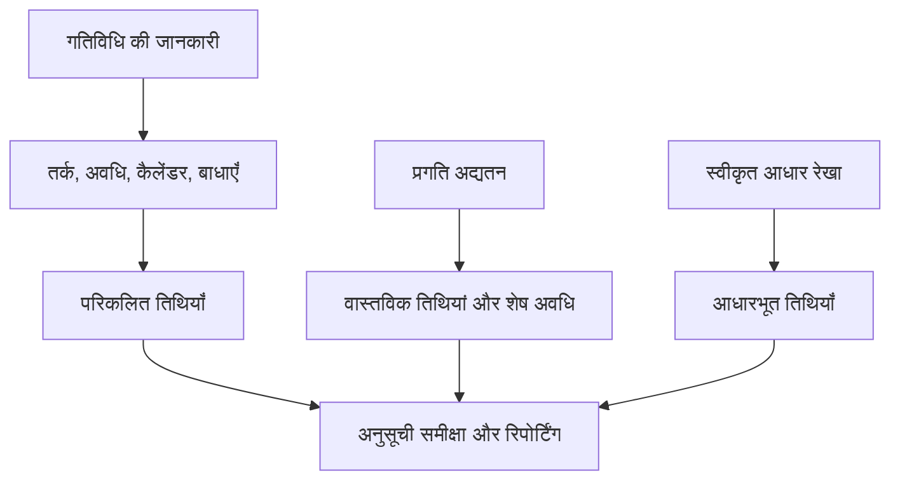

# पी6 में तिथियाँ

प्रिमावेरा पी6 में तारीखें भ्रमित करने वाली हो सकती हैं क्योंकि किसी गतिविधि में केवल एक आरंभ तिथि और एक समाप्ति तिथि नहीं होती है। इसमें लेआउट और प्रोजेक्ट सेटिंग्स के आधार पर योजनाबद्ध तिथियां, वर्तमान शेड्यूल तिथियां, प्रारंभिक तिथियां, देर तिथियां, वास्तविक तिथियां, आधारभूत तिथियां, बाधा तिथियां, अपेक्षित तिथियां और कभी-कभी बाहरी या पूर्वानुमान-संबंधित तिथियां हो सकती हैं।

इन सभी तारीखों का मतलब एक ही नहीं है। कुछ की गणना सीपीएम तर्क द्वारा की जाती है। कुछ को प्रगति अद्यतन के दौरान दर्ज किया जाता है। कुछ का उपयोग तुलना के लिए किया जाता है। कुछ का उपयोग शेड्यूल को नियंत्रित या सीमित करने के लिए किया जाता है। शेड्यूल गुणवत्ता, पीएमओ रिपोर्टिंग, विलंब विश्लेषण तैयारी और बुनियादी परियोजना नियंत्रण के लिए अंतर को समझना आवश्यक है।

सबसे महत्वपूर्ण प्रश्न सरल है: यह तारीख मुझे क्या बता रही है, और यह कहाँ से आई है?

## P6 में इतनी सारी तारीखें क्यों हैं?

P6 केवल दिनांक सूची नहीं है. यह एक गणना मॉडल है. सॉफ्टवेयर गतिविधि अवधि, कैलेंडर, रिश्ते, बाधाएं, संसाधन, प्रगति स्थिति और डेटा तिथि से तारीखों की गणना करता है।

अलग-अलग दिनांक फ़ील्ड मौजूद हैं क्योंकि योजनाकारों को अलग-अलग प्रश्नों के उत्तर देने की आवश्यकता होती है:

- मूल योजना क्या थी?
- वर्तमान पूर्वानुमान क्या है?
- वास्तव में क्या हुआ था?
- कौन सी गतिविधि सबसे पहले शुरू या ख़त्म हो सकती है?
- नवीनतम क्या है जो परियोजना को प्रभावित किए बिना प्रारंभ या समाप्त कर सकता है?
- क्या कोई बाधा गतिविधि को बाध्य कर रही है?
- वर्तमान योजना की तुलना आधार रेखा से कैसे की जाती है?

समस्या तब शुरू होती है जब इन दिनांक प्रकारों को उनके उद्देश्य को समझे बिना एक साथ मिला दिया जाता है।

## डेटा की तारीख

डेटा तिथि कोई गतिविधि तिथि नहीं है, लेकिन यह नियंत्रित करती है कि सभी गतिविधि तिथियों की व्याख्या कैसे की जानी चाहिए।

डेटा दिनांक वास्तविक प्रदर्शन और पूर्वानुमान कार्य के बीच की सीमा है। डेटा तिथि से पहले कार्य को वास्तविक या स्थितिबद्ध किया जाना चाहिए। डेटा दिनांक के बाद कार्य का पूर्वानुमान लगाया जाना चाहिए।

यदि किसी गतिविधि में डेटा तिथि के बाद वास्तविक तिथियां हैं, तो यह आमतौर पर एक स्थिति त्रुटि है। यदि कोई खुली गतिविधि बिल्कुल डेटा दिनांक पर बिना किसी ड्राइविंग तर्क के शुरू होती है, तो यह अनुपलब्ध अनुक्रमण का संकेत दे सकता है। यदि अपेक्षित समापन डेटा दिनांक से पहले है, तो यह पुरानी अद्यतन जानकारी का संकेत दे सकता है।

किसी भी गतिविधि तिथि की समीक्षा करने से पहले, डेटा तिथि की पुष्टि करें।

## प्रारंभ करें और समाप्त करें

प्रारंभ और समाप्ति मुख्य शेड्यूल तिथियां हैं जिन्हें अधिकांश उपयोगकर्ता P6 लेआउट में देखते हैं। वे शेड्यूल डेटा के आधार पर गतिविधि के लिए वर्तमान गणना या निर्धारित तिथियों का प्रतिनिधित्व करते हैं।

शुरू न हुई गतिविधियों के लिए, प्रारंभ और समाप्ति पूर्वानुमानित तिथियां हैं। प्रगतिरत गतिविधियों के लिए, वे वास्तविक स्थिति और शेष पूर्वानुमान को जोड़ सकते हैं। पूरी की गई गतिविधियों के लिए, उन्हें वास्तविक तिथियों के अनुरूप होना चाहिए।

ये आमतौर पर रिपोर्ट, लुकहेड शेड्यूल और प्रबंधन चर्चाओं में उपयोग की जाने वाली तारीखें हैं। हालाँकि, उनके पीछे के तर्क और स्थिति की जाँच किए बिना उन्हें स्वीकार नहीं किया जाना चाहिए।

उत्तर देने के लिए प्रारंभ और समाप्ति का उपयोग करें: वर्तमान में गतिविधि कब प्रारंभ और समाप्त होने के लिए निर्धारित है?

## शीघ्र प्रारंभ और शीघ्र समापन

प्रारंभिक प्रारंभ और प्रारंभिक समाप्ति सीपीएम गणना तिथियां हैं। वे पूर्ववर्ती तर्क, कैलेंडर, बाधाओं और वर्तमान शेड्यूल स्थितियों के आधार पर किसी गतिविधि को शुरू और समाप्त करने की शुरुआती तारीखें दिखाते हैं।

प्रारंभिक तिथियां महत्वपूर्ण हैं क्योंकि वे शेड्यूल गणना के फॉरवर्ड पास को समझाने में मदद करती हैं। वे दिखाते हैं कि तर्क की अनुमति मिलते ही काम नेटवर्क के माध्यम से कैसे आगे बढ़ सकता है।

यदि कई गतिविधियां डेटा तिथि पर प्रारंभिक शुरुआत में हैं, तो समीक्षक को यह जांचना चाहिए कि क्या वे वास्तव में तैयार हैं या क्या वे खुली शुरुआत, प्रतिबंधित गतिविधियां, या कमजोर रूप से जुड़ी गतिविधियां हैं।

उत्तर देने के लिए प्रारंभिक प्रारंभ और प्रारंभिक समाप्ति का उपयोग करें: वर्तमान नेटवर्क के अनुसार यह गतिविधि कितनी जल्दी हो सकती है?

## देर से शुरू और देर से ख़त्म

लेट स्टार्ट और लेट फिनिश नवीनतम तारीखों को दिखाते हैं जो शेड्यूल सेटअप के आधार पर प्रोजेक्ट फिनिश या कंट्रोलिंग फिनिश पॉइंट में देरी किए बिना गतिविधि शुरू या खत्म कर सकते हैं।

देर की तारीखें बैकवर्ड पास का हिस्सा हैं। इनका उपयोग फ्लोट की गणना के लिए किया जाता है। प्रारंभिक और देर की तारीखों के बीच का अंतर यह दिखाने में मदद करता है कि गतिविधि में कितना लचीलापन है।

यदि देर की तारीखें अजीब लगती हैं, तो बाधाओं, लापता उत्तराधिकारियों, खुली समाप्ति, कैलेंडर, या असामान्य परियोजना समाप्ति सेटिंग्स की तलाश करें।

उत्तर देने के लिए देर से प्रारंभ और देर से समाप्त का उपयोग करें: नियंत्रित समापन तिथि को प्रभावित करने से पहले यह गतिविधि कितनी देर तक चल सकती है?

## वास्तविक प्रारंभ और वास्तविक समाप्ति

वास्तविक प्रारंभ और वास्तविक समाप्ति स्थिति तथ्य हैं। उन्हें यह बताना चाहिए कि वास्तव में क्षेत्र में या परियोजना निष्पादन में क्या हुआ।

वास्तविक शुरुआत का मतलब है कि गतिविधि वास्तव में शुरू हुई। वास्तविक समापन का अर्थ है गतिविधि वास्तव में पूरी हुई। इन तिथियों का उपयोग योजना लक्ष्य या पूर्वानुमान तिथियों के रूप में नहीं किया जाना चाहिए।

वास्तविक तिथियां सामान्यतः डेटा तिथि पर या उससे पहले होनी चाहिए। यदि वास्तविक तिथियां डेटा तिथि के बाद की हैं, तो शेड्यूल भविष्य के काम को पहले ही शुरू या पूरा होने की रिपोर्ट कर रहा है, जो अद्यतन विश्वसनीयता को कमजोर करता है।

उत्तर देने के लिए वास्तविक प्रारंभ और वास्तविक समाप्ति का उपयोग करें: वास्तव में क्या हुआ है?

## नियोजित प्रारंभ और नियोजित समाप्ति

नियोजित शुरुआत और नियोजित समाप्ति को अक्सर गलत समझा जाता है। शेड्यूल कैसे बनाया जाता है, अद्यतन किया जाता है और प्रदर्शित किया जाता है, इसके आधार पर, ये फ़ील्ड औपचारिक अनुमोदित आधार रेखा की तरह व्यवहार नहीं कर सकते हैं।

कुछ उपयोगकर्ता उम्मीद करते हैं कि नियोजित तिथियां मूल योजना को हमेशा के लिए दिखाएंगी। यह हमेशा एक सुरक्षित धारणा नहीं होती. औपचारिक विचरण रिपोर्टिंग के लिए, नियोजित तिथियों पर आकस्मिक रूप से भरोसा करने की तुलना में एक निर्धारित आधार रेखा आमतौर पर अधिक विश्वसनीय होती है।

नियोजित प्रारंभ और नियोजित समाप्ति का उपयोग केवल तभी करें जब आपकी परियोजना नियंत्रण प्रक्रिया स्पष्ट रूप से परिभाषित करती हो कि उनका रखरखाव कैसे किया जाता है और उनका क्या मतलब है।

## बेसलाइन प्रारंभ और बेसलाइन समाप्ति

बेसलाइन तारीखें एक निर्दिष्ट बेसलाइन शेड्यूल से आती हैं। इनका उपयोग अनुमोदित योजना के विरुद्ध वर्तमान अनुसूची की तुलना करने के लिए किया जाता है।

उदाहरण के लिए, BL1 स्टार्ट और BL1 फिनिश स्वीकृत बेसलाइन से गतिविधि की शुरुआत और समाप्ति तिथियां दिखा सकते हैं। वर्तमान प्रारंभ और समाप्ति नवीनतम पूर्वानुमान दिखाते हैं। उनके बीच का अंतर भिन्नता दर्शाता है।

बेसलाइन तिथियां प्रदर्शन रिपोर्टिंग, शेड्यूल भिन्नता, परिवर्तन नियंत्रण और विलंब विश्लेषण तैयारी के लिए केंद्रीय हैं।

उत्तर देने के लिए बेसलाइन स्टार्ट और बेसलाइन फिनिश का उपयोग करें: वर्तमान शेड्यूल की तुलना अनुमोदित योजना से कैसे की जाती है?

## बाधा दिनांक

बाधा तिथियों पर दिनांक नियंत्रण लगाया जाता है। वे बाधा प्रकारों से जुड़े हुए हैं जैसे स्टार्ट ऑन, स्टार्ट ऑन या आफ्टर, फिनिश ऑन, फिनिश ऑन या बिफोर, अनिवार्य स्टार्ट, या अनिवार्य फिनिश।

बाधाएँ स्वतः ग़लत नहीं होतीं। कुछ वास्तविक अनुबंध तिथियों, पहुंच प्रतिबंध, परमिट रिलीज, आउटेज विंडो या मालिक की आवश्यकताओं का प्रतिनिधित्व करते हैं। लेकिन बाधाएँ गायब तर्क को छिपा भी सकती हैं या अवास्तविक तारीखों को बाध्य कर सकती हैं।

कठिन बाधाएँ, विशेष रूप से अनिवार्य प्रारंभ और अनिवार्य समाप्ति, दुर्लभ और प्रलेखित होनी चाहिए।

उत्तर देने के लिए बाधा तिथि का उपयोग करें: क्या कोई थोपी गई तिथि इस गतिविधि को नियंत्रित या सीमित कर रही है?

## अपेक्षित समाप्ति और पूर्वानुमान-प्रकार की तिथियाँ

जब प्रोजेक्ट टीम किसी गतिविधि के समाप्त होने की उम्मीद करती है, तो उसे कैप्चर करने के लिए अपडेट के दौरान अक्सर अपेक्षित फिनिश का उपयोग किया जाता है। सेटिंग्स और प्रक्रियाओं के आधार पर, अपेक्षित तिथियां पी6 द्वारा गतिविधि तिथियों की गणना या प्रदर्शित करने के तरीके को प्रभावित कर सकती हैं।

अपेक्षित समाप्ति प्रगतिरत कार्य के लिए उपयोगी हो सकती है जब फ़ील्ड टीमें यथार्थवादी समाप्ति अपेक्षा प्रदान करती हैं। लेकिन अगर इसका रखरखाव न किया जाए तो यह बासी हो सकता है। डेटा दिनांक से पहले अपेक्षित समाप्ति एक सामान्य चेतावनी संकेत है।

कुछ परियोजनाएँ रिपोर्टिंग के लिए पूर्वानुमान-संबंधित दिनांक फ़ील्ड या उपयोगकर्ता-परिभाषित फ़ील्ड का भी उपयोग करती हैं। मुख्य बात उन्हें स्पष्ट रूप से परिभाषित करना है ताकि टीम को पता चले कि उनकी गणना की गई है, मैन्युअल रूप से दर्ज किया गया है या आयात किया गया है।

उत्तर देने के लिए अपेक्षित या पूर्वानुमानित तिथियों का उपयोग करें: टीम की नवीनतम अपेक्षा क्या है, और क्या यह एक परिभाषित अद्यतन प्रक्रिया द्वारा नियंत्रित है?

## प्राथमिक और माध्यमिक बाधा तिथियाँ

P6 चयनित बाधा फ़ील्ड के आधार पर, किसी गतिविधि पर एक से अधिक बाधा स्थितियाँ रख सकता है। प्राथमिक बाधा आमतौर पर मानक लेआउट में दिखाई जाने वाली मुख्य बाधा होती है, लेकिन एक द्वितीयक बाधा भी व्याख्या को प्रभावित कर सकती है।

शेड्यूल समीक्षा के दौरान केवल प्रारंभ और समाप्ति पर ध्यान न दें। लेआउट में बाधा प्रकार और बाधा दिनांक फ़ील्ड जोड़ें। यदि तिथियां अपेक्षा के अनुरूप व्यवहार नहीं कर रही हैं, तो बाधाएं जांचने वाली पहली चीजों में से एक हैं।

## आपको कौन सी तिथियों का उपयोग करना चाहिए?

प्रत्येक तिथि का उसके उद्देश्य के लिए उपयोग करें:

- वर्तमान शेड्यूल पूर्वानुमान के लिए प्रारंभ और समाप्ति का उपयोग करें।
- सीपीएम गणना को समझने और फ़्लोट करने के लिए प्रारंभिक और अंतिम तिथियों का उपयोग करें।
- पूर्ण या आरंभ किए गए कार्य के लिए वास्तविक तिथियों का उपयोग करें।
- अनुमोदित योजना के विरुद्ध भिन्नता के लिए बेसलाइन तिथियों का उपयोग करें।
- लगाए गए दिनांक नियंत्रणों की पहचान करने के लिए बाधा तिथियों का उपयोग करें।
- अपेक्षित समाप्ति या पूर्वानुमान फ़ील्ड का उपयोग केवल तभी करें जब अद्यतन प्रक्रिया उन्हें परिभाषित करे।
- पूर्वानुमान कार्य से वास्तविक प्रदर्शन को अलग करने के लिए डेटा दिनांक का उपयोग करें।

## सामान्य गलतियां

एक सामान्य गलती गलत तारीखों की तुलना करना है। उदाहरण के लिए, यदि नियोजित तिथियों को परियोजना प्रक्रिया द्वारा नियंत्रित नहीं किया जाता है, तो वर्तमान शुरुआत की योजनाबद्ध शुरुआत से तुलना करना सार्थक नहीं हो सकता है।

एक और गलती वास्तविक शुरुआत को पूर्वानुमान के रूप में मानना ​​है। वास्तविक तिथियों को वास्तविक प्रदर्शन का प्रतिनिधित्व करना चाहिए, इरादे का नहीं।

तीसरी गलती है दिन के समय की अनदेखी करना। पी6 समय के साथ तिथियों को संग्रहीत करता है, और कैलेंडर अंतर स्पष्ट एक-दिवसीय बदलाव या फ्लोट आश्चर्य पैदा कर सकते हैं।

अंत में, बाधा तिथियों को छिपाने से बचें। यदि कोई तारीख लगाई गई है, तो समीक्षकों को उसे देखना होगा।

## निष्कर्ष

पी6 में तारीखें शक्तिशाली हैं क्योंकि वे शेड्यूल कहानी के विभिन्न हिस्सों को बताती हैं। वर्तमान तिथियाँ पूर्वानुमान दर्शाती हैं। प्रारंभिक और देर की तारीखें सीपीएम गणना की व्याख्या करती हैं। वास्तविक तारीखें रिकॉर्ड करती हैं कि क्या हुआ। बेसलाइन तिथियां तुलना का समर्थन करती हैं। बाधा तिथियाँ थोपे गए नियंत्रणों को प्रकट करती हैं। अपेक्षित तिथियां अपडेट का समर्थन कर सकती हैं जब उन्हें ठीक से बनाए रखा जाए।

एक मजबूत शेड्यूल समीक्षा में केवल यह नहीं पूछा जाता कि "तारीख क्या है?" इसमें पूछा गया है, "यह किस तरह की तारीख है, यह कहां से आई है और क्या यह विश्वसनीय है?"

जब प्रोजेक्ट टीम प्रत्येक दिनांक फ़ील्ड का अर्थ समझती है, तो शेड्यूल को समझाना आसान हो जाता है, ऑडिट करना आसान हो जाता है और प्रोजेक्ट नियंत्रण के लिए अधिक विश्वसनीय हो जाता है।
## संबंधित सामग्री
- [वास्तविक तिथियाँ प्रिमावेरा पी6 में डेटा तिथि से बाद की हैं - अवलोकन](../../05_metrics_hi/12_actual_date_greater_than_data_date/01_overview_template.md)
- [पी6 में अवधि प्रकार](../06_DURATION%20TYPES%20IN%20P6/06_DURATION%20TYPES%20IN%20P6.md)
- [P6 में कैलेंडर](../08_CALENDARS%20IN%20P6/08_CALENDARS%20IN%20P6.md)
