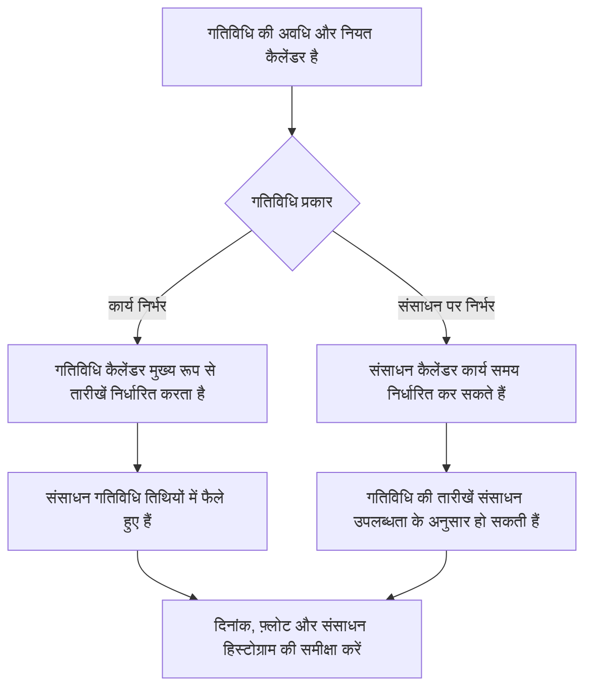

# P6 में कैलेंडर

कैलेंडर प्राइमेरा पी6 शेड्यूल की शांत नींवों में से एक हैं। वे परिभाषित करते हैं कि काम कब हो सकता है। वे पी6 को बताते हैं कि कौन से दिन कार्य दिवस हैं, कौन से दिन गैर-कार्य दिवस हैं, एक दिन में कितने घंटे उपलब्ध हैं, और दिन के किस समय काम शुरू और खत्म होता है।

क्योंकि कैलेंडर पर्दे के पीछे काम करते हैं, इसलिए उन्हें कम आंकना आसान है। किसी शेड्यूल में मजबूत तर्क और उचित अवधि हो सकती है, लेकिन यदि कैलेंडर गलत या असंगत हैं, तो तारीखें अभी भी भ्रामक हो सकती हैं।

शेड्यूल गुणवत्ता, संसाधन योजना, महत्वपूर्ण पथ समीक्षा और अद्यतन अनुशासन के लिए कैलेंडर को समझना आवश्यक है।

## P6 में एक कैलेंडर क्या करता है

P6 में, एक कैलेंडर अवधि को तारीखों में परिवर्तित करता है। यदि किसी गतिविधि की अवधि 10 कार्य दिवस है, तो P6 को यह जानना होगा कि कार्य दिवस का क्या अर्थ है। क्या यह सोमवार से शुक्रवार है? क्या शनिवार शामिल है? क्या कार्यदिवस 8 घंटे, 10 घंटे या 12 घंटे है? क्या काम 7:00 या 8:00 बजे शुरू होता है? क्या छुट्टियाँ शामिल नहीं हैं?

कैलेंडर उन सवालों का जवाब देता है।

कैलेंडर का प्रभाव:

- गतिविधि प्रारंभ और समाप्ति तिथियां.
- प्रारंभिक और देर की तारीखें.
- कुल फ्लोट.
- महत्वपूर्ण पथ और सबसे लंबा पथ.
- संसाधन उपयोग का समय.
- संबंध अंतराल व्याख्या.
- अद्यतन के दौरान दिनांक परिवर्तन।
- आगे की ओर देखें और रिपोर्टिंग सटीकता।

एक कैलेंडर केवल एक प्रशासनिक सेटअप आइटम नहीं है। यह शेड्यूल गणना का हिस्सा है.

## एक से अधिक कैलेंडर की आवश्यकता क्यों पड़ सकती है?

कई परियोजनाओं के लिए एक से अधिक कैलेंडर की आवश्यकता होती है क्योंकि सभी कार्य समान कार्य पैटर्न का पालन नहीं करते हैं।

उदाहरणों में शामिल हैं:

- ऑफिस इंजीनियरिंग का काम 5 दिन के कैलेंडर पर होता है।
- 6 दिवसीय कैलेंडर पर साइट निर्माण कार्य।
- 24 घंटे के कैलेंडर पर काम बंद या बंद।
- रात्रि पाली में कमीशनिंग कार्य।
- मालिक की पहुंच वाली खिड़कियां।
- पर्यावरणीय प्रतिबंध.
- आपूर्तिकर्ता कार्य दिवसों के आधार पर खरीद गतिविधियाँ।
- निरीक्षकों, विक्रेताओं, या विशेष दल के लिए संसाधन-विशिष्ट कैलेंडर।

हर चीज़ के लिए एक कैलेंडर का उपयोग करना सरल लग सकता है, लेकिन यह अवास्तविक तारीखें उत्पन्न कर सकता है। यदि कमीशनिंग केवल रात में ही हो सकती है, तो सामान्य दिन का कैलेंडर गलत हो सकता है। यदि कोई विक्रेता केवल सप्ताह के दिनों में काम करता है, तो 7-दिवसीय निर्माण कैलेंडर उपलब्धता को बढ़ा-चढ़ाकर बता सकता है।

लक्ष्य अनेक कैलेंडर बनाना नहीं है. लक्ष्य शेड्यूल को अनावश्यक रूप से जटिल बनाए बिना वास्तविक कामकाजी परिस्थितियों को मॉडल करने के लिए पर्याप्त कैलेंडर बनाना है।

## गतिविधि कैलेंडर

गतिविधि कैलेंडर सीधे किसी गतिविधि को सौंपा जाता है। यह उस गतिविधि की अवधि और तिथियों की गणना करने के लिए उपयोग किए जाने वाले कार्य समय को परिभाषित करता है, विशेष रूप से कार्य पर निर्भर गतिविधियों के लिए।

उदाहरण के लिए, यदि "इंस्टॉल केबल ट्रे" में 6-दिवसीय निर्माण कैलेंडर है, तो P6 उस कैलेंडर के आधार पर अपने कार्य की गणना करेगा। यदि शनिवार एक कार्य दिवस है, तो गतिविधि 5-दिवसीय कैलेंडर की तुलना में पहले समाप्त हो सकती है।

गतिविधि कैलेंडर आमतौर पर सामान्य शेड्यूल गतिविधियों के लिए मुख्य कैलेंडर नियंत्रण होते हैं।

गतिविधि कैलेंडर का उपयोग तब करें जब कार्य स्वयं एक परिभाषित कार्य पैटर्न का पालन करता हो, जैसे दिन की पाली, रात की पाली, शटडाउन कार्य, या कार्यालय कार्य।

## संसाधन कैलेंडर

संसाधन कैलेंडर परिभाषित करते हैं कि कोई संसाधन कब उपलब्ध है। एक संसाधन एक व्यक्ति, चालक दल, उपकरण आइटम, विक्रेता विशेषज्ञ, या अन्य निर्दिष्ट संसाधन हो सकता है।

संसाधन कैलेंडर विशेष रूप से महत्वपूर्ण हो जाते हैं जब गतिविधियाँ संसाधन पर निर्भर होती हैं या जब परियोजना संसाधन समतलन या विस्तृत संसाधन योजना का उपयोग कर रही होती है।

उदाहरण के लिए, एक गतिविधि को 6-दिवसीय निर्माण कैलेंडर सौंपा जा सकता है, लेकिन इसे सौंपा गया विशेषज्ञ निरीक्षक केवल सोमवार से बुधवार तक ही उपलब्ध हो सकता है। यदि गतिविधि संसाधन-संचालित है, तो P6 केवल गतिविधि कैलेंडर के बजाय संसाधन कैलेंडर के आधार पर तिथियों की गणना कर सकता है।

संसाधन कैलेंडर तब उपयोगी होते हैं जब संसाधन उपलब्धता एक वास्तविक शेड्यूलिंग बाधा होती है। यदि उन्हें सौंपा तो गया है लेकिन उनका रखरखाव नहीं किया गया तो वे भ्रम भी पैदा कर सकते हैं।

## गतिविधि और संसाधन कैलेंडर इंटरफ़ेस कैसे

गतिविधि कैलेंडर और संसाधन कैलेंडर के बीच संबंध गतिविधि प्रकार, संसाधन सेटिंग्स और शेड्यूल गणना व्यवहार पर निर्भर करता है।

कार्य पर निर्भर गतिविधियों के लिए, गतिविधि कैलेंडर आमतौर पर गतिविधि अवधि के लिए प्राथमिक आधार होता है। संसाधन कैलेंडर अभी भी संसाधन प्रसार और उपयोग को प्रभावित कर सकते हैं।

संसाधन पर निर्भर गतिविधियों के लिए, कार्य निष्पादित होने पर संसाधन कैलेंडर प्रभावित हो सकते हैं। इसका मतलब है कि संसाधन कैलेंडर गतिविधि तिथियों को अधिक सीधे प्रभावित कर सकता है।

मुख्य बात यह है कि कैलेंडरों की एक साथ समीक्षा की जानी चाहिए। एक गतिविधि कैलेंडर कह सकता है कि कार्य संभव है, जबकि संसाधन कैलेंडर कहता है कि निर्दिष्ट संसाधन उपलब्ध नहीं है। वह बेमेल डीसिंक्रनाइज़ेशन बना सकता है।

## कैलेंडर डीसिंक्रनाइज़ेशन का क्या अर्थ है

कैलेंडर डीसिंक्रनाइज़ेशन तब होता है जब शेड्यूल में विभिन्न कैलेंडर उस वास्तविक तरीके से संरेखित नहीं होते हैं जिस तरह से प्रोजेक्ट को काम करना चाहिए।

सामान्य उदाहरणों में शामिल हैं:

- गतिविधि 6-दिवसीय कैलेंडर का उपयोग करती है, लेकिन निर्दिष्ट संसाधन 5-दिवसीय कैलेंडर का उपयोग करते हैं।
- गतिविधि दिन-शिफ्ट कैलेंडर का उपयोग करती है, लेकिन संसाधन रात की पाली का उपयोग करते हैं।
- दो जुड़ी हुई गतिविधियाँ दिन में अलग-अलग प्रारंभ और समाप्ति समय का उपयोग करती हैं।
- लैग की व्याख्या ऐसे कैलेंडर के माध्यम से की जाती है जो कार्य से मेल नहीं खाता।
- कॉपी की गई गतिविधि किसी अन्य प्रोजेक्ट का पुराना कैलेंडर रखती है।
- संसाधन कैलेंडर में वे छुट्टियाँ होती हैं जो गतिविधि कैलेंडर में नहीं होती हैं।

परिणाम भ्रामक हो सकता है. तारीखें अप्रत्याशित रूप से बदल सकती हैं. गतिविधियाँ एक दिन बाद समाप्त होती दिखाई दे सकती हैं। फ़्लोट बिना किसी स्पष्ट तार्किक कारण के बदल सकता है। संसाधन हिस्टोग्राम निष्पादन योजना से मेल नहीं खा सकते हैं। वास्तविक अनुक्रम के बजाय कैलेंडर व्यवहार के कारण महत्वपूर्ण पथ आगे बढ़ सकता है।

## कैलेंडर बेमेल के कारण होने वाली समस्याएँ

कैलेंडर बेमेल होने से शेड्यूल गुणवत्ता संबंधी कई समस्याएं पैदा हो सकती हैं।

सबसे पहले, यह भ्रामक तारीखें बना सकता है। ऐसा लग सकता है कि कोई कार्य अधिक समय लेता है क्योंकि कैलेंडर में कार्य अवधि कम है।

दूसरा, यह फ्लोट को विकृत कर सकता है। विभिन्न कैलेंडरों पर होने वाली गतिविधियाँ प्रारंभिक और देर की तारीखों की गणना ऐसे तरीकों से कर सकती हैं जिन्हें समझाना कठिन है।

तीसरा, यह महत्वपूर्ण पथ को प्रभावित कर सकता है। एक पथ महत्वपूर्ण हो सकता है क्योंकि एक कैलेंडर काम को प्रतिबंधित करता है, इसलिए नहीं कि तर्क अनुक्रम वास्तव में नियंत्रित कर रहा है।

चौथा, यह संसाधन रिपोर्टिंग को नुकसान पहुंचा सकता है। एक संसाधन हिस्टोग्राम उन तिथियों पर संसाधन की मांग दिखा सकता है जब संसाधन वास्तव में उपलब्ध नहीं है, या जो मांग दिखाई देनी चाहिए वह गायब हो सकती है।

अंततः, यह अद्यतन भ्रम पैदा कर सकता है। जब डेटा तिथि चलती है, तो अलग-अलग कैलेंडर पर गतिविधियां अलग-अलग प्रतिक्रिया दे सकती हैं, जिससे शेड्यूल की स्थिति और समीक्षा करना कठिन हो जाता है।

## डीसिंक्रनाइज़ेशन को कैसे हल करें

प्रोजेक्ट कैलेंडर मानक की पहचान करके प्रारंभ करें। सामान्य कार्यसप्ताह, कार्यदिवस प्रारंभ और समाप्ति समय, छुट्टियां, शटडाउन अवधि और विशेष कार्य विंडो को परिभाषित करें।

फिर शेड्यूल में सभी कैलेंडर की समीक्षा करें। जाँच करना:

- कैलेंडर का नाम और उद्देश्य.
- काम कर दिन।
- दैनिक कार्य के घंटे.
- प्रारंभ और समाप्ति समय.
- छुट्टियाँ और अपवाद.
- कैलेंडर प्रकार.
- कैलेंडर को सौंपी गई गतिविधियाँ.
- कैलेंडर को संसाधन सौंपे गए.

इसके बाद, उन गतिविधियों की समीक्षा करें जिनमें तारीखें अजीब लगती हैं। यदि उपलब्ध हो तो गतिविधि कैलेंडर, गतिविधि प्रकार, प्रारंभ, समाप्ति, प्रारंभिक प्रारंभ, प्रारंभिक समाप्ति, कुल फ़्लोट, संसाधन और संसाधन कैलेंडर के लिए कॉलम जोड़ें।

यदि कोई कैलेंडर गलत है तो उसे सुधारें। यदि गतिविधि गलत कैलेंडर को सौंपी गई है, तो असाइनमेंट बदलें। यदि संसाधन कैलेंडर वैध है लेकिन अप्रत्याशित परिणाम दे रहा है, तो पुष्टि करें कि गतिविधि संसाधन पर निर्भर होनी चाहिए या कार्य पर निर्भर होनी चाहिए।

सुधार करने के बाद, शेड्यूल की पुनर्गणना करें और प्रभावित तिथियों, फ़्लोट, महत्वपूर्ण पथ और संसाधन हिस्टोग्राम की समीक्षा करें।

## अच्छा कैलेंडर शासन

कैलेंडरों को तर्क और बाधाओं की तरह नियंत्रित किया जाना चाहिए। उन्हें बिना नियंत्रण के नहीं बढ़ना चाहिए।

अच्छे अभ्यास में शामिल हैं:

- एक स्पष्ट नामकरण परंपरा का प्रयोग करें.
- अनुमोदित परियोजना कैलेंडर का एक सीमित सेट रखें।
- दस्तावेज करें कि विशेष कैलेंडर क्यों मौजूद हैं।
- पुराने शेड्यूल से अप्रयुक्त कैलेंडरों की प्रतिलिपि बनाने से बचें।
- आधारभूत अनुमोदन से पहले गतिविधि कैलेंडर असाइनमेंट की समीक्षा करें।
- यदि संसाधन लोडिंग का उपयोग किया जाता है तो संसाधन कैलेंडर की समीक्षा करें।
- केवल कार्य दिवस ही नहीं, बल्कि कैलेंडर के प्रारंभ और समाप्ति समय की भी जाँच करें।

बड़े शेड्यूल में कैलेंडर प्रशासन विशेष रूप से महत्वपूर्ण है जहां कई उपयोगकर्ता गतिविधियां जोड़ या कॉपी कर सकते हैं।

## व्यावहारिक उदाहरण

एक निर्माण परियोजना साइट पर काम के लिए 6-दिवसीय कैलेंडर का उपयोग करती है। अधिकांश निर्माण गतिविधियाँ सोमवार से शनिवार सुबह 7:00 बजे से शाम 17:00 बजे तक चलती हैं। एक कमीशनिंग टीम रात की पाली में 22:00 से 6:00 बजे तक काम करती है क्योंकि परीक्षण केवल तभी हो सकता है जब संचालन ऑफ़लाइन हो।

दोनों कैलेंडर मान्य हैं.

समस्या तब प्रकट होती है जब कॉपी की गई निर्माण गतिविधियाँ गलती से रात्रि पाली कैलेंडर को प्राप्त कर लेती हैं। उनकी तारीखें अजीब तरह से आगे बढ़ने लगती हैं। ऐसा प्रतीत होता है कि कुछ रिश्ते उत्तराधिकारियों को अगले दिन की ओर धकेलते हैं। फ़्लोट में ऐसे बदलाव होते हैं जिन्हें टीम समझा नहीं सकती।

इसका समाधान रात्रि पाली कैलेंडर को हटाना नहीं है। समाधान गतिविधि कैलेंडर असाइनमेंट को सही करना है, पुष्टि करना है कि किन गतिविधियों को वास्तव में रात्रि पाली कैलेंडर की आवश्यकता है, और शेड्यूल की पुनर्गणना करना है।

## निष्कर्ष

P6 में कैलेंडर परिभाषित करते हैं कि काम कब हो सकता है। वे गतिविधि तिथियों, फ़्लोट, महत्वपूर्ण पथ, संसाधन लोडिंग, अंतराल और अद्यतन व्यवहार को प्रभावित करते हैं।

एक से अधिक कैलेंडर अक्सर आवश्यक होते हैं क्योंकि परियोजनाओं में विभिन्न कार्य पैटर्न शामिल होते हैं: साइट कार्य, कार्यालय कार्य, रात्रि पाली, शटडाउन, आपूर्तिकर्ता कार्य और संसाधन उपलब्धता। लेकिन एकाधिक कैलेंडरों को सावधानीपूर्वक नियंत्रित किया जाना चाहिए।

मुख्य जोखिम डीसिंक्रनाइज़ेशन है। जब गतिविधि कैलेंडर और संसाधन कैलेंडर वास्तविक निष्पादन योजना से मेल नहीं खाते हैं, तो शेड्यूल भ्रमित करने वाली तिथियां, भ्रामक फ़्लोट और अविश्वसनीय संसाधन जानकारी दिखा सकता है।

एक मजबूत शेड्यूल जानबूझकर कैलेंडर का उपयोग करता है। प्रत्येक कैलेंडर का एक उद्देश्य होता है, प्रत्येक विशेष कैलेंडर का दस्तावेजीकरण किया जाता है, और शेड्यूल पर भरोसा करने से पहले गतिविधि और संसाधन कैलेंडर असाइनमेंट की समीक्षा की जाती है।
## संबंधित सामग्री
- [प्रिमावेरा पी6 में अलग-अलग प्रारंभ और समाप्ति समय वाले कैलेंडर - अवलोकन](../../metrics/20_calendars_with_different_start_finish_time_in_day/02_guide_template.md)
- [पी6 में तिथियाँ](../07_DATES%20IN%20P6/07_DATES%20IN%20P6.md)
- [P6 में अवधि](../09_DURATION%20IN%20P6/09_DURATION%20IN%20P6.md)
