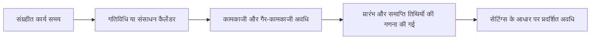

प्रिमावेरा पी6 में अवधि पहली बार में सरल लगती है: एक गतिविधि में कुछ निश्चित दिन लगते हैं। व्यवहार में, अवधि किसी शेड्यूल के सबसे महत्वपूर्ण और सबसे गलत समझे जाने वाले हिस्सों में से एक है।

अवधि कैलेंडर, गतिविधि प्रकार, संसाधन असाइनमेंट, प्रगति अपडेट और उपयोगकर्ता प्रदर्शन सेटिंग्स से जुड़ी है। "5 दिन" के रूप में दिखाई गई अवधि का हर शेड्यूल, हर कैलेंडर या हर उपयोगकर्ता के लेआउट में एक ही मतलब नहीं हो सकता है। यही कारण है कि योजनाकारों को न केवल यह समझने की जरूरत है कि अवधि क्या है, बल्कि यह भी समझने की जरूरत है कि पी6 इसे कैसे संग्रहीत करता है, इसकी गणना करता है और इसे कैसे प्रदर्शित करता है।

## अवधि का क्या मतलब है

अवधि किसी गतिविधि को करने के लिए आवश्यक कार्य समय की मात्रा है। यह केवल आरंभ तिथि और समाप्ति तिथि के बीच कैलेंडर दिनों की संख्या नहीं है।

उदाहरण के लिए, 5 दिनों की अवधि वाली एक गतिविधि निम्नलिखित अवधि तक हो सकती है:

- बिना किसी रुकावट के सोमवार से शुक्रवार कैलेंडर पर 5 कैलेंडर दिन।
- यदि सप्ताहांत कार्य अवधि के अंतर्गत आता है तो 7 कैलेंडर दिन।
- 24-घंटे या विस्तारित-शिफ्ट कैलेंडर पर 5 कैलेंडर दिन से कम।
- यदि छुट्टियाँ या गैर-कार्य दिवस कार्य में बाधा डालते हैं तो 5 कैलेंडर दिनों से अधिक।

यह पहला मुख्य सबक है: अवधि कार्य समय है, जबकि प्रारंभ और समाप्ति तिथियां कैलेंडर स्थिति हैं।

## P6 अवधि को कैसे संग्रहीत करता है

पी6 अवधि को समय के रूप में संग्रहीत करता है, आमतौर पर अंतर्निहित शेड्यूल डेटा में घंटे के स्तर पर। उपयोगकर्ता लेआउट में जो देखता है उसे प्राथमिकताओं के आधार पर दिन, सप्ताह, महीने या वर्ष के रूप में दिखाया जा सकता है।

इसका मतलब है कि प्रदर्शित अवधि अक्सर एक रूपांतरण होती है। यदि P6 किसी गतिविधि को 40 कार्य घंटों के रूप में संग्रहीत करता है, तो एक उपयोगकर्ता इसे 5 दिनों के रूप में देख सकता है यदि प्रदर्शन रूपांतरण प्रति दिन 8 घंटे का उपयोग करता है। यदि समय-अवधि रूपांतरण या कैलेंडर का आधार अलग है तो दूसरा सेटअप इसे अलग तरह से दिखा सकता है।

यही कारण है कि दो लोग एक ही शेड्यूल को देख सकते हैं और भ्रमित हो सकते हैं यदि उनकी उपयोगकर्ता प्राथमिकताएं या प्रशासनिक समय-अवधि सेटिंग्स संरेखित नहीं हैं।

## अवधि और कैलेंडर

कैलेंडर P6 को बताते हैं कि काम कब हो सकता है। अवधि P6 को बताती है कि कितने कार्य समय की आवश्यकता है। फिर कैलेंडर उस कार्य समय को वास्तविक तिथियों पर रखता है।

यदि किसी गतिविधि की अवधि 40 घंटे शेष है, तो कैलेंडर निर्धारित करता है कि उन 40 घंटों को कैसे फैलाया जाएगा।

8-घंटे-प्रतिदिन के कैलेंडर पर, 40 घंटे 5 कार्य दिवसों के रूप में दिखाई दे सकते हैं। 10-घंटे-प्रतिदिन के कैलेंडर पर, वही 40 घंटे 4 कार्य दिवसों के रूप में दिखाई दे सकते हैं। 24-घंटे के कैलेंडर पर, यह बहुत कम कैलेंडर समय तक फैल सकता है।

यही कारण है कि कैलेंडर असाइनमेंट मायने रखते हैं। कैलेंडर बदलने से समाप्ति तिथि बदल सकती है, भले ही संग्रहीत कार्य अवधि समान रहे।

## मूल अवधि

मूल अवधि प्रगति लागू होने से पहले गतिविधि की नियोजित अवधि है। यह गतिविधि को पूरा करने के लिए आवश्यक कार्य समय के प्रारंभिक अनुमान का प्रतिनिधित्व करता है।

योजना और आधारभूत विकास के दौरान मूल अवधि महत्वपूर्ण है। यह किसी कार्य के लिए अपेक्षित प्रयास या समय विंडो को परिभाषित करने में मदद करता है। इसका उपयोग प्रगति और प्रदर्शन चर्चाओं में भी किया जाता है क्योंकि यह एक संदर्भ बिंदु प्रदान करता है कि गतिविधि में कितना समय लगने की उम्मीद थी।

उत्तर देने के लिए मूल अवधि का उपयोग करें: स्थिति अपडेट से पहले इस गतिविधि को कितना समय लेने की योजना बनाई गई थी?

## शेष अवधि

शेष अवधि वर्तमान डेटा तिथि से गतिविधि को पूरा करने के लिए अभी भी आवश्यक कार्य समय की मात्रा है।

किसी शुरू न की गई गतिविधि के लिए, शेष अवधि आमतौर पर मूल अवधि से मेल खाती है जब तक कि इसे संशोधित नहीं किया गया हो। किसी प्रगतिरत गतिविधि के लिए, शेष अवधि को अभी भी आवश्यक यथार्थवादी कार्य को प्रतिबिंबित करना चाहिए। पूर्ण की गई गतिविधि के लिए, शेष अवधि 0 होनी चाहिए।

शेष अवधि P6 में सबसे महत्वपूर्ण अद्यतन फ़ील्ड में से एक है। यदि यह ग़लत है, तो पूर्वानुमान भी ग़लत होगा।

उत्तर देने के लिए शेष अवधि का उपयोग करें: अभी भी कितना कार्य समय आवश्यक है?

## वास्तविक अवधि

वास्तविक अवधि वास्तविक प्रगति के आधार पर गतिविधि पर पहले ही खर्च किए गए समय की मात्रा को दर्शाती है। यह वास्तविक प्रारंभ, वास्तविक समाप्ति, डेटा दिनांक, कैलेंडर और अद्यतन विधि से जुड़ा हुआ है।

वास्तविक अवधि को स्थिति कहानी का समर्थन करना चाहिए। यदि कोई गतिविधि शुरू हो गई है, तो वास्तविक अवधि वास्तविक शुरुआत और डेटा तिथि के सापेक्ष समझ में आनी चाहिए। यदि गतिविधि पूरी हो गई है, तो वास्तविक अवधि वास्तविक कार्य अवधि के अनुरूप होनी चाहिए।

उत्तर देने के लिए वास्तविक अवधि का उपयोग करें: कितना कार्य समय पहले ही खर्च हो चुका है?

## समापन अवधि पर

समापन अवधि वास्तविक और शेष कार्य के संयोजन के बाद गतिविधि की कुल अपेक्षित अवधि का प्रतिनिधित्व करती है।

सामान्य शर्तों में:

वास्तविक अवधि + शेष अवधि = समापन अवधि पर

यह उपयोगी है क्योंकि यह दर्शाता है कि किसी गतिविधि में मूल रूप से नियोजित समय से अधिक या कम समय लगने की उम्मीद है। यदि मूल अवधि 10 दिन थी लेकिन समापन अवधि अब 15 दिन है, तो गतिविधि में योजना से अधिक समय लगने का अनुमान है।

उत्तर देने के लिए पूर्णता अवधि का उपयोग करें: इस गतिविधि में कुल कितना समय लगने की उम्मीद है?

## अवधि और उपयोगकर्ता प्राथमिकताएँ

उपयोगकर्ता प्राथमिकताएँ नियंत्रित करती हैं कि किसी व्यक्तिगत उपयोगकर्ता के लिए समय इकाइयाँ कैसे प्रदर्शित की जाती हैं। उपयोगकर्ता चुन सकता है कि अवधि घंटों, दिनों, सप्ताहों, महीनों या वर्षों में दिखाई जाए या नहीं।

यह उपयोगकर्ता द्वारा देखी जाने वाली चीज़ों को प्रभावित करता है, ज़रूरी नहीं कि अंतर्निहित शेड्यूल गणना को। उदाहरण के लिए, समान संग्रहीत अवधि को एक लेआउट में घंटों और दूसरे में दिनों के रूप में प्रदर्शित किया जा सकता है।

यह उपयोगी है, लेकिन यह भ्रम भी पैदा कर सकता है। विस्तृत कार्य की समीक्षा करने वाला एक योजनाकार घंटों को प्राथमिकता दे सकता है। एक प्रोजेक्ट मैनेजर दिनों को प्राथमिकता दे सकता है। एक पोर्टफोलियो रिपोर्ट महीनों को दिखा सकती है। यदि रूपांतरण का आधार समझ में नहीं आता है, तो संख्याएँ असंगत लग सकती हैं।

अवधि की समीक्षा करते समय, प्रदर्शन इकाई की पुष्टि करें। पूछें कि क्या दिखाई गई अवधि घंटों, दिनों, हफ्तों या किसी अन्य इकाई में है।

## व्यवस्थापक प्राथमिकताएँ और समयावधियाँ

व्यवस्थापक प्राथमिकताओं में समय-अवधि सेटिंग्स शामिल होती हैं जो परिभाषित करती हैं कि P6 घंटों को दिन, सप्ताह, महीने और वर्षों जैसी बड़ी इकाइयों में कैसे परिवर्तित करता है। ये सेटिंग्स महत्वपूर्ण हैं क्योंकि वे प्रभावित करते हैं कि अवधि मान कैसे प्रदर्शित और परिवर्तित होते हैं।

उदाहरण के लिए, यदि सिस्टम प्रतिदिन 8 घंटे का उपयोग करता है, तो 40 घंटे 5 दिनों के रूप में प्रदर्शित होते हैं। यदि सिस्टम प्रतिदिन 10 घंटे का उपयोग करता है, तो 40 घंटे 4 दिनों के रूप में प्रदर्शित होते हैं।

इसका मतलब यह नहीं कि काम बदल गया। इसका मतलब केवल यह हो सकता है कि रूपांतरण बदल गया।

कुछ P6 कॉन्फ़िगरेशन में, अवधि प्रदर्शन इस पर भी निर्भर हो सकता है कि सिस्टम या उपयोगकर्ता समय-अवधि रूपांतरण के लिए निर्दिष्ट कैलेंडर घंटों का उपयोग कर रहा है या नहीं। यही कारण है कि प्रोजेक्ट टीमों को औपचारिक रिपोर्टिंग से पहले कैलेंडर मानकों, उपयोगकर्ता प्राथमिकताओं और व्यवस्थापक समय-अवधि सेटिंग्स को संरेखित करना चाहिए।

## अवधि भिन्न क्यों दिख सकती है?

अवधि कई कारणों से भिन्न दिख सकती है:

- अलग-अलग उपयोगकर्ता अलग-अलग इकाइयों में समय प्रदर्शित करते हैं।
- व्यवस्थापक समय-अवधि सेटिंग्स घंटों को अलग-अलग रूप में परिवर्तित करती हैं।
- गतिविधि कैलेंडर में प्रति दिन अलग-अलग घंटे होते हैं।
- संसाधन कैलेंडर गतिविधि कैलेंडर से भिन्न होते हैं।
- गतिविधियाँ विभिन्न गतिविधि प्रकारों का उपयोग करती हैं।
- शेष अवधि मैन्युअल रूप से अपडेट की गई थी।
- प्रगति गलत तरीके से लागू की गई थी.
- दिन का समय लेआउट में छिपा हुआ है.

यही कारण है कि अवधि की समस्या हमेशा अवधि की समस्या नहीं होती है। कभी-कभी यह एक कैलेंडर समस्या होती है. कभी-कभी यह डिस्प्ले सेटिंग की समस्या होती है। कभी-कभी यह प्रगति अद्यतन समस्या होती है.

## गतिविधि प्रकार और अवधि प्रकार के साथ संबंध

गतिविधि प्रकार प्रभावित करता है कि कौन सा कैलेंडर आधार सबसे महत्वपूर्ण है। कार्य पर निर्भर गतिविधियाँ आमतौर पर मुख्य रूप से गतिविधि कैलेंडर पर निर्भर करती हैं। संसाधन पर निर्भर गतिविधियाँ संसाधन कैलेंडर से अधिक प्रभावित हो सकती हैं।

अवधि प्रकार प्रभावित करता है कि P6 अवधि, संसाधन इकाइयों और प्रति समय इकाइयों को कैसे संतुलित करता है। उदाहरण के लिए, संसाधन जोड़ने से अवधि प्रकार के आधार पर गतिविधि छोटी हो भी सकती है और नहीं भी।

इसलिए जब कोई अवधि अप्रत्याशित रूप से व्यवहार करती है, तो तीन चीजों को एक साथ जांचें:

- गतिविधि कैलेंडर और संसाधन कैलेंडर.
- गतिविधि प्रकार.
- अवधि प्रकार.

ये क्षेत्र एक साथ काम करते हैं। उनमें से केवल एक की समीक्षा करने से गलत निष्कर्ष निकल सकता है।

## सामान्य समस्या

एक आम समस्या दिनों में एक अवधि दर्ज करना है, बिना यह जाने कि गतिविधि कैलेंडर प्रति दिन अपेक्षा से भिन्न संख्या में घंटों का उपयोग करता है।

एक अन्य समस्या विभिन्न कैलेंडर का उपयोग करने वाली गतिविधियों के बीच अवधि की तुलना करना है। एक कैलेंडर के पांच दिन दूसरे कैलेंडर के पांच दिनों के समान कार्य समय का प्रतिनिधित्व नहीं कर सकते हैं।

तीसरी समस्या असंगत उपयोगकर्ता प्राथमिकताएँ है। एक समीक्षक घंटे देख सकता है जबकि दूसरा दिन देख सकता है, और दोनों सोच सकते हैं कि शेड्यूल बदल गया है।

एक अन्य सामान्य समस्या शेड्यूल पहले से मौजूद होने के बाद व्यवस्थापक प्राथमिकताएँ बदलना है। इससे प्रदर्शित अवधि भिन्न दिखाई दे सकती है, भले ही अंतर्निहित संग्रहीत घंटे नहीं बदले हों।

## अवधि की सही समीक्षा कैसे करें

P6 में अवधि की समीक्षा करते समय, केवल अवधि कॉलम में दिखाई गई संख्या को न देखें।

जाँच करना:

- मूल अवधि.
- शेष अवधि.
- वास्तविक अवधि.
- समापन अवधि पर.
- गतिविधि कैलेंडर.
- यदि संसाधनों का उपयोग किया जाता है तो संसाधन कैलेंडर।
- गतिविधि प्रकार.
- अवधि प्रकार.
- उपयोगकर्ता प्राथमिकताएँ समय इकाई प्रदर्शन।
- व्यवस्थापक प्राथमिकताएँ समय-अवधि रूपांतरण।

यदि दिनांक या अवधि अजीब लगती है, तो लेआउट में कैलेंडर और समय फ़ील्ड जोड़ें। समस्या निवारण के दौरान दिन का समय न छिपाएँ।

## निष्कर्ष

पी6 में अवधि कार्य समय है, न कि केवल बीता हुआ कैलेंडर समय। P6 अवधि को समय के रूप में संग्रहीत करता है, उस समय को शेड्यूल पर रखने के लिए कैलेंडर लागू करता है, और इसे उपयोगकर्ता की प्राथमिकताओं और प्रशासनिक समय-अवधि सेटिंग्स के अनुसार प्रदर्शित करता है।

इसका मतलब है कि अवधि की संदर्भ के साथ समीक्षा की जानी चाहिए। "5 दिन" के रूप में दिखाया गया मान कैलेंडर घंटों, प्रदर्शन इकाइयों, रूपांतरण सेटिंग्स, गतिविधि प्रकार, अवधि प्रकार और अद्यतन स्थिति पर निर्भर करता है।

एक मजबूत अनुसूचक समझता है कि अवधि केवल एक इनपुट नहीं है। यह गणना इंजन का हिस्सा है. जब अवधि, कैलेंडर और प्राथमिकताएँ संरेखित हो जाती हैं, तो शेड्यूल को समझाना आसान हो जाता है और प्रोजेक्ट नियंत्रण के लिए अधिक विश्वसनीय हो जाता है।
## संबंधित सामग्री
- [बिना किसी ड्राइविंग लॉजिक के डेटा तिथि पर शुरू होने वाली गतिविधियाँ: यह शेड्यूल मीट्रिक क्यों मायने रखता है - अवलोकन](../../metrics/01_activities_starting_in_dd_with_no_logic_driving/02_guide_template.md)
- [P6 में कैलेंडर](../08_CALENDARS%20IN%20P6/08_CALENDARS%20IN%20P6.md)
- [P6 में प्रतिशत पूर्ण प्रकार](../10_PERCENT%20COMPLETION%20TYPES%20IN%20P6/10_PERCENT%20COMPLETION%20TYPES%20IN%20P6.md)
