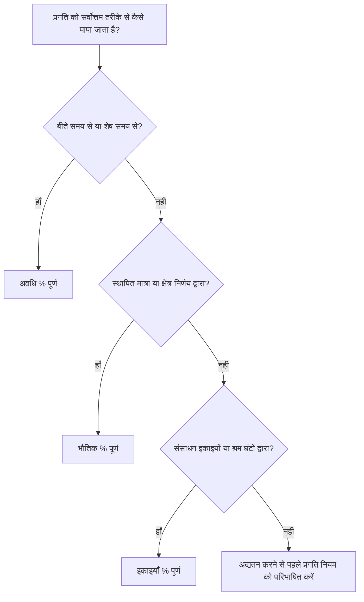

# P6 में प्रतिशत पूर्ण प्रकार

प्रिमावेरा पी6 में प्रतिशत पूर्णता सबसे अधिक दिखाई देने वाले प्रगति क्षेत्रों में से एक है, लेकिन यह सबसे गलत समझे जाने वाले क्षेत्रों में से एक भी है। गतिविधि कैसे कॉन्फ़िगर की गई है और परियोजना प्रगति को कैसे मापती है, इसके आधार पर 50% पूर्ण का मान अलग-अलग चीजों का मतलब हो सकता है।

P6 में, प्रतिशत पूर्ण प्रकार नियंत्रित करता है कि गतिविधि % पूर्ण की गणना या अद्यतन कैसे की जाती है। यह P6 को बताता है कि क्या प्रगति समय, भौतिक उपलब्धि या संसाधन इकाइयों पर आधारित होनी चाहिए।

गतिविधियों के लिए मुख्य प्रतिशत पूर्ण प्रकार हैं:

- अवधि % पूर्ण.
- भौतिक % पूर्ण.
- इकाइयाँ % पूर्ण।

सही को चुनना मायने रखता है क्योंकि प्रगति केवल एक रिपोर्टिंग संख्या नहीं है। यह शेष अवधि, अर्जित मूल्य, संसाधन रिपोर्टिंग, शेड्यूल विश्वसनीयता और प्रत्येक अद्यतन चक्र की गुणवत्ता को प्रभावित करता है।

## प्रतिशत पूर्ण प्रकार क्यों मायने रखता है

विभिन्न गतिविधियों की प्रगति को मापने के लिए अलग-अलग तरीकों की आवश्यकता होती है।

कुछ गतिविधियों के लिए, समय एक उचित प्रॉक्सी है। यदि किसी कार्य की अवधि 10 दिन है और 5 कार्य दिवस पूरे हो गए हैं, तो यह कहना उचित होगा कि गतिविधि लगभग 50% पूरी हो गई है।

अन्य गतिविधियों के लिए समय पर्याप्त नहीं है। एक दल 10-दिवसीय कार्य पर 5 दिन बिता सकता है और केवल 20% भौतिक कार्य पूरा कर सकता है। एक अन्य दल अवधि के पहले भाग में 80% मात्रा पूरी कर सकता है। उन मामलों में, अवधि-आधारित प्रगति परियोजना टीम को गुमराह कर सकती है।

संसाधन-भरे शेड्यूल के लिए, इकाइयाँ सर्वोत्तम प्रगति का आधार हो सकती हैं। यदि किसी गतिविधि की योजना 1,000 श्रम घंटों के लिए बनाई गई है और 600 श्रम घंटे अर्जित या उपभोग किए गए हैं, तो पूर्ण इकाइयाँ प्रगति को बेहतर ढंग से दर्शा सकती हैं।

सही प्रतिशत पूर्ण प्रकार इस बात पर निर्भर करता है कि गतिविधि क्या दर्शाती है और प्रगति वास्तव में कैसे मापी जाती है।

## गतिविधि % पूर्ण

गतिविधि % पूर्ण गतिविधि के लिए प्रदर्शित सामान्य प्रगति मान है। इसका स्रोत चयनित प्रतिशत पूर्ण प्रकार पर निर्भर करता है।

यदि गतिविधि अवधि % पूर्ण का उपयोग करती है, तो गतिविधि % पूर्ण मूल, वास्तविक और शेष अवधि के बीच संबंध से प्रेरित होती है।

यदि गतिविधि भौतिक % पूर्ण का उपयोग करती है, तो गतिविधि % पूर्ण उपयोगकर्ता द्वारा दर्ज किए गए भौतिक % पूर्ण मान का अनुसरण करती है।

यदि गतिविधि % पूर्ण इकाइयों का उपयोग करती है, तो गतिविधि % पूर्ण संसाधन इकाइयों की प्रगति पर आधारित है।

यही कारण है कि दो गतिविधियाँ 50% पूर्ण दिखा सकती हैं लेकिन उनके मायने बहुत अलग हैं।

## अवधि % पूर्ण

अवधि % पूर्ण माप समय के आधार पर प्रगति। यह तुलना करता है कि कुल अपेक्षित अवधि के मुकाबले कितनी अवधि का उपभोग किया गया है।

सरल शब्दों में, यदि किसी गतिविधि की योजना बनाई गई है या पूर्ण होने की अवधि 10 दिन है और 5 दिन का उपभोग किया गया है, तो गतिविधि लगभग 50% अवधि% पूर्ण दिखाई दे सकती है।

अवधि % पूर्ण तब उपयोगी होती है जब प्रगति समय के साथ यथोचित आनुपातिक होती है।

उदाहरणों में शामिल हैं:

- प्रशासनिक समीक्षा अवधि.
- पीरियड्स का इंतज़ार करना या ठीक होना।
- समय-आधारित सहायता कार्य.
- कुछ सरल गतिविधियाँ जहाँ कार्य उत्पादन स्थिर होता है।

अवधि % पूर्ण का उपयोग तब करें जब समय प्रगति का उचित माप हो और शेष अवधि सावधानीपूर्वक बनाए रखी जाए।

जोखिम यह है कि बिताया गया समय हमेशा हासिल किए गए कार्य के बराबर नहीं होता है। कोई कार्य अपनी नियोजित अवधि का आधा समय ले सकता है और फिर भी भौतिक रूप से बहुत पीछे रह सकता है। यदि शेड्यूलर केवल अवधि पर निर्भर करता है, तो प्रगति रिपोर्ट वास्तविकता से बेहतर दिख सकती है।

## भौतिक % पूर्ण

भौतिक % पूर्ण वास्तविक भौतिक प्रगति के आधार पर मैन्युअल रूप से दर्ज या अद्यतन किया जाता है। यह दर्शाता है कि कार्य में वास्तव में क्या हासिल किया गया है, अवधि या संसाधन इकाइयों से स्वतंत्र।

यह अक्सर निर्माण, इंजीनियरिंग डिलिवरेबल्स, इंस्टॉलेशन कार्य, कमीशनिंग पैकेज या किसी भी गतिविधि के लिए सबसे अच्छा विकल्प होता है जहां प्रगति मापने योग्य उपलब्धि पर आधारित होनी चाहिए।

उदाहरणों में शामिल हैं:

- 40% चित्र जारी किए गए।
- 60% केबल ट्रे स्थापित।
- 75% पाइपिंग वेल्डेड।
- परीक्षण पैकेज का 30% पूरा हो गया।
- उपकरण संरेखण का 100% कार्य पूरा हो गया है।

जब प्रगति को मात्रा, वितरण योग्य स्थिति, फ़ील्ड सत्यापन, या जिम्मेदार-स्वामी निर्णय द्वारा मापा जाना चाहिए तो भौतिक % पूर्ण का उपयोग करें।

लाभ यह है कि यह बीते समय की तुलना में वास्तविकता को बेहतर ढंग से प्रतिबिंबित कर सकता है। जोखिम यह है कि इसके लिए अनुशासन की आवश्यकता है। प्रोजेक्ट टीम को यह परिभाषित करना होगा कि भौतिक प्रगति को कैसे मापा जाता है, इसे कौन मंजूरी देता है और साक्ष्य कैसे एकत्र किए जाते हैं।

## इकाइयाँ % पूर्ण

इकाइयाँ % पूर्णता संसाधन इकाइयों के आधार पर प्रगति को मापती है। यह वास्तविक इकाइयों की तुलना पूर्ण होने वाली इकाइयों से करता है।

यह तब उपयोगी होता है जब शेड्यूल संसाधन-भरा होता है और प्रगति को श्रम घंटों, उपकरण घंटों या अन्य मापने योग्य संसाधन इकाइयों के माध्यम से ट्रैक किया जाता है।

उदाहरणों में शामिल हैं:

- बजटीय श्रम घंटों के मुकाबले अर्जित वास्तविक श्रम घंटे।
- नियोजित उपकरण घंटों के विरुद्ध उपयोग किए गए उपकरण घंटे।
- स्थापित कार्य संसाधन इकाई की प्रगति से जुड़ा हुआ है।
- इकाइयों के आधार पर अर्जित मूल्य वर्कफ़्लो।

जब संसाधन इकाइयाँ विश्वसनीय हों, अनुरक्षित हों और परियोजना प्रगति पद्धति का हिस्सा हों, तब इकाइयों % पूर्ण का उपयोग करें।

जोखिम यह है कि संसाधन की खपत हमेशा भौतिक प्रगति के बराबर नहीं होती है। एक टीम अपेक्षित कार्य पूरा किए बिना कई घंटे बिता सकती है। इस कारण से, यूनिट्स % पूर्ण तब सबसे अच्छा काम करता है जब संसाधन रिपोर्टिंग और प्रगति माप अच्छी तरह से नियंत्रित होते हैं।

## सही प्रकार का चयन कैसे करें

प्रतिशत पूर्ण प्रकार को चुनने का एक व्यावहारिक तरीका यह पूछना है कि गतिविधि के लिए प्रगति का क्या अर्थ है।

यदि प्रगति का मतलब है कि समय बीत चुका है, तो अवधि% पूर्ण का उपयोग करें।

यदि प्रगति का अर्थ है कि भौतिक कार्य प्राप्त कर लिया गया है, तो फिजिकल % कम्प्लीट का उपयोग करें।

यदि प्रगति का अर्थ है कि संसाधन इकाइयाँ अर्जित या उपभोग कर ली गई हैं, तो इकाइयाँ % पूर्ण का उपयोग करें।

चयन समान गतिविधि समूहों में सुसंगत होना चाहिए। इंजीनियरिंग डिलिवरेबल्स भौतिक % पूर्ण का उपयोग कर सकते हैं। निर्माण स्थापना मात्रा के आधार पर भौतिक % पूर्ण का उपयोग कर सकती है। समय-आधारित प्रबंधन समर्थन अवधि% पूर्ण का उपयोग कर सकता है। यदि संसाधन डेटा विश्वसनीय है तो संसाधन-भारी कार्य पैकेज यूनिट% पूर्ण का उपयोग कर सकते हैं।

## शेष अवधि के साथ संबंध

पूर्ण प्रतिशत और शेष अवधि को एक सुसंगत कहानी बतानी चाहिए।

कोई गतिविधि भौतिक रूप से 80% पूर्ण हो सकती है लेकिन यदि शेष कार्य कठिन, विलंबित या किसी अन्य स्थिति पर निर्भर है तो उसके पास 10 दिनों की शेष अवधि होती है। वह मान्य हो सकता है.

एक गतिविधि 50% अवधि% पूर्ण हो सकती है क्योंकि नियोजित समय का आधा हिस्सा बीत चुका है, लेकिन यदि केवल 20% कार्य भौतिक रूप से किया गया है, तो शेष अवधि को संभवतः संशोधित किया जाना चाहिए।

यही कारण है कि अच्छे अपडेट के लिए प्रगति और पूर्वानुमान समीक्षा दोनों की आवश्यकता होती है। प्रतिशत पूर्ण बताता है कि कितना हासिल किया गया है। शेष अवधि बताती है कि अभी कितना समय चाहिए।

## सामान्य गलतियां

एक सामान्य गलती उन गतिविधियों के लिए अवधि% पूर्ण का उपयोग करना है जहां भौतिक प्रगति समय के समानुपाती नहीं है। इससे प्रगति वास्तविक कार्य से बेहतर या ख़राब दिखाई दे सकती है।

एक और गलती माप नियम के बिना फिजिकल % कम्प्लीट का उपयोग करना है। यदि एक अनुशासन स्थापित मात्रा के आधार पर भौतिक प्रगति की रिपोर्ट करता है और दूसरा राय के आधार पर रिपोर्ट करता है, तो अनुसूची असंगत हो जाती है।

तीसरी गलती यूनिट्स % कम्प्लीट का उपयोग करना है जब संसाधन डेटा अधूरा या अविश्वसनीय होता है। यदि वास्तविक इकाइयों का रखरखाव नहीं किया जाता है, तो प्रगति मूल्य भरोसेमंद नहीं होगा।

एक अन्य मुद्दा पूर्ण प्रतिशत अपडेट करना है लेकिन शेष अवधि को अनदेखा करना है। कोई गतिविधि प्रगति दिखा सकती है और फिर भी उसका पूर्वानुमान अवास्तविक हो सकता है।

## अच्छा रिवाज़

अद्यतन चक्र शुरू होने से पहले प्रगति नियम परिभाषित करें। प्रोजेक्ट टीम को पता होना चाहिए कि कौन से गतिविधि समूह अवधि, भौतिक, या पूर्ण इकाइयों का उपयोग करते हैं।

ऐसे लेआउट का उपयोग करें जो प्रतिशत पूर्ण प्रकार, गतिविधि% पूर्ण, भौतिक% पूर्ण, अवधि% पूर्ण, इकाइयाँ% पूर्ण, शेष अवधि, वास्तविक प्रारंभ, वास्तविक समाप्ति और गतिविधि स्थिति दिखाते हैं।

विसंगतियों की जाँच करें जैसे:

- 0% प्रगति के साथ गतिविधियाँ शुरू कीं।
- शेष अवधि = 0 लेकिन स्थिति पूर्ण नहीं।
- वास्तविक समाप्ति के बिना 100% प्रगति।
- भौतिक % पूर्ण जो फ़ील्ड साक्ष्य से मेल नहीं खाता।
- अनुपलब्ध संसाधन अद्यतनों के आधार पर इकाइयाँ % पूर्ण।

ये जाँचें यह सुनिश्चित करने में मदद करती हैं कि प्रगति न केवल दर्ज की गई है, बल्कि विश्वसनीय भी है।

## निष्कर्ष

P6 में प्रतिशत पूर्ण प्रकार परिभाषित करता है कि गतिविधि प्रगति को कैसे मापा जाता है। अवधि % पूर्ण माप समय-आधारित प्रगति। भौतिक % पूर्ण माप वास्तविक कार्य प्राप्त करता है। इकाइयाँ % पूर्ण माप संसाधन-इकाई प्रगति।

प्रत्येक गतिविधि के लिए कोई भी एक प्रकार सर्वोत्तम नहीं है। सही चुनाव इस बात पर निर्भर करता है कि कार्य की योजना कैसे बनाई जाती है, मापी जाती है और नियंत्रित किया जाता है।

एक मजबूत शेड्यूल जानबूझकर प्रतिशत पूर्ण प्रकारों का उपयोग करता है। जब विधि कार्य से मेल खाती है, तो प्रगति अद्यतन स्पष्ट हो जाते हैं, शेष अवधि अधिक विश्वसनीय हो जाती है, और परियोजना रिपोर्टिंग का बचाव करना आसान हो जाता है।
## संबंधित सामग्री
- [बिना किसी ड्राइविंग लॉजिक के डेटा तिथि पर शुरू होने वाली गतिविधियाँ: यह शेड्यूल मीट्रिक क्यों मायने रखता है - अवलोकन](../../05_metrics_hi/01_activities_starting_in_dd_with_no_logic_driving/01_overview_template.md)
- [P6 में अवधि](../09_DURATION%20IN%20P6/09_DURATION%20IN%20P6.md)
- [जहां लागत P6 में रहती है](../11_WHERE%20THE%20COST%20LIVE%20IN%20P6/11_WHERE%20THE%20COST%20LIVE%20IN%20P6.md)
