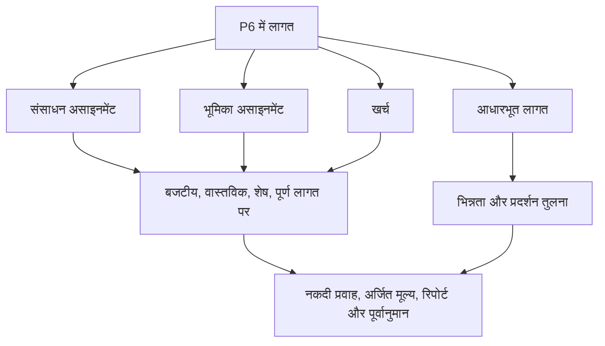

# जहां लागत P6 में रहती है

प्रिमावेरा पी6 में लागत कई स्थानों पर रह सकती है। यह उपयोगी है, लेकिन यह भ्रमित करने वाला भी हो सकता है। एक शेड्यूल बजट लागत, वास्तविक लागत, शेष लागत, पूर्णता लागत, संसाधन लागत, भूमिका लागत, व्यय लागत, अर्जित मूल्य फ़ील्ड और आधारभूत लागत दिखा सकता है। ये मूल्य संबंधित हैं, लेकिन इन सभी का मतलब एक ही नहीं है।

परियोजना नियंत्रण टीमों के लिए, मुख्य प्रश्न केवल "लागत क्या है?" बेहतर सवाल यह है: यह लागत कहां से आती है, यह क्या दर्शाती है और इसका उपयोग कैसे किया जाना चाहिए?

यह ब्लॉग पी6 में उपलब्ध मुख्य प्रकार की लागतों, उनके बीच के अंतर और प्रत्येक कब उपयोगी है, इसकी व्याख्या करता है।

## लागत स्थान क्यों मायने रखता है

पी6 मुख्य रूप से एक शेड्यूलिंग टूल है, लेकिन यह लागत-भारित शेड्यूल, अर्जित मूल्य, नकदी प्रवाह और पूर्वानुमान रिपोर्टिंग का भी समर्थन कर सकता है। इसे ठीक से करने के लिए, लागत को शेड्यूल मॉडल के सही हिस्से में रखा जाना चाहिए।

यदि श्रम लागत को व्यय के रूप में दर्ज किया गया है, तो संसाधन हिस्टोग्राम सही कहानी नहीं बता सकते हैं। यदि वास्तविक लागत मैन्युअल रूप से दर्ज की गई है, लेकिन परियोजना को उम्मीद है कि यह संसाधन वास्तविक से आएगी, तो रिपोर्ट असंगत हो सकती है। यदि आधारभूत लागत गायब है, तो शेड्यूल भिन्नता और लागत भिन्नता रिपोर्टिंग संदर्भ खो देती है।

लागत का स्थान मायने रखता है क्योंकि लागत का स्रोत प्रभावित करता है कि यह कैसे आगे बढ़ता है, अपडेट होता है, पूर्वानुमान होता है और रिपोर्ट आती है।

## संसाधन लागत

संसाधन लागत गतिविधियों को सौंपे गए संसाधनों से आती है। एक संसाधन श्रम, उपकरण या अन्य संसाधन श्रेणी का प्रतिनिधित्व कर सकता है। प्रत्येक संसाधन में दरें, इकाइयाँ और लागत गणनाएँ हो सकती हैं।

उदाहरण के लिए, यदि कोई गतिविधि एक निर्धारित प्रति घंटा दर पर 80 घंटे के लिए पाइपफिटर क्रू का उपयोग करती है, तो पी6 निर्दिष्ट इकाइयों और दर से श्रम लागत की गणना कर सकता है।

संसाधन लागत तब उपयोगी होती है जब परियोजना शेड्यूल गतिविधियों को श्रम, उपकरण, उत्पादकता और संसाधन हिस्टोग्राम से जोड़ना चाहती है।

संसाधन लागत का उपयोग तब करें जब:

- श्रम या उपकरण की मांग मायने रखती है।
- संसाधन हिस्टोग्राम की आवश्यकता है.
- लागत घंटों या इकाइयों से जुड़ी होती है।
- अर्जित मूल्य या प्रगति संसाधन-आधारित है।
- अनुसूची का उपयोग संसाधन नियोजन के लिए किया जाता है।

मुख्य जोखिम रखरखाव है. संसाधन-भरे शेड्यूल के लिए अनुशासन की आवश्यकता होती है। यदि इकाइयों, दरों, कैलेंडरों या वास्तविक आंकड़ों का रखरखाव नहीं किया जाता है, तो लागत रिपोर्ट विश्वसनीय नहीं होंगी।

## भूमिका लागत

भूमिकाएँ सामान्य कार्य हैं, जैसे इंजीनियर, इलेक्ट्रीशियन, योजनाकार, निरीक्षक, या क्रेन ऑपरेटर। पी6 में, नामित संसाधनों के ज्ञात होने से पहले गतिविधियों को भूमिकाएँ सौंपी जा सकती हैं।

भूमिका लागत प्रारंभिक योजना का समर्थन कर सकती है जब टीम आवश्यक संसाधन के प्रकार को जानती है लेकिन विशिष्ट व्यक्ति या चालक दल को नहीं।

उदाहरण के लिए, प्रारंभिक इंजीनियरिंग योजना के दौरान, किसी गतिविधि के लिए 120 घंटे के "वरिष्ठ अभियंता" समय की आवश्यकता हो सकती है। नामित व्यक्ति को अभी तक नियुक्त नहीं किया जा सकता है, लेकिन भूमिका नियोजन दर और लागत अनुमान प्रदान कर सकती है।

भूमिका लागत का उपयोग तब करें जब:

- कार्यक्रम अभी भी योजना में है।
- नामित संसाधनों की अभी पुष्टि नहीं हुई है.
- परियोजना उच्च-स्तरीय संसाधन या लागत अनुमान चाहती है।
- भूमिकाएँ बाद में वास्तविक संसाधनों द्वारा प्रतिस्थापित कर दी जाएंगी।

प्रारंभिक चरण की योजना के लिए भूमिका लागत उपयोगी होती है, लेकिन परियोजना के परिपक्व होने पर उनकी समीक्षा की जानी चाहिए। यदि वास्तविक संसाधनों के ज्ञात होने के बाद भी भूमिकाएँ बनी रहती हैं, तो विस्तृत नियंत्रण के लिए शेड्यूल बहुत सामान्य हो सकता है।

## व्यय लागत

व्यय गैर-संसाधन लागतें हैं जो सीधे गतिविधियों को सौंपी जाती हैं। वे उन लागतों के लिए उपयोगी हैं जिनका श्रम या उपकरण संसाधनों द्वारा सर्वोत्तम प्रतिनिधित्व नहीं किया जाता है।

उदाहरणों में शामिल हैं:

- परमिट.
- यात्रा करना।
- विक्रेता एकमुश्त रकम.
- उपठेकेदार पैकेज.
- सामग्री एक निश्चित राशि के रूप में खरीदी गई।
- परीक्षण शुल्क.
- लामबंदी शुल्क.

व्यय लागत का बजट, वास्तविक, शेष, या पूरा होने पर किया जा सकता है, यह इस बात पर निर्भर करता है कि परियोजना उन्हें कैसे ट्रैक करती है।

खर्चों का उपयोग तब करें जब:

- लागत संसाधन घंटों से संचालित नहीं होती है।
- लागत एक निश्चित या एकमुश्त वस्तु है।
- गतिविधि के लिए प्रत्यक्ष गैर-संसाधन लागत की आवश्यकता होती है।
- परियोजना गैर-श्रमिक मदों के लिए नकदी प्रवाह चाहती है।

जोखिम यह है कि खर्च डंपिंग ग्राउंड बन सकता है। यदि सभी लागतों को व्यय के रूप में दर्ज किया जाता है, तो अनुसूची श्रम, उपकरण और उत्पादकता को अलग से समझाने की क्षमता खो सकती है।

## बजटीय लागत

बजटीय लागत गतिविधि को सौंपी गई योजनाबद्ध लागत है। यह संसाधन असाइनमेंट, भूमिका असाइनमेंट, खर्च या इनके संयोजन से आ सकता है।

बजटीय लागत महत्वपूर्ण है क्योंकि यह निष्पादन से पहले लागत योजना का प्रतिनिधित्व करती है। यह नकदी प्रवाह, आधारभूत लागत, अर्जित मूल्य सेटअप और परियोजना नियंत्रण रिपोर्टिंग का समर्थन करता है।

उत्तर देने के लिए बजटीय लागत का उपयोग करें: इस गतिविधि की नियोजित लागत क्या थी?

यदि बजटीय लागत गायब है या असंगत है, तो शेड्यूल अभी भी तारीखों की गणना कर सकता है, लेकिन यह सार्थक लागत-भरी रिपोर्टिंग का समर्थन नहीं कर सकता है।

## वास्तविक कीमत

वास्तविक लागत पहले से खर्च की गई लागत का प्रतिनिधित्व करती है। प्रोजेक्ट सेटअप के आधार पर, वास्तविक लागत की गणना वास्तविक संसाधन इकाइयों और दरों से की जा सकती है, मैन्युअल रूप से दर्ज की जा सकती है, टाइमशीट से आयात की जा सकती है, या बाहरी लागत प्रणाली से लोड की जा सकती है।

प्रगति रिपोर्टिंग और अर्जित मूल्य के लिए वास्तविक लागत महत्वपूर्ण है। यह दर्शाता है कि अब तक क्या खर्च किया गया है या रिकॉर्ड किया गया है।

उत्तर देने के लिए वास्तविक लागत का उपयोग करें: कौन सी लागत पहले ही खर्च की जा चुकी है या दर्ज की गई है?

जोखिम स्रोतों के मिश्रण का है। यदि कुछ वास्तविक लागतें लेखांकन से आयात की जाती हैं और अन्य मैन्युअल रूप से P6 में दर्ज की जाती हैं, तो टीम को दोहराव या अंतराल से बचने के लिए एक स्पष्ट नियम की आवश्यकता होती है।

## शेष लागत

शेष लागत वह अनुमानित लागत है जो गतिविधि को पूरा करने के लिए अभी भी आवश्यक है। यह शेष इकाइयों, संसाधन दरों, शेष खर्चों और अद्यतन मान्यताओं से जुड़ा हुआ है।

शेष लागत सबसे महत्वपूर्ण पूर्वानुमान क्षेत्रों में से एक है। यह प्रोजेक्ट टीम को बताता है कि वर्तमान डेटा तिथि से आगे कितनी लागत शेष है।

उत्तर देने के लिए शेष लागत का उपयोग करें: अभी भी कितनी लागत अपेक्षित है?

यदि शेष अवधि अपडेट की गई है लेकिन शेष लागत अपडेट नहीं की गई है, तो पूर्वानुमान असंगत हो सकता है। यही बात तब सच है जब संसाधन इकाइयों या व्यय के शेष मूल्यों को बनाए नहीं रखा जाता है।

## समापन लागत पर

पूर्णता लागत पर वास्तविक और शेष लागत के संयोजन के बाद गतिविधि की अपेक्षित कुल लागत है।

सामान्य शर्तों में:

वास्तविक लागत + शेष लागत = समापन लागत पर

समापन लागत पर यह दिखाने में मदद मिलती है कि क्या किसी गतिविधि के बजट से अधिक, कम या कम समाप्त होने का अनुमान है।

उत्तर देने के लिए पूर्णता लागत पर उपयोग करें: नवीनतम अपेक्षित कुल लागत क्या है?

## आधारभूत लागत

बेसलाइन लागत एक निर्दिष्ट बेसलाइन शेड्यूल से आती है। इसका उपयोग अनुमोदित योजना के विरुद्ध वर्तमान लागत मूल्यों की तुलना करने के लिए किया जाता है।

विचरण रिपोर्टिंग के लिए आधारभूत लागत महत्वपूर्ण है। आधार रेखा के बिना, परियोजना वर्तमान पूर्वानुमान लागत को जान सकती है लेकिन यह नहीं कि वह पूर्वानुमान अनुमोदित योजना से बेहतर है या खराब।

उत्तर देने के लिए बेसलाइन लागत का उपयोग करें: वर्तमान लागत की तुलना अनुमोदित लागत योजना से कैसे की जाती है?

अर्जित मूल्य या औपचारिक पीएमओ रिपोर्टिंग के लिए पी6 का उपयोग करते समय बेसलाइन लागत विशेष रूप से महत्वपूर्ण है।

## अर्जित मूल्य लागत फ़ील्ड

P6 प्रोजेक्ट सेटअप के आधार पर अर्जित मूल्य फ़ील्ड जैसे नियोजित मूल्य, अर्जित मूल्य, वास्तविक लागत, लागत भिन्नता और शेड्यूल भिन्नता का समर्थन कर सकता है।

अर्जित मूल्य नियोजित कार्य, अर्जित कार्य और वास्तविक लागत की तुलना करने के लिए लागत-भरी हुई शेड्यूल जानकारी का उपयोग करता है।

ये फ़ील्ड तब उपयोगी होते हैं जब प्रोजेक्ट में औपचारिक अर्जित मूल्य प्रक्रिया होती है। उन्हें सुसंगत आधार रेखा, प्रगति नियम, प्रतिशत पूर्ण विधियाँ और लागत लोडिंग की आवश्यकता होती है।

अर्जित मूल्य लागत फ़ील्ड का उपयोग करें जब:

- प्रोजेक्ट के लिए ईवी रिपोर्टिंग की आवश्यकता है।
- प्रगति नियम परिभाषित हैं।
- आधारभूत लागत स्वीकृत है.
- वास्तविक लागत स्रोत नियंत्रित है।
- गतिविधि की प्रगति लगातार बनी रहती है।

उन नियंत्रणों के बिना, अर्जित मूल्य आउटपुट अविश्वसनीय होते हुए भी सटीक दिख सकते हैं।

## आपको किस लागत प्रकार का उपयोग करना चाहिए?

श्रम और उपकरणों के लिए संसाधन लागत का उपयोग करें जो संसाधन योजना, उत्पादकता और हिस्टोग्राम का समर्थन करें।

जब नामित संसाधन अभी तक ज्ञात नहीं हैं तो प्रारंभिक योजना के लिए भूमिका लागत का उपयोग करें।

प्रत्यक्ष गैर-संसाधन लागत, एकमुश्त राशि, विक्रेता आइटम, परमिट, यात्रा, या उपअनुबंध पैकेज के लिए व्यय लागत का उपयोग करें।

समय-चरणबद्ध लागत जीवनचक्र को समझने के लिए बजटीय, वास्तविक, शेष और पूर्ण लागत फ़ील्ड का उपयोग करें।

अनुमोदित योजना से तुलना के लिए आधारभूत लागत का उपयोग करें।

जब परियोजना में ईवी रिपोर्टिंग का समर्थन करने के लिए आवश्यक प्रशासन हो तो अर्जित मूल्य फ़ील्ड का उपयोग करें।

## सामान्य समस्या

एक सामान्य समस्या लागत दोहराव है। उसी उपठेकेदार लागत को संसाधन लागत के रूप में और फिर व्यय के रूप में दर्ज किया जा सकता है।

एक अन्य समस्या वास्तविक लागत का अभाव है। शेड्यूल में बजट और शेष लागत हो सकती है, लेकिन वास्तविक लागत एक अलग लेखांकन प्रणाली में रह सकती है और कभी भी P6 तक नहीं पहुंच सकती है।

तीसरी समस्या हर चीज़ के लिए खर्च का उपयोग करना है। इससे कुल लागत लेकिन कमजोर संसाधन दृश्यता उत्पन्न हो सकती है।

एक अन्य मुद्दा असंगत प्रगति का है। यदि प्रतिशत पूर्ण, शेष अवधि और शेष लागत संरेखित नहीं है, तो पूर्णता पर लागत अविश्वसनीय हो जाती है।

## अच्छा रिवाज़

शेड्यूल लोड करने से पहले लागत रणनीति परिभाषित करें। तय करें कि श्रम, उपकरण, सामग्री, उपठेकेदार और अप्रत्यक्ष लागत कहाँ रहेंगी।

सुसंगत लागत खातों, गतिविधि कोड, संसाधनों, भूमिकाओं और व्यय श्रेणियों का उपयोग करें।

दस्तावेज करें कि क्या वास्तविक लागतें पी6 में दर्ज की जाएंगी, आयात की जाएंगी, या किसी अन्य सिस्टम से रिपोर्ट की जाएंगी।

प्रत्येक अद्यतन चक्र के दौरान लागत फ़ील्ड की समीक्षा करें। बजटीय, वास्तविक, शेष और पूर्ण लागत पर एक सुसंगत कहानी बतानी चाहिए।

## निष्कर्ष

पी6 में लागत संसाधनों, भूमिकाओं, खर्चों, आधार रेखाओं और अर्जित मूल्य क्षेत्रों में रह सकती है। प्रत्येक स्थान का एक अलग उद्देश्य होता है।

संसाधन लागत लागत को श्रम और उपकरण से जोड़ती है। भूमिका लागत प्रारंभिक योजना का समर्थन करती है। व्यय लागत प्रत्यक्ष गैर-संसाधन वस्तुओं पर कब्जा करती है। बजटीय, वास्तविक, शेष और पूर्ण होने पर लागत लागत जीवनचक्र दर्शाती है। बेसलाइन और अर्जित मूल्य फ़ील्ड तुलना और प्रदर्शन रिपोर्टिंग का समर्थन करते हैं।

एक मजबूत लागत-भारित शेड्यूल संख्याओं को कहीं भी फिट करने से नहीं बनाया जाता है। इसका निर्माण यह तय करके किया जाता है कि प्रत्येक प्रकार की लागत कहां है और प्रत्येक अद्यतन चक्र के माध्यम से उस संरचना को बनाए रखा जाए।
## संबंधित सामग्री
- [बिना किसी ड्राइविंग लॉजिक के डेटा तिथि पर शुरू होने वाली गतिविधियाँ: यह शेड्यूल मीट्रिक क्यों मायने रखता है - अवलोकन](../../metrics/01_activities_starting_in_dd_with_no_logic_driving/02_guide_template.md)
- [P6 में प्रतिशत पूर्ण प्रकार](../10_PERCENT%20COMPLETION%20TYPES%20IN%20P6/10_PERCENT%20COMPLETION%20TYPES%20IN%20P6.md)
- [P6 में संसाधन प्रकार](../12_RESOURCE%20TYPES%20IN%20P6/12_RESOURCE%20TYPES%20IN%20P6.md)
