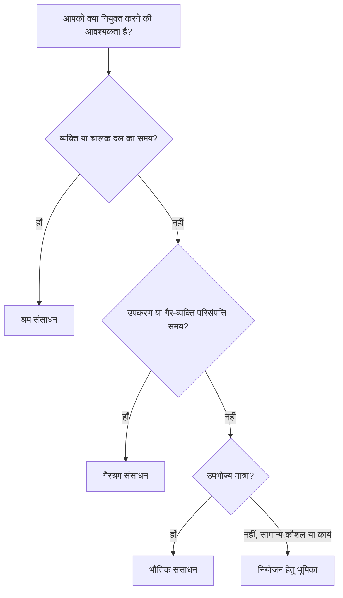

# P6 में संसाधन प्रकार

प्रिमावेरा पी6 में संसाधन कार्य को निष्पादित करने के लिए आवश्यक लोगों, उपकरणों और सामग्रियों का प्रतिनिधित्व करते हैं। वे शेड्यूल को क्षमता, उत्पादकता, लागत और समय के साथ संसाधन की मांग से जोड़ते हैं।

एक शेड्यूल संसाधनों के बिना भी अस्तित्व में रह सकता है, लेकिन संसाधनों से भरा शेड्यूल प्रोजेक्ट टीम को एक गहन दृष्टिकोण प्रदान करता है। यह श्रम हिस्टोग्राम, उपकरण की मांग, सामग्री का उपयोग, लागत घटता, संसाधन की कमी और संभावित अधिभार दिखा सकता है। उस जानकारी को उपयोगी बनाने के लिए, शेड्यूलर को P6 में उपलब्ध विभिन्न संसाधन प्रकारों को समझना चाहिए और प्रत्येक का उपयोग कब करना चाहिए।

P6 में मुख्य संसाधन प्रकार हैं:

- श्रम।
- गैरश्रम.
- सामग्री।

पी6 भूमिकाओं का भी उपयोग करता है, जो संसाधनों के बिल्कुल समान नहीं हैं लेकिन योजना बनाते समय निकट से संबंधित और बहुत उपयोगी हैं।

## संसाधन प्रकार क्यों मायने रखता है

संसाधन प्रकार प्रभावित करता है कि P6 इकाइयों, दरों, लागतों, कैलेंडरों और रिपोर्टों को कैसे संभालता है।

एक श्रम संसाधन भौतिक संसाधन से भिन्न व्यवहार करता है। क्रेन को कंक्रीट वॉल्यूम के समान नहीं माना जाना चाहिए। एक सामान्य इंजीनियर की भूमिका नामित इंजीनियर संसाधन के समान नहीं होती है। यदि संसाधन प्रकार गलत तरीके से मिश्रित किए जाते हैं, तो हिस्टोग्राम, लागत रिपोर्ट, उत्पादकता समीक्षा और अर्जित मूल्य आउटपुट भ्रामक हो सकते हैं।

संसाधन प्रकार एक व्यावहारिक प्रश्न का उत्तर देता है: गतिविधि को किस प्रकार की चीज़ सौंपी जा रही है?

## श्रम संसाधन

श्रम संसाधन लोगों या कर्मचारियों का प्रतिनिधित्व करते हैं। इन्हें आमतौर पर घंटों, दिनों या अन्य समय-आधारित इकाइयों में मापा जाता है। श्रम संसाधनों में दरें, कैलेंडर, उपलब्धता सीमाएँ और लागत मूल्य हो सकते हैं।

उदाहरणों में शामिल हैं:

- योजनाकार.
- सिविल क्रू.
- बिजली मिस्त्री.
- वेल्डिंग दल.
- अभियंता।
- इंस्पेक्टर.
- कमीशनिंग तकनीशियन.

जब शेड्यूल में मानवीय प्रयास या चालक दल की मांग दर्शाने की आवश्यकता हो तो श्रम संसाधनों का उपयोग करें। श्रम संसाधन जनशक्ति हिस्टोग्राम, स्टाफिंग योजना, उत्पादकता विश्लेषण और श्रम लागत पूर्वानुमान के लिए उपयोगी हैं।

उदाहरण के लिए, "केबल ट्रे स्थापित करें" नामक गतिविधि के लिए 5 दिनों के लिए 4 इलेक्ट्रीशियन की आवश्यकता हो सकती है। श्रम संसाधनों को आवंटित करने से शेड्यूल उस अवधि के दौरान इलेक्ट्रीशियन की मांग को दिखाने की अनुमति देता है।

श्रम संसाधन तब भी उपयोगी होते हैं जब परियोजना को वास्तविक श्रम घंटों के साथ नियोजित श्रम घंटों की तुलना करने की आवश्यकता होती है।

## गैरश्रम संसाधन

गैर-श्रम संसाधन उपकरण या अन्य पुन: प्रयोज्य गैर-व्यक्ति संपत्तियों का प्रतिनिधित्व करते हैं। वे आमतौर पर श्रम की तरह समय-आधारित होते हैं, लेकिन वे मानव संसाधन नहीं होते हैं।

उदाहरणों में शामिल हैं:

- क्रेन.
- खुदाई करनेवाला।
- वेल्डिंग मशीन।
- परीक्षण उपकरण.
- मचान चालक दल के उपकरण.
- विशेष उपकरण सेट.
- जेनरेटर.

जब उपकरण की उपलब्धता मायने रखती है या जब उपकरण की लागत को समय के साथ ट्रैक किया जाना चाहिए तो गैर-श्रम संसाधनों का उपयोग करें।

उदाहरण के लिए, यदि किसी भारी लिफ्ट के लिए दो दिनों के लिए क्रेन की आवश्यकता होती है, तो एक गैर-श्रमिक क्रेन संसाधन आवंटित करने से परियोजना टीम को क्रेन की मांग देखने, संघर्षों से बचने और उपकरण लागत का पूर्वानुमान लगाने में मदद मिलती है।

गैर-श्रम संसाधन तब महत्वपूर्ण होते हैं जब उपकरण दुर्लभ, महंगे, कार्य क्षेत्रों के बीच साझा किए जाने वाले या कार्य अनुक्रम के चालक होते हैं।

## भौतिक संसाधन

भौतिक संसाधन उपभोग योग्य वस्तुओं का प्रतिनिधित्व करते हैं। इन्हें आमतौर पर समय के बजाय मात्रा में मापा जाता है।

उदाहरणों में शामिल हैं:

- कंक्रीट घन मीटर.
- स्टील टन.
- केबल मीटर.
- पाइप स्पूल.
- वाल्व.
- कोटिंग लीटर.
- पैनल।

जब शेड्यूल को मात्रा-आधारित खपत या सामग्री-संबंधित लागत को ट्रैक करने की आवश्यकता हो तो भौतिक संसाधनों का उपयोग करें।

भौतिक संसाधन सामग्री वक्र, मात्रा ट्रैकिंग और लागत लोडिंग का समर्थन कर सकते हैं। वे विशेष रूप से तब उपयोगी होते हैं जब शेड्यूल स्थापित मात्राओं या मात्राओं के आधार पर अर्जित मूल्य से जुड़ा होता है।

उदाहरण के लिए, एक गतिविधि में 500 मीटर की केबल स्थापना शामिल हो सकती है। केबल को एक भौतिक संसाधन के रूप में निर्दिष्ट करने से टीम को समय के साथ नियोजित और वास्तविक स्थापित मात्रा को ट्रैक करने में मदद मिलती है।

श्रम घंटों या उपकरण समय को दर्शाने के लिए भौतिक संसाधनों का उपयोग नहीं किया जाना चाहिए। वे एक अलग उद्देश्य की पूर्ति करते हैं।

## भूमिकाएँ

भूमिकाएँ सामान्य कार्य कार्य या कौशल श्रेणियाँ हैं। वे संसाधनों के समान नहीं हैं, लेकिन नामित संसाधनों के ज्ञात होने से पहले वे योजना बनाने में मदद करते हैं।

उदाहरणों में शामिल हैं:

- वरिष्ठ इंजीनियर।
- विद्युत पर्यवेक्षक।
- सिविल इंस्पेक्टर.
- अनुसूचक.
- कमीशनिंग लीड.
- क्रेन चालक।

प्रारंभिक योजना बनाने में भूमिकाएँ उपयोगी होती हैं क्योंकि परियोजना को पता चल सकता है कि किस प्रकार के कौशल की आवश्यकता है बिना यह जाने कि कार्य कौन करेगा।

उदाहरण के लिए, एक इंजीनियरिंग गतिविधि के लिए 80 घंटे के "वरिष्ठ विद्युत अभियंता" प्रयास की आवश्यकता हो सकती है। बाद में, उस भूमिका को नामित संसाधन से बदला या पूरक किया जा सकता है।

भूमिकाओं का उपयोग तब करें जब:

- योजना अभी भी उच्च स्तर पर है.
- नामित संसाधनों की पुष्टि नहीं की गई है.
- कौशल प्रकार के अनुसार संसाधन की मांग आवश्यक है।
- संगठन शीघ्र स्टाफिंग पूर्वानुमान चाहता है।

परियोजना के परिपक्व होने पर भूमिकाओं की समीक्षा की जानी चाहिए। यदि शेड्यूल को विस्तृत नियंत्रण की आवश्यकता है, तो भूमिकाओं को वास्तविक संसाधनों द्वारा प्रतिस्थापित करने की आवश्यकता हो सकती है।

## संसाधन कैलेंडर

संसाधनों में कैलेंडर हो सकते हैं. यह मायने रखता है क्योंकि संसाधन उपलब्धता गतिविधि उपलब्धता से भिन्न हो सकती है।

उदाहरण के लिए, एक निर्माण गतिविधि 6-दिवसीय गतिविधि कैलेंडर का उपयोग कर सकती है, लेकिन निर्दिष्ट विक्रेता विशेषज्ञ केवल सोमवार से शुक्रवार तक उपलब्ध हो सकता है। यदि गतिविधि संसाधन पर निर्भर है या संसाधन लेवलिंग का उपयोग किया जाता है, तो संसाधन कैलेंडर शेड्यूल को प्रभावित कर सकता है।

श्रम और गैर-श्रम संसाधनों को अक्सर कैलेंडर की आवश्यकता होती है क्योंकि लोग और उपकरण केवल निश्चित समय पर ही उपलब्ध होते हैं। भौतिक संसाधन आमतौर पर अलग-अलग व्यवहार करते हैं क्योंकि वे मात्रा का प्रतिनिधित्व करते हैं, कार्य समय का नहीं।

जब संसाधन तिथियां अजीब लगती हैं, तो गतिविधि कैलेंडर और संसाधन कैलेंडर दोनों की जांच करें।

## संसाधन लागत

संसाधन लागत दरें वहन कर सकते हैं। श्रम और गैर-श्रम संसाधन अक्सर समय-आधारित दरों का उपयोग करते हैं। भौतिक संसाधन अक्सर इकाई दरों का उपयोग करते हैं।

उदाहरण के लिए:

- इलेक्ट्रीशियन: लागत प्रति घंटा.
- क्रेन: लागत प्रति घंटा या दिन।
- कंक्रीट: लागत प्रति घन मीटर.

जब संसाधनों को गतिविधियों के लिए आवंटित किया जाता है, तो P6 बजटीय, वास्तविक, शेष और पूर्ण लागत पर गणना कर सकता है।

यह लागत-भारित शेड्यूल, अर्जित मूल्य रिपोर्टिंग, संसाधन पूर्वानुमान और नकदी प्रवाह विश्लेषण के लिए उपयोगी है। लेकिन यह तभी अच्छा काम करता है जब इकाइयाँ, दरें, कैलेंडर और प्रगति अद्यतन बनाए रखे जाते हैं।

## सही संसाधन प्रकार का चयन करना

श्रम का उपयोग तब करें जब संसाधन कोई व्यक्ति, दल या मानव प्रयास हो।

जब संसाधन उपकरण या पुन: प्रयोज्य संपत्ति हो, जिसका समय मायने रखता है, तो गैर-श्रम का उपयोग करें।

सामग्री का उपयोग तब करें जब संसाधन एक उपभोज्य मात्रा हो।

नामित संसाधनों के ज्ञात होने से पहले कौशल या कार्य द्वारा योजना बनाते समय भूमिकाओं का उपयोग करें।

चयन को यह प्रतिबिंबित करना चाहिए कि परियोजना किस प्रकार कार्य की योजना बनाना, मापना और रिपोर्ट करना चाहती है।

## सामान्य गलतियां

एक सामान्य गलती हर चीज़ के लिए श्रम संसाधनों का उपयोग करना है। इससे शुरुआत में लागत लोड करना आसान हो सकता है, लेकिन जब उपकरण या सामग्री की मात्रा मायने रखती है तो यह स्पष्टता कम कर देता है।

एक और गलती उन वस्तुओं के लिए भौतिक संसाधनों का उपयोग करना है जो वास्तव में व्यय या उप-अनुबंध एकमुश्त राशि हैं। यदि परियोजना को मात्रा ट्रैकिंग की आवश्यकता नहीं है, तो व्यय अधिक उपयुक्त हो सकता है।

तीसरी गलती वास्तविक इकाइयों को बनाए रखे बिना संसाधनों को आवंटित करना है। संसाधन-लोडेड शेड्यूल केवल तभी उपयोगी होता है जब प्रगति अद्यतन संसाधन डेटा को अद्यतन रखते हैं।

एक अन्य मुद्दा भूमिकाओं और संसाधनों को भ्रमित करने वाला है। योजना बनाने के लिए भूमिकाएँ अच्छी होती हैं, लेकिन जब विस्तृत असाइनमेंट, कैलेंडर और वास्तविक बातें मायने रखती हैं तो नामित संसाधन बेहतर होते हैं।

## अच्छा रिवाज़

शेड्यूल लोड करने से पहले संसाधन रणनीति परिभाषित करें।

तय करें कि किस कार्य में श्रम संसाधनों का उपयोग किया जाएगा, किस कार्य में गैर-श्रम संसाधनों का उपयोग किया जाएगा, किन सामग्रियों की मात्रा पर नज़र रखने की आवश्यकता है, और इसके स्थान पर खर्चों का उपयोग कहाँ किया जाना चाहिए।

सुसंगत नामकरण परंपराओं और संसाधन कोड का उपयोग करें। संसाधन शब्दकोश को साफ़ रखें. थोड़े अलग नामों वाले डुप्लिकेट संसाधनों से बचें।

प्रत्येक अद्यतन चक्र के दौरान संसाधन असाइनमेंट की समीक्षा करें। इकाइयाँ, लागत, कैलेंडर और वास्तविक आंकड़े परियोजना नियंत्रण प्रक्रिया के अनुरूप रहने चाहिए।

## निष्कर्ष

P6 में संसाधन प्रकार यह परिभाषित करने में सहायता करते हैं कि कार्य करने के लिए क्या आवश्यक है। श्रम संसाधन लोगों और कर्मचारियों का प्रतिनिधित्व करते हैं। गैर-श्रम संसाधन उपकरण और पुन: प्रयोज्य संपत्तियों का प्रतिनिधित्व करते हैं। भौतिक संसाधन उपभोग योग्य मात्रा का प्रतिनिधित्व करते हैं। नामित संसाधनों के ज्ञात होने से पहले भूमिकाएँ कौशल या कार्य द्वारा नियोजन का समर्थन करती हैं।

सही संसाधन प्रकार चुनने से शेड्यूल का विश्लेषण करना आसान हो जाता है। यह श्रम हिस्टोग्राम, उपकरण योजना, सामग्री ट्रैकिंग, लागत लोडिंग, अर्जित मूल्य और पूर्वानुमान रिपोर्टिंग में सुधार करता है।

एक अच्छा संसाधन-युक्त शेड्यूल केवल संसाधनों से जुड़ा शेड्यूल नहीं है। यह एक शेड्यूल है जहां प्रत्येक संसाधन प्रकार का जानबूझकर उपयोग किया जाता है और परियोजना के पूरे जीवन तक बनाए रखा जाता है।
## संबंधित सामग्री
- [प्रिमावेरा पी6 में 0% प्रगति के साथ गतिविधियाँ शुरू हुईं - अवलोकन](../../metrics/13_activity_started_progress_zero/02_guide_template.md)
- [जहां लागत P6 में रहती है](../11_WHERE%20THE%20COST%20LIVE%20IN%20P6/11_WHERE%20THE%20COST%20LIVE%20IN%20P6.md)
- [P6 में संसाधन सीमाएँ](../13_RESOURCES%20LIMITS%20IN%20P6/13_RESOURCES%20LIMITS%20IN%20P6.md)
