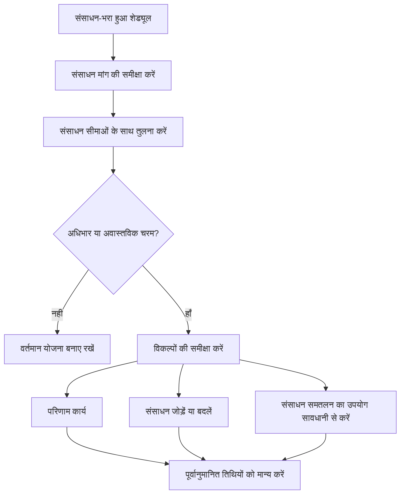

# पी6 में संसाधन संतुलन

प्रिमावेरा पी6 में संसाधन संतुलन उपलब्ध क्षमता के विरुद्ध संसाधन की मांग की समीक्षा करने और योजना को समायोजित करने की प्रक्रिया है ताकि उपलब्ध संसाधनों के साथ कार्य निष्पादित किया जा सके। यह प्रोजेक्ट टीम को यह समझने में मदद करता है कि शेड्यूल केवल तार्किक रूप से सही है या संसाधन के दृष्टिकोण से व्यावहारिक भी है।

दिन-प्रतिदिन के शेड्यूलिंग में, लोग अक्सर संसाधन संतुलन और संसाधन समतलन शब्दों का उपयोग इस तरह करते हैं मानो उनका मतलब एक ही हो। वे संबंधित हैं, लेकिन वे बिल्कुल एक जैसे नहीं हैं।

संसाधन संतुलन व्यापक योजना समीक्षा है। इसमें हिस्टोग्राम, संसाधन प्रोफाइल, चालक दल की उपलब्धता, उपकरण की मांग, जनशक्ति शिखर और योजना की वास्तविकता को देखना शामिल है।

रिसोर्स लेवलिंग एक P6 सुविधा है जो संसाधन उपलब्धता और लेवलिंग सेटिंग्स के आधार पर गतिविधियों को स्थानांतरित कर सकती है।

सुविधा उपयोगी हो सकती है, लेकिन इसका उपयोग नियंत्रण के साथ किया जाना चाहिए। P6 एक समतल परिणाम की गणना कर सकता है, लेकिन अनुसूचक को यह तय करना होगा कि वह परिणाम परियोजना के लिए सार्थक है या नहीं।

## संसाधन संतुलन क्या है

संसाधन संतुलन एक व्यावहारिक प्रश्न पूछता है: क्या परियोजना इस शेड्यूल को उन संसाधनों के साथ क्रियान्वित कर सकती है जो उसके पास वास्तव में हैं?

एक शेड्यूल में अच्छे तर्क, स्वीकार्य तिथियां और एक उचित महत्वपूर्ण पथ हो सकता है। लेकिन अगर एक ही समय में कई स्थानों पर काम करने के लिए एक ही सीमित चालक दल या उपकरण की आवश्यकता होती है, तो योजना यथार्थवादी नहीं हो सकती है।

संसाधनों को संतुलित करने का अर्थ है उस मांग की समीक्षा करना और यह निर्णय लेना कि इसे कैसे प्रबंधित किया जाए।

संभावित कार्रवाइयों में शामिल हैं:

- गैर-महत्वपूर्ण कार्य को आगे बढ़ाना।
- संसाधन जोड़ना.
- कार्य को विभिन्न दल या क्षेत्रों में बाँटना।
- गतिविधि अनुक्रम बदलना.
- ओवरटाइम या शिफ्ट कार्य का उपयोग करना।
- कैलेंडर समायोजित करना.
- संसाधन सीमाएँ अद्यतन की जा रही हैं।
- यदि यह यथार्थवादी और स्वीकृत है तो अस्थायी शिखर को स्वीकार करना।

लक्ष्य हिस्टोग्राम को बिल्कुल सपाट बनाना नहीं है। वास्तविक परियोजनाओं में शिखर और घाटियाँ होती हैं। लक्ष्य यह सुनिश्चित करना है कि संसाधन की मांग को समझा जाए, प्राप्त किया जाए और निष्पादन योजना के साथ संरेखित किया जाए।

## यह क्यों मायने रखती है

संसाधन संतुलन मायने रखता है क्योंकि शेड्यूल को केवल गणना का नहीं, बल्कि निष्पादन का समर्थन करना चाहिए।

यदि योजना को अगले सप्ताह 50 वेल्डर की आवश्यकता है लेकिन ठेकेदार केवल 30 ही प्रदान कर सकता है, तो शेड्यूल एक ऐसी मांग दिखा रहा है जिसे पूरा नहीं किया जा सकता है। यदि दो महत्वपूर्ण गतिविधियों के लिए एक ही समय में एक ही क्रेन की आवश्यकता होती है, तो उनमें से कम से कम एक को स्थानांतरित करना पड़ सकता है। यदि सभी इंजीनियरिंग समीक्षा गतिविधियों के लिए एक ही विशेषज्ञ की आवश्यकता होती है, तो निर्माण शुरू होने से पहले ही बाधा उत्पन्न हो सकती है।

संसाधन संतुलन के बिना, परियोजना यह मान सकती है कि उसकी क्षमता वास्तव में उससे अधिक है।

यह प्रभावित कर सकता है:

- निकट भविष्य की योजना।
- जनशक्ति का पूर्वानुमान.
- उपकरण योजना.
- महत्वपूर्ण पथ विश्वसनीयता.
- अर्जित मूल्य पूर्वानुमान.
- लागत और नकदी प्रवाह वक्र.
- प्रगति प्रतिबद्धताएँ.
- पुनर्प्राप्ति योजनाएँ.

संसाधन संतुलन सीपीएम शेड्यूल को वास्तविक क्षेत्र और कार्यालय क्षमता से जोड़ने में मदद करता है।

## संसाधन संतुलन बनाम संसाधन समतलन

संसाधन संतुलन एक प्रबंधन और नियोजन गतिविधि है।

संसाधन समतलन एक शेड्यूलिंग गणना है।

वह भेद महत्वपूर्ण है. एक योजनाकार हिस्टोग्राम की समीक्षा करके और परियोजना ज्ञान के आधार पर शेड्यूल को समायोजित करके संसाधनों को मैन्युअल रूप से संतुलित कर सकता है। जब संसाधन की मांग उपलब्धता से अधिक हो जाती है तो P6 संसाधन लेवलिंग गतिविधियों को स्वचालित रूप से विलंबित करने में भी मदद कर सकती है।

दोनों दृष्टिकोण उपयोगी हो सकते हैं.

मैन्युअल संतुलन तब बेहतर होता है जब शेड्यूलर को निर्णय, फ़ील्ड इनपुट, निर्माण क्षमता की समीक्षा, या कौन सी गतिविधियाँ चलती हैं, इस पर सावधानीपूर्वक नियंत्रण की आवश्यकता होती है।

P6 संसाधन लेवलिंग तब उपयोगी होती है जब संसाधन डेटा विश्वसनीय होता है, संसाधन सीमाएँ परिभाषित होती हैं, कैलेंडर सही होते हैं, और शेड्यूलर यह परीक्षण करना चाहता है कि संसाधन उपलब्धता लागू होने पर शेड्यूल कैसे बदलता है।

लेवलिंग को नियोजन निर्णय का स्थान नहीं लेना चाहिए। इसका समर्थन करना चाहिए.

## लेवलिंग से पहले P6 को क्या चाहिए

P6 संसाधन लेवलिंग सुविधा का उपयोग करने से पहले, संसाधन विश्लेषण के लिए शेड्यूल तैयार होना चाहिए।

कम से कम, जांचें:

- गतिविधियों में सार्थक संसाधन असाइनमेंट होते हैं।
- संसाधन इकाइयाँ वास्तविक माँग को दर्शाती हैं।
- संसाधन सीमाएँ वास्तविक उपलब्धता को दर्शाती हैं।
- संसाधन कैलेंडर सही हैं.
- गतिविधि कैलेंडर सही हैं.
- शेड्यूलिंग निर्णयों का समर्थन करने के लिए तर्क पर्याप्त रूप से पूर्ण है।
- बाधाएं समझ में आती हैं.
- प्राथमिकताएँ परिभाषित या समीक्षा की जाती हैं।
- वर्तमान शेड्यूल सहेजा गया है ताकि समतल परिणाम की तुलना की जा सके।

यदि ये आइटम कमजोर हैं, तो लेवलिंग से ऐसा परिणाम मिल सकता है जो सटीक दिखता है लेकिन उपयोगी नहीं है।

उदाहरण के लिए, यदि सभी निर्माण श्रम को एक सामान्य "निर्माण दल" संसाधन को सौंपा गया है, तो P6 संसाधन अधिभार दिखा सकता है, लेकिन परिणाम परियोजना को यह नहीं बता सकता है कि समस्या सिविल, पाइपिंग, इलेक्ट्रिकल या मैकेनिकल है या नहीं। संसाधन सेटअप को नियोजन निर्णय से मेल खाना चाहिए।

## P6 संसाधन लेवलिंग का उपयोग कैसे करता है

P6 संसाधन लेवलिंग संसाधन असाइनमेंट और उपलब्धता की समीक्षा करता है। सेटिंग्स के आधार पर, संसाधन के अति-आवंटन को कम करने या हटाने के लिए गतिविधियों में देरी हो सकती है।

गणना संसाधन सीमा, गतिविधि तर्क, फ़्लोट, कैलेंडर, प्राथमिकताओं और लेवलिंग विकल्पों पर विचार कर सकती है। सटीक परिणाम इस बात पर निर्भर करता है कि प्रोजेक्ट कैसे कॉन्फ़िगर किया गया है।

व्यावहारिक रूप से, पी6 उन स्थितियों की तलाश करता है जहां संसाधनों की मांग उपलब्धता से अधिक है और फिर गतिविधियों को उन तारीखों में स्थानांतरित करने का प्रयास करता है जहां संसाधन उपलब्ध हैं।

यह एक अधिक संसाधन-व्यवहार्य शेड्यूल बना सकता है, लेकिन यह महत्वपूर्ण पथ को भी बदल सकता है, मील के पत्थर में देरी कर सकता है, या काम को ऐसे तरीकों से आगे बढ़ा सकता है जिनकी समीक्षा की आवश्यकता है।

समतल करने के बाद, अनुसूचक को परिणाम की तुलना मूल पूर्वानुमान से करनी चाहिए:

- कौन सी गतिविधियाँ स्थानांतरित हुईं?
- कौन से मील के पत्थर बदले?
- क्या आलोचनात्मक पथ बदल गया?
- क्या लेवलिंग में उपलब्ध फ़्लोट का उपयोग किया गया या प्रोजेक्ट ख़त्म होने में देरी हुई?
- क्या नई तारीखें रचनात्मक हैं?
- क्या परिणाम ने संसाधन समस्या का समाधान कर दिया या कोई अन्य समस्या उत्पन्न कर दी?

निर्धारित कार्यक्रम को आँख मूँद कर स्वीकार नहीं किया जाना चाहिए।

## संसाधन संतुलन का उपयोग कब करें

जब भी संसाधन उपलब्धता निष्पादन को प्रभावित करती है तो संसाधन संतुलन का उपयोग करें।

यह विशेष रूप से उपयोगी है:

- चालक दल की सीमाओं के साथ निर्माण कार्यक्रम।
- शटडाउन, टर्नअराउंड और आउटेज।
- सीमित विशेषज्ञों के साथ कमीशनिंग योजनाएँ।
- साझा समीक्षकों के साथ इंजीनियरिंग कार्यक्रम।
- महँगे या साझा उपकरण वाली परियोजनाएँ।
- प्रोग्राम जहां एक संसाधन पूल कई परियोजनाओं का समर्थन करता है।
- पुनर्प्राप्ति योजनाएं जहां अतिरिक्त संसाधनों पर विचार किया जा रहा है।

आधारभूत अनुमोदन से पहले संसाधन संतुलन भी उपयोगी है। एक आधार रेखा जो अवास्तविक जनशक्ति या उपकरण उपलब्धता मानती है, बाद में बचाव करना मुश्किल हो सकता है।

अपडेट के दौरान, संसाधन संतुलन यह पुष्टि करने में मदद करता है कि क्या शेष कार्य अभी भी वर्तमान टीम और उपकरण के साथ वितरित किया जा सकता है।

## कब सावधान रहें

जब संसाधन डेटा का रखरखाव नहीं किया जाता है तो सावधान रहें।

यदि वास्तविक इकाइयाँ अद्यतन नहीं की जाती हैं, तो संसाधन वक्र वास्तविकता से दूर हो सकते हैं। यदि संसाधन केवल लागत लोडिंग के लिए आवंटित किए गए हैं, तो इकाइयाँ वास्तविक क्षमता का प्रतिनिधित्व नहीं कर सकती हैं। यदि कैलेंडर गलत हैं, तो संसाधन उपलब्धता भी गलत हो सकती है।

संविदात्मक या बेसलाइन शेड्यूल पर संसाधन लेवलिंग का उपयोग करते समय भी सावधान रहें। लेवलिंग से तारीखें आगे बढ़ सकती हैं और फ़्लोट प्रभावित हो सकता है। टीम को यह समझना चाहिए कि क्या समतल कार्यक्रम आधिकारिक योजना है, क्या होगा-अगर परिदृश्य है, या आंतरिक योजना दृश्य है।

लेवलिंग से तर्क संबंधी कमज़ोरियाँ भी छुप सकती हैं। यदि कोई गतिविधि लेवलिंग के कारण चलती है, तो समीक्षक यह भूल सकते हैं कि मूल तर्क अधूरा या गलत था। हमेशा पहले तर्क की समीक्षा करें, फिर संसाधनों की।

## व्यवहार में इसका उपयोग कैसे करें

सबसे महत्वपूर्ण संसाधनों की पहचान करके शुरुआत करें। प्रत्येक छोटे संसाधन को समान स्तर के विवरण के साथ संतुलित करने का प्रयास न करें। प्रमुख कर्मचारियों, महत्वपूर्ण विशेषज्ञों, साझा उपकरणों और संसाधनों पर ध्यान केंद्रित करें जो मील के पत्थर को प्रभावित कर सकते हैं।

फिर P6 में संसाधन प्रोफ़ाइल या हिस्टोग्राम की समीक्षा करें। शिखर, अधिभार, अंतराल और मांग में अचानक बदलाव को देखें।

संसाधन सीमा के विरुद्ध मांग की तुलना करें। यदि मांग सीमा से अधिक है, तो जिम्मेदार टीम के साथ मुद्दे पर चर्चा करें। उत्तर क्रियाशील हो सकता है, न कि केवल शेड्यूलिंग।

इसके बाद, सुधार विधि तय करें:

- यदि संसाधन सीमा ग़लत है, तो संसाधन सीमा अद्यतन करें।
- यदि संसाधन की मांग गलत है, तो असाइनमेंट को सही करें।
- यदि अनुक्रम अवास्तविक है, तो तर्क या गतिविधि समय समायोजित करें।
- यदि अधिभार वास्तविक है, तो तय करें कि संसाधन जोड़ना है, ओवरटाइम का उपयोग करना है, काम को स्थानांतरित करना है, या शिखर को स्वीकार करना है।
- यदि स्वचालित लेवलिंग उपयुक्त है, तो इसे नियंत्रित परिदृश्य के रूप में चलाएं और परिणाम की तुलना करें।

संसाधन लेवलिंग चलाने से पहले अनलेवल शेड्यूल की एक प्रति अपने पास रखें। इससे टीम को एक संदर्भ बिंदु मिलता है और यह समझाने में मदद मिलती है कि क्या बदलाव आया है।

## अच्छा रिवाज़

संसाधन संतुलन का उपयोग शेड्यूल समीक्षा के भाग के रूप में करें, न कि एक बार की सफ़ाई प्रक्रिया के रूप में।

आधारभूत विकास, प्रमुख पूर्वानुमानों, पुनर्प्राप्ति योजना और नियमित अद्यतन चक्रों के दौरान संसाधन घटता की समीक्षा करें।

खराब-गुणवत्ता वाला शेड्यूल न बनाएं और परिणाम विश्वसनीय होने की उम्मीद न करें। पहले तर्क, कैलेंडर, गतिविधि स्थिति, शेष अवधि और संसाधन असाइनमेंट ठीक करें।

जब P6 सुविधा का उपयोग किया जाता है तो दस्तावेज़ लेवलिंग सेटिंग्स। संसाधन समतलन चयनित विकल्पों के आधार पर अलग-अलग परिणाम दे सकता है, इसलिए सेटिंग्स शेड्यूल रिकॉर्ड का हिस्सा हैं।

सबसे महत्वपूर्ण बात यह है कि संसाधन योजना को उन लोगों के साथ मान्य करें जिनके पास काम है। प्रोजेक्ट टीम को यह पुष्टि करनी चाहिए कि क्या संसाधन शिखर प्राप्त करने योग्य हैं, क्या अनुक्रम व्यावहारिक है, और क्या अतिरिक्त संसाधन वास्तव में उपलब्ध हैं।

## निष्कर्ष

पी6 में संसाधन संतुलन प्रोजेक्ट टीम को यह परीक्षण करने में मदद करता है कि शेड्यूल को उपलब्ध संसाधनों के साथ निष्पादित किया जा सकता है या नहीं। यह तारीखों और तर्क को जनशक्ति, उपकरण, विशेषज्ञ उपलब्धता और वास्तविक उत्पादन क्षमता से जोड़ता है।

पी6 संसाधन लेवलिंग संसाधन उपलब्धता के आधार पर गतिविधियों को आगे बढ़ाकर इस समीक्षा का समर्थन कर सकता है, लेकिन इसका उपयोग सावधानी से किया जाना चाहिए और गणना के बाद समीक्षा की जानी चाहिए।

एक संतुलित शेड्यूल जरूरी नहीं कि पूरी तरह से सुचारू शेड्यूल हो। यह एक शेड्यूल है जहां संसाधन की मांग दिखाई देती है, यथार्थवादी होती है और परियोजना को वास्तव में वितरित करने के तरीके के साथ संरेखित होती है।
## संबंधित सामग्री
- [प्रिमावेरा पी6 में 0% प्रगति के साथ गतिविधियाँ शुरू हुईं - अवलोकन](../../05_metrics_hi/13_activity_started_progress_zero/01_overview_template.md)
- [P6 में संसाधन सीमाएँ](../13_RESOURCES%20LIMITS%20IN%20P6/13_RESOURCES%20LIMITS%20IN%20P6.md)
- [SS और FF Relations](../15_SS%20&%20FF%20RELATIONS/15_SS%20&%20FF%20RELATIONS.md)
