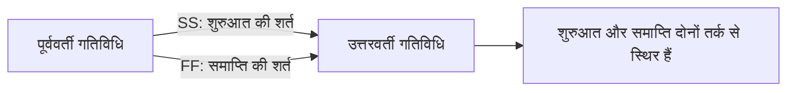

Start-to-Start (SS) और Finish-to-Finish (FF) Primavera P6 में वैध तर्क संबंध प्रकार हैं। जब दो गतिविधियाँ वास्तविक रूप से ओवरलैप करती हैं, तब ये संबंध साधारण Finish-to-Start संबंध की तुलना में कार्य क्रम को अधिक सही ढंग से दिखा सकते हैं।

समस्या SS या FF में नहीं है। समस्या तब आती है जब इन्हें अकेले इस्तेमाल किया जाता है, जबकि गतिविधि की शुरुआत और समाप्ति दोनों को नियंत्रित करने की जरूरत होती है। अकेला SS संबंध उत्तरवर्ती गतिविधि की शुरुआत को नियंत्रित करता है, लेकिन उसकी समाप्ति को नहीं। अकेला FF संबंध समाप्ति को नियंत्रित करता है, लेकिन शुरुआत को नहीं। इसलिए कई शेड्यूलर इन्हें पूरक तर्क के बिना "आधा संबंध" मानते हैं।

## SS और FF का अर्थ

SS संबंध का अर्थ है कि उत्तरवर्ती गतिविधि पूर्ववर्ती गतिविधि की शुरुआत पर, या पूर्ववर्ती शुरुआत से परिभाषित लैग के बाद, शुरू हो सकती है।

FF संबंध का अर्थ है कि उत्तरवर्ती गतिविधि पूर्ववर्ती गतिविधि की समाप्ति पर, या पूर्ववर्ती समाप्ति से परिभाषित लैग के बाद, समाप्त हो सकती है।

दोनों वास्तविक काम को दिखा सकते हैं। उदाहरण के लिए, डिज़ाइन उत्पादन शुरू होने के बाद इंजीनियरिंग समीक्षा शुरू हो सकती है। स्थापना समाप्त होने पर ही परीक्षण समाप्त हो सकता है। निर्माण क्षेत्रों में एक क्रू दूसरे क्रू के शुरू होने के बाद काम शुरू कर सकता है, लेकिन दोनों क्रू की समाप्ति पर भी नियंत्रण चाहिए।

## अकेला SS अधूरा क्यों हो सकता है

अकेला SS संबंध केवल उत्तरवर्ती गतिविधि की शुरुआत को स्थिर करता है। वह यह नहीं बताता कि उत्तरवर्ती गतिविधि की समाप्ति किससे नियंत्रित होगी।

यदि उत्तरवर्ती गतिविधि की अवधि बदलती है या गतिविधि यथार्थवादी सीमा से आगे बढ़ती है, तो डाउनस्ट्रीम तर्क के बिना शेड्यूल सही प्रभाव नहीं दिखा पाएगा। शुरुआत जुड़ी हुई दिखेगी, लेकिन समाप्ति खुली रह सकती है।

P6 में इससे शेड्यूल वास्तविकता से अधिक जुड़ा हुआ दिख सकता है। गतिविधि के पास पूर्ववर्ती गतिविधि तो होगी, लेकिन तर्क कार्य निष्पादन क्रम को पूरी तरह नहीं समझाएगा।

## अकेला FF अधूरा क्यों हो सकता है

अकेला FF विपरीत समस्या बनाता है। वह उत्तरवर्ती गतिविधि की समाप्ति को स्थिर करता है, लेकिन यह नहीं बताता कि वह गतिविधि कब शुरू हो सकती है।

अद्यतन शेड्यूल में इससे गतिविधि की आरंभिक शुरुआत बहुत पीछे गणना हो सकती है। गतिविधि Data Date पर या उससे पहले शुरू होने योग्य दिख सकती है, इसलिए नहीं कि काम तैयार है, बल्कि इसलिए कि शुरुआत की शर्त तर्क में परिभाषित नहीं है।

इससे फ्लोट, क्रिटिकल पाथ विश्लेषण और निकट अवधि योजना गलत संकेत दे सकते हैं।

## SS + FF जोड़ी

जब काम सच में ओवरलैप करता है, तो मजबूत मॉडल अक्सर SS + FF जोड़ी होता है। SS संबंध बताता है कि उत्तरवर्ती गतिविधि कब शुरू हो सकती है। FF संबंध बताता है कि उत्तरवर्ती गतिविधि कब समाप्त हो सकती है। साथ में वे ओवरलैप कार्य की तार्किक सीमा बनाते हैं।

यह निरंतर कार्य, क्षेत्र-दर-क्षेत्र निर्माण, डिज़ाइन और समीक्षा चक्र, स्थापना और परीक्षण, या दोहरावदार उत्पादन क्रम में उपयोगी है।

## कब अकेला SS या FF स्वीकार्य हो सकता है

हर अकेला SS या FF संबंध अपने आप गलत नहीं है।

अकेला SS स्वीकार्य हो सकता है यदि उत्तरवर्ती गतिविधि की समाप्ति किसी अन्य वैध डाउनस्ट्रीम संबंध से नियंत्रित है। अकेला FF स्वीकार्य हो सकता है यदि उत्तरवर्ती गतिविधि की शुरुआत किसी अन्य वैध पूर्ववर्ती तर्क से नियंत्रित है। मुख्य प्रश्न यह है कि गतिविधि के दोनों सिरे नेटवर्क में कहीं न कहीं नियंत्रित हैं या नहीं।

शेड्यूलर को यह समझा पाना चाहिए कि अकेला संबंध पर्याप्त क्यों है। यदि व्याख्या स्पष्ट नहीं है, तो संबंध की समीक्षा करनी चाहिए।

## P6 में समीक्षा कैसे करें

P6 में SS पूर्ववर्ती, SS उत्तरवर्ती, FF पूर्ववर्ती और FF उत्तरवर्ती वाली गतिविधियों की समीक्षा करें। खासकर उन गतिविधियों को देखें जिनका एकमात्र पूर्ववर्ती FF है या एकमात्र उत्तरवर्ती SS है।

उपयोगी समीक्षा फ़ील्ड हैं Activity ID, Activity Name, Start, Finish, Activity Status, Total Float, Predecessors, Successors, Relationship Type, Lag, Constraints और Driving Relationship संकेतक।

पूछें:

- यह गतिविधि किस शर्त से शुरू हो सकती है?
- इसकी समाप्ति को क्या नियंत्रित करता है?
- क्या ओवरलैप भौतिक या अनुबंधीय रूप से वास्तविक है?
- क्या लैग गुम विवरण छिपा रहा है?
- क्या संबंध निष्पादन योजना को समझाता है?
- क्या स्वतंत्र समीक्षक तर्क समझ पाएगा?

## सामान्य समस्याएँ

एक आम समस्या है SS संबंध से काम को जल्दी खींचना, लेकिन उस वास्तविक शर्त को मॉडल न करना जो ओवरलैप की अनुमति देती है।

दूसरी समस्या है FF संबंध से समाप्ति तिथि को रोकना, लेकिन गतिविधि की शुरुआत खुली छोड़ देना।

SS और FF का गलत उपयोग तब भी होता है जब बड़े काम को छोटी स्पष्ट गतिविधियों में बाँटना चाहिए था। अस्पष्ट गतिविधि पर संबंध लगाकर परिणाम मजबूर करना स्वच्छ योजना नहीं है।

## अच्छा अभ्यास

SS और FF संबंधों का उपयोग उद्देश्य के साथ करें। वे वास्तविक अनुक्रमण दिखाएँ, शेड्यूल सुविधा नहीं।

SS उपयोग करते समय पुष्टि करें कि उत्तरवर्ती गतिविधि की समाप्ति भी तर्क से नियंत्रित है। FF उपयोग करते समय पुष्टि करें कि उत्तरवर्ती गतिविधि की शुरुआत भी तर्क से नियंत्रित है।

जहाँ ओवरलैप कार्य की शुरुआत और समाप्ति दोनों लिंक होनी चाहिए, वहाँ SS + FF जोड़ी का उपयोग करें। यदि अकेला SS या FF जानबूझकर रखा गया है, तो अपवाद दस्तावेज़ करें।

## निष्कर्ष

SS और FF P6 में उपयोगी उपकरण हैं, लेकिन इनके लिए अनुशासन चाहिए। अकेले उपयोग होने पर वे गतिविधि के केवल एक सिरे को नियंत्रित कर सकते हैं और अधूरा तर्क बना सकते हैं।

विश्वसनीय CPM शेड्यूल को यह समझाना चाहिए कि काम क्यों शुरू हो सकता है और उसकी समाप्ति किससे नियंत्रित है। जब SS और FF इन प्रश्नों का उत्तर देते हैं, वे शेड्यूल को मजबूत बनाते हैं। जब वे एक सिरा खुला छोड़ते हैं, तो तर्क समीक्षा की जरूरत है।

## संबंधित सामग्री
- [बिना किसी ड्राइविंग लॉजिक के डेटा तिथि पर शुरू होने वाली गतिविधियाँ: यह शेड्यूल मीट्रिक क्यों मायने रखता है - अवलोकन](../../metrics/01_activities_starting_in_dd_with_no_logic_driving/02_guide_template.md)
- [पी6 में संसाधन संतुलन](../14_RESOURCES%20BALANCING%20IN%20P6/14_RESOURCES%20BALANCING%20IN%20P6.md)
- [CPM (क्रिटिकल पाथ मेथड)](../16_CPM%20(CRITICAL%20PATH%20METHOD)/16_CPM%20(CRITICAL%20PATH%20METHOD).md)
