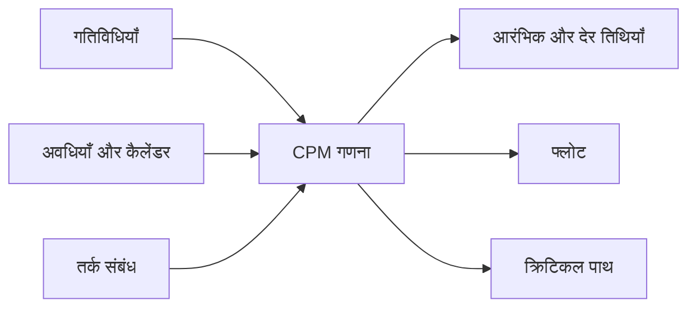

क्रिटिकल पाथ मेथड, या CPM, गंभीर प्रोजेक्ट शेड्यूल के पीछे की मुख्य गणना विधि है। यह गतिविधियों की सूची को तर्क-संचालित मॉडल में बदलता है, ताकि टीम समझ सके कि प्रोजेक्ट कब समाप्त हो सकता है, कौन सी गतिविधियाँ समाप्ति को नियंत्रित करती हैं और शेड्यूल में लचीलापन कहाँ है।

Primavera P6 में CPM अक्सर शेड्यूल बटन के पीछे छिपा रहता है। सॉफ़्टवेयर तिथियाँ, फ्लोट और क्रिटिकल गतिविधियाँ जल्दी गणना कर देता है। फिर भी विधि को समझना जरूरी है। यदि योजनाकार CPM नहीं समझता, तो शेड्यूल गणना तो करेगा, लेकिन परिणाम का अर्थ गलत समझा जा सकता है।

## CPM क्या करता है

CPM गतिविधियों, अवधियों, कैलेंडरों और संबंधों के नेटवर्क से प्रोजेक्ट अवधि गणना करता है।

मुख्य विचार सरल है: प्रोजेक्ट अवधि सभी गतिविधियों की अवधि का योग नहीं है। यह निर्भर कार्य के सबसे लंबे जुड़े हुए पथ की अवधि है। यही क्रिटिकल पाथ है।

यदि इस पथ की कोई गतिविधि देरी करती है, तो प्रोजेक्ट समाप्ति भी देरी करेगी, जब तक उसी पथ पर समय रिकवर न किया जाए।

## CPM को कौन से इनपुट चाहिए

CPM शेड्यूल नेटवर्क की गुणवत्ता पर निर्भर करता है।

पहले, शेड्यूल में स्पष्ट कार्य हिस्सों को दिखाने वाली गतिविधियाँ होनी चाहिए। हर गतिविधि का दायरा, उचित अवधि और स्पष्ट समाप्ति बिंदु होना चाहिए।

दूसरे, हर गतिविधि को अवधि चाहिए। अधिकतर P6 शेड्यूल में यह उत्पादकता, संसाधन, कैलेंडर और निष्पादन धारणाओं पर आधारित नियतात्मक अनुमान होता है।

तीसरे, गतिविधियों को तर्क चाहिए। संबंध बताते हैं कि कौन सा काम पहले होना चाहिए, क्या समानांतर हो सकता है और किस शर्त पर उत्तरवर्ती गतिविधि शुरू या समाप्त हो सकती है।

CPM यह नहीं जानता कि तर्क अच्छा है या नहीं। वह मिले हुए तर्क से गणना करता है। गुम तर्क, कमजोर बाधाएँ, अत्यधिक लैग या अधूरे SS/FF संबंध परिणाम को गणितीय रूप से सही लेकिन व्यावहारिक रूप से अविश्वसनीय बना सकते हैं।

## फॉरवर्ड पास और बैकवर्ड पास

CPM दो मुख्य पास में शेड्यूल गणना करता है।

फॉरवर्ड पास Data Date से प्रोजेक्ट समाप्ति की ओर चलता है। यह तर्क, अवधियों, कैलेंडरों और बाधाओं के आधार पर प्रत्येक गतिविधि की सबसे आरंभिक शुरुआत और समाप्ति तिथि गणना करता है।

बैकवर्ड पास प्रोजेक्ट समाप्ति से शुरुआत की ओर चलता है। यह उन सबसे देर तिथियों की गणना करता है जिन पर गतिविधि शुरू और समाप्त हो सकती है, बिना प्रोजेक्ट समाप्ति या चयनित लक्ष्य को देरी किए।

इन आरंभिक और देर तिथियों से P6 फ्लोट गणना करता है।

## फ्लोट

फ्लोट वह समय है जितना कोई गतिविधि परिभाषित शेड्यूल लक्ष्य को प्रभावित किए बिना खिसक सकती है।

Total Float सामान्यतः P6 में सबसे ज्यादा समीक्षा किया जाने वाला मूल्य है। यह दिखाता है कि गतिविधि प्रोजेक्ट समाप्ति या नियंत्रक पथ को प्रभावित करने से पहले कितनी देरी सह सकती है।

Free Float अधिक स्थानीय है। यह बताता है कि गतिविधि अपने तत्काल उत्तरवर्ती की आरंभिक शुरुआत को प्रभावित करने से पहले कितनी देरी हो सकती है।

फ्लोट बर्बाद करने के लिए खाली समय नहीं है। यह शेड्यूल लचीलापन है। जब फ्लोट उपयोग हो जाता है, तो भविष्य की देरी के खिलाफ सुरक्षा कम हो जाती है।

## क्रिटिकल पाथ

क्रिटिकल पाथ निर्भर गतिविधियों का सबसे लंबा जुड़ा हुआ पथ है जो प्रोजेक्ट समाप्ति को नियंत्रित करता है। कई शेड्यूल में क्रिटिकल गतिविधियाँ शून्य या नकारात्मक Total Float से पहचानी जाती हैं, लेकिन बेहतर समीक्षा यह है कि सबसे लंबे पथ को समझा जाए और देखा जाए कि वह तार्किक है या नहीं।

अच्छा क्रिटिकल पाथ विश्वसनीय निष्पादन कहानी बताता है। उसे उन गतिविधियों से गुजरना चाहिए जो वास्तव में समाप्ति नियंत्रित करती हैं: डिज़ाइन जारीकरण, खरीद, निर्माण क्रम, परीक्षण, कमीशनिंग, हैंडओवर या अन्य वास्तविक प्रोजेक्ट प्रेरक।

यदि क्रिटिकल पाथ अजीब माइलस्टोन, अनावश्यक बाधाओं, गुम तर्क या गैर-नियंत्रित गतिविधियों से गुजरता है, तो शेड्यूल गलत संकेत दे सकता है।

## निकट-क्रिटिकल कार्य

टीम को केवल शून्य फ्लोट वाली गतिविधियों को नहीं देखना चाहिए।

निकट-क्रिटिकल गतिविधियों में कम फ्लोट होता है और थोड़ी देरी से वे क्रिटिकल बन सकती हैं। सीमा प्रोजेक्ट आकार और संवेदनशीलता पर निर्भर करती है। बड़े प्रोजेक्ट में 10 या 20 कार्य दिवस से कम फ्लोट वाली गतिविधियों पर करीबी ध्यान देना उचित हो सकता है।

जोखिम हमेशा एक साफ रेखा में नहीं रहता। घने निर्माण, कमीशनिंग या शटडाउन विंडो में कई पथ क्रिटिकल बनने के करीब हो सकते हैं।

## CPM और जोखिम विश्लेषण

CPM नियतात्मक उत्तर देता है: यदि हर गतिविधि नियोजित अवधि लेती है, तो प्रोजेक्ट इस तिथि पर समाप्त होगा।

शेड्यूल जोखिम विश्लेषण अनिश्चितता की जाँच करता है। यह गतिविधि अवधियों पर सीमाएँ या संभाव्यता वितरण लगाकर कई सिमुलेशन चलाता है। इससे लक्ष्य तिथि तक समाप्त होने की संभावना का अनुमान मिलता है।

लेकिन जोखिम विश्लेषण CPM नेटवर्क पर निर्भर करता है। कमजोर तर्क से कमजोर जोखिम परिणाम मिलेगा। Monte Carlo सिमुलेशन गुम तर्क, अयथार्थवादी अवधियाँ या खराब शेड्यूल संरचना को ठीक नहीं कर सकता।

## Primavera P6 में CPM

P6 CPM गणना को तेज बनाता है, लेकिन यह गति धारणाओं को छिपा सकती है।

शेड्यूल गणना करते समय P6 Data Date, कैलेंडर, अवधि, गतिविधि संबंध, बाधाएँ, वास्तविक मान, शेष अवधियाँ और शेड्यूल विकल्प उपयोग करता है। इन सेटिंग्स में छोटे परिवर्तन फ्लोट, क्रिटिकल पाथ और पूर्वानुमान तिथियाँ बदल सकते हैं।

इसलिए योजनाकार को केवल F9 दबाकर परिणाम स्वीकार नहीं करना चाहिए। उसे देखना चाहिए कि गणना वास्तविक निष्पादन योजना से मेल खाती है या नहीं।

## अच्छा अभ्यास

CPM नेटवर्क को वास्तविक निष्पादन तर्क से बनाएं। केवल जाँच पास कराने या इच्छित तिथि पाने के लिए संबंध न जोड़ें।

हर अद्यतन के बाद क्रिटिकल पाथ की समीक्षा करें। पुष्टि करें कि वह वर्तमान प्रोजेक्ट स्थिति के लिए उचित शुरुआत और समाप्ति दिखाता है।

फ्लोट की गति समय के साथ ट्रैक करें। प्रोजेक्ट योजना पर दिख सकता है जबकि फ्लोट चुपचाप उपयोग हो रहा हो।

निकट-क्रिटिकल पथों की समीक्षा करें। अक्सर वही अगली शेड्यूल समस्या दिखाते हैं।

शेड्यूल को CPM समर्थन करने लायक स्वच्छ रखें। खुली शुरुआतें, खुली समाप्तियाँ, कठोर बाधाएँ, अत्यधिक लैग और अधूरे संबंध CPM गणना का मूल्य घटाते हैं।

## निष्कर्ष

CPM वह इंजन है जो Primavera P6 शेड्यूल को प्रोजेक्ट नियंत्रण उपकरण बनाता है। यह गतिविधि नेटवर्क से आरंभिक तिथियाँ, देर तिथियाँ, फ्लोट और क्रिटिकल पाथ गणना करता है।

लेकिन CPM उतना ही विश्वसनीय है जितना शेड्यूल जिसे वह गणना करता है। अच्छी गतिविधियाँ, यथार्थवादी अवधियाँ, मजबूत कैलेंडर और मजबूत तर्क परिणाम को सार्थक बनाते हैं।

CPM का मूल्य केवल प्रोजेक्ट समाप्ति तिथि दिखाना नहीं है। असली मूल्य यह समझाना है कि समाप्ति तिथि क्यों नियंत्रित है, लचीलापन कहाँ है और प्रबंधन का ध्यान कहाँ जाना चाहिए।

## संबंधित सामग्री
- [एक बाधा से शुरू होने वाला महत्वपूर्ण पथ या फ्लोट पथ - अवलोकन](../../metrics/09_cp_or_float_path_starting_with_constraint/02_guide_template.md)
- [SS और FF संबंध](../15_SS%20&%20FF%20RELATIONS/15_SS%20&%20FF%20RELATIONS.md)
- [प्रोजेक्ट शेड्यूल विकसित करें](../17_DEVELOPE%20A%20PROJECT%20SCHEDULE/17_DEVELOPE%20A%20PROJECT%20SCHEDULE.md)
