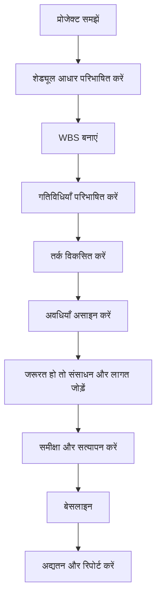

# प्रोजेक्ट शेड्यूल विकसित करें

शून्य से प्रोजेक्ट शेड्यूल विकसित करना केवल Primavera P6 में गतिविधियाँ दर्ज करना नहीं है। यह दायरा, निष्पादन रणनीति, बाधाएँ, संसाधन और प्रोजेक्ट प्रतिबद्धताओं को ऐसे समय मॉडल में बदलने की प्रक्रिया है जिसे समीक्षा, अनुमोदन, अद्यतन और निर्णय लेने के लिए उपयोग किया जा सके।

अच्छा शेड्यूल गणना होने से पहले बनाया जाता है। अंतिम P6 फ़ाइल की गुणवत्ता उस सोच पर निर्भर करती है जो पहली गतिविधि दर्ज करने से पहले होती है।

## विकास प्रवाह

## पहले प्रोजेक्ट समझें

P6 खोलने से पहले प्रोजेक्ट को समझें।

अनुबंध, कार्य दायरा, विनिर्देश, मुख्य माइलस्टोन, निष्पादन रणनीति, खरीद बाधाएँ, परमिट, पहुंच सीमाएँ और हैंडओवर आवश्यकताएँ समीक्षा करें। फिर प्रोजेक्ट मैनेजर, इंजीनियरिंग, खरीद, निर्माण, कमीशनिंग, उपठेकेदार और आपूर्तिकर्ताओं से बात करें।

शेड्यूल यह मॉडल है कि टीम प्रोजेक्ट कैसे पूरा करना चाहती है। यदि योजनाकार उस इरादे को नहीं समझता, तो शेड्यूल धारणाओं पर बनेगा।

## शेड्यूल आधार परिभाषित करें

शेड्यूल आधार समझाता है कि शेड्यूल कैसे बनाया जाएगा। इसमें WBS, कैलेंडर, गतिविधि कोडिंग, विवरण स्तर, संबंध नियम, लैग नीति, P6 गणना सेटिंग्स, Data Date परंपरा, रिपोर्टिंग आवश्यकताएँ और बेसलाइन दृष्टिकोण परिभाषित होने चाहिए।

यह दस्तावेज़ इसलिए महत्वपूर्ण है क्योंकि यह बताता है कि शेड्यूल ऐसा क्यों दिखता है। यह समीक्षकों को गुणवत्ता आकलन और बाद के अद्यतनों की तुलना के लिए संदर्भ देता है।

## WBS बनाएं

Work Breakdown Structure शेड्यूल का संगठनात्मक ढांचा है। इसे दिखाना चाहिए कि प्रोजेक्ट कैसे प्रबंधित और रिपोर्ट किया जाएगा।

उपयोगी WBS चरण, क्षेत्र, सिस्टम, अनुशासन, सुपुर्दगी, अनुबंध पैकेज या इनके संयोजन से संगठित हो सकता है। संरचना फ़िल्टरिंग, प्रगति मापन, जिम्मेदारी असाइनमेंट और रिपोर्टिंग का समर्थन करे।

यदि WBS प्रोजेक्ट नियंत्रण विधि से मेल नहीं खाता, तो गतिविधियाँ तकनीकी रूप से सही होने पर भी शेड्यूल उपयोग करना कठिन होगा।

## गतिविधियाँ परिभाषित करें

गतिविधियाँ स्पष्ट और मापने योग्य कार्य हिस्से होनी चाहिए। हर गतिविधि का परिभाषित दायरा, स्पष्ट शुरुआत शर्त, स्पष्ट समाप्ति शर्त और जिम्मेदार मालिक होना चाहिए।

बहुत बड़ी गतिविधियाँ स्थिति अद्यतन करना कठिन बनाती हैं। बहुत छोटी गतिविधियाँ शेड्यूल रखरखाव को महंगा बनाती हैं। सही विवरण स्तर प्रोजेक्ट चरण, अनुबंध आवश्यकताओं, रिपोर्टिंग जरूरतों और नियंत्रण अपेक्षाओं पर निर्भर करता है।

गतिविधि नाम महत्वपूर्ण हैं। अच्छा नाम बताए कि कौन सा काम, कहाँ, किस वस्तु, सिस्टम या सुपुर्दगी पर हो रहा है।

## तर्क विकसित करें

तर्क CPM शेड्यूल का केंद्र है। यह परिभाषित करता है कि क्या पहले होना चाहिए, क्या समानांतर हो सकता है और कौन सी शर्त गतिविधि को शुरू या समाप्त करने देती है।

तर्क उन लोगों के साथ विकसित करें जो कार्य जानते हैं। P6 में क्रम केवल डेस्क से न बनाएं। अनुशासन लीड, निर्माण प्रबंधक, कमीशनिंग लीड, खरीद टीम और उपठेकेदारों के साथ समीक्षा करें।

जहाँ FS कार्य को सही दर्शाता है, FS उपयोग करें। वास्तविक ओवरलैप हो तो SS और FF सावधानी से उपयोग करें। नकारात्मक लैग से बचें और SF से बचें, जब तक स्पष्ट स्वीकृत कारण न हो। वैध प्रोजेक्ट शुरू और समाप्ति माइलस्टोन छोड़कर हर गतिविधि के पास सामान्यतः पूर्ववर्ती और उत्तरवर्ती गतिविधि होनी चाहिए।

## अवधियाँ असाइन करें

अवधियाँ यथार्थवादी होनी चाहिए, आकांक्षी नहीं। वे दायरा, उत्पादकता, संसाधन, कैलेंडर, विक्रेता इनपुट, उपठेकेदार इनपुट और तुलनीय अनुभव पर आधारित हों।

अवधि केवल संख्या नहीं है। यह क्रू, उत्पादन दर, कार्य कैलेंडर, पहुंच शर्त और निष्पादन विधि मानती है। यदि धारणाएँ बदलती हैं, तो अवधि भी बदल सकती है।

महत्वपूर्ण अवधि धारणाएँ दस्तावेज़ करें। यह समीक्षा, अद्यतन, परिवर्तन प्रबंधन और विलंब विश्लेषण में मदद करता है।

## जरूरत हो तो संसाधन और लागत जोड़ें

यदि शेड्यूल संसाधन योजना, लागत लोडिंग, अर्जित मूल्य या नकदी प्रवाह के लिए उपयोग होगा, तो संसाधन और लागत सावधानी से जोड़ें।

संसाधन लोडिंग श्रम मांग, उपकरण मांग, सामग्री मात्रा और संभावित ओवरलोड दिखाती है। लागत लोडिंग शेड्यूल को बजट, पूर्वानुमान और भुगतान या प्रगति वक्र से जोड़ती है।

संसाधन केवल दिखावे के लिए न जोड़ें। यदि प्रोजेक्ट संसाधन डेटा पर निर्भर करेगा, तो अद्यतन के दौरान डेटा बनाए रखना होगा।

## समीक्षा और सत्यापन करें

बेसलाइन अनुमोदन से पहले शेड्यूल को तकनीकी और संचालनात्मक रूप से समीक्षा करें।

खुली शुरुआतें, खुली समाप्तियाँ, संबंध प्रकार, लैग, बाधाएँ, लंबी अवधियाँ, गुम तर्क, फ्लोट वितरण और क्रिटिकल पाथ की उचितता जाँचें। DCMA-शैली जाँच उपयोगी हो सकती है, लेकिन परिणाम को प्रोजेक्ट निर्णय से समझना जरूरी है।

प्रोजेक्ट टीम के साथ शेड्यूल वॉकथ्रू करें। पूछें कि तर्क, अवधियाँ, संसाधन और माइलस्टोन वास्तविक निष्पादन योजना से मेल खाते हैं या नहीं। मीट्रिक पास करने वाला शेड्यूल भी तैयार नहीं है यदि वह फील्ड समीक्षा में विफल हो।

## शेड्यूल बेसलाइन करें

समीक्षा और अनुमोदन के बाद शेड्यूल बेसलाइन बनता है। बेसलाइन प्रगति, विचलन, देरी, रिकवरी और प्रदर्शन मापन का संदर्भ है।

बेसलाइन बनाना औपचारिक होना चाहिए। स्वीकृत संस्करण सहेजें, अनियंत्रित बदलावों से सुरक्षित रखें और अनुमोदन दस्तावेज़ करें। बाद के बेसलाइन बदलाव परिवर्तन नियंत्रण से गुजरें।

जो बेसलाइन प्रोजेक्ट फिसलते ही बदल जाती है, वह बेसलाइन नहीं है। वह चलता लक्ष्य है।

## अद्यतन चक्र स्थापित करें

शेड्यूल तभी उपयोगी रहता है जब वह लगातार अद्यतन हो।

परिभाषित करें कि प्रगति कौन देगा, कब एकत्र होगी, कौन सा साक्ष्य चाहिए, वास्तविक तिथियाँ कैसे सत्यापित होंगी, शेष अवधियाँ कैसे समीक्षा होंगी और कौन सी रिपोर्ट जारी होंगी। सक्रिय निर्माण और कमीशनिंग में साप्ताहिक या द्विसाप्ताहिक अद्यतन चाहिए हो सकते हैं। आरंभिक चरणों में मासिक चक्र पर्याप्त हो सकता है।

अद्यतन चक्र बेसलाइन को स्थिर दस्तावेज़ से जीवंत नियंत्रण उपकरण बनाता है।

## निष्कर्ष

प्रोजेक्ट शेड्यूल विकसित करना संरचित प्रक्रिया है। प्रोजेक्ट समझें, शेड्यूल आधार परिभाषित करें, WBS बनाएं, गतिविधियाँ बनाएं, तर्क विकसित करें, अवधियाँ असाइन करें, जरूरत हो तो संसाधन लोड करें, परिणाम सत्यापित करें, बेसलाइन करें और अद्यतन से बनाए रखें।

सर्वश्रेष्ठ शेड्यूल P6 जल्दी खोलने से नहीं बनते। वे काम समझने, धारणाओं को चुनौती देने और ऐसा मॉडल बनाने से बनते हैं जिस पर प्रोजेक्ट टीम भरोसा कर सके।

## संबंधित सामग्री
- [बिना किसी ड्राइविंग लॉजिक के डेटा तिथि पर शुरू होने वाली गतिविधियाँ: यह शेड्यूल मीट्रिक क्यों मायने रखता है - अवलोकन](../../metrics/01_activities_starting_in_dd_with_no_logic_driving/02_guide_template.md)
- [CPM (क्रिटिकल पाथ मेथड)](../16_CPM%20(CRITICAL%20PATH%20METHOD)/16_CPM%20(CRITICAL%20PATH%20METHOD).md)
- [गतिविधि कोड](../18_ACTIVITY%20CODES/18_ACTIVITY%20CODES.md)
