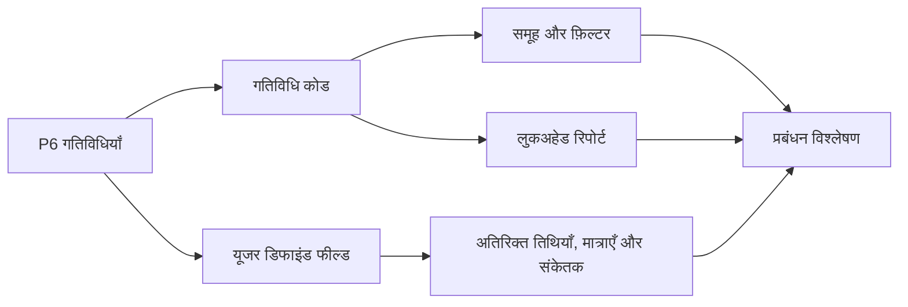

# गतिविधि कोड

Primavera P6 में गतिविधि कोड वे मुख्य उपकरण हैं जो शेड्यूल को गतिविधियों की सूची से उपयोगी प्रोजेक्ट नियंत्रण डेटाबेस में बदलते हैं। इनके माध्यम से टीम शेड्यूल को अलग-अलग प्रबंधन दृष्टिकोणों से समूहबद्ध, फ़िल्टर, क्रमबद्ध, रिपोर्ट और विश्लेषण कर सकती है।

शेड्यूल केवल बार चार्ट नहीं है। P6 में हर गतिविधि एक रिकॉर्ड भी है, जिसमें जिम्मेदारी, चरण, क्षेत्र, सिस्टम, अनुशासन, अनुबंध, माइलस्टोन प्रकार और अन्य प्रोजेक्ट विशेषताएँ रखी जा सकती हैं। गतिविधि कोड इस जानकारी को नियंत्रित तरीके से व्यवस्थित करते हैं।

## गतिविधि कोड क्या हैं

गतिविधि कोड संरचित वर्गीकरण फ़ील्ड हैं जो गतिविधियों को असाइन किए जाते हैं। हर कोड प्रकार एक रिपोर्टिंग आयाम दिखाता है और हर कोड मान उस आयाम का एक विकल्प होता है।

उदाहरण:

- कोड प्रकार: क्षेत्र.
- कोड मान: यूनिट 1, यूनिट 2, टैंक फार्म, यूटिलिटीज.

या:

- कोड प्रकार: अनुशासन.
- कोड मान: सिविल, मैकेनिकल, इलेक्ट्रिकल, इंस्ट्रूमेंटेशन, कमीशनिंग.

WBS बताता है कि काम प्रोजेक्ट संरचना में कहाँ बैठता है। गतिविधि कोड बताते हैं कि रिपोर्टिंग और विश्लेषण के लिए काम को कैसे देखा जा सकता है।

## वे क्या नहीं हैं

गतिविधि कोड WBS का विकल्प नहीं हैं। WBS दायरे का पदानुक्रम है। कोड उन्हीं गतिविधियों को देखने के अतिरिक्त तरीके हैं।

गतिविधि कोड तर्क का विकल्प नहीं हैं। तर्क कार्य अनुक्रम परिभाषित करता है।

गतिविधि कोड संसाधनों का विकल्प नहीं हैं। संसाधन श्रम, उपकरण, सामग्री मांग और लागत लोडिंग परिभाषित करते हैं।

जब ये अवधारणाएँ मिल जाती हैं, तो शेड्यूल बनाए रखना कठिन हो जाता है। स्वच्छ P6 शेड्यूल WBS, तर्क, संसाधन, गतिविधि कोड और UDFs को अलग-अलग उद्देश्यों के लिए उपयोग करता है।

## ग्लोबल और प्रोजेक्ट गतिविधि कोड

P6 में ग्लोबल गतिविधि कोड और प्रोजेक्ट गतिविधि कोड होते हैं।

ग्लोबल गतिविधि कोड कई प्रोजेक्ट में साझा होते हैं। वे तब उपयोगी हैं जब समान वर्गीकरण पोर्टफोलियो में चाहिए, जैसे मानक चरण, कॉर्पोरेट जिम्मेदारी समूह या प्रोग्राम-स्तर रिपोर्टिंग श्रेणियाँ।

प्रोजेक्ट गतिविधि कोड किसी विशिष्ट प्रोजेक्ट के होते हैं। वे क्षेत्र, सिस्टम, अनुबंध पैकेज, कार्य मोर्चे, टर्नओवर पैकेज या स्थानीय रिपोर्टिंग श्रेणियों के लिए उपयोगी हैं।

ग्लोबल कोड सावधानी से उपयोग करें क्योंकि बदलाव दूसरे प्रोजेक्ट को प्रभावित कर सकते हैं। प्रोजेक्ट कोड उन विशेषताओं के लिए उपयोग करें जो केवल एक प्रोजेक्ट में सार्थक हैं।

## सामान्य गतिविधि कोड प्रकार

उपयोगी कोड प्रकार प्रोजेक्ट पर निर्भर करते हैं, लेकिन सामान्य उदाहरण हैं:

- जिम्मेदार पक्ष.
- अनुशासन.
- प्रोजेक्ट चरण.
- क्षेत्र या स्थान.
- सिस्टम या उप-सिस्टम.
- अनुबंध पैकेज.
- कार्य पैकेज.
- माइलस्टोन प्रकार.
- टर्नओवर पैकेज.
- रिपोर्टिंग स्तर.

सर्वश्रेष्ठ कोड प्रकार रिपोर्टिंग जरूरतों से आते हैं। कोड बनाने से पहले पूछें: शेड्यूल को कौन से प्रश्नों का उत्तर देना है?

उदाहरण:

- अगले महीने क्षेत्र A में कौन सा कार्य नियोजित है?
- कौन सी गतिविधियाँ इलेक्ट्रिकल ठेकेदार से संबंधित हैं?
- कौन से सिस्टम कमीशनिंग को चला रहे हैं?
- कौन सा अनुबंध पैकेज फिसल रहा है?
- क्लाइंट को कौन से माइलस्टोन रिपोर्ट करने हैं?

## यूजर डिफाइंड फील्ड

यूजर डिफाइंड फील्ड, या UDFs, गतिविधि कोड से अलग हैं। कोड गतिविधियों को श्रेणियों में वर्गीकृत करते हैं। UDFs कस्टम डेटा रखते हैं, जैसे तिथियाँ, संख्याएँ, टेक्स्ट, लागत, मात्रा या हाँ/नहीं संकेतक।

जब जानकारी केवल श्रेणी नहीं हो, तब UDFs उपयोग करें।

उदाहरण:

- अनुबंधित समाप्ति तिथि.
- पूर्वानुमानित समाप्ति तिथि.
- जोखिम संकेतक.
- नियोजित मात्रा.
- स्थापित मात्रा.
- चेंज ऑर्डर संख्या.
- ड्राइंग संदर्भ.
- निरीक्षण स्थिति.

गतिविधि कोड समूहबद्ध और फ़िल्टर करने के लिए बेहतर हैं। UDFs अतिरिक्त जानकारी रखने के लिए बेहतर हैं जो P6 मानक फ़ील्ड में नहीं मिलती।

## रिपोर्टिंग में महत्त्व

अच्छी कोडिंग रिपोर्टिंग को तेज और अधिक विश्वसनीय बनाती है।

सुसंगत गतिविधि कोड से शेड्यूलर अनुशासन लुकअहेड, क्षेत्र रिपोर्ट, अनुबंध पैकेज सारांश, कमीशनिंग सिस्टम रिपोर्ट, माइलस्टोन रिपोर्ट और डैशबोर्ड जल्दी बना सकता है।

कोड के बिना रिपोर्टिंग अक्सर मैनुअल हो जाती है। टीम डेटा निर्यात करती है, स्प्रेडशीट संपादित करती है, लेबल हाथ से जोड़ती है और हर अद्यतन चक्र में वही काम दोहराती है। इससे त्रुटियाँ और समय बर्बाद होते हैं।

कोड शेड्यूल को पुन: उपयोग योग्य डेटा स्रोत बनाते हैं।

## गवर्नेंस

गतिविधि कोड को गवर्नेंस चाहिए। यदि सभी लोग मान स्वतंत्र रूप से बनाते हैं, तो शेड्यूल जल्दी असंगत हो जाता है।

उदाहरण: एक व्यक्ति "Electrical" लिखता है, दूसरा "Elec", तीसरा "E&I"। रिपोर्ट गतिविधियाँ छोड़ सकती है क्योंकि समान श्रेणी कई लेबल में विभाजित हो गई।

बेसलाइन से पहले कोड प्रकार और वैध मान परिभाषित करें, जब संभव हो। हर कोड का अर्थ, मालिक और अनिवार्य स्थिति दस्तावेज़ करें।

कोडिंग पूर्णता को शेड्यूल गुणवत्ता आइटम की तरह जाँचें। यदि अनिवार्य कोड गुम हैं, तो उन कोड पर आधारित रिपोर्ट विश्वसनीय नहीं होगी।

## अतिरिक्त जटिलता से बचें

अधिक कोड अपने आप बेहतर नियंत्रण नहीं देते।

हर कोड और UDF रखरखाव कार्य बनाता है। यदि कोई कोड रिपोर्ट, फ़िल्टर, डैशबोर्ड या विश्लेषण में उपयोग नहीं होता, तो शायद उसे बनाए रखना उचित नहीं है।

महत्त्वपूर्ण रिपोर्टिंग प्रश्नों से शुरू करें। उनके उत्तर के लिए पर्याप्त संरचना बनाएं, लेकिन केवल संभावित भविष्य उपयोग के लिए फ़ील्ड न बनाएं।

## अच्छा अभ्यास

कोडिंग संरचना शेड्यूल विकास के दौरान डिज़ाइन करें, बेसलाइन के बाद नहीं।

कोड को प्रोजेक्ट रिपोर्टिंग योजना से संरेखित करें। यदि प्रोजेक्ट क्षेत्र, अनुशासन, अनुबंध और सिस्टम से रिपोर्ट करता है, तो ये आयाम P6 कोडिंग संरचना में होने चाहिए।

कोड मान सुसंगत और नियंत्रित रखें। डुप्लिकेट और अस्पष्ट संक्षेपों से बचें।

कस्टम तिथियों, मात्राओं, संदर्भों और संकेतकों के लिए UDFs उपयोग करें। संख्यात्मक या तिथि जानकारी को गतिविधि कोड में मजबूर न करें।

हर अद्यतन में कोडिंग समीक्षा करें। नई गतिविधियों को रिपोर्ट जारी होने से पहले आवश्यक कोड मिलने चाहिए।

## निष्कर्ष

गतिविधि कोड केवल प्रशासनिक लेबल नहीं हैं। वे Primavera P6 शेड्यूल को प्रबंधन प्रश्नों के उत्तर जल्दी और लगातार देने में सक्षम बनाते हैं।

अच्छे उपयोग से कोड शेड्यूल को फ़िल्टर, समूहबद्ध, रिपोर्ट और विश्लेषण करना आसान बनाते हैं। UDFs प्रोजेक्ट-विशिष्ट जानकारी रखकर इस क्षमता को बढ़ाते हैं।

बार चार्ट समय दिखाता है। कोडिंग संरचना बताती है कि शेड्यूल को कैसे पढ़ा, विभाजित और उपयोग किया जा सकता है।

## संबंधित सामग्री
- [प्रिमावेरा पी6 में गुम निर्भरताएँ - अवलोकन](../../metrics/21_missing_dependencies/02_guide_template.md)
- [प्रोजेक्ट शेड्यूल विकसित करें](../17_DEVELOPE%20A%20PROJECT%20SCHEDULE/17_DEVELOPE%20A%20PROJECT%20SCHEDULE.md)
- [शेड्यूल आधार](../19_SCHEDULE%20BASIS/19_SCHEDULE%20BASIS.md)
