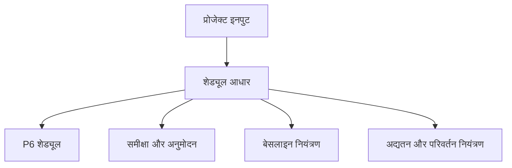

# शेड्यूल आधार

शेड्यूल आधार, जिसे Basis of Schedule भी कहा जाता है, वह दस्तावेज़ है जो समझाता है कि प्रोजेक्ट शेड्यूल कैसे बनाया गया और कौन सी धारणाएँ उसे समर्थन करती हैं। यह Primavera P6 फ़ाइल का लिखित साथी दस्तावेज़ है।

शेड्यूल तिथियाँ, तर्क, फ्लोट, माइलस्टोन, संसाधन और क्रिटिकल पाथ दिखाता है। शेड्यूल आधार बताता है कि ये चीजें ऐसी क्यों हैं।

## इसका उपयोग

शेड्यूल आधार समीक्षा, अनुमोदन, बेसलाइन नियंत्रण, प्रगति अद्यतन, परिवर्तन प्रबंधन और विलंब विश्लेषण में सहायता करता है। यह समीक्षक को शेड्यूल के नियम, धारणाएँ, इनपुट और सीमाएँ समझने में मदद करता है।

इसके बिना P6 फ़ाइल सही गणना कर सकती है, लेकिन टीम यह नहीं जान पाएगी कि कौन सी धारणाएँ उपयोग हुईं या शेड्यूल प्रबंधन निर्णयों के लिए उपयुक्त है या नहीं।

## कौन लिखता है और कौन उपयोग करता है

शेड्यूलर या योजना इंजीनियर सामान्यतः शेड्यूल आधार तैयार करता है। इनपुट प्रोजेक्ट मैनेजर, इंजीनियरिंग, खरीद, निर्माण, कमीशनिंग, प्रोजेक्ट नियंत्रण, अनुबंध और लागत टीमों से आता है।

यह प्रोजेक्ट टीम, क्लाइंट, PMO, समीक्षकों, दावा विश्लेषकों और उन सभी के लिए है जिन्हें समझना है कि शेड्यूल कैसे बनाया गया।

## यह क्यों महत्त्वपूर्ण है

शेड्यूल में बहुत से निर्णय होते हैं। कैलेंडर, अवधियाँ, तर्क, क्रू, माइलस्टोन, अनुमोदन चक्र, परमिट और संसाधन सीमाएँ तिथियों और फ्लोट को प्रभावित करते हैं।

शेड्यूल आधार इन निर्णयों को दृश्यमान बनाता है। यह अस्पष्टता कम करता है, ऑडिट योग्यता का समर्थन करता है और भविष्य में बेसलाइन धारणाओं पर विवाद कम करता है।

## इसमें क्या शामिल होना चाहिए

व्यापक शेड्यूल आधार में शामिल करें:

- प्रोजेक्ट दायरा और बहिष्करण.
- शेड्यूल उद्देश्य और अनुबंधीय उपयोग.
- शेड्यूल विकास कार्यप्रणाली.
- WBS और गतिविधि कोडिंग संरचना.
- कैलेंडर, शिफ्ट, छुट्टियाँ, मौसम और गैर-कार्य अवधियाँ.
- मुख्य धारणाएँ और बाधाएँ.
- शुरुआत, समाप्ति, पहुंच, क्लाइंट अनुमोदन और सामग्री डिलीवरी माइलस्टोन.
- अनुमोदन और परमिट चक्र.
- हैंडओवर और टर्नओवर धारणाएँ.
- तर्क नियम, संबंध प्रकार और लैग नीति.
- अवधि आधार, उत्पादकता दरें और मानदंड.
- क्रू, संसाधन उपलब्धता, श्रम सीमाएँ और उपकरण सीमाएँ.
- लागत लोडिंग नियम, यदि लागू हो.
- क्रिटिकल पाथ और निकट-क्रिटिकल पाथ की व्याख्या.
- जोखिम धारणाएँ और बड़ी अनिश्चितताएँ.
- अद्यतन चक्र, स्थिति नियम और रिपोर्टिंग दृष्टिकोण.

## धारणाएँ

धारणाएँ स्पष्ट और परीक्षण योग्य होनी चाहिए। इनमें साइट पहुंच तिथियाँ, इंजीनियरिंग जारीकरण समय, विक्रेता डिलीवरी तिथियाँ, परमिट अनुमोदन अवधियाँ, क्लाइंट समीक्षा अवधि, क्रू उपलब्धता, मौसम भत्ते और कमीशनिंग क्रम धारणाएँ शामिल हो सकती हैं।

धारणाओं को शेड्यूल के भीतर छिपाएँ नहीं। यदि कोई धारणा तिथियों, फ्लोट, संसाधन या हैंडओवर को प्रभावित करती है, तो वह शेड्यूल आधार में होनी चाहिए।

## कैलेंडर और कार्य अवधियाँ

दस्तावेज़ में P6 में उपयोग किए गए हर प्रमुख कैलेंडर को समझाएँ। कार्य दिवस, शिफ्ट, छुट्टियाँ, मौसमी बंदी, मौसम कैलेंडर, रात्रि कार्य, सप्ताहांत कार्य और गैर-कार्य अवधियाँ शामिल करें।

कैलेंडर गतिविधि तिथियों और फ्लोट को सीधे प्रभावित करते हैं। यदि इंजीनियरिंग, खरीद, निर्माण, कमीशनिंग या संसाधन के लिए अलग कैलेंडर उपयोग होते हैं, तो आधार में कारण समझाएँ।

## क्रू, संसाधन और सीमाएँ

अवधियाँ तभी सार्थक हैं जब मानी गई संसाधन धारणाएँ समझी गई हों। शेड्यूल आधार में क्रू धारणाएँ, संसाधन उपलब्धता, श्रम सीमाएँ, उपकरण सीमाएँ और किसी नियोजित ओवरटाइम या शिफ्ट रणनीति को बताएं।

यदि संसाधन लोडिंग शामिल है, तो समझाएँ कि संसाधन मानवबल योजना, लागत लोडिंग, अर्जित मूल्य या संसाधन समतलीकरण के लिए उपयोग हो रहे हैं या नहीं।

## माइलस्टोन, अनुमोदन, परमिट और हैंडओवर

मुख्य माइलस्टोन सूचीबद्ध और समझाए जाने चाहिए। इसमें प्रोजेक्ट शुरुआत, अनुबंधित समाप्ति, पहुंच स्वीकृति, मालिक या क्लाइंट अनुमोदन, तृतीय-पक्ष इंटरफ़ेस, सामग्री डिलीवरी, परमिट, सिस्टम हैंडओवर और अंतिम टर्नओवर शामिल हैं।

अनुमोदन और परमिट चक्रों में मानी गई अवधियाँ और जिम्मेदार पक्ष दिखाएँ। यदि क्लाइंट या तृतीय-पक्ष कार्रवाई शेड्यूल चलाती है, तो उसे दृश्यमान रखें।

## कार्यप्रणाली, उत्पादकता और लागत

शेड्यूल आधार समझाए कि शेड्यूल कैसे विकसित हुआ: उपयोग किए गए स्रोत, कार्यशालाएँ, अनुक्रमण तर्क, अवधि अनुमान विधि, उत्पादकता दरें, मानदंड और सत्यापन प्रक्रिया।

यदि लागत लोडिंग शामिल है, तो नियम बताएं। समझाएँ कि लागत संसाधन, व्यय, गतिविधि, WBS, अनुबंध पैकेज या अर्जित मूल्य विधि से असाइन है।

## क्रिटिकल पाथ और जोखिम

शेड्यूल आधार क्रिटिकल पाथ का सारांश दे और समझाए कि वह उचित क्यों है। इसमें निकट-क्रिटिकल पथ, बड़े जोखिम, शेड्यूल संवेदनशीलताएँ और निष्पादन के दौरान बदल सकने वाली धारणाएँ भी पहचानी जानी चाहिए।

यह टीम को केवल नियोजित समाप्ति तिथि नहीं, बल्कि उसे नियंत्रित करने वाली चीजें भी समझने में मदद करता है।

## अच्छा अभ्यास

बेसलाइन अनुमोदन से पहले शेड्यूल आधार लिखें। इसे P6 फ़ाइल से संरेखित रखें। जब स्वीकृत बदलाव धारणाएँ, कैलेंडर, माइलस्टोन, संसाधन रणनीति या कार्यप्रणाली बदलते हैं, तो इसे अद्यतन करें।

इसे सामान्य वर्णन न बनाएं। यह इतना विशिष्ट होना चाहिए कि दूसरा शेड्यूलर समझ सके कि शेड्यूल कैसे बनाया गया।

## निष्कर्ष

शेड्यूल आधार शेड्यूल के पीछे की व्याख्या है। यह बताता है कि शेड्यूल क्या मानता है, कैसे बनाया गया, क्या शामिल करता है, क्या बाहर रखता है और तिथियाँ वैध रहने के लिए कौन सी शर्तें सही रहनी चाहिए।

मजबूत शेड्यूल आधार P6 फ़ाइल को समीक्षा, समर्थन, अद्यतन और भरोसा करना आसान बनाता है।

## संबंधित सामग्री
- [बिना किसी ड्राइविंग लॉजिक के डेटा तिथि पर शुरू होने वाली गतिविधियाँ: यह शेड्यूल मीट्रिक क्यों मायने रखता है - अवलोकन](../../05_metrics_hi/01_activities_starting_in_dd_with_no_logic_driving/01_overview_template.md)
- [गतिविधि कोड](../18_ACTIVITY%20CODES/18_ACTIVITY%20CODES.md)
