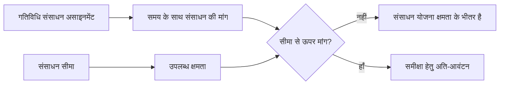

प्रिमावेरा पी6 में संसाधन सीमाएँ परिभाषित करती हैं कि किसी समयावधि के दौरान कितना संसाधन उपलब्ध है। उनका उपयोग गतिविधि असाइनमेंट द्वारा बनाई गई संसाधन मांग की तुलना परियोजना की वास्तविक क्षमता से करने के लिए किया जाता है।

सरल शब्दों में, एक संसाधन सीमा इस प्रश्न का उत्तर देती है: परियोजना इस संसाधन का कितना उपयोग कर सकती है?

यदि कोई शेड्यूल कहता है कि एक दल को एक ही समय में पांच गतिविधियों पर काम करना होगा, तो P6 मांग दिखा सकता है। लेकिन संसाधन सीमा के बिना, शेड्यूल स्पष्ट रूप से नहीं दिखा सकता कि वह मांग यथार्थवादी है या नहीं। सीमा वह है जो योजनाकार को ओवरलोड, क्षमता संबंधी समस्याओं और संभावित संसाधन-संचालित शेड्यूल समस्याओं को देखने की अनुमति देती है।

## संसाधन सीमाएँ क्या हैं

संसाधन सीमा किसी संसाधन की अधिकतम उपलब्धता है। इसे प्रति समय अवधि इकाइयों के रूप में परिभाषित किया जा सकता है, जैसे प्रति दिन घंटे, प्रति सप्ताह घंटे, या कार्य अवधि के दौरान उपलब्ध इकाइयों की संख्या।

उदाहरण के लिए:

- एक योजनाकार प्रतिदिन 8 घंटे उपलब्ध है।
- तीन इलेक्ट्रीशियन प्रतिदिन 24 श्रम-घंटे उपलब्ध हैं।
- एक क्रेन प्रति दिन 8 उपकरण-घंटे उपलब्ध है।
- दो निरीक्षक प्रतिदिन 16 श्रम-घंटे उपलब्ध हैं।

जब गतिविधियों पर संसाधन लोड किया जाता है, तो P6 उन असाइनमेंट द्वारा बनाई गई संसाधन मांग की गणना करता है। संसाधन सीमा वह क्षमता रेखा प्रदान करती है जिसके विरुद्ध मांग की तुलना की जाती है।

## संसाधन सीमाएँ क्यों मायने रखती हैं?

संसाधन सीमाएँ महत्वपूर्ण हैं क्योंकि शेड्यूल अक्सर तकनीकी रूप से संभव होते हैं लेकिन व्यावहारिक रूप से असंभव होते हैं।

एक तर्क नेटवर्क यह गणना कर सकता है कि कई गतिविधियाँ समानांतर में हो सकती हैं। तारीख़ें स्वीकार्य लग सकती हैं. महत्वपूर्ण पथ उचित प्रतीत हो सकता है. लेकिन यदि उन सभी गतिविधियों के लिए समान सीमित दल, विशेषज्ञ या उपकरण की आवश्यकता होती है, तो योजना निष्पादन योग्य नहीं हो सकती है।

संसाधन सीमाएँ परिकलित शेड्यूल और वितरण योग्य शेड्यूल के बीच अंतर को उजागर करने में मदद करती हैं।

वे इसके लिए उपयोगी हैं:

- अतिभारित श्रमिक दल की पहचान करना।
- उपकरण की मांग की जाँच करना।
- संसाधन हिस्टोग्राम का समर्थन करना.
- जनशक्ति योजनाओं की समीक्षा करना।
- संसाधन समतलन की तैयारी.
- यह समझाना कि तर्क अनुमति देने पर भी कुछ कार्य क्यों शुरू नहीं हो पाते।
- परीक्षण करना कि योजना उपलब्ध क्षमता से मेल खाती है या नहीं।

परियोजना नियंत्रण में, यह विशेष रूप से मूल्यवान है जब शेड्यूल का उपयोग स्टाफिंग, खरीद सहायता, निर्माण योजना, या अर्जित मूल्य रिपोर्टिंग के लिए किया जाता है।

## श्रम संसाधन सीमाएँ

श्रम सीमाएँ परिभाषित करती हैं कि कितने लोग या श्रम-घंटे उपलब्ध हैं।

उदाहरण के लिए, यदि परियोजना में 10 इलेक्ट्रीशियन प्रतिदिन 8 घंटे काम कर रहे हैं, तो दैनिक श्रम सीमा 80 घंटे प्रति दिन हो सकती है। यदि शेड्यूल की मांग उसी दिन 120 इलेक्ट्रीशियन-घंटे दिखाती है, तो शेड्यूल प्रोजेक्ट की तुलना में अधिक इलेक्ट्रीशियन की मांग कर रहा है।

इसका स्वचालित रूप से यह मतलब नहीं है कि शेड्यूल गलत है। इसका मतलब है कि योजनाकार को योजना की समीक्षा करनी चाहिए। समाधान कर्मचारियों को जोड़ना, अनुक्रम बदलना, गैर-महत्वपूर्ण कार्य को आगे बढ़ाना, ओवरटाइम का उपयोग करना, या यदि यह यथार्थवादी और स्वीकृत है तो अस्थायी शिखर को स्वीकार करना हो सकता है।

श्रम संसाधन सीमाएँ तब उपयोगी होती हैं जब जनशक्ति उपलब्धता एक वास्तविक बाधा होती है। वे तब कम उपयोगी होते हैं जब शेड्यूल को संसाधन नियंत्रण का समर्थन करने के लिए आवश्यक विवरण के स्तर पर बनाए नहीं रखा जाता है।

## गैरश्रम संसाधन सीमाएँ

गैर-श्रम सीमाएँ उपकरण और अन्य पुन: प्रयोज्य संपत्तियों पर लागू होती हैं।

उदाहरणों में क्रेन, उत्खननकर्ता, परीक्षण उपकरण, विशेष उपकरण, जनरेटर या अस्थायी सुविधाएं शामिल हैं। यदि केवल एक क्रेन उपलब्ध है, तो उसी क्रेन की आवश्यकता वाली सभी गतिविधियाँ एक ही समय में नहीं की जा सकतीं, जब तक कि दूसरी क्रेन नहीं जोड़ी जाती या कार्य को दोबारा नहीं किया जाता।

यहीं पर संसाधन सीमाएँ बहुत व्यावहारिक हो सकती हैं। उपकरण अक्सर एक वास्तविक बाधा होती है, खासकर जब यह महंगा होता है, क्षेत्रों के बीच साझा किया जाता है, जुटाना मुश्किल होता है, या महत्वपूर्ण कार्यों के लिए आवश्यक होता है।

उदाहरण के लिए, दो भारी लिफ्ट तार्किक रूप से तैयार हो सकती हैं। लेकिन यदि दोनों को एक ही क्रेन की आवश्यकता है, तो संसाधन सीमा यह दिखा सकती है कि योजना उपलब्ध क्षमता से अधिक है।

## भौतिक संसाधन और सीमाएँ

भौतिक संसाधन श्रम और गैर-श्रम संसाधनों से भिन्न व्यवहार करते हैं। वे आम तौर पर मात्रा का प्रतिनिधित्व करते हैं, न कि कार्य समय की दैनिक उपलब्धता का।

एक सामग्री असाइनमेंट नियोजित कंक्रीट मात्रा, केबल लंबाई, स्टील टन भार, या स्थापित मात्रा दिखा सकता है। परियोजना में अभी भी भौतिक बाधाएं हो सकती हैं, लेकिन उन्हें अक्सर लोगों या उपकरणों के लिए उपयोग की जाने वाली दैनिक संसाधन उपलब्धता सीमा के बजाय खरीद तिथियों, वितरण मील के पत्थर, इन्वेंट्री ट्रैकिंग या शेड्यूल में बाधाओं के माध्यम से प्रबंधित किया जाता है।

इसका मतलब यह नहीं है कि सामग्रियां महत्वहीन हैं। इसका मतलब है कि योजनाकार को इस बात से सावधान रहना चाहिए कि सीमा का क्या प्रतिनिधित्व किया जाना चाहिए।

यदि मुद्दा उत्पादन क्षमता का है, जैसे कि अधिकतम घन मीटर कंक्रीट जिसे प्रति दिन रखा जा सकता है, तो एक संसाधन या उत्पादन मॉडल उपयोगी हो सकता है। यदि मुद्दा यह है कि क्या सामग्री आ गई है, तो तर्क संबंध या खरीद मील के पत्थर स्पष्ट हो सकते हैं।

## P6 कैसे सीमाओं का उपयोग करता है

P6 संसाधन प्रोफाइल, स्प्रेडशीट, हिस्टोग्राम और संसाधन विश्लेषण में संसाधन सीमाओं का उपयोग कर सकता है। गतिविधि असाइनमेंट की मांग को उपलब्ध सीमा के विरुद्ध दिखाया जा सकता है।

जब संसाधन लेवलिंग का उपयोग किया जाता है, तो पी6 गतिविधियों में देरी करने के लिए संसाधन उपलब्धता का भी उपयोग कर सकता है ताकि लेवलिंग सेटिंग्स के आधार पर मांग सीमा के भीतर रहे।

यह शक्तिशाली है, लेकिन इसे सावधानी से संभालना चाहिए। संसाधन समतलन से पूर्वानुमान की तारीखें बदल सकती हैं। यदि सीमाएं, कैलेंडर, प्राथमिकताएं और गतिविधि तर्क को अच्छी तरह से बनाए नहीं रखा जाता है, तो समतल परिणाम गणितीय लग सकता है लेकिन व्यावहारिक नहीं।

इसलिए संसाधन सीमाएं नियंत्रित शेड्यूलिंग प्रक्रिया का हिस्सा होनी चाहिए, न कि अपडेट के अंत में दबाया गया बटन।

## संसाधन सीमाओं का उपयोग कब करें

संसाधन सीमाओं का उपयोग तब करें जब संसाधन वास्तव में सीमित हों और शेड्यूल विश्लेषण का समर्थन करने के लिए पर्याप्त गुणवत्ता से भरा हुआ हो।

अच्छे उपयोग के मामलों में शामिल हैं:

- क्रू की निश्चित संख्या वाला एक प्रोजेक्ट.
- साझा क्रेन या विशेष उपकरण।
- सीमित इंजीनियरिंग या कमीशनिंग विशेषज्ञ।
- शटडाउन, टर्नअराउंड और आउटेज।
- निर्माण योजनाएं जहां जनशक्ति शिखर को नियंत्रित किया जाना चाहिए।
- प्रोग्राम जहां एक ही संसाधन पूल एकाधिक परियोजनाओं का समर्थन करता है।

क्या-अगर विश्लेषण के दौरान संसाधन सीमाएँ भी उपयोगी होती हैं। योजनाकार यह परीक्षण कर सकता है कि क्या वर्तमान योजना उपलब्ध क्षमता के साथ काम करती है या क्या अतिरिक्त कर्मचारियों, ओवरटाइम या पुन: अनुक्रमण की आवश्यकता है।

## कब सावधान रहें

जब संसाधन डेटा अधूरा या प्रतीकात्मक हो तो सावधान रहें।

यदि संसाधन केवल लागत लोडिंग के लिए जोड़े गए थे, तो इकाइयाँ वास्तविक उपलब्धता का प्रतिनिधित्व नहीं कर सकती हैं। यदि सारा काम सामान्य संसाधनों को सौंपा गया है, तो वास्तविक निर्णयों का समर्थन करने के लिए हिस्टोग्राम बहुत व्यापक हो सकता है। यदि वास्तविक इकाइयाँ अद्यतन नहीं की जाती हैं, तो संसाधन योजना जल्दी ही वास्तविकता से दूर हो सकती है।

कृत्रिम सीमाओं से भी सावधान रहें। बहुत कम सीमा लेवलिंग के दौरान अनावश्यक देरी पैदा कर सकती है। बहुत अधिक सीमा वास्तविक क्षमता समस्याओं को छिपा सकती है।

सीमा वास्तविक नियोजन प्रश्न से मेल खानी चाहिए। क्या हम वास्तविक चालक दल की उपलब्धता, बजटीय स्टाफिंग, उपकरण पहुंच या प्रबंधन लक्ष्य का परीक्षण कर रहे हैं? प्रत्येक को एक अलग सेटअप की आवश्यकता हो सकती है।

## सामान्य गलतियां

एक आम गलती यह है कि वे जो प्रतिनिधित्व करते हैं उससे सहमत हुए बिना संसाधन सीमाएँ निर्धारित कर रहे हैं। एक संसाधन प्रतिदिन 80 घंटे दिखा सकता है, लेकिन क्या वह वर्तमान दल, अधिकतम दल, बजटित दल, या ठेकेदार द्वारा वादा किया गया दल है?

एक और गलती परिणामों की समीक्षा किए बिना उन्हें समतल करना है। पी6 संसाधन नियमों के आधार पर गतिविधियों को आगे बढ़ा सकता है, लेकिन योजनाकार को अभी भी यह जांचना होगा कि परिणाम निर्माण के लायक है या नहीं।

एक अन्य मुद्दा कैलेंडरों की अनदेखी करना है। संसाधन सीमा उपलब्धता से जुड़ी होती है, और उपलब्धता कार्य समय पर निर्भर करती है। यदि संसाधन कैलेंडर वास्तविक कार्य पैटर्न से मेल नहीं खाता है, तो सीमा भ्रामक अधिभार या गलत उपलब्धता उत्पन्न कर सकती है।

संसाधनों को अधिभारित करना और हिस्टोग्राम को ऐसे स्वीकार करना भी आम है जैसे कि यह सिर्फ एक रिपोर्ट थी। अधिभार एक नियोजन संकेत है। इसकी समीक्षा होनी चाहिए, न कि इसे नजरअंदाज कर दिया जाना चाहिए।

## अच्छा रिवाज़

उन संसाधनों से शुरुआत करें जो सबसे ज्यादा मायने रखते हैं। प्रत्येक संसाधन को विस्तृत सीमा की आवश्यकता नहीं होती है। महत्वपूर्ण कर्मचारियों, दुर्लभ उपकरणों, प्रमुख विशेषज्ञों और संसाधनों पर ध्यान केंद्रित करें जो परियोजना के पूरा होने या प्रमुख मील के पत्थर को प्रभावित करते हैं।

परिभाषित करें कि क्या सीमा सामान्य क्षमता, अधिकतम क्षमता, या अनुमोदित शिखर क्षमता का प्रतिनिधित्व करती है। उस परिभाषा को सुसंगत रखें.

शेड्यूल अपडेट के दौरान संसाधन प्रोफ़ाइल की समीक्षा करें। यदि पूर्वानुमान बदलता है, तो संसाधन की मांग भी बदल जाती है। तर्क, कैलेंडर, शेष अवधि और प्रगति के साथ सीमाओं की समीक्षा की जानी चाहिए।

संसाधन लेवलिंग का सावधानीपूर्वक उपयोग करें और सेटिंग्स का दस्तावेजीकरण करें। समतल परिणाम की तुलना समतल शेड्यूल से करें ताकि टीम समझ सके कि क्या बदलाव हुआ और क्यों।

सबसे महत्वपूर्ण बात यह है कि कार्य को निष्पादित करने वाले लोगों के साथ आउटपुट को मान्य करें। एक हिस्टोग्राम केवल तभी उपयोगी होता है जब यह वास्तविक संसाधन योजना को दर्शाता है।

## निष्कर्ष

P6 में संसाधन सीमाएँ उपलब्ध क्षमता को परिभाषित करती हैं। वे प्रोजेक्ट टीम को यह तुलना करने की अनुमति देते हैं कि शेड्यूल क्या मांग करता है और प्रोजेक्ट वास्तविक रूप से क्या प्रदान कर सकता है।

अच्छी तरह से उपयोग किए जाने पर, संसाधन सीमाएं ओवरलोड की पहचान करने, जनशक्ति योजना का समर्थन करने, उपकरण की मांग को नियंत्रित करने और शेड्यूल यथार्थवाद में सुधार करने में मदद करती हैं। खराब तरीके से उपयोग किए जाने पर, वे भ्रामक हिस्टोग्राम या कृत्रिम लेवलिंग परिणाम बना सकते हैं।

सर्वोत्तम संसाधन सीमाएँ सरल, जानबूझकर और वास्तविक परियोजना निर्णयों से जुड़ी होती हैं। वे एक व्यावहारिक प्रश्न का उत्तर देने में मदद करते हैं: क्या परियोजना इस योजना को उन संसाधनों के साथ क्रियान्वित कर सकती है जो उसके पास वास्तव में हैं?
