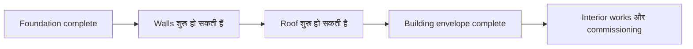
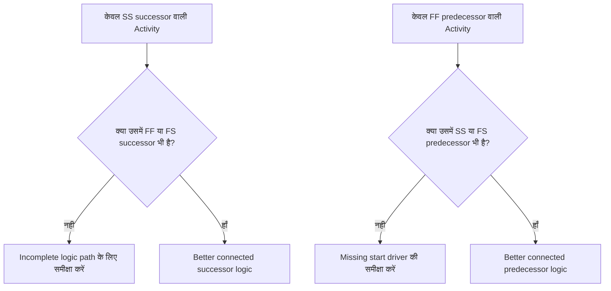

Logic project schedule के अंदर sequencing और dependencies का mathematical representation है। यह बताती है कि क्या पहले होना चाहिए, कौन-सी activities एक साथ हो सकती हैं, और project team का पहली activity से final completion तक पहुँचने का इरादा कैसा है।

एक अच्छी Primavera P6 schedule में, logic decoration नहीं है। यह वह engine है जो schedule को dates, float, critical path, और forecast movement calculate करने देती है। यह execution की story इस तरह बताती है जिसे review, challenge, और improve किया जा सके।

अगर schedule कहती है "foundation डालो, फिर walls बनाओ, फिर roof बनाओ," तो logic वह है जो उस sequence को एक calculable network में बदलती है। Planner केवल एक timeline नहीं बना रहा। Planner delivery path define कर रहा है।

## Logic काम की Story बताती है

हर project team के पास project execute करने का एक intended तरीका होता है। Engineering area के हिसाब से design release कर सकती है। Procurement package के हिसाब से equipment deliver कर सकती है। Civil work structural work शुरू होने से पहले access prepare कर सकती है। Mechanical completion commissioning शुरू होने से पहले हो सकती है।

Logic links उस plan का mathematical expression हैं।

यह simple diagram केवल एक sequence नहीं है। यह एक decision model है। अगर foundations late हैं, तो walls late हो सकती हैं। अगर walls late हैं, तो roof late हो सकती है। अगर roof late है, तो interior works affect हो सकती हैं। Schedule वह impact तभी दिखा सकती है जब logic मौजूद हो।

Robust logic का मतलब है कि schedule explain कर सके कि activities क्यों शुरू होती हैं, क्यों finish होती हैं, और जब plan का एक हिस्सा move करता है तो क्या होता है।

## Data Date पर Robust Logic क्यों Matter करती है

Metric "Activities Starting on the Data Date with No Driving Logic" schedule quality का एक strong test है।

Data Date actual performance और forecast work के बीच की boundary है। जब कोई activity Data Date पर शुरू होती है, तो reviewer को एक simple सवाल पूछना चाहिए: इस start को क्या drive कर रहा है?

अगर activity में valid predecessor logic है, तो schedule start को explain कर सकती है। शायद कोई area release हुआ। शायद material delivery complete हुई। शायद predecessor activity finish हुई और अगले crew को शुरू करने की अनुमति मिली।

अगर activity में कोई driving logic नहीं है, तो start कमज़ोर है। Activity Data Date पर बैठी हो सकती है क्योंकि उसका कोई predecessor नहीं, क्योंकि logic incomplete है, क्योंकि कोई constraint उसे force कर रहा है, या क्योंकि update को पूरी तरह status नहीं किया गया।

इसीलिए robust logic matter करती है। एक schedule को केवल इसलिए काम ready नहीं दिखाना चाहिए क्योंकि Data Date move हो गया। उसे वह real condition दिखानी चाहिए जो काम शुरू होने देती है।

## संतुलन: पर्याप्त Logic, Redundant Logic नहीं

अच्छी logic balanced है। Schedule को activities को predecessors और successors से ठीक से connect करने के लिए पर्याप्त relationships चाहिए। साथ ही, उसे redundant logic से बचना चाहिए जो same dependency को unnecessary तरीकों से repeat करती है।

बहुत कम logic open starts, open finishes, unreliable float, और weak critical path results बनाती है। बहुत अधिक logic network को review करना कठिन बना सकती है और किसी activity के true driver को hide कर सकती है।

लक्ष्य relationships की संख्या maximize करना नहीं है। लक्ष्य mandatory और required dependencies को clearly represent करना है।

हर activity के लिए, scheduler को जवाब देने में सक्षम होना चाहिए:

- इस activity को शुरू होने देने वाला क्या है?
- यह activity आगे क्या enable करती है?
- कौन-सा relationship वास्तव में activity को drive कर रहा है?
- क्या कोई relationship duplicate या unnecessary है?
- क्या reviewer intended sequence समझेगा?

यह balance PMO schedule reviews के केंद्र में है। एक dense network automatically एक strong network नहीं है। एक light network automatically एक clean network नहीं है। सही network बिना clutter के execution plan explain करता है।

## हर Activity को एक Start Driver चाहिए

Robust logic का मतलब है कि हर activity में एक predecessor हो जो उसके start को allow या trigger करे — valid project-start या externally authorized exceptions के अलावा।

एक construction activity के लिए, start driver area access, predecessor completion, material availability, design release, permit approval, या prior trade completion हो सकता है। एक procurement activity के लिए, यह design approval या purchase order release हो सकता है। Commissioning के लिए, यह mechanical completion, test package readiness, या system turnover हो सकता है।

जब यह start driver missing होता है, तो activity schedule में किसी artificial position पर float कर सकती है। Updates के दौरान, यह Data Date पर दिख सकती है। यह readiness का एक false sense बनाता है।

"Install Pumps" नाम की एक activity की कल्पना करें। अगर वह Data Date पर शुरू होती है लेकिन foundation completion, pump delivery, या area handover का कोई predecessor नहीं है, तो schedule यह explain नहीं कर रही कि installation क्यों शुरू हो सकती है। Activity planned हो सकती है, लेकिन logic robust नहीं है।

## SS और FF आधे Relationships हैं

Start-to-Start और Finish-to-Finish relationships उपयोगी हैं, लेकिन इन्हें सावधानी से उपयोग करना चाहिए। कई schedule reviews में, इन्हें "आधे" relationships के रूप में समझना best है क्योंकि ये अकेले activity को एक complete logic path में पूरी तरह place नहीं करते।

SS relationship explain कर सकता है कि activity कब शुरू हो सकती है, लेकिन यह शायद explain न करे कि activity कब finish होनी चाहिए या वह क्या hand over करती है। FF relationship finish alignment explain कर सकता है, लेकिन शायद explain न करे कि activity को शुरू होने की अनुमति कब है।

इसका मतलब यह नहीं कि SS या FF गलत हैं। Overlapping work common है और अक्सर realistic है। मुद्दा यह है कि activity fully connected है या नहीं।

उदाहरण के लिए:

- SS successor वाली activity में usually FF या FS successor भी होना चाहिए।
- FF predecessor वाली activity में usually SS या FS predecessor भी होना चाहिए।

यह activities को उनकी duration के केवल एक side पर connected होने से रोकता है। Schedule को यह explain करना चाहिए कि काम कैसे शुरू होता है और काम कैसे complete होता है।

## व्यवहार में Robust Logic

एक practical logic review Data Date के पास की activities, critical और near-critical काम, और major handover paths से शुरू होनी चाहिए। इन areas का current decision-making पर सबसे अधिक प्रभाव होता है।

P6 में, उपयोगी review columns में Activity ID, Activity Name, WBS, Start, Finish, Activity Status, Total Float, predecessors, successors, relationship type, lag, constraints, calendar, और driving relationship indicators (अगर उपलब्ध हों) शामिल हैं।

Data Date पर शुरू होने वाली हर activity के लिए, पूछें:

- क्या activity वास्तव में शुरू होने के लिए तैयार है?
- कौन-सा predecessor start को allow करता है?
- क्या वह predecessor complete है, in progress है, या forecast है?
- क्या relationship driving है?
- क्या कोई constraint या expected date logic की जगह ले रहा है?
- क्या activity में valid successor logic भी है?

अगर जवाब unclear है, तो activity को responsible owner के साथ review करना चाहिए। Correction में missing predecessor add करना, relationship type बदलना, constraint remove करना, actuals update करना, या एक valid exception document करना शामिल हो सकता है।

## Artificial Logic से बचें

एक गलती है केवल metric pass करने के लिए relationships add करना। यह robust logic नहीं बनाता। यह artificial logic बनाता है।

Relationships real dependencies represent करनी चाहिए। अगर कोई link construction sequence, engineering release, procurement need, access, approval, testing, commissioning, या handover को reflect नहीं करता, तो शायद वह network में नहीं होना चाहिए।

दूसरी गलती है redundant logic को इसलिए छोड़ना क्योंकि यह safer लगती है। अगर same dependency already किसी clearer relationship से represent है, तो extra links critical path को confuse कर सकते हैं और network को audit करना कठिन बना सकते हैं।

Robust logic clear, purposeful, और defensible है।

## निष्कर्ष

Logic उस mathematical story है कि project कैसे execute होगी। यह define करती है कि पहले क्या होना चाहिए, क्या एक साथ हो सकता है, और आगे क्या होता है।

Robust logic का मतलब जितने हो सके उतने links add करना नहीं है। इसका मतलब है सही links add करना: हर activity को real predecessors और successors से connect करने के लिए पर्याप्त, लेकिन इतने नहीं कि network redundant या misleading हो जाए।

जब activities Data Date पर बिना driving logic के शुरू होती हैं, तो schedule उस story में एक weakness expose कर रही है। Activity ready दिख सकती है, लेकिन network explain नहीं करता कि क्यों।

एक reliable schedule को उस सवाल का clearly जवाब देना चाहिए। यह काम शुरू होने देने वाला क्या है? यह आगे क्या enable करता है? अगर schedule दोनों का जवाब दे सके, तो logic robust हो रही है। अगर नहीं दे सके, तो project team के पास और sequencing काम है इससे पहले कि forecast पर भरोसा किया जा सके।
