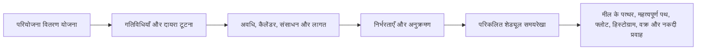

एक प्रोजेक्ट शेड्यूल तारीखों की सूची से कहीं अधिक है। यह परियोजना वितरण योजना का एक ग्राफिक और तार्किक प्रतिनिधित्व है। यह बताता है कि परियोजना को शुरू से अंत तक कैसे क्रियान्वित किया जाएगा, कार्य पैकेज कैसे जुड़ते हैं, प्रमुख मील के पत्थर कब तक पहुंचने चाहिए, और निर्णय लेने के लिए परियोजना टीम को किस जानकारी का उपयोग करना चाहिए।

सरल शब्दों में, शेड्यूल परियोजना योजना को एक रोडमैप में बदल देता है। इससे इसमें शामिल सभी लोगों को यह समझने में मदद मिलती है कि क्या करने की जरूरत है, इसे कब करने की जरूरत है और इसे पूरा करने के लिए कौन जिम्मेदार है। परियोजना प्रबंधकों, योजनाकारों, निर्माण टीमों, इंजीनियरों, खरीद प्रमुखों और पीएमओ समीक्षकों के लिए, शेड्यूल समन्वय और नियंत्रण के लिए मुख्य उपकरणों में से एक बन जाता है।

शेड्यूल एक समयरेखा है, लेकिन यह केवल एक समयरेखा नहीं है। कमज़ोर शेड्यूल तारीखें दिखा सकता है। एक मजबूत शेड्यूल बताता है कि वे तारीखें विश्वसनीय क्यों हैं।

## डिलीवरी रोडमैप के रूप में शेड्यूल

प्रत्येक परियोजना इरादे से शुरू होती है। टीम जानती है कि क्या वितरित किया जाना चाहिए: एक इमारत, एक सुविधा, एक औद्योगिक प्रणाली, एक शटडाउन, एक बुनियादी ढांचा संपत्ति, या काम का पैकेज। लेकिन डिलीवरी के लिए अंतिम उद्देश्य को जानने से कहीं अधिक की आवश्यकता होती है। टीम को अनुक्रम समझना चाहिए।

सबसे पहले क्या आता है? समानांतर में क्या हो सकता है? डिज़ाइन अनुमोदन, सामग्री वितरण, पहुंच, परमिट जारी करने, परीक्षण, या हैंडओवर के लिए क्या इंतजार करना होगा? कौन सी गतिविधियाँ समाप्ति तिथि को नियंत्रित करती हैं? ग्राहक के लिए कौन से मील के पत्थर सबसे अधिक मायने रखते हैं?

एक शेड्यूल योजना को गतिविधियों, अवधियों, निर्भरताओं, कैलेंडरों, संसाधनों, लागतों और मील के पत्थर में परिवर्तित करके उन सवालों का जवाब देता है।

ग्राफिक टाइमलाइन उपयोगी है क्योंकि लोग काम देख सकते हैं। लॉजिक नेटवर्क उपयोगी है क्योंकि सॉफ्टवेयर कार्य की गणना कर सकता है। साथ में, वे शेड्यूल को संचार उपकरण और नियंत्रण उपकरण दोनों बनने की अनुमति देते हैं।

## शेड्यूल क्या फ़ीड करता है

एक शेड्यूल उतना ही विश्वसनीय होता है जितना उसे बनाने में उपयोग की गई जानकारी। प्रिमावेरा पी6 में, शेड्यूल को कई प्रमुख इनपुट द्वारा फीड किया जाता है।

पहला इनपुट गतिविधि सूची है. गतिविधियाँ परियोजना को कार्य के प्रबंधनीय टुकड़ों में तोड़ देती हैं। प्रत्येक गतिविधि योजना, स्थिति और माप के लिए पर्याप्त रूप से स्पष्ट होनी चाहिए।

दूसरा इनपुट नियतात्मक अवधि है। यह प्रत्येक गतिविधि को पूरा करने के लिए आवश्यक नियोजित कार्य समय है। अवधि में निष्पादन की विधि, उत्पादकता धारणाएं, चालक दल का आकार, पहुंच, कार्यस्थल की बाधाएं और परियोजना की स्थिति प्रतिबिंबित होनी चाहिए।

तीसरा इनपुट निर्भरता तर्क है। निर्भरताएँ बताती हैं कि गतिविधियाँ एक-दूसरे से कैसे संबंधित हैं। एक गतिविधि को दूसरी शुरू होने से पहले समाप्त करने की आवश्यकता हो सकती है। दो गतिविधियाँ एक साथ शुरू हो सकती हैं। दो फ़िनिशों को संरेखित करने की आवश्यकता हो सकती है। ये रिश्ते सीपीएम नेटवर्क बनाते हैं।

चौथा इनपुट अनुक्रमण है। अनुक्रमण निष्पादन का व्यावहारिक क्रम है। यह निर्माण क्षमता, इंजीनियरिंग प्रवाह, खरीद समय, पहुंच, कमीशनिंग तर्क, हैंडओवर रणनीति और ग्राहक प्राथमिकताओं पर विचार करता है।

पांचवां इनपुट संसाधन और लागत है। संसाधन लोडिंग शेड्यूल को समय के साथ श्रम, उपकरण और सामग्री की मांग दिखाने की अनुमति देता है। लागत लोडिंग शेड्यूल को नकदी प्रवाह, अर्जित मूल्य और वित्तीय पूर्वानुमान का समर्थन करने की अनुमति देती है।

जब ये इनपुट पूर्ण और यथार्थवादी होते हैं, तो शेड्यूल उपयोगी आउटपुट उत्पन्न कर सकता है।

## अनुसूची हमें क्या बताती है

एक अच्छी तरह से निर्मित शेड्यूल समग्र परियोजना अवधि बताता है। यह नियोजित समापन मील के पत्थर और अंतरिम डिलिवरेबल्स दिखाता है। यह संसाधन हिस्टोग्राम तैयार करता है जो दिखाता है कि श्रम या उपकरण की मांग कब बढ़ती और घटती है। यह प्रगति वक्र, नकदी प्रवाह वक्र, अर्जित मूल्य रिपोर्टिंग और भविष्य की योजना का समर्थन करता है।

सबसे महत्वपूर्ण बात यह है कि यह महत्वपूर्ण पथ या सबसे लंबे पथ की पहचान करता है। यह कार्य की श्रृंखला है जो परियोजना को पूरा करती है। यदि उस पथ पर गतिविधियाँ फिसलती हैं, तो परियोजना पूरी होने की तारीख खिसक सकती है। यही कारण है कि तर्क इतना अधिक महत्व रखता है। अच्छी निर्भरता के बिना, महत्वपूर्ण पथ परियोजना के वास्तविक चालकों को नहीं दिखा सकता है।

फ़्लोट एक अन्य महत्वपूर्ण आउटपुट है। फ़्लोट बताता है कि किसी गतिविधि में किसी अन्य गतिविधि या प्रोजेक्ट समाप्ति को प्रभावित करने से पहले कितना लचीलापन है। लेकिन फ्लोट तभी सार्थक है जब शेड्यूल नेटवर्क पूरा हो जाए। यदि गतिविधियों में तर्क की कमी है, तो फ़्लोट वास्तविकता से बेहतर या ख़राब दिख सकता है।

## तर्क समयरेखा को विश्वसनीय क्यों बनाता है?

यहीं पर मीट्रिक "बिना ड्राइविंग लॉजिक के डेटा तिथि पर शुरू होने वाली गतिविधियां" महत्वपूर्ण हो जाती है।

P6 में डेटा दिनांक वास्तविक प्रदर्शन और पूर्वानुमान के बीच की सीमा है। डेटा तिथि से पहले की हर चीज़ को यह दर्शाना चाहिए कि क्या पहले ही हो चुका है। डेटा दिनांक के बाद की हर चीज़ को अब से आगे की योजना का प्रतिनिधित्व करना चाहिए।

जब गतिविधियाँ बिल्कुल डेटा तिथि पर बिना किसी तर्क के शुरू होती हैं, तो शेड्यूल एक चेतावनी संकेत भेज रहा है। ऐसा लग सकता है कि काम तुरंत शुरू होने के लिए तैयार है, लेकिन शेड्यूल यह समझाने में सक्षम नहीं हो सकता है कि ऐसा क्यों है। ऐसा कोई पूर्ववर्ती नहीं हो सकता जो यह दर्शाता हो कि क्षेत्र उपलब्ध है, सामग्री वितरण से कोई संबंध नहीं, डिज़ाइन अनुमोदन से कोई संबंध नहीं, निरीक्षण जारी करने से कोई संबंध नहीं, और पूर्व कार्य से कोई तर्क नहीं।

यह मायने रखता है क्योंकि किसी शेड्यूल में काम को केवल एक तारीख पर नहीं रखा जाना चाहिए। इसे उस तिथि तक का मार्ग स्पष्ट करना चाहिए।

यदि कोई गतिविधि डेटा तिथि पर शुरू होती है क्योंकि सभी आवश्यक पूर्ववर्ती कार्य पूरे हो चुके हैं और तर्क शुरुआत का समर्थन करता है, तो तारीख बचाव योग्य है। यदि यह वहां शुरू होता है क्योंकि गतिविधि खुली है, संचालित नहीं है, बाधित है, या खराब तरीके से अपडेट की गई है, तो तारीख कमजोर है। जब वास्तविक सक्षम स्थितियां तैयार नहीं की गई हों तो प्रोजेक्ट टीम यह मान सकती है कि काम तैयार है।

## एक व्यावहारिक उदाहरण

01 जून की डेटा तिथि के साथ एक प्रोजेक्ट शेड्यूल की कल्पना करें। अपडेट के बाद, कई गतिविधियाँ 01 जून से शुरू होंगी:

- एरिया बी में केबल ट्रे स्थापित करें।
- पाइप दबाव परीक्षण प्रारंभ करें.
- उपकरण संरेखण प्रारंभ करें.
- इन्सुलेशन दल जुटाएं.

पहली नज़र में, लुकहेड व्यस्त और तैयार दिखाई देता है। लेकिन जब शेड्यूलर तर्क की समीक्षा करता है, तो समस्या स्पष्ट हो जाती है। केबल ट्रे स्थापना सामग्री वितरण से जुड़ी नहीं है। दबाव परीक्षण पाइपिंग पूर्णता से जुड़ा नहीं है। यांत्रिक पूर्णता के लिए उपकरण संरेखण में पूर्ववर्ती का अभाव है। इंसुलेशन क्रू मोबिलाइज़ेशन का कोई एक्सेस-रिलीज़ पूर्ववर्ती नहीं है।

शेड्यूल डेटा तिथि पर काम दिखा रहा है, लेकिन यह नहीं बता रहा है कि काम क्यों शुरू हो सकता है। यह कोई विश्वसनीय रोडमैप नहीं है. यह निकट अवधि के इरादों की एक सूची है।

समाधान वास्तविक सीपीएम तर्क को जोड़ना या सही करना है। यदि सामग्री वितरण केबल ट्रे स्थापना को संचालित करता है, तो इसे लिंक करें। यदि पाइपिंग पूरा होने से दबाव परीक्षण होता है, तो इसे लिंक करें। यदि एक्सेस रिलीज इन्सुलेशन को संचालित करता है, तो उस स्थिति का मॉडल बनाएं। पुनर्गणना के बाद, कुछ गतिविधियाँ अभी भी डेटा तिथि के आसपास शुरू हो सकती हैं, लेकिन अब शेड्यूल समझा सकता है कि क्यों।

## एक अच्छे शेड्यूल को क्या करना चाहिए

एक अच्छे शेड्यूल से टीम को योजना देखने, योजना का परीक्षण करने और योजना का प्रबंधन करने में मदद मिलेगी।

इसे दिखाना चाहिए कि क्या करने की जरूरत है. इसमें कार्य का क्रम स्पष्ट होना चाहिए। इसे यह पहचानना चाहिए कि किसे और कब कार्य करने की आवश्यकता है। इसे महत्वपूर्ण पथ का खुलासा करना चाहिए। इसे संसाधन योजना, प्रगति माप, नकदी प्रवाह पूर्वानुमान और पीएमओ रिपोर्टिंग का समर्थन करना चाहिए।

इसमें कमजोर बिंदु भी दिखने चाहिए। गुम तर्क, कठिन बाधाएं, पुरानी तिथियां, खुली शुरुआत, खुली समाप्ति, और डेटा तिथि पर क्लस्टरिंग गतिविधियां सिर्फ तकनीकी समस्याएं नहीं हैं। वे प्रभावित करते हैं कि प्रोजेक्ट टीम तत्परता, जोखिम और नियंत्रण को कैसे समझती है।

## निष्कर्ष

शेड्यूल एक परियोजना वितरण योजना है जिसे समय, तर्क और मापने योग्य कार्य के रूप में व्यक्त किया जाता है। यह एक रोडमैप, एक गणना मॉडल और एक संचार उपकरण है।

जब अच्छी तरह से बनाया जाता है, तो यह प्रोजेक्ट टीम को बताता है कि क्या होना चाहिए, कब होना चाहिए और तारीखें विश्वसनीय क्यों हैं। जब डेटा तिथि पर गतिविधियां बिना किसी ड्राइविंग तर्क के शुरू होती हैं, तो विश्वसनीयता कमजोर हो जाती है। शेड्यूल योजना की व्याख्या करना बंद कर देता है और अगले चरण पर अनुमान लगाना शुरू कर देता है।

इस कारण से, शेड्यूल गुणवत्ता समीक्षाओं में हमेशा एक सरल प्रश्न पूछा जाना चाहिए: क्या शेड्यूल बताता है कि काम शुरू होने पर क्यों शुरू होता है? यदि उत्तर हां है, तो शेड्यूल अपना काम कर रहा है। यदि उत्तर नहीं है, तो रोडमैप पर भरोसा करने से पहले अधिक तर्क की आवश्यकता होती है।
