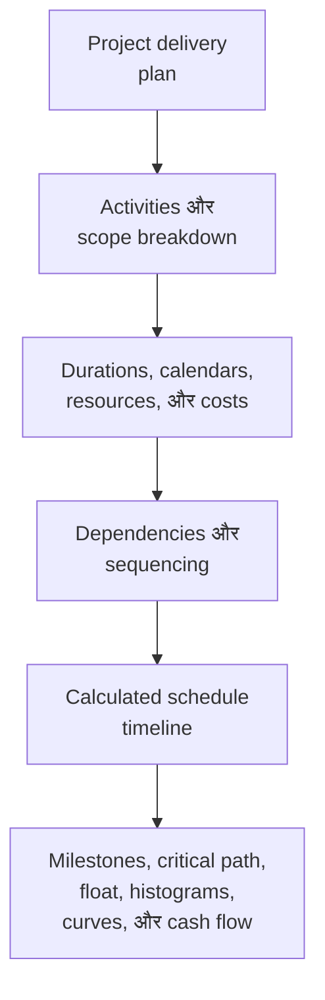

Project schedule केवल dates की एक सूची नहीं है। यह project delivery plan का एक ग्राफिकल और तार्किक प्रतिनिधित्व है। यह बताती है कि project को शुरू से अंत तक कैसे execute किया जाएगा, work packages कैसे जुड़े हैं, प्रमुख milestones कब तक पहुँचने चाहिए, और project team को निर्णय लेने के लिए कौन-सी जानकारी का उपयोग करना चाहिए।

सरल शब्दों में, schedule project plan को एक roadmap में बदल देती है। यह सभी संबंधित लोगों को यह समझने में मदद करती है कि क्या करना है, कब करना है, और इसे पूरा करने की ज़िम्मेदारी किसकी है। Project managers, planners, construction teams, engineers, procurement leads, और PMO reviewers के लिए, schedule समन्वय और नियंत्रण के मुख्य साधनों में से एक बन जाती है।

Schedule एक timeline है, लेकिन केवल एक timeline नहीं है। एक कमज़ोर schedule dates दिखा सकती है। एक मज़बूत schedule बताती है कि वे dates क्यों विश्वसनीय हैं।

## Delivery Roadmap के रूप में Schedule

हर project एक इरादे से शुरू होता है। Team जानती है कि क्या deliver करना है: एक building, एक facility, एक industrial system, एक shutdown, एक infrastructure asset, या work का एक package। लेकिन delivery के लिए केवल अंतिम उद्देश्य जानना पर्याप्त नहीं है। Team को sequence समझनी होती है।

पहले क्या होगा? क्या parallel में हो सकता है? किसे design approval, material delivery, access, permit release, testing, या handover का इंतज़ार करना है? कौन-सी activities finish date को नियंत्रित करती हैं? Client के लिए कौन-से milestones सबसे महत्वपूर्ण हैं?

Schedule इन सवालों का जवाब देती है — plan को activities, durations, dependencies, calendars, resources, costs, और milestones में परिवर्तित करके।

ग्राफिकल timeline उपयोगी है क्योंकि लोग कार्य को देख सकते हैं। Logic network उपयोगी है क्योंकि software कार्य की गणना कर सकता है। साथ मिलकर, वे schedule को एक communication tool और एक control tool दोनों बनाते हैं।

## Schedule को क्या Feed करता है

Schedule उतनी ही reliable होती है जितनी उसे बनाने में इस्तेमाल की गई जानकारी। Primavera P6 में, schedule को कई प्रमुख inputs से feed किया जाता है।

पहला input है activity list। Activities project को काम के manageable टुकड़ों में तोड़ती हैं। हर activity इतनी स्पष्ट होनी चाहिए कि उसे plan, status, और measure किया जा सके।

दूसरा input है deterministic duration। यह वह planned working time है जो हर activity को पूरा करने के लिए चाहिए। Duration को execution की method, productivity assumptions, crew size, access, workface constraints, और project conditions को reflect करना चाहिए।

तीसरा input है dependency logic। Dependencies बताती हैं कि activities एक-दूसरे से कैसे संबंधित हैं। एक activity को दूसरी शुरू होने से पहले finish होना पड़ सकता है। दो activities एक साथ शुरू हो सकती हैं। दो finishes को align करना पड़ सकता है। ये relationships CPM network बनाती हैं।

चौथा input है sequencing। Sequencing execution का व्यावहारिक क्रम है। यह constructability, engineering flow, procurement timing, access, commissioning logic, handover strategy, और client priorities को ध्यान में रखता है।

पाँचवाँ input है resources और costs। Resource loading schedule को समय के साथ labor, equipment, और material की demand दिखाने देती है। Cost loading schedule को cash flow, earned value, और financial forecasting को support करने देती है।

जब ये inputs पूर्ण और realistic होते हैं, तो schedule उपयोगी outputs दे सकती है।

## Schedule हमें क्या बताती है

एक अच्छी तरह बनी schedule पूरी project duration बताती है। यह planned completion milestones और interim deliverables दिखाती है। यह resource histograms देती है जो दर्शाते हैं कि labor या equipment की demand कब बढ़ती और घटती है। यह progress curves, cash flow curves, earned value reporting, और lookahead planning को support करती है।

सबसे महत्वपूर्ण, यह critical path या longest path पहचानती है। यह कार्य की वह chain है जो project finish को drive करती है। अगर उस path पर activities slip हों, तो project completion date भी slip हो सकती है। इसीलिए logic इतना महत्वपूर्ण है। अच्छे dependencies के बिना, critical path project के real drivers नहीं दिखा सकती।

Float एक और महत्वपूर्ण output है। Float बताता है कि किसी activity के पास कितना flexibility है इससे पहले कि वह किसी दूसरी activity या project finish को affect करे। लेकिन float तभी meaningful होता है जब schedule network पूर्ण हो। अगर activities में logic missing है, तो float वास्तविकता से बेहतर या बदतर दिख सकता है।

## Logic Timeline को विश्वसनीय क्यों बनाती है

यहीं पर metric "Activities Starting on the Data Date with No Driving Logic" महत्वपूर्ण हो जाती है।

P6 में Data Date वह boundary है जो actual performance और forecast के बीच है। Data Date से पहले की हर चीज़ यह represent करनी चाहिए कि क्या हो चुका है। Data Date के बाद की हर चीज़ अब से आगे के plan को represent करनी चाहिए।

जब activities बिना किसी driving logic के Data Date पर शुरू होती हैं, तो schedule एक warning signal दे रही होती है। ऐसा लग सकता है कि काम तुरंत शुरू होने के लिए तैयार है, लेकिन schedule शायद इसे explain नहीं कर सके। कोई predecessor नहीं हो सकता जो दर्शाए कि area उपलब्ध है, कोई material delivery से link नहीं, कोई design approval से connection नहीं, कोई inspection release से जोड़ नहीं, और prior work से कोई logic नहीं।

यह इसलिए महत्वपूर्ण है क्योंकि schedule को केवल किसी date पर काम place नहीं करना चाहिए। उसे उस date तक पहुँचने का रास्ता explain करना चाहिए।

अगर कोई activity Data Date पर इसलिए शुरू होती है क्योंकि सभी required predecessor कार्य पूर्ण हैं और logic start को support करती है, तो date defensible है। अगर वह इसलिए शुरू होती है क्योंकि activity open है, undriven है, constrained है, या poorly updated है, तो date कमज़ोर है। Project team सोच सकती है कि काम तैयार है जबकि real enabling conditions को model नहीं किया गया।

## एक व्यावहारिक उदाहरण

मान लीजिए एक project schedule है जिसकी Data Date 01 June है। Update के बाद, कई activities 01 June को शुरू होती हैं:

- Area B में cable tray install करना।
- Pipe pressure testing शुरू करना।
- Equipment alignment शुरू करना।
- Insulation crew को mobilize करना।

पहली नज़र में, lookahead व्यस्त और तैयार लगती है। लेकिन जब scheduler logic की समीक्षा करता है, तो समस्या स्पष्ट हो जाती है। Cable tray installation material delivery से link नहीं है। Pressure testing piping completion से link नहीं है। Equipment alignment में mechanical completion का predecessor missing है। Insulation crew mobilization में कोई access-release predecessor नहीं है।

Schedule Data Date पर काम दिखा रही है, लेकिन यह explain नहीं कर रही कि काम शुरू क्यों हो सकता है। यह एक reliable roadmap नहीं है। यह near-term intentions की एक सूची है।

Fix यह है कि real CPM logic को add या correct करें। अगर material delivery cable tray installation drive करती है, तो उसे link करें। अगर piping completion pressure testing drive करती है, तो उसे link करें। अगर access release insulation drive करती है, तो उस condition को model करें। Recalculation के बाद, कुछ activities अभी भी Data Date के पास शुरू हो सकती हैं, लेकिन अब schedule बता सकती है कि क्यों।

## एक अच्छी Schedule को क्या करना चाहिए

एक अच्छी schedule team को plan देखने, plan को test करने, और plan को manage करने में मदद करनी चाहिए।

उसे दिखाना चाहिए कि क्या करना है। उसे कार्य के क्रम को explain करना चाहिए। उसे बताना चाहिए कि किसे कब act करना है। उसे critical path reveal करना चाहिए। उसे resource planning, progress measurement, cash flow forecasting, और PMO reporting को support करना चाहिए।

उसे कमज़ोर बिंदुओं को भी visible बनाना चाहिए। Missing logic, hard constraints, stale dates, open starts, open finishes, और Data Date पर cluster होती activities केवल technical issues नहीं हैं। वे project team की readiness, risk, और control की समझ को प्रभावित करती हैं।

## निष्कर्ष

Schedule project delivery plan है जिसे time, logic, और measurable work के रूप में व्यक्त किया गया है। यह एक roadmap है, एक calculation model है, और एक communication tool है।

जब अच्छी तरह बनाई जाए, तो यह project team को बताती है कि क्या होना है, कब होना है, और dates क्यों विश्वसनीय हैं। जब activities Data Date पर बिना driving logic के शुरू होती हैं, तो यह विश्वसनीयता कमज़ोर हो जाती है। Schedule plan को explain करना बंद कर देती है और अगले कदम का अनुमान लगाने लगती है।

इसीलिए, schedule quality reviews को हमेशा एक सरल सवाल पूछना चाहिए: क्या schedule बताती है कि काम जब शुरू होता है तब शुरू क्यों होता है? अगर जवाब हाँ है, तो schedule अपना काम कर रही है। अगर जवाब नहीं है, तो roadmap को trust करने से पहले उसे और logic की ज़रूरत है।
