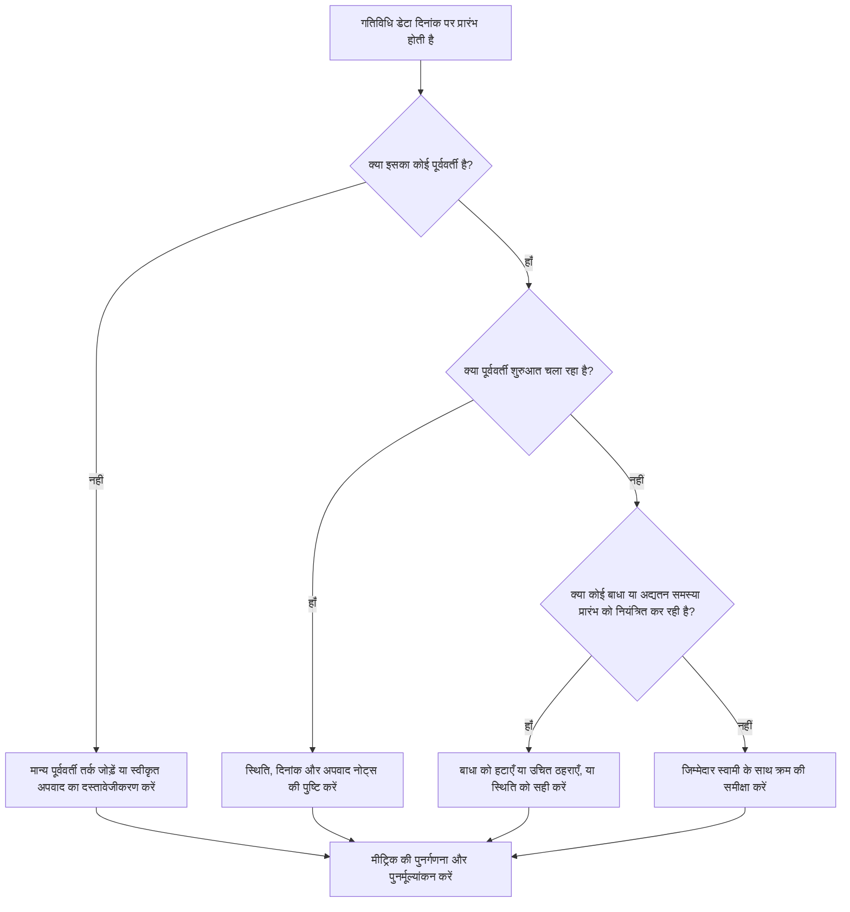

# बिना किसी ड्राइविंग लॉजिक के डेटा तिथि पर शुरू होने वाली गतिविधियाँ - सुधार मार्गदर्शिका

## उद्देश्य

यह मार्गदर्शिका शेड्यूलर्स और प्रोजेक्ट नियंत्रण टीमों को उन गतिविधियों को कम करने या समाप्त करने में मदद करती है जो प्राइमेरा पी 6 डेटा तिथि पर शुरू होने वाले वैध पूर्ववर्ती तर्क के बिना शुरू होने वाली हैं। यह शेड्यूल गुणवत्ता समीक्षा, पीएमओ स्वास्थ्य जांच और अद्यतन-चक्र सत्यापन पर लागू होता है।

इसका उद्देश्य यह पुष्टि करना है कि निकट अवधि का कार्य स्पष्ट सीपीएम तर्क द्वारा समर्थित है और गतिविधियां केवल लापता रिश्तों, बाधाओं, मैन्युअल तिथियों या अपूर्ण प्रगति अपडेट के कारण डेटा तिथि पर शुरू नहीं हो रही हैं।

## आपके शुरू करने से पहले

कार्रवाई करने से पहले निम्नलिखित जानकारी इकट्ठा करें:

- इस मीट्रिक के लिए वर्तमान मूल्यांकन परिणाम।
- नवीनतम शेड्यूल गणना में उपयोग की गई प्रोजेक्ट डेटा तिथि।
- डेटा तिथि के बराबर आरंभ तिथि के साथ खुली या शुरू न हुई गतिविधियों की सूची।
- प्रत्येक गतिविधि के लिए पूर्ववर्ती और उत्तराधिकारी संबंध विवरण।
- बाधाएं, अपेक्षित तिथियां, वास्तविक तिथियां और कैलेंडर असाइनमेंट।
- अद्यतन के लिए पी6 शेड्यूलिंग विकल्पों का उपयोग किया जाता है, जिसमें प्रासंगिक तर्क या प्रगति ओवरराइड सेटिंग्स शामिल हैं।
- कोई भी स्वीकृत अपवाद, जैसे प्रोजेक्ट प्रारंभ गतिविधियाँ, बाहरी इंटरफ़ेस मील के पत्थर, या स्वामी-निर्देशित प्रारंभ।

## अपने परिणाम को समझें

पूर्ववर्ती तर्क को चलाए बिना डेटा तिथि पर शुरू होने वाली शून्य अनसुलझी गतिविधियां एक मजबूत परिणाम है। इसका मतलब है कि वर्तमान और निकट-अवधि का कार्य शेड्यूल नेटवर्क से जुड़ा हुआ है और डेटा दिनांक गुम अनुक्रमण को छिपा नहीं रहा है।

एक स्वीकार्य परिणाम में कम संख्या में दस्तावेजी अपवाद शामिल हो सकते हैं। इनकी समीक्षा और अनुमोदन किया जाना चाहिए, नजरअंदाज नहीं किया जाना चाहिए। उदाहरण के लिए, नोटिस-टू-आगे बढ़ने वाले मील के पत्थर या बाहरी रूप से अधिकृत गतिविधि को सामान्य पूर्ववर्ती की आवश्यकता नहीं हो सकती है, लेकिन इसका कारण समीक्षकों को दिखाई देना चाहिए।

कमजोर परिणाम का मतलब है कि डेटा दिनांक पर स्पष्ट तार्किक ड्राइवर के बिना कई गतिविधियाँ शुरू हो रही हैं। यह खुली शुरुआत, लापता पूर्ववर्ती संबंध, अत्यधिक बाधाएं, अपूर्ण प्रगति अपडेट या नवीनतम अपडेट के बाद उचित रूप से पुन: अनुक्रमित नहीं की गई गतिविधियों का संकेत दे सकता है।

## सुधार लक्ष्य

लक्ष्य 0 अनसुलझी गतिविधियाँ हैं जो डेटा दिनांक से शुरू होती हैं और उनका कोई वैध ड्राइविंग तर्क नहीं है।

सुधार का लक्ष्य केवल गिनती कम करना नहीं है। गहरा लक्ष्य यह सुनिश्चित करना है कि डेटा तिथि के पास प्रत्येक गतिविधि के पूर्वानुमान की शुरुआत के लिए एक रक्षात्मक कारण हो। सुधार के बाद, प्रत्येक प्रभावित गतिविधि में या तो उपयुक्त पूर्ववर्ती तर्क, एक दस्तावेजी अपवाद, या एक सही स्थिति/दिनांक स्थिति होनी चाहिए।

## कार्य योजना

### चरण 1: मुख्य मुद्दे की पहचान करें

एक P6 लेआउट या रिपोर्ट बनाएं जो डेटा तिथि के बराबर प्रारंभ तिथि के साथ खुली या शुरू न हुई गतिविधियों के लिए फ़िल्टर करता है। यदि उपलब्ध हो तो गतिविधि आईडी, गतिविधि नाम, डब्ल्यूबीएस, प्रारंभ, समाप्ति, स्थिति, कुल फ्लोट, कैलेंडर, प्राथमिक बाधा, पूर्ववर्ती, उत्तराधिकारी और ड्राइविंग रिलेशनशिप संकेतक के लिए कॉलम शामिल करें।

प्रत्येक गतिविधि की समीक्षा करें और पूछें:

- क्या गतिविधि का कोई पूर्ववर्ती है?
- यदि पूर्ववर्ती अस्तित्व में हैं, तो क्या वे वास्तव में शुरुआत कर रहे हैं?
- क्या गतिविधि किसी बाधा द्वारा आयोजित की जा रही है या स्थानांतरित की जा रही है?
- क्या गतिविधि में वास्तविक शुरुआत या प्रगति अद्यतन गायब है?
- क्या गतिविधि एक वैध अपवाद है, जैसे प्रोजेक्ट प्रारंभ मील का पत्थर?
- क्या गतिविधि डब्ल्यूबीएस क्षेत्र से संबंधित है जहां तर्क आम तौर पर कमजोर है?

निष्कर्षों को व्यावहारिक कारणों में समूहित करें: लापता पूर्ववर्ती, गैर-ड्राइविंग पूर्ववर्ती, बाधाएं या अपेक्षित तिथियां, अद्यतन/स्थिति त्रुटियां, या अनुमोदित अपवाद।

### चरण 2: अनुशंसित सुधार लागू करें

गुम या कमज़ोर तर्क से शुरुआत करें। वैध पूर्ववर्ती संबंध जोड़ें जो काम के वास्तविक अनुक्रम का प्रतिनिधित्व करते हैं, जैसे कि जहां उपयुक्त हो, खत्म-से-शुरू, शुरू-से-शुरू, या खत्म-से-खत्म रिश्ते। केवल मीट्रिक को संतुष्ट करने के लिए संबंध जोड़ने से बचें; प्रत्येक रिश्ते को वास्तविक निर्माण, इंजीनियरिंग, खरीद, पहुंच, अनुमोदन, या हैंडओवर निर्भरता को प्रतिबिंबित करना चाहिए।

आगे बाधाओं की समीक्षा करें. यदि कोई गतिविधि प्रारंभ बाधा के कारण डेटा तिथि पर शुरू हो रही है, तो पुष्टि करें कि क्या बाधा अनुबंधात्मक या परिचालनात्मक रूप से उचित है। अनावश्यक बाधाएँ हटाएँ और गतिविधि को तर्क द्वारा संचालित होने दें। यदि बाधा वैध है, तो कारण का दस्तावेजीकरण करें और पुष्टि करें कि यह महत्वपूर्ण पथ को विकृत नहीं करता है।

प्रगति की स्थिति जांचें. यदि काम पहले ही शुरू हो चुका है, तो वास्तविक शुरुआत और शेष अवधि को सही ढंग से अपडेट करें। यदि कार्य प्रारंभ नहीं हुआ है, तो पुष्टि करें कि पूर्वानुमान प्रारंभ डेटा तिथि पर ही रहना चाहिए। कोई गतिविधि केवल इसलिए शुरू होने के लिए तैयार नहीं दिखनी चाहिए क्योंकि अद्यतन चक्र ने उसे वर्तमान तिथि तक खींच लिया है।

परिवर्तन किए जाने के बाद, शेड्यूल की पुनर्गणना करें और प्रभावित गतिविधियों की दोबारा समीक्षा करें। पुष्टि करें कि प्रारंभ तिथि अब तर्क द्वारा संचालित है, सही स्थिति में है, या स्वीकृत अपवाद के रूप में प्रलेखित है।

### चरण 3: सामान्य अवरोधक हटाएँ

सामान्य अवरोधकों में अस्पष्ट फ़ील्ड फीडबैक, अनुपलब्ध इंटरफ़ेस जानकारी और निकट अवधि के काम को तैयार दिखाने का दबाव शामिल है। अनुशासन नेतृत्वकर्ताओं, निर्माण प्रबंधकों, खरीद मालिकों या पैकेज प्रबंधकों के साथ प्रभावित गतिविधियों की समीक्षा करके इनका समाधान करें।

एक अन्य आम अवरोधक तर्क के विकल्प के रूप में बाधाओं का दुरुपयोग है। कुछ मामलों में बाधाओं की आवश्यकता हो सकती है, लेकिन उन्हें शेड्यूल नेटवर्क को प्रतिस्थापित नहीं करना चाहिए। यदि कोई बाधा बरकरार रहती है, तो दस्तावेज करें कि यह क्यों मौजूद है और यह फ्लोट और सबसे लंबे पथ को कैसे प्रभावित करता है।

यह भी जांचें कि क्या समस्या शेड्यूल गणना सेटिंग्स या अद्यतन प्रथाओं के कारण है। यदि प्रगति ओवरराइड, बनाए रखा तर्क, अनुक्रम से बाहर की प्रगति, या अपूर्ण वास्तविकता परिणाम को प्रभावित कर रही है, तो मीट्रिक का पुनर्मूल्यांकन करने से पहले अद्यतन विधि को परियोजना नियंत्रण प्रक्रिया के साथ संरेखित करें।

### चरण 4: परिवर्तनों को मान्य करें

अगले मूल्यांकन से पहले संशोधित शेड्यूल को मान्य करें। बिना किसी ड्राइविंग लॉजिक के डेटा दिनांक से शुरू होने वाली खुली या शुरू न हुई गतिविधियों के लिए फ़िल्टर को फिर से चलाएँ। पुष्टि करें कि प्रत्येक शेष आइटम को या तो सही कर दिया गया है या अनुमोदित अपवाद के रूप में प्रलेखित किया गया है।

पुनर्गणना के बाद कुल फ्लोट, सबसे लंबे पथ और निकट भविष्य की गतिविधियों की समीक्षा करें। एक तर्क सुधार महत्वपूर्ण पथ को बदल सकता है या अतिरिक्त अनुक्रमण मुद्दों को प्रकट कर सकता है। यदि शेड्यूल मूवमेंट महत्वपूर्ण है, तो प्रोजेक्ट कंट्रोल लीड या पीएमओ समीक्षक को प्रभाव बताएं।

## सुधार अनुसूची

### दिन 1: समीक्षा करें और निदान करें

मीट्रिक चलाएँ, डेटा दिनांक की पुष्टि करें, और गतिविधि सूची तैयार करें। परिणामों को लुप्त तर्क, गैर-ड्राइविंग तर्क, बाधाओं, स्थिति त्रुटियों और संभावित अपवादों में अलग करें।

### दिन 2-3: प्राथमिकता वाले कार्यों को लागू करें

सबसे अधिक प्रभाव वाली गतिविधियों को पहले ठीक करें, विशेष रूप से महत्वपूर्ण या निकट-महत्वपूर्ण गतिविधियों को। वैध पूर्ववर्ती तर्क जोड़ें, अनावश्यक बाधाओं को हटाएं, गलत स्थिति और दस्तावेज़ अपवादों को अपडेट करें।

### दिन 4-5: प्रारंभिक परिणामों की निगरानी करें

शेड्यूल की पुनर्गणना करें और समीक्षा करें कि क्या प्रभावित गतिविधियाँ अब तर्क-चालित हैं। कुल फ़्लोट, सबसे लंबे पथ और मील के पत्थर की तारीखों में अप्रत्याशित परिवर्तनों की जाँच करें।

### दिन 6: अंतिम समायोजन

जिम्मेदार अनुशासन या पैकेज मालिक के साथ शेष अवरोधकों का समाधान करें। पुष्टि करें कि कोई भी बरकरार रखा गया अपवाद उचित है और स्पष्ट रूप से प्रलेखित है।

### दिन 7: पुनर्मूल्यांकन करें और तुलना करें

मूल्यांकन फिर से चलाएँ और पिछले परिणाम और लक्ष्य सीमा के विरुद्ध नए परिणाम की तुलना करें। पुष्टि करें कि क्या मीट्रिक अब शून्य अनसुलझे गतिविधियों पर है या क्या आगे की कार्रवाई की आवश्यकता है।

## प्रगति पर नज़र रखना

सुधार और अनुमोदन प्रबंधित करने के लिए एक सरल ट्रैकर का उपयोग करें।

| तारीख | कार्रवाई की | अपेक्षित प्रभाव | परिणाम/अवलोकन | अगला कदम |
| --- | --- | --- | --- | --- |
| [तारीख] | बिना किसी ड्राइविंग तर्क के डेटा दिनांक से शुरू होने वाली गतिविधियों की समीक्षा की गई | लुप्त या कमजोर तर्क को पहचानें | [देखा गया परिणाम] | जिम्मेदार स्वामी को सुधार सौंपें |
| [तारीख] | वैध पूर्ववर्ती संबंध जोड़े गए | सीपीएम अनुक्रमण में सुधार करें | [देखा गया परिणाम] | फ्लोट प्रभाव की पुनर्गणना और समीक्षा करें |
| [तारीख] | बाधाओं को हटाया गया या उचित ठहराया गया | कृत्रिम शुरुआत कम करें | [देखा गया परिणाम] | शेष अपवादों की पुष्टि करें |
| [तारीख] | गलत गतिविधि स्थिति अपडेट की गई | अद्यतन सटीकता में सुधार करें | [देखा गया परिणाम] | मूल्यांकन पुनः चलाएँ |

## यदि परिणाम में सुधार नहीं होता है

यदि परिणाम में सुधार नहीं होता है, तो समीक्षा करें कि क्या वही गतिविधियाँ अभी भी विफल हो रही हैं या क्या डेटा तिथि पर नई गतिविधियाँ दिखाई दे रही हैं। बार-बार विफलताएं एक व्यापक शेड्यूल विकास समस्या का संकेत दे सकती हैं, जैसे कि WBS क्षेत्र में अधूरा तर्क, कमजोर अद्यतन अनुशासन, या बाधाओं का असंगत उपयोग।

परियोजना नियंत्रण प्रमुख, योजना प्रबंधक, या पीएमओ समीक्षक के पास लगातार मुद्दों को बढ़ाएं। प्रमुख शेड्यूल के लिए, प्रभावित कार्य पैकेजों के लिए एक केंद्रित तर्क समीक्षा कार्यशाला पर विचार करें। यदि शेड्यूल का उपयोग संविदात्मक रिपोर्टिंग, विलंब विश्लेषण, या अर्जित मूल्य पूर्वानुमान के लिए किया जाता है, तो अनसुलझे आइटम को गुणवत्ता संबंधी चिंता के रूप में माना जाना चाहिए।

## रखरखाव

शेड्यूल जारी करने से पहले प्रत्येक अद्यतन चक्र के दौरान इस मीट्रिक की समीक्षा करें। जाँच मानक अनुसूची स्वास्थ्य समीक्षा का हिस्सा होनी चाहिए, विशेष रूप से प्रगति अद्यतन, पुनरुत्पादन, प्रमुख दायरे में परिवर्तन, या पुनर्प्राप्ति योजना के बाद।

अच्छी रखरखाव आदतों में पी6 लेआउट में पूर्ववर्ती और उत्तराधिकारी कॉलमों को दृश्यमान रखना, प्रत्येक सबमिशन से पहले खुली शुरुआत की समीक्षा करना, स्वीकृत अपवादों का दस्तावेजीकरण करना और यह जांचना शामिल है कि डेटा दिनांक आंदोलन अनियंत्रित गतिविधियों का एक नया समूह नहीं बनाता है।

## सारांश चेकलिस्ट

- [ ] वर्तमान परिणाम की समीक्षा की गई
- [ ] लक्ष्य सीमा की पुष्टि की गई
- [ ] डेटा दिनांक की पुष्टि की गई
- [ ] डेटा दिनांक पर शुरू होने वाली गतिविधियाँ पहचानी गईं
- [ ] मुख्य मुद्दा पहचाना गया
- [ ] गुम या कमजोर तर्क को ठीक किया गया
- [ ] बाधाओं की समीक्षा की गई और उन्हें उचित ठहराया गया या हटा दिया गया
- [ ] स्थिति तिथियों की जाँच की गई
- [ ] स्वीकृत अपवादों का दस्तावेजीकरण किया गया
- [ ] शेड्यूल की पुनर्गणना की गई
- [ ] परिणामों की निगरानी की गई
- [ ] मूल्यांकन दोहराया गया
- [ ] अगले चरणों का दस्तावेजीकरण किया गया
## संबंधित सामग्री
- [बिना किसी ड्राइविंग लॉजिक के डेटा तिथि पर शुरू होने वाली गतिविधियाँ: यह शेड्यूल मीट्रिक क्यों मायने रखता है - अवलोकन](01_overview_template.md)
- [ब्लॉग टेम्पलेट](03_blog_template.md)
- [शेड्यूल क्या है](../../05_blogs_hi/01_WHAT%20A%20SCHEDULE%20IS/01_blog.md)
- [मजबूत तर्क](../../05_blogs_hi/02_ROBUST%20LOGIC/02_ROBUST%20LOGIC.md)
