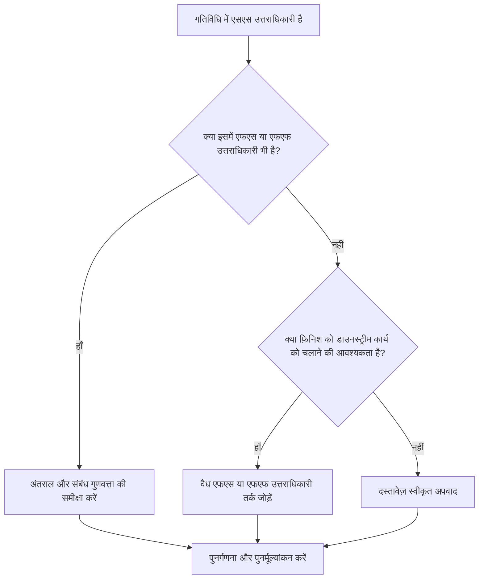

## उद्देश्य

यह मार्गदर्शिका शेड्यूलर्स को उन गतिविधियों की समीक्षा करने और सही करने में मदद करती है जिनमें स्टार्ट-टू-स्टार्ट उत्तराधिकारी हैं लेकिन कोई फिनिश-टू-स्टार्ट या फिनिश-टू-फिनिश उत्तराधिकारी नहीं हैं। यह पुष्टि करके मजबूत सीपीएम तर्क का समर्थन करता है कि गतिविधि समाप्त होती है, न केवल शुरू होती है, डाउनस्ट्रीम शेड्यूल नेटवर्क से जुड़ी होती है।

## आपके शुरू करने से पहले

कार्रवाई करने से पहले निम्नलिखित जानकारी इकट्ठा करें:

- इस मीट्रिक के लिए वर्तमान मूल्यांकन परिणाम।
- एसएस उत्तराधिकारियों और बिना एफएस या एफएफ उत्तराधिकारियों वाली गतिविधियों की सूची।
- प्रत्येक गतिविधि के लिए उत्तराधिकारी संबंध विवरण।
- गतिविधि प्रकार, अवधि, स्थिति, कैलेंडर, कुल फ़्लोट और WBS।
- गतिविधि या उसके उत्तराधिकारियों को प्रभावित करने वाला कोई अंतराल, बाधाएं या अपेक्षित तिथियां।
- प्रासंगिक निर्माण, इंजीनियरिंग, खरीद, या हैंडओवर अनुक्रम जानकारी।

## अपने परिणाम को समझें

इस स्थिति में शून्य अनसुलझे गतिविधियाँ एक मजबूत परिणाम है। इसका मतलब यह है कि जो गतिविधियां डाउनस्ट्रीम काम शुरू करती हैं उनमें फिनिश-आधारित तर्क भी होता है जहां काम का पूरा होना मायने रखता है।

एक स्वीकार्य परिणाम में प्रलेखित अपवाद शामिल हो सकते हैं, जैसे प्रयास के स्तर की गतिविधियाँ, प्रशासनिक गतिविधियाँ, या जानबूझकर ओवरलैपिंग कार्य जहां अंतिम तर्क की आवश्यकता नहीं है। इन्हें वैध मानने के बजाय इनकी समीक्षा की जानी चाहिए।

एक कमजोर परिणाम का मतलब है कि कई गतिविधियाँ उत्तराधिकारी शुरू कर सकते हैं लेकिन किसी भी उत्तराधिकारी को अपने स्वयं के समापन के माध्यम से समाप्त करने या शुरू करने को नियंत्रित नहीं करते हैं। इससे अधूरे काम शेड्यूल को प्रभावित करना बंद कर सकते हैं।

## सुधार लक्ष्य

लक्ष्य एसएस उत्तराधिकारियों के साथ 0 अनसुलझे गतिविधियाँ हैं और कोई एफएस या एफएफ उत्तराधिकारी नहीं हैं।

लक्ष्य यह पुष्टि करना है कि प्रत्येक गतिविधि में एक यथार्थवादी फिनिश-संचालित उत्तराधिकारी होता है, जहां पूर्णता डाउनस्ट्रीम कार्य को प्रभावित करती है, या कि फिनिश तर्क की कमी उचित और प्रलेखित है।

## कार्य योजना

### चरण 1: मुख्य मुद्दे की पहचान करें

एक P6 लेआउट या निर्यात बनाएं जो कम से कम एक SS उत्तराधिकारी और बिना FS या FF उत्तराधिकारी वाली गतिविधियों को सूचीबद्ध करता हो। गतिविधि आईडी, गतिविधि का नाम, डब्ल्यूबीएस, मूल अवधि, शेष अवधि, कुल फ्लोट, उत्तराधिकारी, संबंध प्रकार, अंतराल, बाधाएं और गतिविधि स्थिति शामिल करें।

प्रत्येक गतिविधि की समीक्षा करें और पूछें:

- इस गतिविधि के प्रारंभ होने से कौन सा कार्य प्रारंभ होता है?
- कौन सा कार्य, मील का पत्थर, हैंडओवर या निरीक्षण इस गतिविधि के समापन पर निर्भर करता है?
- क्या एफएस या एफएफ उत्तराधिकारी गायब है?
- क्या एसएस संबंध का उपयोग ओवरलैपिंग कार्य को सही ढंग से मॉडल करने के लिए किया जा रहा है?
- क्या गतिविधि एक वैध अपवाद है, जैसे प्रयास का स्तर या समर्थन गतिविधि?

### चरण 2: अनुशंसित सुधार लागू करें

फिनिश-आधारित तर्क जोड़ें जहां गतिविधि पूर्णता को बाद के काम को नियंत्रित करना चाहिए। जब उत्तराधिकारी गतिविधि समाप्त होने तक प्रारंभ नहीं कर सकता तो एफएस का उपयोग करें। जब उत्तराधिकारी ओवरलैप हो सकता है लेकिन पूर्ववर्ती समाप्त होने तक समाप्त नहीं हो सकता है तो एफएफ का उपयोग करें।

अंतराल के साथ एसएस संबंधों की समीक्षा करें। यदि लैग का उपयोग समाप्ति निर्भरता का अनुमान लगाने के लिए किया जा रहा है, तो इसे स्पष्ट एफएस या एफएफ संबंध के साथ बदलें या पूरक करें। केवल मीट्रिक को संतुष्ट करने के लिए तर्क जोड़ने से बचें; प्रत्येक रिश्ते को वास्तविक कार्य अनुक्रम प्रतिबिंबित करना चाहिए।

यदि गतिविधि एक वैध अपवाद है, तो कारण को नोटबुक विषय, यूडीएफ, टिप्पणी फ़ील्ड या शेड्यूल गुणवत्ता ट्रैकर में दर्ज करें।

### चरण 3: सामान्य अवरोधक हटाएँ

सामान्य अवरोधकों में पुराने शेड्यूल से कॉपी किए गए तर्क, अत्यधिक एसएस संबंध, अस्पष्ट हैंडओवर बिंदु और फ़ील्ड या अनुशासन लीड से गायब इनपुट शामिल हैं। जिम्मेदार स्वामी के साथ वास्तविक कार्य क्रम की समीक्षा करके इनका समाधान करें।

एक अन्य अवरोधक यह विश्वास है कि ओवरलैपिंग कार्य को हमेशा केवल एसएस तर्क की आवश्यकता होती है। ओवरलैप वैध हो सकता है, लेकिन पूर्ववर्ती की समाप्ति के लिए अक्सर उत्तराधिकारी समाप्ति, निरीक्षण, टर्नओवर या अनुवर्ती गतिविधि को नियंत्रित करने की आवश्यकता होती है।

### चरण 4: परिवर्तनों को मान्य करें

सुधार के बाद शेड्यूल की पुनर्गणना करें। मीट्रिक को दोबारा चलाएँ और पुष्टि करें कि प्रत्येक शेष गतिविधि को या तो सही कर दिया गया है या अनुमोदित अपवाद के रूप में प्रलेखित किया गया है।

कुल फ़्लोट, महत्वपूर्ण पथ, सबसे लंबे पथ और निकट अवधि के मील के पत्थर पर प्रभाव की समीक्षा करें। यदि फिनिश लॉजिक जोड़ने से मुख्य तिथियां बदल जाती हैं, तो परिणाम को प्रोजेक्ट कंट्रोल लीड या पीएमओ समीक्षक को बताएं।

## सुधार अनुसूची

### दिन 1: समीक्षा करें और निदान करें

मीट्रिक चलाएँ, प्रभावित गतिविधि सूची की पुष्टि करें, और गतिविधियों को लापता फिनिश तर्क, कमजोर एसएस तर्क, अंतराल मुद्दों और संभावित अपवादों में अलग करें।

### दिन 2-3: प्राथमिकता वाले कार्यों को लागू करें

पहले महत्वपूर्ण और निकट-महत्वपूर्ण गतिविधियों को ठीक करें। वैध एफएस या एफएफ उत्तराधिकारी जोड़ें, अनुपयुक्त एसएस तर्क समायोजित करें, और उचित अपवादों का दस्तावेजीकरण करें।

### दिन 4-5: प्रारंभिक परिणामों की निगरानी करें

शेड्यूल की पुनर्गणना करें और फ़्लोट, सबसे लंबे पथ और मील के पत्थर की तारीखों में आंदोलन की समीक्षा करें।

### दिन 6: अंतिम समायोजन

जिम्मेदार अनुशासन, पैकेज मालिक, या निर्माण नेतृत्व के साथ शेष अनिश्चित वस्तुओं का समाधान करें।

### दिन 7: पुनर्मूल्यांकन करें और तुलना करें

मूल्यांकन फिर से चलाएँ और लक्ष्य सीमा के विरुद्ध परिणाम की तुलना करें।

## प्रगति पर नज़र रखना

सुधार और अनुमोदन प्रबंधित करने के लिए एक सरल ट्रैकर का उपयोग करें।

| तारीख | कार्रवाई की | अपेक्षित प्रभाव | परिणाम/अवलोकन | अगला कदम |
| --- | --- | --- | --- | --- |
| [तारीख] | केवल एसएस उत्तराधिकारी गतिविधियों की समीक्षा की गई | लुप्त समापन तर्क को पहचानें | [देखा गया परिणाम] | सुधार निर्दिष्ट करें |
| [तारीख] | एफएस या एफएफ उत्तराधिकारी तर्क जोड़ा गया | सीपीएम निरंतरता में सुधार करें | [देखा गया परिणाम] | शेड्यूल की पुनर्गणना करें |
| [तारीख] | वैध अपवादों का दस्तावेजीकरण किया गया | समीक्षा ट्रैसेबिलिटी में सुधार करें | [देखा गया परिणाम] | मीट्रिक का पुनर्मूल्यांकन करें |

## यदि परिणाम में सुधार नहीं होता है

यदि परिणाम में सुधार नहीं होता है, तो जांचें कि क्या फ़िल्टर कमजोर नेटवर्क विकास वाले विशिष्ट WBS क्षेत्र में वैध अपवादों, डुप्लिकेट तर्क या गतिविधियों की पहचान कर रहा है। बार-बार आने वाला मुद्दा यह संकेत दे सकता है कि टीम योजना बनाते समय एसएस रिश्तों पर बहुत अधिक भरोसा कर रही है।

जब अनसुलझे आइटम महत्वपूर्ण, निकट-महत्वपूर्ण, संविदात्मक, या हैंडओवर-संबंधित कार्य को प्रभावित करते हैं, तो उन्हें नियोजन प्रमुख या पीएमओ समीक्षक के पास भेजें।

## रखरखाव

प्रत्येक शेड्यूल अपडेट के दौरान और बेसलाइन अनुमोदन से पहले इस मीट्रिक की समीक्षा करें। पुनरुत्पादन, पुनर्प्राप्ति योजना, कॉपी किए गए शेड्यूल विकास, या बड़े दायरे में बदलाव के बाद विशेष ध्यान दें।

## सारांश चेकलिस्ट

- [ ] वर्तमान परिणाम की समीक्षा की गई
- [ ] लक्ष्य सीमा की पुष्टि की गई
- [ ] मुख्य मुद्दा पहचाना गया
- [ ] एसएस उत्तराधिकारियों की समीक्षा की गई
- [ ] गुम एफएस या एफएफ तर्क को ठीक किया गया
- [ ] अंतराल और बाधाओं की जाँच की गई
- [ ] वैध अपवादों का दस्तावेजीकरण किया गया
- [ ] शेड्यूल की पुनर्गणना की गई
- [ ] परिणामों की निगरानी की गई
- [ ] मूल्यांकन दोहराया गया
- [ ] अगले चरणों का दस्तावेजीकरण किया गया
## संबंधित सामग्री
- [ब्लॉग टेम्पलेट](03_blog_template.md)
- [शेड्यूल क्या है](../../05_blogs_hi/01_WHAT%20A%20SCHEDULE%20IS/01_blog.md)
- [मजबूत तर्क](../../05_blogs_hi/02_ROBUST%20LOGIC/02_ROBUST%20LOGIC.md)
