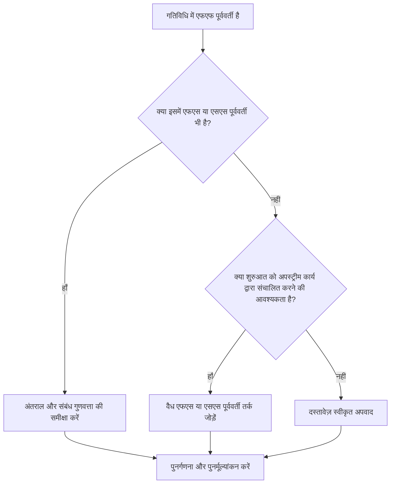

## उद्देश्य

यह मार्गदर्शिका शेड्यूलर्स को उन गतिविधियों की समीक्षा करने और सही करने में मदद करती है जिनमें फिनिश-टू-फिनिश पूर्ववर्ती हैं लेकिन कोई फिनिश-टू-स्टार्ट या स्टार्ट-टू-स्टार्ट पूर्ववर्ती नहीं हैं। यह पुष्टि करके मजबूत सीपीएम तर्क का समर्थन करता है कि गतिविधि शुरू होती है, न केवल खत्म होती है, अपस्ट्रीम शेड्यूल नेटवर्क से जुड़ी होती है।

## आपके शुरू करने से पहले

कार्रवाई करने से पहले निम्नलिखित जानकारी इकट्ठा करें:

- इस मीट्रिक के लिए वर्तमान मूल्यांकन परिणाम।
- एफएफ पूर्ववर्तियों और बिना एफएस या एसएस पूर्ववर्तियों वाली गतिविधियों की सूची।
- प्रत्येक गतिविधि के लिए पूर्ववर्ती संबंध विवरण।
- गतिविधि प्रकार, अवधि, स्थिति, कैलेंडर, कुल फ़्लोट और WBS।
- गतिविधि या उसके पूर्ववर्तियों को प्रभावित करने वाला कोई अंतराल, बाधाएं या अपेक्षित तिथियां।
- प्रासंगिक निर्माण, इंजीनियरिंग, खरीद, पहुंच, अनुमोदन, या हैंडओवर अनुक्रम जानकारी।

## अपने परिणाम को समझें

इस स्थिति में शून्य अनसुलझे गतिविधियाँ एक मजबूत परिणाम है। इसका मतलब यह है कि जिन गतिविधियों की समाप्ति पूर्व कार्य से जुड़ी होती है, उनके पास जहां आवश्यक हो वहां वैध स्टार्ट-ड्राइविंग तर्क भी होता है।

स्वीकार्य परिणाम में प्रलेखित अपवाद शामिल हो सकते हैं, जैसे प्रयास के स्तर की गतिविधियाँ, प्रशासनिक गतिविधियाँ, या जानबूझकर तैयार किए गए समानांतर कार्य जहां प्रारंभ तर्क की आवश्यकता नहीं है। इन्हें वैध मानने के बजाय इनकी समीक्षा की जानी चाहिए।

कमजोर परिणाम का मतलब है कि कई गतिविधियाँ पूर्ववर्तियों के संबंध में समाप्त हो सकती हैं, लेकिन उनकी शुरुआत अपस्ट्रीम कार्य द्वारा नियंत्रित नहीं होती है। यह गतिविधियों को वास्तविक अनुक्रम समर्थन से पहले शुरू करने की अनुमति दे सकता है।

## सुधार लक्ष्य

लक्ष्य एफएफ पूर्ववर्तियों के साथ 0 अनसुलझे गतिविधियाँ हैं और कोई एफएस या एसएस पूर्ववर्तियों के साथ नहीं है।

लक्ष्य यह पुष्टि करना है कि प्रत्येक गतिविधि में एक यथार्थवादी स्टार्ट-ड्राइविंग पूर्ववर्ती है जहां शुरुआत अपस्ट्रीम कार्य पर निर्भर करती है, या स्टार्ट तर्क की कमी उचित और दस्तावेजित है।

## कार्य योजना

### चरण 1: मुख्य मुद्दे की पहचान करें

एक P6 लेआउट या निर्यात बनाएं जो कम से कम एक FF पूर्ववर्ती और बिना किसी FS या SS पूर्ववर्ती वाली गतिविधियों को सूचीबद्ध करता हो। गतिविधि आईडी, गतिविधि का नाम, डब्ल्यूबीएस, मूल अवधि, शेष अवधि, कुल फ्लोट, पूर्ववर्ती, संबंध प्रकार, अंतराल, बाधाएं और गतिविधि स्थिति शामिल करें।

प्रत्येक गतिविधि की समीक्षा करें और पूछें:

- इस गतिविधि के शुरू होने से पहले क्या होना चाहिए?
- क्या एफएफ पूर्ववर्ती केवल फिनिश संरेखण को नियंत्रित कर रहा है?
- क्या कोई एफएस या एसएस पूर्ववर्ती गायब है?
- क्या ओवरलैपिंग कार्य को सही ढंग से मॉडल करने के लिए एफएफ संबंध का उपयोग किया जा रहा है?
- क्या गतिविधि एक वैध अपवाद है, जैसे प्रयास का स्तर या समर्थन गतिविधि?

### चरण 2: अनुशंसित सुधार लागू करें

स्टार्ट-ड्राइविंग तर्क जोड़ें जहां गतिविधि की शुरुआत पूर्व कार्य पर निर्भर होनी चाहिए। जब पूर्ववर्ती समाप्त होने तक गतिविधि शुरू नहीं हो सकती तो एफएस का उपयोग करें। एसएस का उपयोग तब करें जब गतिविधि पूर्ववर्ती शुरू होने के बाद शुरू हो सकती है या प्रगति के एक निर्धारित बिंदु तक पहुंच सकती है।

अंतराल के साथ एफएफ संबंधों की समीक्षा करें। यदि लैग का उपयोग प्रारंभ निर्भरता का अनुमान लगाने के लिए किया जा रहा है, तो इसे स्पष्ट एफएस या एसएस तर्क के साथ बदलें या पूरक करें। केवल मीट्रिक को संतुष्ट करने के लिए संबंध जोड़ने से बचें; प्रत्येक रिश्ते को वास्तविक कार्य अनुक्रम प्रतिबिंबित करना चाहिए।

यदि गतिविधि एक वैध अपवाद है, तो कारण को नोटबुक विषय, यूडीएफ, टिप्पणी फ़ील्ड या शेड्यूल गुणवत्ता ट्रैकर में दर्ज करें।

### चरण 3: सामान्य अवरोधक हटाएँ

सामान्य अवरोधकों में पुराने शेड्यूल से कॉपी किए गए तर्क, एफएफ रिश्तों का अति प्रयोग, अस्पष्ट पहुंच या रिलीज बिंदु, और फ़ील्ड या अनुशासन लीड से लापता इनपुट शामिल हैं। जिम्मेदार मालिक के साथ वास्तविक शुरुआत स्थिति की समीक्षा करके इनका समाधान करें।

एक अन्य अवरोधक यह विश्वास है कि जब दो गतिविधियाँ एक साथ समाप्त होनी चाहिए तो एफएफ तर्क पर्याप्त है। समाप्ति संरेखण वैध हो सकता है, लेकिन उत्तराधिकारी गतिविधि को अक्सर स्पष्ट प्रारंभ स्थिति की आवश्यकता होती है।

### चरण 4: परिवर्तनों को मान्य करें

सुधार के बाद शेड्यूल की पुनर्गणना करें। मीट्रिक को दोबारा चलाएँ और पुष्टि करें कि प्रत्येक शेष गतिविधि को या तो सही कर दिया गया है या अनुमोदित अपवाद के रूप में प्रलेखित किया गया है।

प्रारंभिक तिथियों, कुल फ़्लोट, महत्वपूर्ण पथ, सबसे लंबे पथ और निकट अवधि के मील के पत्थर पर प्रभाव की समीक्षा करें। यदि प्रारंभ तर्क जोड़ने से मुख्य तिथियां बदल जाती हैं, तो परिणाम को प्रोजेक्ट नियंत्रण लीड या पीएमओ समीक्षक को बताएं।

## सुधार अनुसूची

### दिन 1: समीक्षा करें और निदान करें

मीट्रिक चलाएं, प्रभावित गतिविधि सूची की पुष्टि करें, और गतिविधियों को लापता प्रारंभ तर्क, कमजोर एफएफ तर्क, अंतराल मुद्दों और संभावित अपवादों में अलग करें।

### दिन 2-3: प्राथमिकता वाले कार्यों को लागू करें

पहले महत्वपूर्ण और निकट-महत्वपूर्ण गतिविधियों को ठीक करें। वैध एफएस या एसएस पूर्ववर्तियों को जोड़ें, अनुपयुक्त एफएफ तर्क को समायोजित करें, और उचित अपवादों का दस्तावेजीकरण करें।

### दिन 4-5: प्रारंभिक परिणामों की निगरानी करें

शेड्यूल की पुनर्गणना करें और प्रारंभिक तिथियों, फ़्लोट, सबसे लंबे पथ और मील के पत्थर की तिथियों में आंदोलन की समीक्षा करें।

### दिन 6: अंतिम समायोजन

जिम्मेदार अनुशासन, पैकेज मालिक, या निर्माण नेतृत्व के साथ शेष अनिश्चित वस्तुओं का समाधान करें।

### दिन 7: पुनर्मूल्यांकन करें और तुलना करें

मूल्यांकन फिर से चलाएँ और लक्ष्य सीमा के विरुद्ध परिणाम की तुलना करें।

## प्रगति पर नज़र रखना

सुधार और अनुमोदन प्रबंधित करने के लिए एक सरल ट्रैकर का उपयोग करें।

| तारीख | कार्रवाई की | अपेक्षित प्रभाव | परिणाम/अवलोकन | अगला कदम |
| --- | --- | --- | --- | --- |
| [तारीख] | केवल एफएफ पूर्ववर्ती गतिविधियों की समीक्षा की गई | लुप्त प्रारंभ तर्क को पहचानें | [देखा गया परिणाम] | सुधार निर्दिष्ट करें |
| [तारीख] | एफएस या एसएस पूर्ववर्ती तर्क जोड़ा गया | सीपीएम निरंतरता में सुधार करें | [देखा गया परिणाम] | शेड्यूल की पुनर्गणना करें |
| [तारीख] | वैध अपवादों का दस्तावेजीकरण किया गया | समीक्षा ट्रैसेबिलिटी में सुधार करें | [देखा गया परिणाम] | मीट्रिक का पुनर्मूल्यांकन करें |

## यदि परिणाम में सुधार नहीं होता है

यदि परिणाम में सुधार नहीं होता है, तो जांचें कि क्या फ़िल्टर कमजोर नेटवर्क विकास वाले विशिष्ट WBS क्षेत्र में वैध अपवादों, डुप्लिकेट तर्क या गतिविधियों की पहचान कर रहा है। बार-बार आने वाला मुद्दा यह संकेत दे सकता है कि टीम योजना बनाते समय एफएफ रिश्तों पर बहुत अधिक भरोसा कर रही है।

जब अनसुलझे आइटम महत्वपूर्ण, निकट-महत्वपूर्ण, संविदात्मक, पहुंच-संबंधित, या हैंडओवर-संबंधी कार्य को प्रभावित करते हैं, तो उन्हें नियोजन प्रमुख या पीएमओ समीक्षक के पास भेजें।

## रखरखाव

प्रत्येक शेड्यूल अपडेट के दौरान और बेसलाइन अनुमोदन से पहले इस मीट्रिक की समीक्षा करें। पुनरुत्पादन, पुनर्प्राप्ति योजना, कॉपी किए गए शेड्यूल विकास, या बड़े दायरे में बदलाव के बाद विशेष ध्यान दें।

## सारांश चेकलिस्ट

- [ ] वर्तमान परिणाम की समीक्षा की गई
- [ ] लक्ष्य सीमा की पुष्टि की गई
- [ ] मुख्य मुद्दा पहचाना गया
- [ ] एफएफ पूर्ववर्तियों की समीक्षा की गई
- [ ] गुम एफएस या एसएस तर्क को ठीक किया गया
- [ ] अंतराल और बाधाओं की जाँच की गई
- [ ] वैध अपवादों का दस्तावेजीकरण किया गया
- [ ] शेड्यूल की पुनर्गणना की गई
- [ ] परिणामों की निगरानी की गई
- [ ] मूल्यांकन दोहराया गया
- [ ] अगले चरणों का दस्तावेजीकरण किया गया
## संबंधित सामग्री
- [ब्लॉग टेम्पलेट](03_blog_template.md)
- [शेड्यूल क्या है](../../05_blogs_hi/01_WHAT%20A%20SCHEDULE%20IS/01_blog.md)
- [मजबूत तर्क](../../05_blogs_hi/02_ROBUST%20LOGIC/02_ROBUST%20LOGIC.md)
