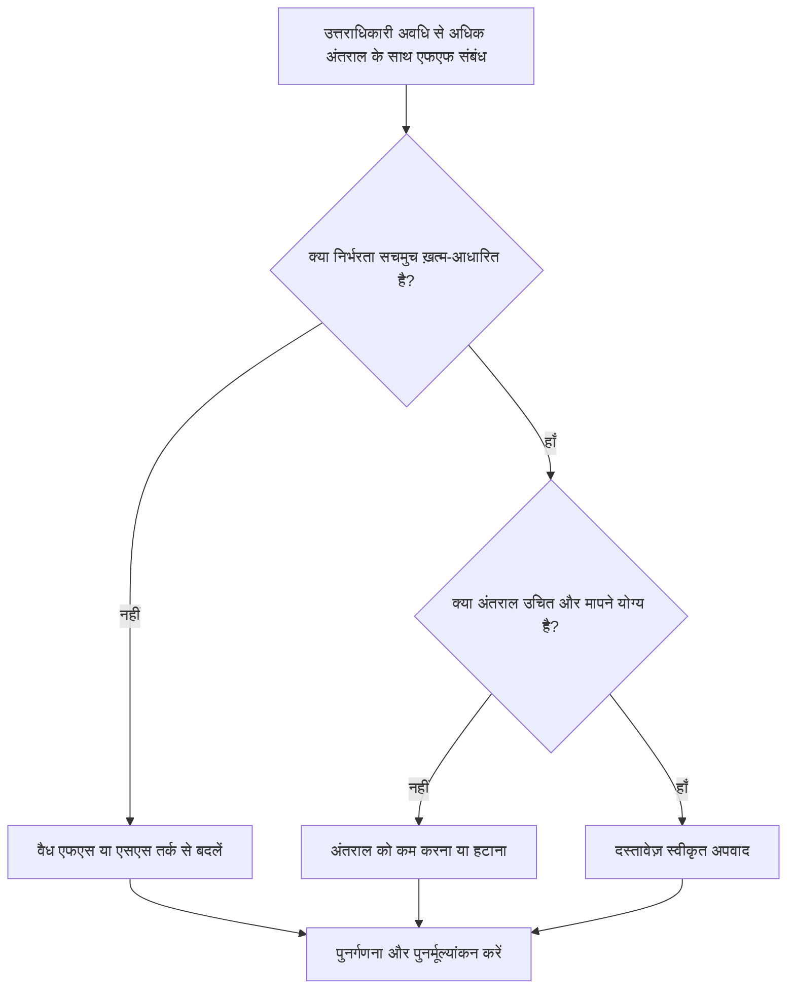

# उत्तराधिकारी अवधि से अधिक अंतराल के साथ एफएफ संबंध - सुधार मार्गदर्शिका

## उद्देश्य

यह मार्गदर्शिका शेड्यूलर्स को फ़िनिश-टू-फ़िनिश संबंधों की समीक्षा करने और उन्हें सही करने में मदद करती है जहां अंतराल उत्तराधिकारी गतिविधि की अवधि से अधिक है। यह अत्यधिक एफएफ अंतराल को संबंध तर्क या दृश्य गतिविधियों के साथ प्रतिस्थापित करके स्पष्ट सीपीएम तर्क का समर्थन करता है जो वास्तविक कार्य अनुक्रम को बेहतर ढंग से दर्शाता है।

## आपके शुरू करने से पहले

कार्रवाई करने से पहले निम्नलिखित जानकारी इकट्ठा करें:

- इस मीट्रिक के लिए वर्तमान मूल्यांकन परिणाम।
- एफएफ रिश्तों की सूची जहां अंतराल उत्तराधिकारी अवधि से अधिक है।
- पूर्ववर्ती और उत्तराधिकारी गतिविधि आईडी, नाम, डब्ल्यूबीएस, अवधि, कैलेंडर और स्थिति।
- रिश्ते में अंतराल, रिश्ते का प्रकार, और कोई भी संबंधित बाधाएँ।
- अंतराल के लिए शेड्यूल गणना सेटिंग्स और कैलेंडर आधार का उपयोग किया जाता है।
- फ़ील्ड, इंजीनियरिंग, खरीद, अनुमोदन, या हैंडओवर तर्क, इच्छित निर्भरता को समझाते हुए।

## अपने परिणाम को समझें

एक मजबूत परिणाम शून्य अनसुलझे एफएफ रिश्ते हैं जहां अंतराल उत्तराधिकारी अवधि से अधिक है।

एक स्वीकार्य परिणाम में दस्तावेजी अपवाद शामिल हो सकते हैं, लेकिन ये दुर्लभ होने चाहिए। लंबा एफएफ अंतराल अक्सर इंगित करता है कि संबंध प्रकार मॉडलिंग की जा रही निर्भरता से मेल नहीं खाता है।

कमजोर परिणाम का मतलब है कि शेड्यूल में कई फिनिश-टू-फिनिश लिंक शामिल हैं जहां उत्तराधिकारी गतिविधि की अवधि की तुलना में उत्तराधिकारी समापन में अधिक समय की देरी होती है। यह प्रारंभ-संचालित तर्क, प्रतीक्षा अवधि, या अनुपलब्ध मध्यवर्ती गतिविधियों को छिपा सकता है।

## सुधार लक्ष्य

लक्ष्य 0 अनसुलझे एफएफ रिश्ते हैं जिनका अंतराल उत्तराधिकारी अवधि से अधिक है।

लक्ष्य यह पुष्टि करना है कि क्या प्रत्येक संबंध को एफएफ रहना चाहिए, एफएस या एसएस तर्क में परिवर्तित किया जाना चाहिए, अंतराल को कम किया जाना चाहिए, या एक वैध अपवाद के रूप में प्रलेखित किया जाना चाहिए।

## कार्य योजना

### चरण 1: मुख्य मुद्दे की पहचान करें

एक P6 लेआउट या निर्यात बनाएं जो FF रिश्तों को सूचीबद्ध करता है जहां अंतराल उत्तराधिकारी अवधि से अधिक है। पूर्ववर्ती और उत्तराधिकारी गतिविधि आईडी, गतिविधि का नाम, डब्ल्यूबीएस, मूल अवधि, शेष अवधि, संबंध प्रकार, अंतराल, कैलेंडर, कुल फ्लोट और गतिविधि स्थिति शामिल करें।

प्रत्येक रिश्ते की समीक्षा करें और पूछें:

- उत्तराधिकारी इतने लंबे विलंब के बाद क्यों समाप्त होता है?
- क्या उत्तराधिकारी वास्तव में पूर्ववर्ती परिष्करण पर, या किसी अन्य प्रारंभ या हैंडओवर स्थिति पर निर्भर करता है?
- क्या अंतराल उत्तराधिकारी की मूल अवधि, शेष अवधि, या दोनों से अधिक है?
- क्या अंतराल का उपयोग समीक्षा समय, इलाज, वितरण, अनुमोदन, पहुंच या किसी अन्य वास्तविक प्रतीक्षा अवधि को मॉडल करने के लिए किया जा रहा है?
- क्या एफएस या एसएस संबंध निर्भरता को स्पष्ट कर देगा?

### चरण 2: अनुशंसित सुधार लागू करें

यदि पूर्ववर्ती के ख़त्म होने के बाद उत्तराधिकारी को शुरू करना चाहिए, तो FF संबंध को FS संबंध से बदलें। यदि उत्तराधिकारी पूर्ववर्ती के शुरू होने के बाद शुरू हो सकता है या प्रगति के एक निर्धारित बिंदु तक पहुंच सकता है, तो एसएस तर्क का उपयोग करें।

यदि संबंध वास्तव में समाप्ति-आधारित है, तो अंतराल मूल्य की समीक्षा करें। अत्यधिक अंतराल को कम करें जहां इसका उपयोग रफ प्लेसहोल्डर के रूप में किया गया था या कॉपी किए गए तर्क से विरासत में मिला था। यदि अंतराल वास्तविक प्रतीक्षा अवधि का प्रतिनिधित्व करता है, तो पुष्टि करें कि इकाई, कैलेंडर और स्पष्टीकरण सही हैं।

उन गतिविधियों के विकल्प के रूप में लंबे अंतराल का उपयोग करने से बचें जो शेड्यूल में दिखाई देनी चाहिए। यदि अंतराल समीक्षा, इलाज, वितरण, जुटाना, अनुमोदन, या समापन समय का प्रतिनिधित्व करता है, तो उस मॉडलिंग को एक अलग गतिविधि के रूप में मानें।

### चरण 3: सामान्य अवरोधक हटाएँ

सामान्य अवरोधकों में पिछले शेड्यूल से कॉपी किए गए तर्क, छिपी हुई प्रतीक्षा अवधि, कैलेंडर भ्रम और नेटवर्क को सरल रखने का दबाव शामिल हैं। जिम्मेदार स्वामी के साथ इच्छित निर्भरता की पुष्टि करके इनका समाधान करें।

एक अन्य अवरोधक लैग को हानिरहित मान रहा है। लंबे अंतराल की समीक्षा करना कठिन हो सकता है, जोखिम छिपा सकता है, और विलंब विश्लेषण को कठिन बना सकता है क्योंकि प्रतीक्षा अवधि एक गतिविधि के रूप में दिखाई नहीं देती है।

### चरण 4: परिवर्तनों को मान्य करें

सुधार के बाद शेड्यूल की पुनर्गणना करें। मीट्रिक को फिर से चलाएँ और पुष्टि करें कि प्रत्येक शेष आइटम को या तो सही कर दिया गया है या स्वीकृत अपवाद के रूप में प्रलेखित किया गया है।

कुल फ़्लोट, सबसे लंबा पथ, महत्वपूर्ण पथ और निकट-अवधि के मील के पत्थर की समीक्षा करें। यदि संबंध में बदलाव की प्रमुख तिथियां बदलती हैं, तो परिणाम को प्रोजेक्ट नियंत्रण लीड या पीएमओ समीक्षक को बताएं।

## सुधार अनुसूची

### दिन 1: समीक्षा करें और निदान करें

मीट्रिक चलाएँ, प्रभावित संबंध सूची की पुष्टि करें, और आइटम को गलत संबंध प्रकार, अत्यधिक अंतराल, छिपी हुई गतिविधि, कैलेंडर समस्या और संभावित अपवाद में अलग करें।

### दिन 2-3: प्राथमिकता वाले कार्यों को लागू करें

पहले आलोचनात्मक और निकट-महत्वपूर्ण रिश्तों को ठीक करें। जहां उपयुक्त हो, एफएफ तर्क को एफएस या एसएस में बदलें, अनुचित अंतराल को कम करें, और वैध अपवादों का दस्तावेजीकरण करें।

### दिन 4-5: प्रारंभिक परिणामों की निगरानी करें

शेड्यूल की पुनर्गणना करें और फ़्लोट, सबसे लंबे पथ और मील के पत्थर की तारीखों में आंदोलन की समीक्षा करें।

### दिन 6: अंतिम समायोजन

जिम्मेदार अनुशासन, पैकेज मालिक, या निर्माण नेतृत्व के साथ शेष अनिश्चित वस्तुओं का समाधान करें।

### दिन 7: पुनर्मूल्यांकन करें और तुलना करें

मूल्यांकन फिर से चलाएँ और लक्ष्य सीमा के विरुद्ध परिणाम की तुलना करें।

## प्रगति पर नज़र रखना

सुधार और अनुमोदन प्रबंधित करने के लिए एक सरल ट्रैकर का उपयोग करें।

| तारीख | कार्रवाई की | अपेक्षित प्रभाव | परिणाम/अवलोकन | अगला कदम |
| --- | --- | --- | --- | --- |
| [तारीख] | समीक्षित एफएफ अंतराल उत्तराधिकारी अवधि से अधिक है | कमजोर या अस्पष्ट तर्क को पहचानें | [देखा गया परिणाम] | सुधार निर्दिष्ट करें |
| [तारीख] | संबंध को एफएस या एसएस में परिवर्तित किया गया | सीपीएम तर्क स्पष्टता में सुधार करें | [देखा गया परिणाम] | शेड्यूल की पुनर्गणना करें |
| [तारीख] | कम या प्रलेखित अंतराल | समीक्षा ट्रैसेबिलिटी में सुधार करें | [देखा गया परिणाम] | मीट्रिक का पुनर्मूल्यांकन करें |

## यदि परिणाम में सुधार नहीं होता है

यदि परिणाम में सुधार नहीं होता है, तो जांचें कि क्या समान संबंध पैटर्न किसी विशिष्ट WBS क्षेत्र, अनुशासन, या कॉपी किए गए शेड्यूल अनुभाग में दोहराए जाते हैं। बार-बार पाए जाने वाले निष्कर्ष यह संकेत दे सकते हैं कि टीम वास्तविक निर्भरताओं को मॉडलिंग करने के बजाय मानक शॉर्टकट के रूप में एफएफ लैग का उपयोग कर रही है।

जब अनसुलझे आइटम महत्वपूर्ण, निकट-महत्वपूर्ण, संविदात्मक, खरीद, अनुमोदन, कमीशनिंग, या हैंडओवर-संबंधित कार्य को प्रभावित करते हैं तो उन्हें बढ़ाएँ।

## रखरखाव

प्रत्येक शेड्यूल अपडेट के दौरान और बेसलाइन अनुमोदन से पहले इस मीट्रिक की समीक्षा करें। कॉपी किए गए शेड्यूल विकास, पुनरुत्पादन, पुनर्प्राप्ति योजना, या प्रमुख दायरे में बदलाव के बाद विशेष ध्यान दें।

## सारांश चेकलिस्ट

- [ ] वर्तमान परिणाम की समीक्षा की गई
- [ ] लक्ष्य सीमा की पुष्टि की गई
- [ ] मुख्य मुद्दा पहचाना गया
- [ ] एफएफ रिश्तों की समीक्षा की गई
- [ ] अत्यधिक अंतराल को ठीक किया गया या उचित ठहराया गया
- [ ] जहां आवश्यक हो वहां एफएस या एसएस प्रतिस्थापन लागू किया जाता है
- [ ] जहां उपयुक्त हो वहां छुपे हुए कार्य का मॉडल तैयार किया गया
- [ ] शेड्यूल की पुनर्गणना की गई
- [ ] परिणामों की निगरानी की गई
- [ ] मूल्यांकन दोहराया गया
- [ ] अगले चरणों का दस्तावेजीकरण किया गया
## संबंधित सामग्री
- [उत्तराधिकारी अवधि से अधिक अंतराल के साथ एफएफ संबंध - अवलोकन](01_overview_template.md)
- [ब्लॉग टेम्पलेट](03_blog_template.md)
- [शेड्यूल क्या है](../../05_blogs_hi/01_WHAT%20A%20SCHEDULE%20IS/01_blog.md)
- [मजबूत तर्क](../../05_blogs_hi/02_ROBUST%20LOGIC/02_ROBUST%20LOGIC.md)
