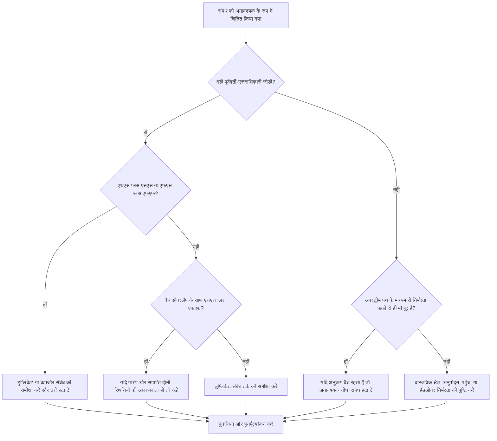

## उद्देश्य

यह मार्गदर्शिका शेड्यूलर्स को प्राइमेरा पी6 शेड्यूल से अनावश्यक तर्क को पहचानने और हटाने में मदद करती है। यह डुप्लिकेट संबंध पैटर्न, दोहराए गए पूर्ववर्ती तर्क और अनावश्यक निर्भरताओं पर लागू होता है जो वास्तविक कार्य अनुक्रम का प्रतिनिधित्व नहीं करते हैं।

## आपके शुरू करने से पहले

कार्रवाई करने से पहले निम्नलिखित जानकारी इकट्ठा करें:

- इस मीट्रिक के लिए वर्तमान मूल्यांकन परिणाम।
- अनावश्यक तर्क के रूप में चिह्नित गतिविधियों और रिश्तों की सूची।
- प्रत्येक चिह्नित गतिविधि के लिए पूर्ववर्ती और उत्तराधिकारी विवरण।
- संबंध प्रकार, अंतराल, कैलेंडर, कुल फ़्लोट और ड्राइविंग संबंध संकेतक।
- WBS, गतिविधि कोड, और अनुशासन या कार्य पैकेज स्वामित्व।
- फ़ील्ड, इंजीनियरिंग, खरीद, अनुमोदन, या हैंडओवर जानकारी जो वास्तविक निर्भरता की व्याख्या करती है।

## अपने परिणाम को समझें

एक मजबूत परिणाम शून्य अनसुलझे अनावश्यक रिश्ते हैं।

एक स्वीकार्य परिणाम में दुर्लभ दस्तावेजी अपवाद शामिल हो सकते हैं जहां डुप्लिकेट-दिखने वाले तर्क को जानबूझकर एक रक्षात्मक कारण के लिए उपयोग किया जाता है। इन मामलों की सावधानीपूर्वक समीक्षा की जानी चाहिए क्योंकि अनावश्यक तर्क आमतौर पर शेड्यूल गुणवत्ता का मुद्दा होता है।

कमजोर परिणाम का मतलब है कि शेड्यूल में बार-बार या अनावश्यक संबंध तर्क शामिल हैं। ऐसा तब हो सकता है जब कॉपी किए गए शेड्यूल अनुभागों को साफ नहीं किया जाता है, मौजूदा पथों की जांच किए बिना रिश्ते जोड़े जाते हैं, या एक ही गतिविधियों के बीच कई निर्भरता प्रकारों का उपयोग किया जाता है।

## सुधार लक्ष्य

लक्ष्य 0 अनसुलझे अनावश्यक रिश्ते हैं।

लक्ष्य केवल उन रिश्तों को बनाए रखना है जो वास्तविक निर्भरता का प्रतिनिधित्व करते हैं और ऐसे तर्क को हटाना है जो वास्तविक कार्य अनुक्रम को दोहराते हैं, छिपाते हैं या बढ़ा-चढ़ाकर बताते हैं।

## कार्य योजना

### चरण 1: मुख्य मुद्दे की पहचान करें

एक P6 लेआउट, रिपोर्ट, या बाहरी संबंध समीक्षा बनाएं जो संभावित अनावश्यक तर्क की पहचान करता है। इन मामलों पर फोकस:

- एक ही पूर्ववर्ती एक ही उत्तराधिकारी से एक से अधिक बार जुड़ा, विशेषकर एफएस प्लस एसएस या एफएस प्लस एफएफ।
- समान दो गतिविधियों के बीच एसएस प्लस एफएफ तब मान्य हो सकता है जब ओवरलैप को सही ढंग से मॉडलिंग किया गया हो और शुरुआत और समाप्ति दोनों स्थितियां मायने रखती हों।
- अपने पूर्ववर्ती के समान पूर्ववर्ती और संबंध प्रकार वाली एक गतिविधि, श्रृंखला के माध्यम से बार-बार विरासत में मिले तर्क का निर्माण करती है।
- लंबे समय तक दोहराई जाने वाली पूर्ववर्ती श्रृंखलाएँ जहाँ समान निर्भरता कई कदम पीछे दिखाई देती है।
- निर्भरताएँ जो अनुक्रमण, तिथियाँ, फ़्लोट, हैंडओवर, पहुँच या जोखिम नियंत्रण नहीं बदलती हैं।

प्रत्येक चिह्नित रिश्ते की समीक्षा करें और पूछें:

- क्या यह रिश्ता वास्तविक निर्भरता जोड़ता है?
- क्या निर्भरता पहले से ही समान गतिविधियों के बीच किसी अन्य रिश्ते द्वारा दर्शाई गई है?
- क्या निर्भरता पहले से ही एक अपस्ट्रीम पथ द्वारा दर्शाई गई है?
- क्या संबंध हटाने से वैध शेड्यूल तर्क बदल जाएगा या केवल नेटवर्क सरल हो जाएगा?
- क्या संबंध किसी वैध कारण से तारीखें बढ़ा रहा है, या केवल इसलिए कि अनावश्यक तर्क जोड़ा गया है?

### चरण 2: अनुशंसित सुधार लागू करें

सटीक डुप्लिकेट और दोहराए गए पूर्ववर्ती-उत्तराधिकारी जोड़े से प्रारंभ करें। यदि वही दो गतिविधियाँ एफएस प्लस एसएस या एफएस प्लस एफएफ से जुड़ी हैं, तो निर्धारित करें कि कौन सा संबंध वास्तविक निर्भरता का प्रतिनिधित्व करता है। उस रिश्ते को हटा दें जो तर्क की नकल करता है या कमजोर करता है।

एसएस प्लस एफएफ जोड़ियों की अलग से समीक्षा करें। यह संयोजन तब मान्य हो सकता है जब एक रिश्ता नियंत्रित करता है कि ओवरलैपिंग कार्य कब शुरू हो सकता है और दूसरा यह नियंत्रित करता है कि यह कब समाप्त हो सकता है। इसे तभी रखें जब दोनों स्थितियाँ वास्तविक हों और कार्य अनुक्रम द्वारा प्रलेखित हों।

इसके बाद, विरासत में मिले पूर्ववर्ती तर्क की समीक्षा करें। यदि गतिविधि सी का गतिविधि बी के समान पूर्ववर्ती संबंध है, और गतिविधि बी पहले से ही गतिविधि सी का पूर्ववर्ती है, तो पिछली गतिविधि से सीधा संबंध अनावश्यक हो सकता है। यदि मौजूदा पथ के माध्यम से सीपीएम अनुक्रम सही रहता है तो इसे हटा दें।

अंत में, उन अनावश्यक निर्भरताओं को हटा दें जो कार्य अनुक्रम, पहुंच, अनुमोदन, हैंडओवर, जोखिम नियंत्रण या संविदात्मक तर्क का समर्थन नहीं करती हैं।

### चरण 3: सामान्य अवरोधक हटाएँ

सामान्य अवरोधकों में पुराने शेड्यूल से कॉपी किए गए तर्क, नेटवर्क को कनेक्टेड दिखाने के लिए ओवर-मॉडलिंग और मौजूदा पथ की जांच किए बिना अपडेट के दौरान संबंध जोड़ना शामिल है।

एक और अवरोधक यह डर है कि रिश्तों को हटाने से शेड्यूल कमजोर हो जाएगा। लक्ष्य वैध नियंत्रणों को हटाना नहीं है; यह उन रिश्तों को हटाना है जो नेटवर्क में पहले से मौजूद डुप्लिकेट नियंत्रणों को हटाते हैं।

### चरण 4: परिवर्तनों को मान्य करें

अनावश्यक तर्क को हटाने या समायोजित करने के बाद शेड्यूल की पुनर्गणना करें। कुल फ़्लोट, ड्राइविंग संबंध, सबसे लंबा पथ, महत्वपूर्ण पथ और प्रमुख मील का पत्थर तिथियों की समीक्षा करें।

यदि किसी रिश्ते को हटाने से तारीखें अप्रत्याशित रूप से बदल जाती हैं, तो जांच करें कि क्या हटाया गया लिंक वास्तव में एक वैध निर्भरता प्रदान कर रहा था या क्या किसी अन्य लापता रिश्ते को अधिक सटीक रूप से जोड़ने की आवश्यकता है।

## सुधार अनुसूची

### दिन 1: समीक्षा करें और निदान करें

मीट्रिक चलाएँ, प्रभावित संबंध सूची की पुष्टि करें, और निष्कर्षों को डुप्लिकेट जोड़े, एफएस प्लस एसएस/एफएफ संयोजन, विरासत में मिले पूर्ववर्ती तर्क और अनावश्यक निर्भरता में अलग करें।

### दिन 2-3: प्राथमिकता वाले कार्यों को लागू करें

पहले आलोचनात्मक और निकट-महत्वपूर्ण रिश्तों को ठीक करें। सटीक डुप्लिकेट हटाएं, दोहराए गए पूर्ववर्ती जोड़े साफ़ करें, और वैध एसएस प्लस एफएफ संयोजनों को दस्तावेज़ित करें।

### दिन 4-5: प्रारंभिक परिणामों की निगरानी करें

शेड्यूल की पुनर्गणना करें और फ़्लोट, सबसे लंबे पथ, ड्राइविंग संबंध और मील के पत्थर की तारीखों में आंदोलन की समीक्षा करें।

### दिन 6: अंतिम समायोजन

जिम्मेदार अनुशासन, पैकेज मालिक, या निर्माण नेतृत्व के साथ अनिश्चित वस्तुओं का समाधान करें।

### दिन 7: पुनर्मूल्यांकन करें और तुलना करें

मूल्यांकन फिर से चलाएँ और लक्ष्य सीमा के विरुद्ध परिणाम की तुलना करें।

## प्रगति पर नज़र रखना

सुधार और अनुमोदन प्रबंधित करने के लिए एक सरल ट्रैकर का उपयोग करें।

| तारीख | कार्रवाई की | अपेक्षित प्रभाव | परिणाम/अवलोकन | अगला कदम |
| --- | --- | --- | --- | --- |
| [तारीख] | निरर्थक संबंध सूची की समीक्षा की गई | डुप्लिकेट या अनावश्यक तर्क को पहचानें | [देखा गया परिणाम] | सुधार निर्दिष्ट करें |
| [तारीख] | डुप्लिकेट रिश्ते हटा दिए गए | सीपीएम नेटवर्क को सरल बनाएं | [देखा गया परिणाम] | शेड्यूल की पुनर्गणना करें |
| [तारीख] | वैध अपवादों का दस्तावेजीकरण किया गया | समीक्षा ट्रैसेबिलिटी में सुधार करें | [देखा गया परिणाम] | मीट्रिक का पुनर्मूल्यांकन करें |

## यदि परिणाम में सुधार नहीं होता है

यदि परिणाम में सुधार नहीं होता है, तो जांचें कि क्या अनावश्यक तर्क किसी विशिष्ट WBS क्षेत्र, कॉपी किए गए प्रोजेक्ट अनुभाग, अनुशासन, या शेड्यूल अद्यतन अवधि में केंद्रित है। बार-बार निष्कर्ष यह संकेत दे सकते हैं कि संबंध सफ़ाई सामान्य शेड्यूलिंग वर्कफ़्लो का हिस्सा नहीं है।

अनसुलझे निरर्थक तर्क को तब बढ़ाएं जब यह महत्वपूर्ण, निकट-महत्वपूर्ण, संविदात्मक, पहुंच, अनुमोदन, या हैंडओवर-संबंधित कार्य को प्रभावित करता है।

## रखरखाव

प्रत्येक शेड्यूल अपडेट के दौरान और बेसलाइन अनुमोदन से पहले इस मीट्रिक की समीक्षा करें। कॉपी किए गए शेड्यूल विकास, पुनरुत्पादन, पुनर्प्राप्ति योजना, या बड़े तर्क संशोधनों के बाद विशेष ध्यान दें।

## सारांश चेकलिस्ट

- [ ] वर्तमान परिणाम की समीक्षा की गई
- [ ] लक्ष्य सीमा की पुष्टि की गई
- [ ] मुख्य मुद्दा पहचाना गया
- [ ] डुप्लिकेट पूर्ववर्ती-उत्तराधिकारी जोड़ियों की समीक्षा की गई
- [ ] एफएस प्लस एसएस या एफएस प्लस एफएफ संयोजनों को ठीक किया गया
- [ ] वैध एसएस प्लस एफएफ संयोजन प्रलेखित
- [ ] विरासत में मिले पूर्ववर्ती तर्क की समीक्षा की गई
- [ ] अनावश्यक निर्भरताएँ दूर हो गईं
- [ ] शेड्यूल की पुनर्गणना की गई
- [ ] परिणामों की निगरानी की गई
- [ ] मूल्यांकन दोहराया गया
- [ ] अगले चरणों का दस्तावेजीकरण किया गया
## संबंधित सामग्री
- [ब्लॉग टेम्पलेट](03_blog_template.md)
- [शेड्यूल क्या है](../../05_blogs_hi/01_WHAT%20A%20SCHEDULE%20IS/01_blog.md)
- [मजबूत तर्क](../../05_blogs_hi/02_ROBUST%20LOGIC/02_ROBUST%20LOGIC.md)
