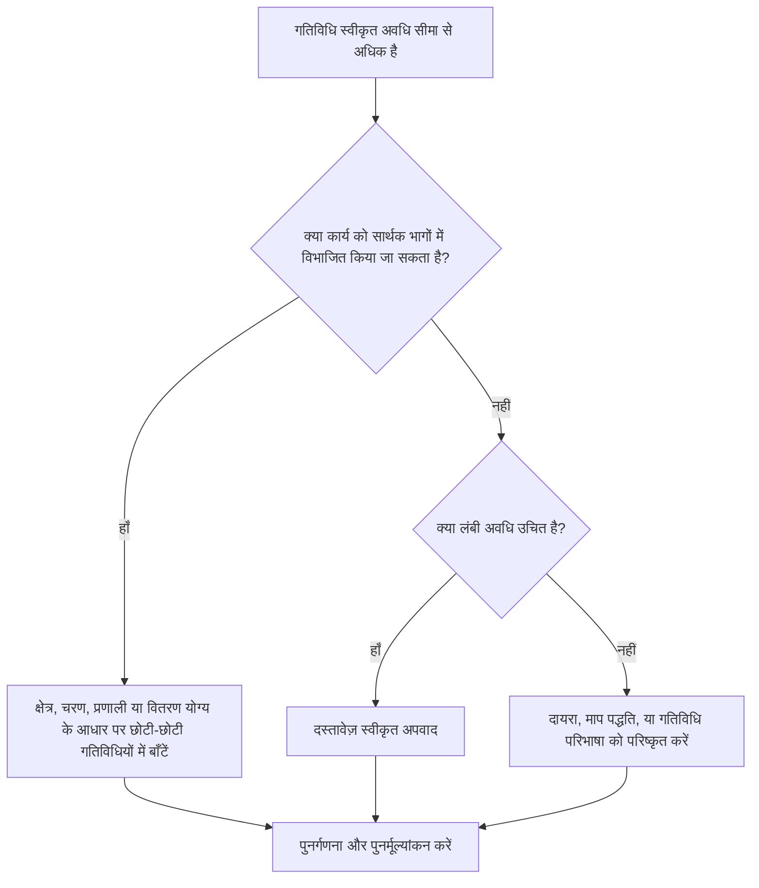

## उद्देश्य

यह मार्गदर्शिका शेड्यूलर्स को स्वीकृत प्रोजेक्ट सीमा से अधिक अवधि वाली गतिविधियों की समीक्षा करने और उनमें सुधार करने में मदद करती है। स्वीकार्य अवधि परियोजना के प्रकार, विवरण के स्तर, रिपोर्टिंग चक्र, अनुबंध आवश्यकताओं और लंबी गतिविधियों के प्रति ग्राहक की संवेदनशीलता पर निर्भर करती है।

## आपके शुरू करने से पहले

कार्रवाई करने से पहले निम्नलिखित जानकारी इकट्ठा करें:

- इस मीट्रिक के लिए वर्तमान मूल्यांकन परिणाम।
- प्रोजेक्ट या शेड्यूल स्तर के लिए स्वीकृत अधिकतम गतिविधि अवधि।
- अवधि सीमा से ऊपर की गतिविधियों की सूची.
- मूल अवधि, शेष अवधि, गतिविधि प्रकार, स्थिति, डब्ल्यूबीएस, कैलेंडर और कुल फ्लोट।
- आधारभूत आवश्यकताएं, ग्राहक रिपोर्टिंग अपेक्षाएं, और पीएमओ अनुसूची गुणवत्ता नियम।
- अग्रिम योजना अवधि, प्रगति अद्यतन चक्र, और अनुशासन या पैकेज स्वामित्व।
- कोई भी उचित अपवाद, जैसे खरीद, इलाज, वितरण, समीक्षा, परीक्षण, या प्रयास के स्तर की गतिविधियाँ।

## अपने परिणाम को समझें

एक मजबूत परिणाम अनुमोदित लंबी अवधि की सीमा से ऊपर शून्य अनसुलझे गतिविधियाँ हैं।

एक स्वीकार्य परिणाम में प्रलेखित अपवाद शामिल हो सकते हैं, विशेष रूप से उन गतिविधियों के लिए जिन्हें उचित रूप से विभाजित नहीं किया जा सकता है या जानबूझकर सारांश-जैसी नियंत्रण गतिविधियों के रूप में प्रबंधित किया जाता है। ये सीमित और स्पष्ट रूप से उचित होने चाहिए।

कमजोर परिणाम का मतलब है कि अनुसूची में कई गतिविधियाँ शामिल हैं जो प्रभावी योजना और नियंत्रण के लिए बहुत व्यापक हैं। इससे प्रगति की दृश्यता कम हो सकती है और यह समझना कठिन हो सकता है कि वास्तव में कौन सा कार्य शेड्यूल चला रहा है।

## सुधार लक्ष्य

लक्ष्य स्वीकृत अवधि सीमा से ऊपर 0 अनसुलझे गतिविधियाँ हैं।

लक्ष्य लंबी गतिविधियों को छोटी, सार्थक गतिविधियों में विभाजित करना है जहां बेहतर नियंत्रण की आवश्यकता है, जबकि वैध अपवादों का दस्तावेजीकरण करना है जहां लंबी अवधि उपयुक्त है।

## कार्य योजना

### चरण 1: मुख्य मुद्दे की पहचान करें

एक P6 लेआउट या रिपोर्ट बनाएं जो प्रोजेक्ट-परिभाषित अवधि सीमा से अधिक की गतिविधियों को सूचीबद्ध करता है। गतिविधि आईडी, गतिविधि नाम, डब्ल्यूबीएस, गतिविधि प्रकार, मूल अवधि, शेष अवधि, प्रारंभ, समाप्ति, कैलेंडर, कुल फ़्लोट और गतिविधि स्थिति शामिल करें।

प्रत्येक गतिविधि की समीक्षा करें और पूछें:

- क्या गतिविधि की अवधि इस परियोजना प्रकार और शेड्यूल स्तर के लिए अनुमोदित सीमा से अधिक लंबी है?
- क्या गतिविधि कई कार्य चरणों, स्थानों, प्रणालियों, क्षेत्रों या डिलिवरेबल्स को कवर करती है?
- क्या प्रत्येक अद्यतन चक्र के दौरान प्रगति को निष्पक्ष रूप से मापा जा सकता है?
- क्या गतिविधि को अधिक विवरण की आवश्यकता है क्योंकि ग्राहक या पीएमओ लंबी अवधि के प्रति संवेदनशील है?
- क्या गतिविधि एक वैध अपवाद है जो लंबे समय तक बनी रहनी चाहिए?

### चरण 2: अनुशंसित सुधार लागू करें

लंबी गतिविधियों को विभाजित करें जहां कार्य की योजना बनाई जा सके और उसे छोटे टुकड़ों में मापा जा सके। सामान्य ब्रेकडाउन विधियों में स्थान, डब्ल्यूबीएस क्षेत्र, अनुशासन, प्रणाली, वितरण योग्य, चरण, क्रू अनुक्रम या रिपोर्टिंग अवधि शामिल हैं।

किसी गतिविधि को विभाजित करते समय, वास्तविक तर्क अनुक्रम को सुरक्षित रखें। उपयुक्त पूर्ववर्तियों और उत्तराधिकारियों को जोड़ें, सही कैलेंडर निर्दिष्ट करें और पुष्टि करें कि नई गतिविधियाँ दर्शाती हैं कि कार्य वास्तव में कैसे निष्पादित किया जाएगा।

केवल मीट्रिक को संतुष्ट करने के लिए गतिविधियों को विभाजित न करें। ब्रेकडाउन से नियंत्रण, प्रगति माप, भविष्य की योजना या रिपोर्टिंग स्पष्टता में सुधार होना चाहिए।

### चरण 3: सामान्य अवरोधक हटाएँ

सामान्य अवरोधकों में अपूर्ण स्कोप परिभाषा, कमजोर WBS संरचना, सीमित फ़ील्ड इनपुट और गतिविधि गिनती कम रखने का दबाव शामिल हैं। जिम्मेदार अनुशासन, पैकेज मालिक, या निर्माण नेतृत्व के साथ लंबी गतिविधियों की समीक्षा करके इनका समाधान करें।

एक अन्य अवरोधक कार्य को दर्शाने के लिए एक लंबी गतिविधि का उपयोग कर रहा है जिसे एक अनुक्रम के रूप में नियोजित किया जाना चाहिए। यदि गतिविधि में एकाधिक हैंडओवर, कार्य चेहरे, डिलिवरेबल्स, या नियंत्रण बिंदु शामिल हैं, तो संभवतः इसे अधिक विवरण की आवश्यकता है।

### चरण 4: परिवर्तनों को मान्य करें

लंबी गतिविधियों को विभाजित करने या समायोजित करने के बाद शेड्यूल की पुनर्गणना करें। पुष्टि करें कि प्रत्येक नई गतिविधि में उचित तर्क, अवधि, कैलेंडर और प्रगति माप है।

कुल फ़्लोट, महत्वपूर्ण पथ, सबसे लंबा पथ और मील का पत्थर तिथियों की समीक्षा करें। यदि ब्रेकडाउन से मुख्य तिथियां बदल जाती हैं, तो प्रोजेक्ट कंट्रोल लीड या पीएमओ समीक्षक को इसका कारण बताएं।

## सुधार अनुसूची

### दिन 1: समीक्षा करें और निदान करें

मीट्रिक चलाएँ, अवधि सीमा की पुष्टि करें, और गतिविधियों को विभाजित उम्मीदवारों, वैध अपवादों और स्वामी इनपुट की आवश्यकता वाली वस्तुओं में अलग करें।

### दिन 2-3: प्राथमिकता वाले कार्यों को लागू करें

पहले आलोचनात्मक, निकट-महत्वपूर्ण और ग्राहक-संवेदनशील गतिविधियों को ठीक करें। व्यापक गतिविधियों को तोड़ें और वैध अपवादों का दस्तावेजीकरण करें।

### दिन 4-5: प्रारंभिक परिणामों की निगरानी करें

शेड्यूल की पुनर्गणना करें और फ्लोट, सबसे लंबे पथ, मील के पत्थर की तारीखों और आगे की दृश्यता में आंदोलन की समीक्षा करें।

### दिन 6: अंतिम समायोजन

जिम्मेदार अनुशासन, पैकेज मालिक, या परियोजना नियंत्रण नेतृत्व के साथ शेष अनिश्चित वस्तुओं का समाधान करें।

### दिन 7: पुनर्मूल्यांकन करें और तुलना करें

मूल्यांकन फिर से चलाएँ और लक्ष्य सीमा के विरुद्ध परिणाम की तुलना करें।

## प्रगति पर नज़र रखना

सुधार और अनुमोदन प्रबंधित करने के लिए एक सरल ट्रैकर का उपयोग करें।

| तारीख | कार्रवाई की | अपेक्षित प्रभाव | परिणाम/अवलोकन | अगला कदम |
| --- | --- | --- | --- | --- |
| [तारीख] | दीर्घकालीन गतिविधियों की समीक्षा की | ब्रेकडाउन की आवश्यकता वाली गतिविधियों की पहचान करें | [देखा गया परिणाम] | स्वामियों को नियुक्त करें |
| [तारीख] | गतिविधि को छोटे-छोटे कार्य चरणों में विभाजित करें | प्रगति दृश्यता में सुधार करें | [देखा गया परिणाम] | शेड्यूल की पुनर्गणना करें |
| [तारीख] | प्रलेखित वैध अपवाद | समीक्षा ट्रैसेबिलिटी में सुधार करें | [देखा गया परिणाम] | मीट्रिक का पुनर्मूल्यांकन करें |

## यदि परिणाम में सुधार नहीं होता है

यदि परिणाम में सुधार नहीं होता है, तो जांचें कि क्या अवधि सीमा अस्पष्ट है, असंगत रूप से लागू की गई है, या शेड्यूल स्तर के साथ संरेखित नहीं है। यह भी समीक्षा करें कि क्या लंबी गतिविधियाँ किसी विशिष्ट WBS क्षेत्र, अनुशासन या परियोजना चरण में केंद्रित हैं।

लंबी अवधि की अनसुलझी गतिविधियों को बढ़ाएं जब वे महत्वपूर्ण, निकट-महत्वपूर्ण, संविदात्मक, रिपोर्टिंग, या ग्राहक-संवेदनशील कार्य को प्रभावित करते हैं।

## रखरखाव

प्रत्येक शेड्यूल अपडेट, बेसलाइन विकास और प्रमुख पुनरुत्पादन अभ्यास के दौरान इस मीट्रिक की समीक्षा करें। यदि प्रोजेक्ट किसी भिन्न चरण या विवरण के स्तर पर चला जाता है तो सीमा को अपडेट करें।

## सारांश चेकलिस्ट

- [ ] वर्तमान परिणाम की समीक्षा की गई
- [ ] लक्ष्य सीमा की पुष्टि की गई
- [ ] मुख्य मुद्दा पहचाना गया
- [ ] लम्बी गतिविधियों की समीक्षा की गई
- [ ] विभाजित उम्मीदवारों की पहचान की गई
- [ ] जहाँ उपयोगी हो वहाँ गतिविधियाँ तोड़ दी गईं
- [ ] वैध अपवादों का दस्तावेजीकरण किया गया
- [ ] शेड्यूल की पुनर्गणना की गई
- [ ] परिणामों की निगरानी की गई
- [ ] मूल्यांकन दोहराया गया
- [ ] अगले चरणों का दस्तावेजीकरण किया गया
## संबंधित सामग्री
- [ब्लॉग टेम्पलेट](03_blog_template.md)
- [शेड्यूल क्या है](../../05_blogs_hi/01_WHAT%20A%20SCHEDULE%20IS/01_blog.md)
- [मजबूत तर्क](../../05_blogs_hi/02_ROBUST%20LOGIC/02_ROBUST%20LOGIC.md)
