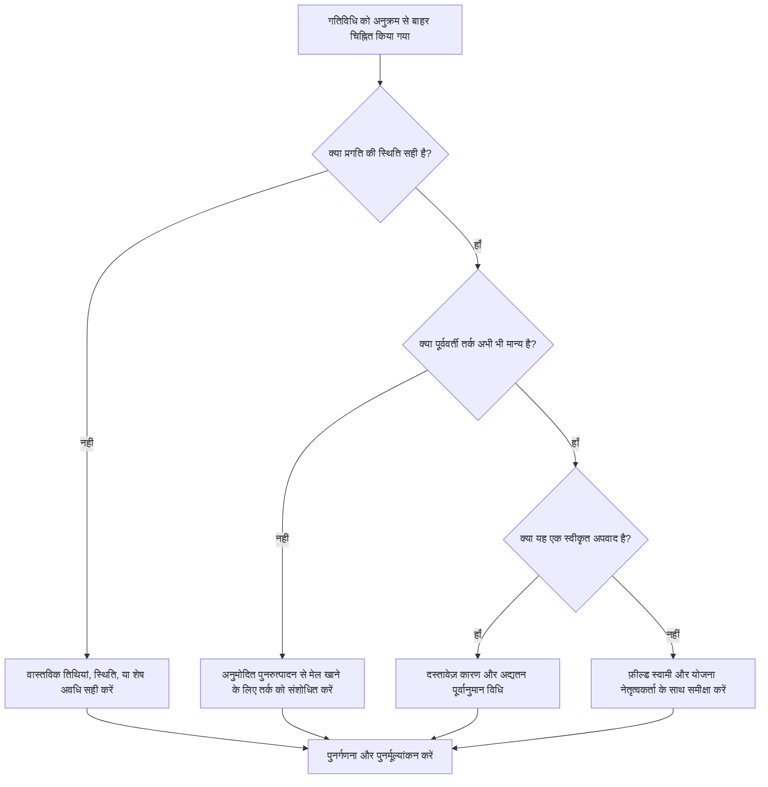

## उद्देश्य

यह मार्गदर्शिका शेड्यूलर्स को उन गतिविधियों की समीक्षा करने और उन्हें सही करने में मदद करती है जो प्राइमेरा पी6 में अनुक्रम से बाहर हैं। यह तब लागू होता है जब कोई गतिविधि अपने आवश्यक पूर्ववर्ती तर्क के संतुष्ट होने से पहले शुरू हो गई हो या आगे बढ़ गई हो।

## आपके शुरू करने से पहले

कार्रवाई करने से पहले निम्नलिखित जानकारी इकट्ठा करें:

- इस मीट्रिक के लिए वर्तमान मूल्यांकन परिणाम।
- अनुक्रम से बाहर के रूप में चिह्नित गतिविधियों की सूची।
- नवीनतम अद्यतन में उपयोग किया गया डेटा दिनांक।
- वास्तविक प्रारंभ, वास्तविक समाप्ति, शेष अवधि और गतिविधि स्थिति।
- पूर्ववर्ती और उत्तराधिकारी संबंध विवरण, संबंध प्रकार और अंतराल सहित।
- शेड्यूल गणना सेटिंग्स, विशेष रूप से तर्क और प्रगति ओवरराइड को बरकरार रखा।
- नियोजित तर्क पूरा होने से पहले कार्य क्यों आगे बढ़ा, इसके लिए फ़ील्ड स्पष्टीकरण।

## अपने परिणाम को समझें

एक मजबूत परिणाम शून्य अनसुलझे अनुक्रम से बाहर की गतिविधियाँ हैं।

एक स्वीकार्य परिणाम में दस्तावेजी अपवाद शामिल हो सकते हैं जहां कार्य जानबूझकर पुन: अनुक्रमित किया गया था और नई योजना को प्रतिबिंबित करने के लिए शेड्यूल तर्क को अद्यतन किया गया है।

कमजोर परिणाम का मतलब है कि शेड्यूल अपडेट में ऐसी प्रगति है जो मौजूदा लॉजिक नेटवर्क के साथ टकराव करती है। यह गलत स्थिति, गायब वास्तविक आंकड़े, पुराने तर्क, या वास्तविक क्षेत्र के पुनरुत्पादन का संकेत दे सकता है जो अभी तक पूर्वानुमान में प्रतिबिंबित नहीं हुआ है।

## सुधार लक्ष्य

लक्ष्य 0 अनसुलझे अनुक्रम से बाहर की गतिविधियाँ हैं।

लक्ष्य यह निर्धारित करना है कि क्या प्रत्येक आइटम एक स्थिति त्रुटि, एक तर्क त्रुटि, या एक वास्तविक पुनरुत्पादन घटना है, फिर शेड्यूल को सही करें ताकि यह वर्तमान योजना का प्रतिनिधित्व कर सके।

## कार्य योजना

### चरण 1: मुख्य मुद्दे की पहचान करें

अनुक्रम से बाहर की गतिविधियों को सूचीबद्ध करते हुए एक P6 लेआउट या रिपोर्ट बनाएं। गतिविधि आईडी, गतिविधि का नाम, डब्ल्यूबीएस, स्थिति, वास्तविक प्रारंभ, वास्तविक समाप्ति, शेष अवधि, प्रारंभ, समाप्ति, कुल फ़्लोट, पूर्ववर्ती, उत्तराधिकारी, संबंध प्रकार, अंतराल और ड्राइविंग संबंध संकेतक शामिल करें।

प्रत्येक गतिविधि की समीक्षा करें और पूछें:

- क्या गतिविधि वास्तव में अपनी पूर्ववर्ती आवश्यकता पूरी होने से पहले शुरू हुई थी?
- क्या पूर्ववर्ती स्थिति सही है?
- क्या उत्तराधिकारी की स्थिति सही है?
- क्या फ़ील्ड पुनर्अनुक्रमण के बाद भी संबंध वैध है?
- क्या शेड्यूल तर्क को बदला जाना चाहिए, या प्रगति अद्यतन को ठीक किया जाना चाहिए?
- किस P6 शेड्यूलिंग विकल्प का उपयोग किया जा रहा है: तर्क बनाए रखा या प्रगति ओवरराइड?

### चरण 2: अनुशंसित सुधार लागू करें

पहले स्थिति संबंधी त्रुटियों को ठीक करें. यदि वास्तविक शुरुआत, वास्तविक समाप्ति, शेष अवधि, या पूर्ववर्ती स्थिति गलत है, तो तर्क बदलने से पहले गतिविधि डेटा अपडेट करें।

यदि फ़ील्ड अनुक्रम बदल गया है, तो अनुमोदित वर्तमान योजना का प्रतिनिधित्व करने के लिए तर्क को संशोधित करें। मीट्रिक साफ़ करने के लिए पूर्ववर्ती संबंधों को न हटाएं। पुराने तर्क को ऐसे रिश्तों से बदलें जो वास्तविक निष्पादन अनुक्रम से मेल खाते हों।

बनाए गए तर्क और प्रगति ओवरराइड सेटिंग्स की समीक्षा करें। बनाए रखा गया तर्क आम तौर पर शेष कार्य के लिए मूल पूर्ववर्ती तर्क को संरक्षित करता है, जबकि प्रगति ओवरराइड अपूर्ण पूर्ववर्ती तर्क के बावजूद शेष कार्य को जारी रखने की अनुमति दे सकता है। सेटिंग को परियोजना नियंत्रण प्रक्रिया के अनुरूप होना चाहिए और परिणाम की रिपोर्ट करने से पहले समझा जाना चाहिए।

### चरण 3: सामान्य अवरोधक हटाएँ

आम अवरोधकों में देर से फ़ील्ड अपडेट, अपूर्ण वास्तविक तिथियां, तर्क समीक्षा के बिना प्रगति स्वीकार करने का दबाव और शेड्यूल गणना विकल्पों के बारे में भ्रम शामिल हैं।

एक अन्य अवरोधक अनुक्रम से बाहर की प्रगति को केवल एक सॉफ़्टवेयर समस्या मान रहा है। असली सवाल यह है कि क्या परियोजना ने काम के क्रम को बदल दिया है और क्या कार्यक्रम अब उस स्वीकृत क्रम को दर्शाता है।

### चरण 4: परिवर्तनों को मान्य करें

सुधार के बाद शेड्यूल की पुनर्गणना करें। आउट-ऑफ-सीक्वेंस जांच को दोबारा चलाएं और पुष्टि करें कि प्रत्येक शेष आइटम को सही, उचित या अनुवर्ती कार्रवाई के लिए सौंपा गया है।

कुल फ़्लोट, सबसे लंबा पथ, महत्वपूर्ण पथ और निकट-अवधि के मील के पत्थर की समीक्षा करें। अनुक्रम से बाहर के सुधार पूर्वानुमान की तारीखों को बदल सकते हैं, इसलिए परियोजना नियंत्रण प्रमुख या पीएमओ समीक्षक को सार्थक प्रभावों के बारे में बताएं।

## सुधार अनुसूची

### दिन 1: समीक्षा करें और निदान करें

मीट्रिक चलाएँ, डेटा दिनांक की पुष्टि करें, और स्थिति त्रुटियों, तर्क त्रुटियों, वास्तविक पुनरुत्पादन और संभावित अपवादों में निष्कर्षों को अलग करें।

### दिन 2-3: प्राथमिकता वाले कार्यों को लागू करें

सबसे पहले आलोचनात्मक, निकट-महत्वपूर्ण और भविष्य की गतिविधियों को ठीक करें। अद्यतन स्थिति, पुराने तर्क को संशोधित करें, और दस्तावेज़ अनुमोदित पुन: अनुक्रमण।

### दिन 4-5: प्रारंभिक परिणामों की निगरानी करें

शेड्यूल की पुनर्गणना करें और फ़्लोट, सबसे लंबे पथ, महत्वपूर्ण पथ और मील के पत्थर की तारीखों में आंदोलन की समीक्षा करें।

### दिन 6: अंतिम समायोजन

शेष आइटमों को फ़ील्ड लीड, अनुशासन स्वामियों, या योजना प्रबंधक के साथ हल करें।

### दिन 7: पुनर्मूल्यांकन करें और तुलना करें

मूल्यांकन फिर से चलाएँ और लक्ष्य सीमा के विरुद्ध परिणाम की तुलना करें।

## प्रगति पर नज़र रखना

सुधार और अनुमोदन प्रबंधित करने के लिए एक सरल ट्रैकर का उपयोग करें।

| तारीख | कार्रवाई की | अपेक्षित प्रभाव | परिणाम/अवलोकन | अगला कदम |
| --- | --- | --- | --- | --- |
| [तारीख] | क्रम से बाहर की गतिविधियों की समीक्षा की | स्थिति या तर्क समस्या की पहचान करें | [देखा गया परिणाम] | मालिक को नियुक्त करें |
| [तारीख] | सही स्थिति या वास्तविक तिथियाँ | अद्यतन सटीकता में सुधार करें | [देखा गया परिणाम] | शेड्यूल की पुनर्गणना करें |
| [तारीख] | अनुमोदित पुनः अनुक्रमण के लिए संशोधित तर्क | पूर्वानुमान की विश्वसनीयता में सुधार करें | [देखा गया परिणाम] | मीट्रिक का पुनर्मूल्यांकन करें |

## यदि परिणाम में सुधार नहीं होता है

यदि परिणाम में सुधार नहीं होता है, तो जांचें कि क्या वही कार्य क्षेत्र बार-बार अनुक्रम से बाहर प्रगति कर रहे हैं। यह कमजोर अद्यतन अनुशासन, अवास्तविक तर्क, अपूर्ण क्षेत्र समन्वय, या बार-बार अस्वीकृत पुनरुत्पादन का संकेत दे सकता है।

जब अनसुलझे आइटम महत्वपूर्ण, निकट-महत्वपूर्ण, संविदात्मक, पहुंच, हैंडओवर या क्लाइंट-संवेदनशील कार्य को प्रभावित करते हैं तो उन्हें बढ़ाएँ।

## रखरखाव

शेड्यूल जारी करने से पहले प्रत्येक अद्यतन चक्र के दौरान इस मीट्रिक की समीक्षा करें। पुष्टि करें कि पीएमओ रिपोर्टिंग, विलंब विश्लेषण, या पुनर्प्राप्ति योजना के लिए शेड्यूल रिपोर्ट का उपयोग करने से पहले अनुक्रम से बाहर की प्रगति का समाधान कर लिया गया है।

## सारांश चेकलिस्ट

- [ ] वर्तमान परिणाम की समीक्षा की गई
- [ ] लक्ष्य सीमा की पुष्टि की गई
- [ ] डेटा दिनांक की पुष्टि की गई
- [ ] मुख्य मुद्दा पहचाना गया
- [ ] स्थिति संबंधी त्रुटियों को ठीक किया गया
- [ ] तर्क संबंधी त्रुटियों को ठीक किया गया
- [ ] स्वीकृत पुनरुत्पादन का दस्तावेजीकरण किया गया
- [ ] शेड्यूल गणना सेटिंग की समीक्षा की गई
- [ ] शेड्यूल की पुनर्गणना की गई
- [ ] परिणामों की निगरानी की गई
- [ ] मूल्यांकन दोहराया गया
- [ ] अगले चरणों का दस्तावेजीकरण किया गया
## संबंधित सामग्री
- [ब्लॉग टेम्पलेट](03_blog_template.md)
- [शेड्यूल क्या है](../../05_blogs_hi/01_WHAT%20A%20SCHEDULE%20IS/01_blog.md)
- [मजबूत तर्क](../../05_blogs_hi/02_ROBUST%20LOGIC/02_ROBUST%20LOGIC.md)
