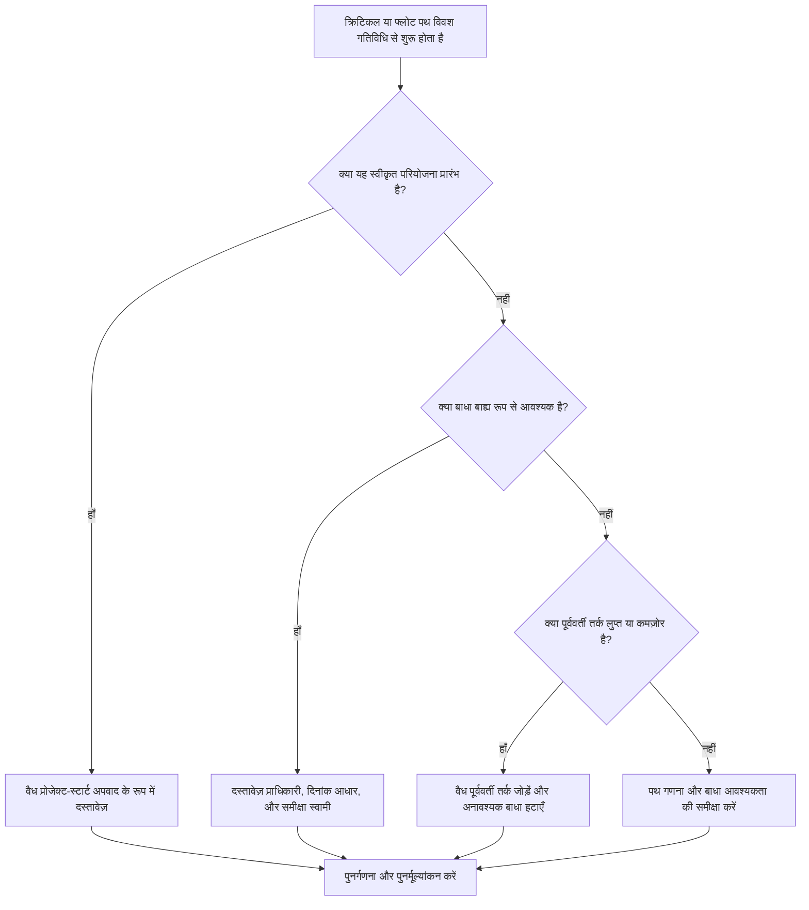

## उद्देश्य

यह मार्गदर्शिका शेड्यूलर्स को महत्वपूर्ण पथ या फ़्लोट पथ श्रृंखलाओं की समीक्षा करने में मदद करती है जो एक प्रतिबंधित गतिविधि से शुरू होती हैं। अनुमोदित परियोजना प्रारंभ आम तौर पर एक वैध अपवाद है; चिंता तब होती है जब डाउनस्ट्रीम पथ तार्किक अनुक्रम के बजाय बाधा से शुरू होता है।

## आपके शुरू करने से पहले

कार्रवाई करने से पहले निम्नलिखित जानकारी इकट्ठा करें:

- इस मीट्रिक के लिए वर्तमान मूल्यांकन परिणाम।
- प्रिमावेरा पी6 से महत्वपूर्ण पथ या फ्लोट पथ रिपोर्ट।
- प्रत्येक ध्वजांकित पथ पर पहली गतिविधि।
- बाधा प्रकार, बाधा तिथि, और कोई अपेक्षित तिथियां।
- पथ-प्रारंभ गतिविधि के लिए पूर्ववर्ती और उत्तराधिकारी संबंध।
- डेटा दिनांक, प्रोजेक्ट प्रारंभ मील का पत्थर, आधारभूत आवश्यकताएं, और पीएमओ या क्लाइंट शेड्यूलिंग नियम।
- किसी भी अनुमोदित बाहरी बाधा के लिए स्पष्टीकरण.

## अपने परिणाम को समझें

एक मजबूत परिणाम शून्य अनसुलझा महत्वपूर्ण या फ्लोट पथ है जो स्वीकृत परियोजना प्रारंभ को छोड़कर किसी बाधा से शुरू होता है।

एक स्वीकार्य परिणाम में दस्तावेज़ीकृत बाहरी बाधाएँ शामिल हो सकती हैं, जैसे आगे बढ़ने के लिए नोटिस, मालिक की पहुँच रिलीज़, परमिट रिलीज़, या संविदात्मक होल्ड पॉइंट। इन्हें स्पष्ट रूप से उचित ठहराया जाना चाहिए।

कमजोर परिणाम का मतलब है कि पथ को नेटवर्क तर्क के बजाय थोपी गई तारीखों द्वारा नियंत्रित किया जा सकता है। यह पूर्वानुमान, रिपोर्टिंग और विलंब विश्लेषण के लिए महत्वपूर्ण पथ या फ़्लोट पथ को कम विश्वसनीय बना सकता है।

## सुधार लक्ष्य

लक्ष्य एक बाधा से शुरू होने वाले 0 अनसुलझे पथ हैं।

लक्ष्य यह पुष्टि करना है कि क्या पथ स्वीकृत परियोजना प्रारंभ से शुरू होना चाहिए, वैध पूर्ववर्ती तर्क से, या किसी दस्तावेजी बाहरी बाधा से।

## कार्य योजना

### चरण 1: मुख्य मुद्दे की पहचान करें

एक P6 लेआउट या रिपोर्ट बनाएं जो महत्वपूर्ण पथ और चयनित फ़्लोट पथ दिखाता है। प्रत्येक पथ पर पहली गतिविधि के लिए, गतिविधि आईडी, गतिविधि नाम, डब्ल्यूबीएस, प्रारंभ, समाप्ति, कुल फ्लोट, फ्री फ्लोट, प्राथमिक बाधा, बाधा तिथि, पूर्ववर्ती, उत्तराधिकारी और गतिविधि स्थिति शामिल करें।

प्रत्येक चिह्नित पथ की समीक्षा करें और पूछें:

- क्या यह अनुमोदित परियोजना प्रारंभ या नोटिस-टू-आगे बढ़ने वाली गतिविधि है?
- क्या बाधा संविदात्मक रूप से या बाह्य रूप से आवश्यक है?
- क्या गतिविधि में पूर्ववर्ती तर्क गायब है?
- क्या बाधा कमजोर या अपूर्ण शेड्यूल नेटवर्क को छिपा रही है?
- यदि बाधा हटा दी जाए तो क्या रास्ता अलग ढंग से शुरू होगा?
- क्या बाधित शुरुआत को पीएमओ या ग्राहक समीक्षा के लिए प्रलेखित किया गया है?

### चरण 2: अनुशंसित सुधार लागू करें

यदि प्रतिबंधित गतिविधि अनुमोदित परियोजना प्रारंभ है, तो इसे एक वैध अपवाद के रूप में दस्तावेज़ित करें और पुष्टि करें कि यह पथ के लिए इच्छित प्रारंभ बिंदु है।

यदि बाधा बाह्य रूप से आवश्यक है तो कारण स्पष्ट होने पर ही इसे रखें। स्रोत का दस्तावेजीकरण करें, जैसे अनुबंध मील का पत्थर, पहुंच जारी करना, परमिट, मालिक का निर्देश, या नियामक आवश्यकता।

यदि बाधा की आवश्यकता नहीं है, तो इसे हटा दें और वैध पूर्ववर्ती तर्क जोड़ें जहां गतिविधि पहले के काम, अनुमोदन, हैंडओवर, खरीद या पहुंच पर निर्भर करती है। शेड्यूल की पुनर्गणना करें और पुष्टि करें कि पथ अब तर्क-चालित है।

### चरण 3: सामान्य अवरोधक हटाएँ

सामान्य अवरोधकों में पुरानी बेसलाइन से विरासत में मिली बाधाएं, तिथियों को मजबूर करने के लिए उपयोग की जाने वाली बाधाएं, लापता इंटरफ़ेस तर्क और बाहरी तिथियों का अस्पष्ट स्वामित्व शामिल हैं।

एक अन्य अवरोधक यह मान रहा है कि एक महत्वपूर्ण पथ केवल इसलिए विश्वसनीय है क्योंकि P6 इसकी पहचान करता है। यदि पथ एक अनावश्यक बाधा से शुरू होता है, तो पथ वास्तविक सीपीएम तर्क के बजाय दिनांक नियंत्रण को प्रतिबिंबित कर सकता है।

### चरण 4: परिवर्तनों को मान्य करें

बाधाओं या तर्क को बदलने के बाद शेड्यूल की पुनर्गणना करें। महत्वपूर्ण पथ, सबसे लंबे पथ, चयनित फ़्लोट पथ, कुल फ़्लोट और मुख्य मील का पत्थर तिथियों की समीक्षा करें।

यदि पथ महत्वपूर्ण रूप से बदलता है, तो कारण का दस्तावेजीकरण करें और परियोजना नियंत्रण लीड, पीएमओ समीक्षक, या क्लाइंट शेड्यूलर को प्रभाव बताएं।

## सुधार अनुसूची

### दिन 1: समीक्षा करें और निदान करें

मीट्रिक चलाएँ, बाधित पथ-प्रारंभ गतिविधियों की पहचान करें, और निष्कर्षों को प्रोजेक्ट-प्रारंभ अपवादों, मान्य बाहरी बाधाओं, गुम तर्क और अनावश्यक बाधाओं में अलग करें।

### दिन 2-3: प्राथमिकता वाले कार्यों को लागू करें

पहले महत्वपूर्ण और ग्राहक-संवेदनशील पथों को ठीक करें। अनावश्यक बाधाएँ हटाएँ, लुप्त तर्क जोड़ें और स्वीकृत अपवादों का दस्तावेजीकरण करें।

### दिन 4-5: प्रारंभिक परिणामों की निगरानी करें

शेड्यूल की पुनर्गणना करें और महत्वपूर्ण पथ, सबसे लंबे पथ, फ्लोट पथ और मील के पत्थर की तारीखों में आंदोलन की समीक्षा करें।

### दिन 6: अंतिम समायोजन

शेष बाधित पथ का समाधान जिम्मेदार स्वामी, परियोजना नियंत्रण नेतृत्व, या ग्राहक समीक्षक से शुरू होता है।

### दिन 7: पुनर्मूल्यांकन करें और तुलना करें

मूल्यांकन फिर से चलाएँ और लक्ष्य सीमा के विरुद्ध परिणाम की तुलना करें।

## प्रगति पर नज़र रखना

सुधार और अनुमोदन प्रबंधित करने के लिए एक सरल ट्रैकर का उपयोग करें।

| तारीख | कार्रवाई की | अपेक्षित प्रभाव | परिणाम/अवलोकन | अगला कदम |
| --- | --- | --- | --- | --- |
| [तारीख] | प्रतिबंधित पथ-प्रारंभ गतिविधियों की समीक्षा की गई | दिनांक-संचालित पथ प्रारंभ की पहचान करें | [देखा गया परिणाम] | मालिक को नियुक्त करें |
| [तारीख] | अनावश्यक बाधा हटाई गई | तर्क-संचालित पथ पुनर्स्थापित करें | [देखा गया परिणाम] | शेड्यूल की पुनर्गणना करें |
| [तारीख] | प्रलेखित स्वीकृत अपवाद | समीक्षा ट्रैसेबिलिटी में सुधार करें | [देखा गया परिणाम] | मीट्रिक का पुनर्मूल्यांकन करें |

## यदि परिणाम में सुधार नहीं होता है

यदि परिणाम में सुधार नहीं होता है, तो जांचें कि क्या बाधाएं किसी विशिष्ट WBS क्षेत्र, इंटरफ़ेस पैकेज या प्रोजेक्ट चरण में केंद्रित हैं। बार-बार निष्कर्ष यह संकेत दे सकते हैं कि शेड्यूल को पूर्ण तर्क के बजाय थोपी गई तारीखों द्वारा नियंत्रित किया जा रहा है।

बढ़ते अनसुलझे अवरोध पथ तब शुरू होते हैं जब वे महत्वपूर्ण, निकट-महत्वपूर्ण, संविदात्मक, ग्राहक-संवेदनशील, पहुंच, या हैंडओवर-संबंधित कार्य को प्रभावित करते हैं।

## रखरखाव

प्रत्येक शेड्यूल अपडेट, बेसलाइन समीक्षा और प्रमुख पुनरुत्पादन अभ्यास के दौरान इस मीट्रिक की समीक्षा करें। पुनर्प्राप्ति योजना, ग्राहक तिथि परिवर्तन, या इंटरफ़ेस संशोधन के बाद विशेष ध्यान दें।

## सारांश चेकलिस्ट

- [ ] वर्तमान परिणाम की समीक्षा की गई
- [ ] लक्ष्य सीमा की पुष्टि की गई
- [ ] क्रिटिकल या फ्लोट पाथ रिपोर्ट की समीक्षा की गई
- [ ] प्रोजेक्ट प्रारंभ अपवादों की पहचान की गई
- [ ] बाधा के आधार की जाँच की गई
- [ ] गुम तर्क को ठीक किया गया
- [ ] अनावश्यक बाधाएं हटाई गईं
- [ ] स्वीकृत अपवादों का दस्तावेजीकरण किया गया
- [ ] शेड्यूल की पुनर्गणना की गई
- [ ] परिणामों की निगरानी की गई
- [ ] मूल्यांकन दोहराया गया
- [ ] अगले चरणों का दस्तावेजीकरण किया गया
## संबंधित सामग्री
- [ब्लॉग टेम्पलेट](03_blog_template.md)
- [शेड्यूल क्या है](../../05_blogs_hi/01_WHAT%20A%20SCHEDULE%20IS/01_blog.md)
- [मजबूत तर्क](../../05_blogs_hi/02_ROBUST%20LOGIC/02_ROBUST%20LOGIC.md)
