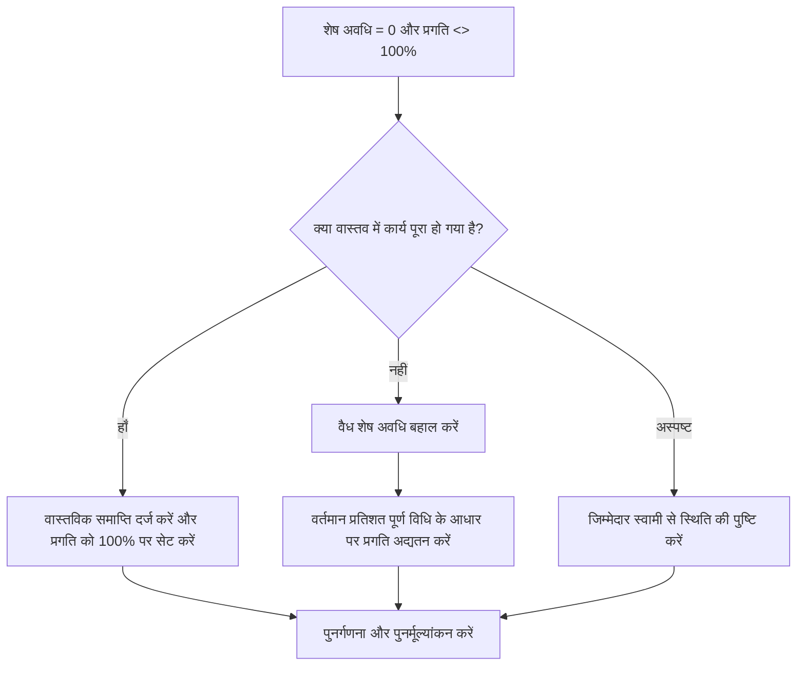

## उद्देश्य

यह मार्गदर्शिका शेड्यूलर्स को उन गतिविधियों की समीक्षा करने और सही करने में मदद करती है जहां शेष अवधि 0 के बराबर है लेकिन प्रगति 100% नहीं है। यह शेष अवधि, प्रगति प्रतिशत, वास्तविक समाप्ति और गतिविधि स्थिति को संरेखित करके क्लीनर प्रिमावेरा पी6 स्थिति अपडेट का समर्थन करता है।

## आपके शुरू करने से पहले

कार्रवाई करने से पहले निम्नलिखित जानकारी इकट्ठा करें:

- इस मीट्रिक के लिए वर्तमान मूल्यांकन परिणाम।
- शेष अवधि = 0 और प्रगति <> 100% वाली गतिविधियों की सूची।
- गतिविधि की स्थिति, वास्तविक शुरुआत, वास्तविक समाप्ति, मूल अवधि, शेष अवधि और समापन पर अवधि।
- प्रतिशत पूर्ण प्रकार और संबंधित प्रगति फ़ील्ड।
- भौतिक प्रतिशत पूर्ण, अवधि प्रतिशत पूर्ण, इकाइयाँ प्रतिशत पूर्ण, और गतिविधि प्रतिशत पूर्ण।
- डेटा दिनांक और नवीनतम प्रगति अद्यतन नोट।
- काम पूरा हो गया है या अभी भी काम बाकी है, इसकी फील्ड पुष्टि।

## अपने परिणाम को समझें

एक मजबूत परिणाम शेष अवधि = 0 के साथ शून्य गतिविधियां और 100% से नीचे या ऊपर प्रगति है।

एक स्वीकार्य परिणाम में दुर्लभ दस्तावेजी मामले शामिल हो सकते हैं जहां एक विशिष्ट प्रतिशत पूर्ण विधि अस्थायी रिपोर्टिंग अंतर पैदा करती है, लेकिन इन्हें औपचारिक रिपोर्टिंग से पहले हल किया जाना चाहिए।

कमजोर परिणाम का मतलब है कि शेड्यूल में ऐसी गतिविधियाँ शामिल हैं जिनके शेष कार्य और प्रगति की स्थिति मेल नहीं खाती है। इससे गलत रिपोर्टिंग, अर्जित मूल्य संबंधी समस्याएं या भ्रामक पूर्णता स्थिति उत्पन्न हो सकती है।

## सुधार लक्ष्य

लक्ष्य 0 अनसुलझे गतिविधियाँ हैं जिनकी शेष अवधि = 0 और प्रगति <> 100% है।

लक्ष्य यह पुष्टि करना है कि क्या प्रत्येक गतिविधि पूर्ण है, गलत प्रगति-अद्यतन है, या एक प्रतिशत पूर्ण पद्धति का उपयोग कर रही है जिसकी समीक्षा की आवश्यकता है।

## कार्य योजना

### चरण 1: मुख्य मुद्दे की पहचान करें

एक P6 लेआउट या रिपोर्ट बनाएं जो उन गतिविधियों के लिए फ़िल्टर करता है जहां शेष अवधि 0 के बराबर है और प्रगति 100% नहीं है। गतिविधि आईडी, गतिविधि का नाम, डब्ल्यूबीएस, गतिविधि की स्थिति, वास्तविक प्रारंभ, वास्तविक समाप्ति, मूल अवधि, शेष अवधि, प्रतिशत पूर्ण प्रकार, भौतिक प्रतिशत पूर्ण, अवधि प्रतिशत पूर्ण, इकाइयां प्रतिशत पूर्ण, और गतिविधि प्रतिशत पूर्ण शामिल करें।

प्रत्येक गतिविधि की समीक्षा करें और पूछें:

- क्या वास्तव में कार्य पूरा हो गया है?
- यदि पूरा हो गया है, तो क्या वास्तविक फिनिश गायब है?
- यदि पूर्ण नहीं है तो शेष अवधि 0 क्यों है?
- किस प्रतिशत पूर्ण प्रकार का उपयोग किया जा रहा है?
- क्या प्रगति का मूल्य भौतिक, अवधि या इकाइयों की प्रगति से आ रहा है?
- क्या यह स्थिति अद्यतन त्रुटि है या प्रगति गणना समस्या है?

### चरण 2: अनुशंसित सुधार लागू करें

यदि कार्य पूरा हो गया है, तो गतिविधि को पूर्ण के रूप में अपडेट करें। वास्तविक समापन दर्ज करें, पुष्टि करें कि शेष अवधि 0 है, और पुष्टि करें कि परियोजना अद्यतन प्रक्रिया के अनुसार प्रगति 100% है।

यदि कार्य पूरा नहीं हुआ है तो उचित शेष अवधि बहाल करें। जिम्मेदार स्वामी के साथ शेष कार्य की पुष्टि करें और गतिविधि के प्रतिशत पूर्ण प्रकार के आधार पर संबंधित प्रगति फ़ील्ड को अपडेट करें।

यदि समस्या प्रतिशत पूर्ण विधि के कारण होती है, तो समीक्षा करें कि क्या गतिविधि को भौतिक प्रतिशत पूर्ण, अवधि प्रतिशत पूर्ण, या इकाई प्रतिशत पूर्ण का उपयोग करना चाहिए। प्रतिशत पूर्ण प्रकार को लापरवाही से न बदलें; इसे प्रोजेक्ट नियंत्रण प्रक्रिया के साथ संरेखित करें।

### चरण 3: सामान्य अवरोधक हटाएँ

सामान्य अवरोधकों में अपूर्ण फ़ील्ड अपडेट, अनुपलब्ध वास्तविक समाप्ति तिथियां, भौतिक और अवधि प्रतिशत पूर्ण के बीच भ्रम, और सत्यापन के बिना बाहरी सिस्टम से आयातित प्रगति शामिल हैं।

एक अन्य अवरोधक शेष अवधि को प्रगति क्षेत्र के रूप में मान रहा है। शेष अवधि को यह दर्शाना चाहिए कि गतिविधि को पूरा करने के लिए अभी भी कितना समय चाहिए, न कि केवल रिपोर्ट किए गए कार्य की मात्रा।

### चरण 4: परिवर्तनों को मान्य करें

सुधार के बाद शेड्यूल की पुनर्गणना करें। मीट्रिक को दोबारा चलाएँ और पुष्टि करें कि प्रत्येक शेष आइटम को सही कर दिया गया है या अनुवर्ती कार्रवाई के लिए असाइन कर दिया गया है।

पूरी की गई गतिविधियों, वास्तविक समापन तिथियों, प्रगति रिपोर्ट, अर्जित मूल्य आउटपुट और लुकहेड रिपोर्ट की समीक्षा करके पुष्टि करें कि सुधार ने नई विसंगतियां पैदा नहीं की हैं।

## सुधार अनुसूची

### दिन 1: समीक्षा करें और निदान करें

मीट्रिक चलाएँ, डेटा दिनांक की पुष्टि करें, और पूर्ण किए गए कार्य की अनुपलब्ध स्थिति, शून्य शेष अवधि के साथ अधूरे कार्य और प्रतिशत पूर्ण विधि समस्याओं के आधार पर निष्कर्षों को अलग करें।

### दिन 2-3: प्राथमिकता वाले कार्यों को लागू करें

सबसे पहले रिपोर्टिंग में उपयोग की जाने वाली सही गतिविधियाँ। वास्तविक समाप्ति को अद्यतन करें, शेष अवधि को पुनर्स्थापित करें, या आवश्यकतानुसार प्रगति मूल्यों को सही करें।

### दिन 4-5: प्रारंभिक परिणामों की निगरानी करें

शेड्यूल की पुनर्गणना करें और प्रगति रिपोर्ट, पूर्ण गतिविधि सूचियों और अर्जित मूल्य आउटपुट की समीक्षा करें।

### दिन 6: अंतिम समायोजन

जिम्मेदार अनुशासन, फील्ड लीड, या प्रोजेक्ट नियंत्रण लीड के साथ शेष अनिश्चित वस्तुओं का समाधान करें।

### दिन 7: पुनर्मूल्यांकन करें और तुलना करें

मूल्यांकन फिर से चलाएँ और लक्ष्य सीमा के विरुद्ध परिणाम की तुलना करें।

## प्रगति पर नज़र रखना

सुधार और अनुमोदन प्रबंधित करने के लिए एक सरल ट्रैकर का उपयोग करें।

| तारीख | कार्रवाई की | अपेक्षित प्रभाव | परिणाम/अवलोकन | अगला कदम |
| --- | --- | --- | --- | --- |
| [तारीख] | समीक्षा की गई आरडी 0 और प्रगति नहीं 100 गतिविधियाँ | स्थिति असंगति को पहचानें | [देखा गया परिणाम] | मालिक को नियुक्त करें |
| [तारीख] | वास्तविक समापन दर्ज किया गया और प्रगति को सही किया गया | पूर्ण स्थिति को संरेखित करें | [देखा गया परिणाम] | शेड्यूल की पुनर्गणना करें |
| [तारीख] | शेष अवधि बहाल | अपूर्ण गतिविधि की स्थिति ठीक करें | [देखा गया परिणाम] | मीट्रिक का पुनर्मूल्यांकन करें |

## यदि परिणाम में सुधार नहीं होता है

यदि परिणाम में सुधार नहीं होता है, तो जांचें कि क्या प्रगति अद्यतन आयात किए जा रहे हैं, कॉपी किए जा रहे हैं, या असंगत रूप से गणना की जा रही है। समीक्षा करें कि क्या अलग-अलग टीमें अलग-अलग प्रतिशत पूर्ण विधियों का उपयोग करती हैं या क्या वास्तविक समाप्ति तिथियां अपडेट वर्कफ़्लो से गायब हैं।

जब अनसुलझे आइटम महत्वपूर्ण, निकट-महत्वपूर्ण, अर्जित मूल्य, ग्राहक रिपोर्टिंग, भुगतान, या हैंडओवर-संबंधी कार्य को प्रभावित करते हैं तो उन्हें बढ़ाएँ।

## रखरखाव

रिपोर्ट जारी करने से पहले प्रत्येक अद्यतन चक्र के दौरान इस मीट्रिक की समीक्षा करें। यह वास्तविक तिथियों, शेष अवधि, पूर्ण प्रतिशत और गतिविधि स्थिति जांच के साथ-साथ मानक अद्यतन सत्यापन का हिस्सा होना चाहिए।

## सारांश चेकलिस्ट

- [ ] वर्तमान परिणाम की समीक्षा की गई
- [ ] लक्ष्य सीमा की पुष्टि की गई
- [ ] डेटा दिनांक की पुष्टि की गई
- [ ] मुख्य मुद्दा पहचाना गया
- [ ] पूर्ण की गई गतिविधियाँ सही ढंग से अद्यतन की गईं
- [ ] जहां आवश्यक हो वहां वास्तविक समाप्ति तिथियां दर्ज की गईं
- [ ] जहां काम अधूरा है वहां शेष अवधि बहाल कर दी गई है
- [ ] प्रतिशत पूर्ण प्रकार की समीक्षा की गई
- [ ] शेड्यूल की पुनर्गणना की गई
- [ ] परिणामों की निगरानी की गई
- [ ] मूल्यांकन दोहराया गया
- [ ] अगले चरणों का दस्तावेजीकरण किया गया
## संबंधित सामग्री
- [ब्लॉग टेम्पलेट](03_blog_template.md)
- [शेड्यूल क्या है](../../05_blogs_hi/01_WHAT%20A%20SCHEDULE%20IS/01_blog.md)
- [मजबूत तर्क](../../05_blogs_hi/02_ROBUST%20LOGIC/02_ROBUST%20LOGIC.md)
