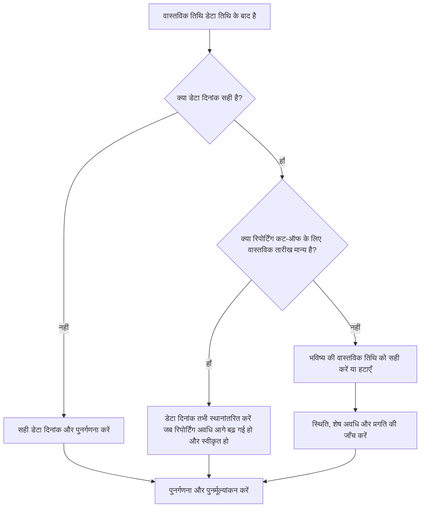

# वास्तविक तिथियाँ प्रिमावेरा पी6 में डेटा तिथि से बाद की हैं - सुधार मार्गदर्शिका

## उद्देश्य

यह मार्गदर्शिका शेड्यूलर्स को प्रिमावेरा पी6 डेटा तिथि के बाद की वास्तविक तिथियों के साथ गतिविधियों की समीक्षा करने और सही करने में मदद करती है। यह अद्यतन सीमा पर या उससे पहले वास्तविक प्रदर्शन को ध्यान में रखते हुए स्वच्छ अद्यतन अनुशासन का समर्थन करता है।

## आपके शुरू करने से पहले

कार्रवाई करने से पहले निम्नलिखित जानकारी इकट्ठा करें:

- इस मीट्रिक के लिए वर्तमान मूल्यांकन परिणाम।
- नवीनतम शेड्यूल अपडेट में उपयोग की गई प्रोजेक्ट डेटा तिथि।
- डेटा तिथि से अधिक वास्तविक तिथियों वाली गतिविधियों की सूची।
- वास्तविक प्रारंभ, वास्तविक समाप्ति, गतिविधि स्थिति, शेष अवधि और प्रतिशत पूर्ण फ़ील्ड।
- प्रगति अद्यतन का स्रोत, जैसे फ़ील्ड रिपोर्ट, आयात फ़ाइल, टाइमशीट, या मैन्युअल अपडेट।
- परियोजना अद्यतन कट-ऑफ नियम और रिपोर्टिंग अवधि।
- कोई भी ज्ञात भविष्य-दिनांकित कार्य प्रविष्टियाँ या डेटा आयात समस्याएँ।

## अपने परिणाम को समझें

एक मजबूत परिणाम डेटा तिथि के बाद की वास्तविक तिथियों के साथ शून्य गतिविधियाँ हैं।

एक स्वीकार्य परिणाम अभी भी शून्य होना चाहिए. डेटा तिथि के बाद की वास्तविक तिथियां आम तौर पर एक अद्यतन त्रुटि या गलत डेटा तिथि दर्शाती हैं।

कमजोर परिणाम का मतलब है कि शेड्यूल में भविष्य के वास्तविक आंकड़े शामिल हैं। यह शेड्यूल रिपोर्ट को अपडेट अवधि के वास्तव में उस तिथि तक पहुंचने से पहले पूरा या शुरू किया हुआ मान सकता है।

## सुधार लक्ष्य

लक्ष्य 0 अनसुलझे गतिविधियाँ हैं जिनकी वास्तविक तिथियाँ डेटा तिथि से अधिक हैं।

लक्ष्य यह पुष्टि करना है कि क्या वास्तविक तिथि गलत है, डेटा तिथि गलत है, या अद्यतन आयात प्रक्रिया भविष्य के वास्तविक आंकड़ों की अनुमति दे रही है।

## कार्य योजना

### चरण 1: मुख्य मुद्दे की पहचान करें

एक P6 लेआउट या रिपोर्ट बनाएं जो वास्तविक प्रारंभ, वास्तविक समाप्ति, या डेटा तिथि से अधिक अन्य वास्तविक तिथियों वाली गतिविधियों के लिए फ़िल्टर करता है। गतिविधि आईडी, गतिविधि का नाम, डब्ल्यूबीएस, गतिविधि की स्थिति, वास्तविक प्रारंभ, वास्तविक समाप्ति, प्रारंभ, समाप्ति, शेष अवधि, पूर्ण प्रतिशत, कैलेंडर और डेटा दिनांक संदर्भ शामिल करें।

प्रत्येक गतिविधि की समीक्षा करें और पूछें:

- क्या प्रोजेक्ट डेटा दिनांक सही है?
- क्या वास्तविक तारीख सही है?
- क्या अद्यतन में कट-ऑफ तिथि से आगे की प्रगति शामिल थी?
- क्या आयात फ़ाइल में भविष्य की वास्तविक तिथियाँ लोड हुईं?
- क्या वास्तविक तिथि बदलनी चाहिए, या डेटा तिथि स्थानांतरित की जानी चाहिए?
- क्या गतिविधि की स्थिति सही की गई वास्तविक तिथि से मेल खाती है?

### चरण 2: अनुशंसित सुधार लागू करें

यदि डेटा दिनांक गलत है, तो अनुमोदित रिपोर्टिंग अवधि के अनुसार इसे ठीक करें और शेड्यूल की पुनर्गणना करें।

यदि वास्तविक तिथि गलत है, तो वास्तविक प्रारंभ या वास्तविक समाप्ति को उचित तिथि पर सही करें। यदि कार्य वास्तव में डेटा तिथि तक शुरू या समाप्त नहीं हुआ है, तो भविष्य की वास्तविक और अद्यतन स्थिति, शेष अवधि और प्रतिशत पूर्ण को सही ढंग से हटा दें।

यदि समस्या आयात से आई है, तो आयात फ़ाइल और मैपिंग की समीक्षा करें। पुष्टि करें कि शेड्यूल रिपोर्ट जारी होने से पहले भविष्य की वास्तविक तिथियों को ब्लॉक कर दिया गया है या जाँच लिया गया है।

### चरण 3: सामान्य अवरोधक हटाएँ

सामान्य अवरोधकों में रिपोर्टिंग कट-ऑफ से परे की तारीखों को कवर करने वाली प्रगति फ़ाइलें, डेटा तिथि की जांच किए बिना दर्ज किए गए मैन्युअल अपडेट और वास्तविक तिथियों और पूर्वानुमान तिथियों के बीच भ्रम शामिल हैं।

एक अन्य अवरोधक केवल भविष्य के वास्तविक आंकड़ों को स्वीकार करने के लिए डेटा तिथि को आगे बढ़ा रहा है। डेटा दिनांक को स्वीकृत अद्यतन सीमा का प्रतिनिधित्व करना चाहिए, स्थिति त्रुटि को छिपाने के लिए आकस्मिक रूप से नहीं बदला जाना चाहिए।

### चरण 4: परिवर्तनों को मान्य करें

सुधार के बाद शेड्यूल की पुनर्गणना करें। मीट्रिक को दोबारा चलाएँ और पुष्टि करें कि डेटा दिनांक के बाद कोई वास्तविक दिनांक नहीं बची है।

पूर्ण की गई गतिविधि सूचियों, प्रगतिरत गतिविधि सूचियों, अर्जित मूल्य आउटपुट की समीक्षा करें और यह पुष्टि करने के लिए तुलना रिपोर्ट शेड्यूल करें कि सुधार ने अन्य स्थिति विसंगतियां पैदा नहीं की हैं।

## सुधार अनुसूची

### दिन 1: समीक्षा करें और निदान करें

मीट्रिक चलाएँ, डेटा दिनांक की पुष्टि करें, और निष्कर्षों को ग़लत वास्तविक दिनांकों, ग़लत डेटा दिनांक, आयात समस्याएँ और अद्यतन कट-ऑफ़ समस्याओं में अलग करें।

### दिन 2-3: प्राथमिकता वाले कार्यों को लागू करें

सबसे पहले रिपोर्टिंग में उपयोग की जाने वाली सही गतिविधियाँ। वास्तविक तिथियाँ ठीक करें, स्थितियाँ अद्यतन करें और आयात समस्याओं का समाधान करें।

### दिन 4-5: प्रारंभिक परिणामों की निगरानी करें

शेड्यूल की पुनर्गणना करें और प्रगति रिपोर्ट, पूर्ण गतिविधि सूची, अर्जित मूल्य आउटपुट और मील के पत्थर की तारीखों की समीक्षा करें।

### दिन 6: अंतिम समायोजन

जिम्मेदार अनुशासन, फील्ड लीड, या प्रोजेक्ट नियंत्रण लीड के साथ शेष अनिश्चित वस्तुओं का समाधान करें।

### दिन 7: पुनर्मूल्यांकन करें और तुलना करें

मूल्यांकन फिर से चलाएँ और लक्ष्य सीमा के विरुद्ध परिणाम की तुलना करें।

## प्रगति पर नज़र रखना

सुधार और अनुमोदन प्रबंधित करने के लिए एक सरल ट्रैकर का उपयोग करें।

| तारीख | कार्रवाई की | अपेक्षित प्रभाव | परिणाम/अवलोकन | अगला कदम |
| --- | --- | --- | --- | --- |
| [तारीख] | डेटा तिथि के बाद वास्तविक तिथियों की समीक्षा की गई | भविष्य के वास्तविक को पहचानें | [देखा गया परिणाम] | मालिक को नियुक्त करें |
| [तारीख] | वास्तविक प्रारंभ या वास्तविक समाप्ति को ठीक किया गया | वैध स्थिति सीमा बहाल करें | [देखा गया परिणाम] | शेड्यूल की पुनर्गणना करें |
| [तारीख] | आयात प्रक्रिया की समीक्षा की | भविष्य में दोहराई जाने वाली वास्तविकताओं को रोकें | [देखा गया परिणाम] | मीट्रिक का पुनर्मूल्यांकन करें |

## यदि परिणाम में सुधार नहीं होता है

यदि परिणाम में सुधार नहीं होता है, तो जांचें कि क्या भविष्य के वास्तविक आंकड़े बार-बार आयात, टाइमशीट या मैन्युअल अपडेट वर्कफ़्लो के माध्यम से पेश किए जाते हैं। अद्यतन कट-ऑफ प्रक्रिया की समीक्षा करें और पुष्टि करें कि डेटा तिथि सभी योगदानकर्ताओं को स्पष्ट रूप से सूचित कर दी गई है।

जब अनसुलझे आइटम महत्वपूर्ण, निकट-महत्वपूर्ण, अर्जित मूल्य, ग्राहक रिपोर्टिंग, भुगतान, या हैंडओवर-संबंधी कार्य को प्रभावित करते हैं तो उन्हें बढ़ाएँ।

## रखरखाव

रिपोर्ट जारी करने से पहले प्रत्येक अद्यतन चक्र के दौरान इस मीट्रिक की समीक्षा करें। यह वास्तविक तिथियों, डेटा तिथि, शेष अवधि, पूर्ण प्रतिशत और गतिविधि स्थिति जांच के साथ मानक स्थिति सत्यापन का हिस्सा होना चाहिए।

## सारांश चेकलिस्ट

- [ ] वर्तमान परिणाम की समीक्षा की गई
- [ ] लक्ष्य सीमा की पुष्टि की गई
- [ ] डेटा दिनांक की पुष्टि की गई
- [ ] मुख्य मुद्दा पहचाना गया
- [ ] भविष्य की वास्तविक तिथियों को सही किया गया
- [ ] गतिविधि स्थिति की जाँच की गई
- [ ] शेष अवधि एवं प्रगति की जांच की गई
- [ ] आयात या अद्यतन वर्कफ़्लो की समीक्षा की गई
- [ ] शेड्यूल की पुनर्गणना की गई
- [ ] परिणामों की निगरानी की गई
- [ ] मूल्यांकन दोहराया गया
- [ ] अगले चरणों का दस्तावेजीकरण किया गया
## संबंधित सामग्री
- [वास्तविक तिथियाँ प्रिमावेरा पी6 में डेटा तिथि से बाद की हैं - अवलोकन](01_overview_template.md)
- [ब्लॉग टेम्पलेट](03_blog_template.md)
- [शेड्यूल क्या है](../../05_blogs_hi/01_WHAT%20A%20SCHEDULE%20IS/01_blog.md)
- [मजबूत तर्क](../../05_blogs_hi/02_ROBUST%20LOGIC/02_ROBUST%20LOGIC.md)
