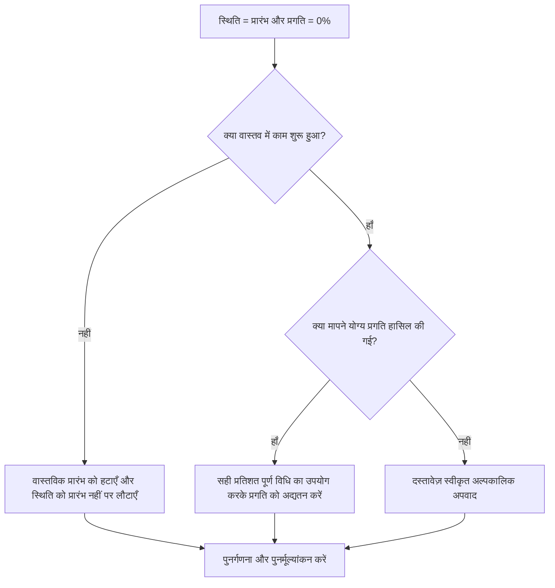

## उद्देश्य

यह मार्गदर्शिका शेड्यूलर्स को उन गतिविधियों की समीक्षा करने और सही करने में मदद करती है जहां गतिविधि स्थिति शुरू हो गई है लेकिन प्रगति 0% है। यह वास्तविक शुरुआत, गतिविधि स्थिति, पूर्ण प्रतिशत और शेष अवधि को संरेखित करके क्लीनर प्रिमावेरा पी6 अपडेट का समर्थन करता है।

## आपके शुरू करने से पहले

कार्रवाई करने से पहले निम्नलिखित जानकारी इकट्ठा करें:

- इस मीट्रिक के लिए वर्तमान मूल्यांकन परिणाम।
- गतिविधि स्थिति के साथ गतिविधियों की सूची = प्रारंभ और प्रगति = 0%।
- वास्तविक प्रारंभ, वास्तविक समाप्ति, शेष अवधि, मूल अवधि और गतिविधि स्थिति।
- प्रतिशत पूर्ण प्रकार और संबंधित प्रगति फ़ील्ड।
- भौतिक प्रतिशत पूर्ण, अवधि प्रतिशत पूर्ण, इकाइयाँ प्रतिशत पूर्ण, और गतिविधि प्रतिशत पूर्ण।
- डेटा दिनांक और नवीनतम अद्यतन नोट्स।
- क्या वास्तव में काम शुरू हुआ और क्या प्रगति हुई, इसकी फील्ड पुष्टि।

## अपने परिणाम को समझें

एक मजबूत परिणाम प्रारंभ स्थिति और 0% प्रगति के साथ शून्य गतिविधियाँ हैं।

एक स्वीकार्य परिणाम में दुर्लभ प्रलेखित मामले शामिल हो सकते हैं जहां एक गतिविधि अद्यतन अवधि के बिल्कुल अंत में शुरू की गई थी और अभी तक कोई मापने योग्य प्रगति अर्जित नहीं की गई थी। इन मामलों को सीमित और स्पष्ट रूप से समझाया जाना चाहिए।

कमजोर परिणाम का मतलब है कि शेड्यूल में ऐसी गतिविधियाँ शामिल हैं जिनकी आरंभ स्थिति और प्रगति मूल्य मेल नहीं खाते हैं। इससे भ्रामक प्रगति रिपोर्ट, अर्जित मूल्य संबंधी समस्याएं और भविष्य संबंधी भ्रम पैदा हो सकता है।

## सुधार लक्ष्य

लक्ष्य 0 अनसुलझे गतिविधियाँ हैं जिनमें गतिविधि स्थिति = प्रारंभ और प्रगति = 0% है।

लक्ष्य यह पुष्टि करना है कि क्या प्रत्येक गतिविधि वास्तव में शुरू हुई थी, क्या प्रगति छूट गई थी, या क्या गतिविधि को 'शुरू नहीं हुई' स्थिति में लौटाया जाना चाहिए।

## कार्य योजना

### चरण 1: मुख्य मुद्दे की पहचान करें

एक P6 लेआउट या रिपोर्ट बनाएं जो प्रारंभ स्थिति और 0% प्रगति वाली गतिविधियों के लिए फ़िल्टर करता है। गतिविधि आईडी, गतिविधि का नाम, डब्ल्यूबीएस, गतिविधि की स्थिति, वास्तविक प्रारंभ, वास्तविक समाप्ति, मूल अवधि, शेष अवधि, प्रतिशत पूर्ण प्रकार, भौतिक प्रतिशत पूर्ण, अवधि प्रतिशत पूर्ण, इकाइयां प्रतिशत पूर्ण, गतिविधि प्रतिशत पूर्ण, प्रारंभ, समाप्ति और कुल फ़्लोट शामिल करें।

प्रत्येक गतिविधि की समीक्षा करें और पूछें:

- क्या वास्तव में काम शुरू हुआ?
- यदि कार्य प्रारंभ हुआ तो कितनी मापनीय प्रगति हासिल हुई?
- क्या वास्तविक शुरुआत सही है?
- किस प्रतिशत पूर्ण प्रकार का उपयोग किया जा रहा है?
- क्या प्रगति सही क्षेत्र से गायब है?
- क्या वास्तविक कार्य शुरू हुए बिना ही गतिविधि प्रशासनिक तौर पर शुरू कर दी गई थी?

### चरण 2: अनुशंसित सुधार लागू करें

यदि कार्य वास्तव में प्रारंभ नहीं हुआ है, तो गलत वास्तविक प्रारंभ को हटा दें और गतिविधि को प्रारंभ नहीं हुआ पर लौटा दें। पुष्टि करें कि शेष अवधि और पूर्वानुमान तिथियां अभी भी मान्य हैं।

यदि कार्य प्रारंभ हो गया है और प्रगति प्राप्त हो गई है, तो प्रतिशत पूर्ण प्रकार के आधार पर सही प्रगति फ़ील्ड को अपडेट करें। भौतिक प्रतिशत पूर्ण के लिए, भौतिक प्रगति दर्ज करें। अवधि प्रतिशत पूर्ण के लिए, पुष्टि करें कि शेष अवधि प्रदर्शन किए गए कार्य को दर्शाती है। इकाइयों के प्रतिशत पूर्ण के लिए, पुष्टि करें कि इकाइयों की प्रगति अद्यतन की गई है।

यदि काम शुरू हो गया है लेकिन कोई मापने योग्य प्रगति अर्जित नहीं हुई है, तो कारण का दस्तावेजीकरण करें। यह दुर्लभ और अस्थायी होना चाहिए, जैसे कि अपडेट कट-ऑफ के पास मोबिलाइज़ेशन प्रारंभ दर्ज किया गया है, जिसमें अभी तक कोई प्रगति नहीं हुई है।

### चरण 3: सामान्य अवरोधक हटाएँ

सामान्य अवरोधकों में लापता फ़ील्ड मात्रा, प्रगति मूल्यों के बिना आयातित वास्तविक शुरुआत, प्रतिशत पूर्ण प्रकार पर भ्रम, और मापने योग्य प्रगति उपलब्ध होने से पहले काम को शुरू दिखाने का दबाव शामिल है।

एक अन्य अवरोधक वास्तविक प्रारंभ को स्थिति तथ्य के बजाय एक नियोजन संकेत के रूप में मान रहा है। वास्तविक शुरुआत को वास्तविक कार्य की शुरुआत का प्रतिनिधित्व करना चाहिए, न कि जल्द ही शुरू करने का इरादा।

### चरण 4: परिवर्तनों को मान्य करें

सुधार के बाद शेड्यूल की पुनर्गणना करें। मीट्रिक को दोबारा चलाएँ और पुष्टि करें कि प्रत्येक शेष आइटम को सही, उचित या अनुवर्ती कार्रवाई के लिए सौंपा गया है।

सुधार की पुष्टि करने के लिए प्रगति रिपोर्ट, अर्जित मूल्य आउटपुट, लुकहेड रिपोर्ट और प्रगति गतिविधि सूचियों की समीक्षा करें, जिससे नई विसंगतियां पैदा न हों।

## सुधार अनुसूची

### दिन 1: समीक्षा करें और निदान करें

मीट्रिक चलाएँ, डेटा दिनांक की पुष्टि करें, और निष्कर्षों को ग़लत प्रारंभ, अनुपलब्ध प्रगति, प्रतिशत पूर्ण विधि समस्याएँ और संभावित अपवादों में अलग करें।

### दिन 2-3: प्राथमिकता वाले कार्यों को लागू करें

सबसे पहले रिपोर्टिंग में उपयोग की जाने वाली सही गतिविधियाँ। ग़लत वास्तविक प्रारंभ हटाएँ, प्रगति मान अद्यतन करें, या मान्य अपवाद दस्तावेज़ित करें।

### दिन 4-5: प्रारंभिक परिणामों की निगरानी करें

शेड्यूल की पुनर्गणना करें और प्रगति रिपोर्ट, अर्जित मूल्य आउटपुट, प्रगतिरत गतिविधि सूचियां और लुकहेड रिपोर्ट की समीक्षा करें।

### दिन 6: अंतिम समायोजन

जिम्मेदार अनुशासन, फील्ड लीड, या प्रोजेक्ट नियंत्रण लीड के साथ शेष अनिश्चित वस्तुओं का समाधान करें।

### दिन 7: पुनर्मूल्यांकन करें और तुलना करें

मूल्यांकन फिर से चलाएँ और लक्ष्य सीमा के विरुद्ध परिणाम की तुलना करें।

## प्रगति पर नज़र रखना

सुधार और अनुमोदन प्रबंधित करने के लिए एक सरल ट्रैकर का उपयोग करें।

| तारीख | कार्रवाई की | अपेक्षित प्रभाव | परिणाम/अवलोकन | अगला कदम |
| --- | --- | --- | --- | --- |
| [तारीख] | 0% प्रगति के साथ शुरू की गई गतिविधियों की समीक्षा की गई | स्थिति असंगति को पहचानें | [देखा गया परिणाम] | मालिक को नियुक्त करें |
| [तारीख] | ग़लत वास्तविक प्रारंभ हटा दिया गया | सटीक स्थिति पुनर्स्थापित करें | [देखा गया परिणाम] | शेड्यूल की पुनर्गणना करें |
| [तारीख] | अद्यतन प्रगति मान | प्रारंभ स्थिति को प्रगति के साथ संरेखित करें | [देखा गया परिणाम] | मीट्रिक का पुनर्मूल्यांकन करें |

## यदि परिणाम में सुधार नहीं होता है

यदि परिणाम में सुधार नहीं होता है, तो जांचें कि क्या प्रगति मूल्यों के मिलान के बिना वास्तविक शुरुआत आयात की गई है या क्या टीमें शुरू की गणना के लिए अलग-अलग नियमों का उपयोग कर रही हैं। अद्यतन कट-ऑफ प्रक्रिया और प्रतिशत पूर्ण विधि की समीक्षा करें।

जब अनसुलझे आइटम महत्वपूर्ण, निकट-महत्वपूर्ण, अर्जित मूल्य, ग्राहक रिपोर्टिंग, भुगतान, या हैंडओवर-संबंधी कार्य को प्रभावित करते हैं तो उन्हें बढ़ाएँ।

## रखरखाव

रिपोर्ट जारी करने से पहले प्रत्येक अद्यतन चक्र के दौरान इस मीट्रिक की समीक्षा करें। यह वास्तविक तिथियों, शेष अवधि, पूर्ण प्रतिशत और गतिविधि स्थिति जांच के साथ मानक अद्यतन सत्यापन का हिस्सा होना चाहिए।

## सारांश चेकलिस्ट

- [ ] वर्तमान परिणाम की समीक्षा की गई
- [ ] लक्ष्य सीमा की पुष्टि की गई
- [ ] डेटा दिनांक की पुष्टि की गई
- [ ] मुख्य मुद्दा पहचाना गया
- [ ] ग़लत वास्तविक प्रारंभ हटा दिया गया
- [ ] अनुपलब्ध प्रगति अद्यतन की गई
- [ ] प्रतिशत पूर्ण प्रकार की समीक्षा की गई
- [ ] वैध अपवादों का दस्तावेजीकरण किया गया
- [ ] शेड्यूल की पुनर्गणना की गई
- [ ] परिणामों की निगरानी की गई
- [ ] मूल्यांकन दोहराया गया
- [ ] अगले चरणों का दस्तावेजीकरण किया गया
## संबंधित सामग्री
- [ब्लॉग टेम्पलेट](03_blog_template.md)
- [शेड्यूल क्या है](../../05_blogs_hi/01_WHAT%20A%20SCHEDULE%20IS/01_blog.md)
- [मजबूत तर्क](../../05_blogs_hi/02_ROBUST%20LOGIC/02_ROBUST%20LOGIC.md)
