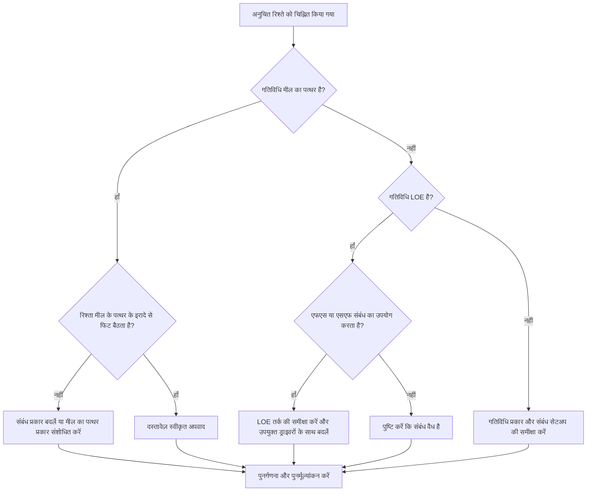

# प्रिमावेरा पी6 में अनुचित संबंध - सुधार मार्गदर्शिका

## उद्देश्य

यह मार्गदर्शिका शेड्यूलर्स को प्रिमावेरा पी6 में फिनिश माइलस्टोन्स, स्टार्ट माइलस्टोन्स और लेवल ऑफ एफर्ट (एलओई) गतिविधियों से जुड़े अनुचित संबंधों की समीक्षा करने और उन्हें ठीक करने में मदद करती है।

## आपके शुरू करने से पहले

कार्रवाई करने से पहले निम्नलिखित जानकारी इकट्ठा करें:

- इस मीट्रिक के लिए वर्तमान मूल्यांकन परिणाम।
- पूर्ववर्ती, उत्तराधिकारी, गतिविधि प्रकार और संबंध प्रकार के आधार पर चिह्नित संबंधों की सूची।
- गतिविधि आईडी, गतिविधि का नाम, डब्लूबीएस, गतिविधि प्रकार, प्रारंभ, समाप्ति, कुल फ़्लोट, और महत्वपूर्ण या सबसे लंबे पथ की स्थिति।
- संबंध प्रकार, अंतराल, पूर्ववर्ती गतिविधि प्रकार और उत्तराधिकारी गतिविधि प्रकार।
- मील का पत्थर उद्देश्य, एलओई उद्देश्य, और संबंधित रिपोर्टिंग आवश्यकता।
- डेटा दिनांक और नवीनतम शेड्यूल गणना आउटपुट।

## अपने परिणाम को समझें

एक मजबूत परिणाम शून्य अनसुलझे अनुचित रिश्ते हैं।

मीट्रिक को इन मामलों को चिह्नित करना चाहिए:

- एसएस या एसएफ उत्तराधिकारी के साथ मील का पत्थर समाप्त करें।
- एसएस पूर्ववर्ती के साथ मील का पत्थर समाप्त करें।
- मील का पत्थर एफएफ या एसएफ पूर्ववर्ती के साथ शुरू करें।
- एफएस या एफएफ उत्तराधिकारी के साथ माइलस्टोन शुरू करें।
- एफएस संबंध के साथ एलओई।
- एसएफ संबंध के साथ एलओई।

दुर्लभ अपवाद मौजूद हो सकते हैं, लेकिन उन्हें दस्तावेज़ीकृत किया जाना चाहिए और शेड्यूल समीक्षा के दौरान समझाना आसान होना चाहिए।

## सुधार लक्ष्य

लक्ष्य 0 अनसुलझे अनुचित रिश्ते हैं।

लक्ष्य प्रत्येक मील के पत्थर और एलओई संबंध को तारीखों को मजबूर किए बिना या कमजोर तर्क को छिपाए बिना इच्छित शेड्यूलिंग व्यवहार से मेल खाना है।

## कार्य योजना

### चरण 1: मुख्य मुद्दे की पहचान करें

एक P6 लेआउट या रिपोर्ट बनाएं जो पूर्ववर्ती और उत्तराधिकारी विवरण के साथ सभी मील के पत्थर और LOE गतिविधियों को दिखाता है। गतिविधि प्रकार, संबंध प्रकार, अंतराल, प्रारंभ, समाप्ति, कुल फ़्लोट और महत्वपूर्ण या सबसे लंबे पथ संकेतक शामिल करें।

प्रत्येक चिह्नित रिश्ते की समीक्षा करें और पूछें:

- क्या गतिविधि प्रकार सही है?
- क्या संबंध का प्रकार मील के पत्थर या एलओई के उद्देश्य से मेल खाता है?
- क्या संबंध आरंभ, समाप्ति, या रिपोर्टिंग तिथि को बाध्य करने का प्रयास कर रहा है?
- क्या सामान्य एफएस, एसएस, या एफएफ संबंध तर्क का बेहतर प्रतिनिधित्व करेगा?
- क्या रिश्ता एक स्वीकृत अपवाद है?

### चरण 2: अनुशंसित सुधार लागू करें

समापन मील के पत्थर के लिए, पुष्टि करें कि तर्क चला रहा है या पूरा होने पर प्रतिक्रिया दे रहा है। एसएस या एसएफ रिश्तों को तब बदलें जब वे वास्तविक फिनिश-आधारित निर्भरता का प्रतिनिधित्व नहीं करते हैं।

स्टार्ट माइलस्टोन के लिए, पुष्टि करें कि तर्क स्टार्ट इवेंट का समर्थन करता है। एफएफ, एसएफ, एफएस उत्तराधिकारी, या अन्य अनुपयुक्त संबंधों को तब बदलें जब उनका उपयोग रिपोर्टिंग तिथि को बाध्य करने के लिए किया जा रहा हो।

एलओई गतिविधियों के लिए, समीक्षा करें कि क्या एफएस या एसएफ रिश्ते गलत तरीके से एलओई ड्राइव को अलग काम कर रहे हैं। एलओई गतिविधियाँ आम तौर पर अन्य कार्यों का सारांश या विस्तार करती हैं, इसलिए उनके रिश्तों को सावधानी से संभाला जाना चाहिए।

यदि संबंध अनुबंध, ग्राहक विधि, या विशेष शेड्यूल डिज़ाइन द्वारा मान्य है, तो कारण और अनुमोदन का दस्तावेजीकरण करें।

### चरण 3: सामान्य अवरोधक हटाएँ

सामान्य अवरोधकों में पुराने शेड्यूल से कॉपी किए गए तर्क, मील के पत्थर के व्यवहार को गलत समझना, शॉर्टकट के रूप में एसएफ रिश्तों का उपयोग करना और काम को नियंत्रित करने के लिए एलओई गतिविधियों का उपयोग करना शामिल है जो अलग-अलग गतिविधियों द्वारा संचालित होना चाहिए।

एक अन्य अवरोधक संबंध सफ़ाई को कॉस्मेटिक मान रहा है। ये लिंक फ़्लोट, महत्वपूर्ण पथ रिपोर्टिंग, मील के पत्थर की तारीखें और शेड्यूल विश्वसनीयता को प्रभावित कर सकते हैं।

### चरण 4: परिवर्तनों को मान्य करें

सुधार के बाद शेड्यूल की पुनर्गणना करें। मीट्रिक को दोबारा चलाएँ और पुष्टि करें कि प्रत्येक शेष आइटम को सही, उचित या अनुवर्ती कार्रवाई के लिए सौंपा गया है।

सुधार की पुष्टि करने के लिए मील के पत्थर की तारीखों, एलओई की तारीखों, कुल फ्लोट, महत्वपूर्ण या सबसे लंबे पथ और प्रमुख रिपोर्टिंग आउटपुट की समीक्षा करें, जिससे नए मुद्दे पैदा नहीं हुए।

## सुधार अनुसूची

### दिन 1: समीक्षा करें और निदान करें

गतिविधि प्रकार और संबंध पैटर्न के आधार पर मीट्रिक और समूह निष्कर्ष चलाएँ।

### दिन 2-3: प्राथमिकता वाले कार्यों को लागू करें

पहले महत्वपूर्ण, निकट-महत्वपूर्ण, संविदात्मक, हैंडओवर और ग्राहक-सामना वाले मील के पत्थर पर संबंधों को सही करें।

### दिन 4-5: प्रारंभिक परिणामों की निगरानी करें

शेड्यूल की पुनर्गणना करें और फ़्लोट, क्रिटिकल पाथ, माइलस्टोन मूवमेंट और LOE व्यवहार की समीक्षा करें।

### दिन 6: अंतिम समायोजन

शेष अपवादों को शेड्यूलर, प्रोजेक्ट नियंत्रण लीड, या पीएमओ समीक्षक के साथ हल करें।

### दिन 7: पुनर्मूल्यांकन करें और तुलना करें

मूल्यांकन फिर से चलाएँ और लक्ष्य सीमा के विरुद्ध परिणाम की तुलना करें।

## प्रगति पर नज़र रखना

सुधार और अनुमोदन प्रबंधित करने के लिए एक सरल ट्रैकर का उपयोग करें।

| तारीख | कार्रवाई की | अपेक्षित प्रभाव | परिणाम/अवलोकन | अगला कदम |
| --- | --- | --- | --- | --- |
| [तारीख] | अनुचित रिश्तों की समीक्षा की | संबंध-प्रकार के मुद्दों को पहचानें | [देखा गया परिणाम] | मालिक को नियुक्त करें |
| [तारीख] | मील का पत्थर संबंध ठीक किया गया | तर्क को मील के पत्थर के उद्देश्य के साथ संरेखित करें | [देखा गया परिणाम] | शेड्यूल की पुनर्गणना करें |
| [तारीख] | LOE रिश्तों की समीक्षा की | LOE को असतत कार्य को गलत तरीके से चलाने से रोकें | [देखा गया परिणाम] | मीट्रिक का पुनर्मूल्यांकन करें |

## यदि परिणाम में सुधार नहीं होता है

यदि परिणाम में सुधार नहीं होता है, तो जांचें कि क्या वही रिश्ते आयात, कॉपी किए गए तर्क, वैश्विक परिवर्तन या बाहरी शेड्यूल एकीकरण के माध्यम से पुन: पेश किए जा रहे हैं।

जब अनसुलझे आइटम संविदात्मक मील के पत्थर, महत्वपूर्ण पथ रिपोर्टिंग, क्लाइंट सबमिशन, भुगतान ईवेंट या हैंडओवर तिथियों को प्रभावित करते हैं तो उन्हें बढ़ाएँ।

## रखरखाव

प्रत्येक अद्यतन चक्र के दौरान और आधारभूत अनुमोदन से पहले इस मीट्रिक की समीक्षा करें। यह शेड्यूल आयात, कॉपी किए गए फ़्रैगनेट, प्रमुख पुनर्अनुक्रमण और मील के पत्थर संशोधनों के बाद विशेष रूप से उपयोगी है।

## सारांश चेकलिस्ट

- [ ] वर्तमान परिणाम की समीक्षा की गई
- [ ] लक्ष्य सीमा की पुष्टि की गई
- [ ] माइलस्टोन और एलओई गतिविधि प्रकारों की समीक्षा की गई
- [ ] फ़्लैग किए गए संबंध प्रकारों की जाँच की गई
- [ ] ग़लत रिश्तों को सुधारा गया
- [ ] वैध अपवादों का दस्तावेजीकरण किया गया
- [ ] शेड्यूल की पुनर्गणना की गई
- [ ] फ़्लोट और क्रिटिकल पथ की समीक्षा की गई
- [ ] परिणामों की निगरानी की गई
- [ ] मूल्यांकन दोहराया गया
- [ ] अगले चरणों का दस्तावेजीकरण किया गया
## संबंधित सामग्री
- [01_overview_template](../14_unusual_relations/01_overview_template.md)
- [03_blog_template](../14_unusual_relations/03_blog_template.md)
- [शेड्यूल क्या है](../../05_blogs_hi/01_WHAT%20A%20SCHEDULE%20IS/01_blog.md)
- [मजबूत तर्क](../../05_blogs_hi/02_ROBUST%20LOGIC/02_ROBUST%20LOGIC.md)
