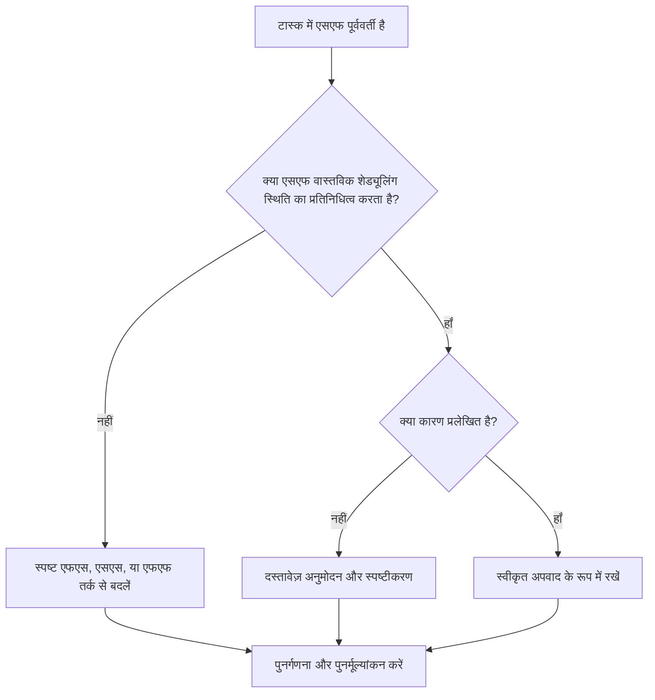

# प्रिमावेरा पी6 में एसएफ पूर्ववर्तियों के साथ कार्य गतिविधियाँ - सुधार मार्गदर्शिका

## उद्देश्य

यह मार्गदर्शिका शेड्यूलर्स को प्राइमेरा पी6 में स्टार्ट-टू-फिनिश (एसएफ) पूर्ववर्ती संबंधों वाली कार्य गतिविधियों की समीक्षा करने और सही करने में मदद करती है।

## आपके शुरू करने से पहले

कार्रवाई करने से पहले निम्नलिखित जानकारी इकट्ठा करें:

- इस मीट्रिक के लिए वर्तमान मूल्यांकन परिणाम।
- कम से कम एक एसएफ पूर्ववर्ती के साथ कार्य गतिविधियों की सूची।
- गतिविधि आईडी, गतिविधि का नाम, डब्लूबीएस, गतिविधि प्रकार, प्रारंभ, समाप्ति, कुल फ़्लोट, और महत्वपूर्ण या सबसे लंबे पथ की स्थिति।
- पूर्ववर्ती गतिविधि आईडी, पूर्ववर्ती गतिविधि प्रकार, संबंध प्रकार और अंतराल।
- कोई बाधाएं, कैलेंडर, अपेक्षित समाप्ति स्थितियां और संबंधित अद्यतन नोट्स।
- डेटा दिनांक और नवीनतम शेड्यूल गणना आउटपुट।

## अपने परिणाम को समझें

एक मजबूत परिणाम एसएफ पूर्ववर्ती संबंधों के साथ शून्य अनसुलझे कार्य गतिविधियाँ हैं।

एसएफ संबंध का मतलब है कि पूर्ववर्ती गतिविधि शुरू होने तक उत्तराधिकारी गतिविधि समाप्त नहीं हो सकती। सामान्य निर्माण, इंजीनियरिंग, खरीद, या कमीशनिंग तर्क में यह असामान्य है। अधिकांश कार्य संबंधों को एफएस, एसएस, या एफएफ तर्क के साथ दर्शाया जाना चाहिए जब वे वास्तविक अनुक्रमण को प्रतिबिंबित करते हैं।

कमजोर परिणाम का मतलब है कि कार्य गतिविधि का समापन तर्क द्वारा नियंत्रित किया जा सकता है जिसे उचित ठहराना कठिन है या जिसे समीक्षा के बिना शेड्यूल के किसी अन्य भाग से कॉपी किया गया था।

## सुधार लक्ष्य

लक्ष्य कार्य गतिविधियों पर 0 अनसुलझे एसएफ पूर्ववर्ती संबंध हैं।

लक्ष्य यह पुष्टि करना है कि क्या प्रत्येक एसएफ संबंध एक वैध शेड्यूलिंग मॉडल है या इसे स्पष्ट तर्क के साथ प्रतिस्थापित किया जाना चाहिए।

## कार्य योजना

### चरण 1: मुख्य मुद्दे की पहचान करें

एक P6 लेआउट या रिपोर्ट बनाएं जो SF पूर्ववर्ती के साथ कार्य गतिविधियों को फ़िल्टर करता है। पूर्ववर्ती और उत्तराधिकारी आईडी, गतिविधि प्रकार, संबंध प्रकार, अंतराल, प्रारंभ, समाप्ति, कुल फ़्लोट, बाधाएं, और महत्वपूर्ण या सबसे लंबे पथ संकेतक शामिल करें।

प्रत्येक रिश्ते की समीक्षा करें और पूछें:

- एसएफ संबंध किस वास्तविक स्थिति का प्रतिनिधित्व करने का प्रयास कर रहा है?
- क्या पूर्ववर्ती प्रारंभ को वास्तव में उत्तराधिकारी समापन को नियंत्रित करना चाहिए?
- क्या एफएस, एसएस, या एफएफ तर्क अनुक्रम का अधिक स्पष्ट रूप से वर्णन करेगा?
- क्या डेट पर जाने के लिए बाध्य करने के लिए लैग का उपयोग किया जा रहा है?
- क्या रिश्ता महत्वपूर्ण या निकट-महत्वपूर्ण पथ पर है?
- क्या एसएफ का उपयोग करने का कोई दस्तावेजी कारण है?

### चरण 2: अनुशंसित सुधार लागू करें

यदि एसएफ संबंध वास्तविक स्थिति का प्रतिनिधित्व नहीं करता है, तो इसे उस संबंध प्रकार से बदलें जो अनुक्रम का सबसे अच्छा वर्णन करता है। एफएस का उपयोग तब करें जब उत्तराधिकारी को पूर्ववर्ती पूर्णता के बाद शुरू करना चाहिए, एसएस जब प्रारंभ जुड़ा हुआ हो, और एफएफ का उपयोग करें जब अंतिम संरेखण इच्छित तर्क हो।

यदि एसएफ संबंध समाप्ति तिथि को नियंत्रित करने के लिए जोड़ा गया था, तो समीक्षा करें कि क्या शेड्यूल को इसके बजाय उचित पूर्ववर्ती, मील का पत्थर, बाधा समीक्षा या गतिविधि विभाजन की आवश्यकता है।

यदि एसएफ संबंध वैध है, तो दस्तावेज करें कि इसकी आवश्यकता क्यों है और इसे किसने मंजूरी दी है। यह एक दुर्लभ अपवाद होना चाहिए, सामान्य शेड्यूलिंग पैटर्न नहीं।

### चरण 3: सामान्य अवरोधक हटाएँ

सामान्य अवरोधकों में कॉपी किए गए रिश्ते, आयातित बाहरी तर्क, एसएफ व्यवहार की गलतफहमी, और समाप्ति तिथि को मजबूर करने के लिए अंतराल के साथ एसएफ का उपयोग करना शामिल है।

एक अन्य अवरोधक रिश्ता छोड़ रहा है क्योंकि गणना की गई तारीख स्वीकार्य लगती है। रिश्ते को अभी भी तार्किक रूप से रक्षात्मक होने की जरूरत है।

### चरण 4: परिवर्तनों को मान्य करें

सुधार के बाद शेड्यूल की पुनर्गणना करें। मीट्रिक को दोबारा चलाएँ और पुष्टि करें कि प्रत्येक शेष एसएफ पूर्ववर्ती को सही किया गया है, उचित ठहराया गया है, या अनुवर्ती कार्रवाई के लिए सौंपा गया है।

तर्क परिवर्तन की पुष्टि करने के लिए कुल फ्लोट, महत्वपूर्ण या सबसे लंबे पथ, प्रभावित मील के पत्थर और लुकहेड आउटपुट की समीक्षा करें, जिससे नए मुद्दे पैदा नहीं हुए।

## सुधार अनुसूची

### दिन 1: समीक्षा करें और निदान करें

मीट्रिक चलाएँ, डेटा दिनांक की पुष्टि करें, और अमान्य एसएफ संबंधों, संभावित अपवादों और स्वामी इनपुट की आवश्यकता वाले आइटमों में निष्कर्षों को अलग करें।

### दिन 2-3: प्राथमिकता वाले कार्यों को लागू करें

पहले महत्वपूर्ण, निकट-महत्वपूर्ण, संविदात्मक और निकट-अवधि की गतिविधियों पर एसएफ संबंधों को ठीक करें।

### दिन 4-5: प्रारंभिक परिणामों की निगरानी करें

शेड्यूल की पुनर्गणना करें और फ़्लोट, महत्वपूर्ण पथ, अग्रिम तिथियों और मील के पत्थर की गतिविधि की समीक्षा करें।

### दिन 6: अंतिम समायोजन

शेष अपवादों को शेड्यूलर, अनुशासन लीड, प्रोजेक्ट नियंत्रण लीड या पीएमओ समीक्षक के साथ हल करें।

### दिन 7: पुनर्मूल्यांकन करें और तुलना करें

मूल्यांकन फिर से चलाएँ और लक्ष्य सीमा के विरुद्ध परिणाम की तुलना करें।

## प्रगति पर नज़र रखना

सुधार और अनुमोदन प्रबंधित करने के लिए एक सरल ट्रैकर का उपयोग करें।

| तारीख | कार्रवाई की | अपेक्षित प्रभाव | परिणाम/अवलोकन | अगला कदम |
| --- | --- | --- | --- | --- |
| [तारीख] | एसएफ पूर्ववर्तियों के साथ कार्य गतिविधियों की समीक्षा की | असामान्य संबंध तर्क को पहचानें | [देखा गया परिणाम] | मालिक को नियुक्त करें |
| [तारीख] | अमान्य SF संबंध बदला गया | तर्क स्पष्टता में सुधार करें | [देखा गया परिणाम] | शेड्यूल की पुनर्गणना करें |
| [तारीख] | दस्तावेज़ीकृत वैध एसएफ अपवाद | अनुमोदित विशेष तर्क को सुरक्षित रखें | [देखा गया परिणाम] | मीट्रिक का पुनर्मूल्यांकन करें |

## यदि परिणाम में सुधार नहीं होता है

यदि परिणाम में सुधार नहीं होता है, तो जांचें कि क्या एसएफ संबंधों को आयात, कॉपी किए गए फ्रैग्नेट्स, वैश्विक परिवर्तन या बाहरी शेड्यूल एकीकरण के माध्यम से पुन: पेश किया जा रहा है।

जब अनसुलझे आइटम महत्वपूर्ण पथ, संविदात्मक मील के पत्थर, ग्राहक सबमिशन, भुगतान घटनाओं, या निकट-अवधि निष्पादन कार्य को प्रभावित करते हैं तो बढ़ें।

## रखरखाव

प्रत्येक अद्यतन चक्र के दौरान और आधारभूत अनुमोदन से पहले इस मीट्रिक की समीक्षा करें। यह शेड्यूल आयात, प्रमुख पुनर्अनुक्रमण और तर्क सफाई अभ्यास के बाद विशेष रूप से उपयोगी है।

## सारांश चेकलिस्ट

- [ ] वर्तमान परिणाम की समीक्षा की गई
- [ ] लक्ष्य सीमा की पुष्टि की गई
- [ ] एसएफ पूर्ववर्ती सूची तैयार की गई
- [ ] महत्वपूर्ण और निकट-महत्वपूर्ण वस्तुओं को प्राथमिकता दी गई
- [ ] अमान्य SF संबंधों को ठीक किया गया
- [ ] वैध अपवादों का दस्तावेजीकरण किया गया
- [ ] शेड्यूल की पुनर्गणना की गई
- [ ] फ़्लोट और क्रिटिकल पथ की समीक्षा की गई
- [ ] परिणामों की निगरानी की गई
- [ ] मूल्यांकन दोहराया गया
- [ ] अगले चरणों का दस्तावेजीकरण किया गया
## संबंधित सामग्री
- [प्रिमावेरा पी6 में एसएफ पूर्ववर्तियों के साथ कार्य गतिविधियाँ - अवलोकन](01_overview_template.md)
- [प्रिमावेरा पी6 में एसएफ पूर्ववर्तियों के साथ कार्य गतिविधियाँ](03_blog_template.md)
- [शेड्यूल क्या है](../../05_blogs_hi/01_WHAT%20A%20SCHEDULE%20IS/01_blog.md)
- [मजबूत तर्क](../../05_blogs_hi/02_ROBUST%20LOGIC/02_ROBUST%20LOGIC.md)
