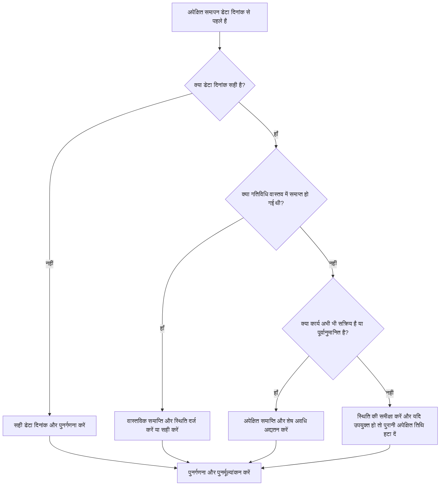

## उद्देश्य

यह मार्गदर्शिका शेड्यूलर्स को उन गतिविधियों की समीक्षा करने और सही करने में मदद करती है जिनकी अपेक्षित समाप्ति तिथि प्रिमावेरा पी6 डेटा तिथि से पहले है। यह अपेक्षित तिथियों को वर्तमान रिपोर्टिंग सीमा के साथ संरेखित करके स्वच्छ अद्यतन अनुशासन का समर्थन करता है।

## आपके शुरू करने से पहले

कार्रवाई करने से पहले निम्नलिखित जानकारी इकट्ठा करें:

- इस मीट्रिक के लिए वर्तमान मूल्यांकन परिणाम।
- नवीनतम शेड्यूल अपडेट में उपयोग की गई प्रोजेक्ट डेटा तिथि।
- उन गतिविधियों की सूची जहां अपेक्षित समापन डेटा तिथि से पहले है।
- गतिविधि की स्थिति, वास्तविक शुरुआत, वास्तविक समाप्ति, शेष अवधि, प्रतिशत पूर्ण, प्रारंभ, समाप्ति और कुल फ़्लोट।
- अपेक्षित समाप्ति स्रोत, जैसे मैन्युअल प्रविष्टि, आयात फ़ाइल, फ़ील्ड पूर्वानुमान, या P6 अद्यतन वर्कफ़्लो।
- प्रोजेक्ट अपडेट कट-ऑफ नियम और नवीनतम प्रगति नोट्स।

## अपने परिणाम को समझें

डेटा दिनांक से पहले अपेक्षित समाप्ति के साथ शून्य गतिविधियाँ एक मजबूत परिणाम है।

डेटा तिथि से पहले अपेक्षित समापन का आमतौर पर मतलब होता है कि शेड्यूल आगे बढ़ने पर पूर्वानुमान या अपेक्षित पूर्णता जानकारी अपडेट नहीं की गई थी। यह यह भी संकेत दे सकता है कि गतिविधि का वास्तविक समापन, एक संशोधित शेष अवधि, या एक सही स्थिति होनी चाहिए।

कमजोर परिणाम का मतलब है कि शेड्यूल में अपेक्षित समापन तिथियां शामिल हैं जो वर्तमान अद्यतन सीमा के सापेक्ष अतीत में हैं।

## सुधार लक्ष्य

लक्ष्य डेटा तिथि से पहले अपेक्षित समाप्ति के साथ 0 अनसुलझे गतिविधियाँ हैं।

लक्ष्य यह पुष्टि करना है कि क्या प्रत्येक गतिविधि पूरी हो गई है, अभी भी प्रगति पर है, शुरू नहीं हुई है, या गलत तरीके से अपडेट की गई है।

## कार्य योजना

### चरण 1: मुख्य मुद्दे की पहचान करें

एक P6 लेआउट या रिपोर्ट बनाएं जो उन गतिविधियों के लिए फ़िल्टर करता है जहां अपेक्षित समाप्ति डेटा तिथि से पहले है। गतिविधि आईडी, गतिविधि का नाम, डब्ल्यूबीएस, गतिविधि की स्थिति, अपेक्षित समाप्ति, वास्तविक प्रारंभ, वास्तविक समाप्ति, शेष अवधि, प्रतिशत पूर्ण, प्रारंभ, समाप्ति, कुल फ़्लोट और कैलेंडर शामिल करें।

प्रत्येक गतिविधि की समीक्षा करें और पूछें:

- क्या डेटा दिनांक सही है?
- क्या गतिविधि वास्तव में डेटा तिथि से पहले समाप्त हो गई थी?
- यदि यह समाप्त हो गया, तो क्या वास्तविक समाप्ति गायब है?
- यदि यह समाप्त नहीं हुआ, तो क्या अपेक्षित समाप्ति को अद्यतन किया जाना चाहिए?
- क्या शेष अवधि अभी भी बचे हुए कार्य को दर्शाती है?
- क्या आयात या मैन्युअल अपडेट ने पुराने अपेक्षित समाप्ति मान को पीछे छोड़ दिया?

### चरण 2: अनुशंसित सुधार लागू करें

यदि डेटा दिनांक गलत है, तो अनुमोदित रिपोर्टिंग अवधि के अनुसार इसे ठीक करें और शेड्यूल की पुनर्गणना करें।

यदि गतिविधि डेटा तिथि से पहले समाप्त हो गई है, तो वास्तविक समाप्ति दर्ज करें या सही करें और पुष्टि करें कि गतिविधि स्थिति, पूर्ण प्रतिशत और शेष अवधि सुसंगत हैं।

यदि गतिविधि अभी भी सक्रिय है या समाप्त नहीं हुई है, तो डेटा तिथि पर या उसके बाद अपेक्षित समाप्ति को किसी वैध तिथि पर अपडेट करें। शेष अवधि की पुष्टि करें और पूर्वानुमान की तारीखें नवीनतम फ़ील्ड जानकारी दर्शाती हैं।

यदि अपेक्षित समाप्ति एक आयात के माध्यम से पेश की गई थी, तो आयात फ़ाइल की समीक्षा करें और मैपिंग करें ताकि पुरानी अपेक्षित तिथियां बार-बार लोड न हों।

### चरण 3: सामान्य अवरोधक हटाएँ

सामान्य अवरोधकों में पुराने फ़ील्ड पूर्वानुमान, प्रगति आयात शामिल हैं जो प्रतिशत पूर्ण लेकिन अपेक्षित तिथियों को अद्यतन नहीं करते हैं, और अपेक्षित समाप्ति, पूर्वानुमान समाप्ति और वास्तविक समाप्ति के बीच भ्रम शामिल हैं।

एक अन्य अवरोधक अपेक्षित समाप्ति को अनदेखा कर रहा है क्योंकि निर्धारित तिथियां स्वीकार्य लगती हैं। पी6 में, अपेक्षित तिथियां सेटिंग्स और वर्कफ़्लो के आधार पर शेड्यूल गणना को प्रभावित कर सकती हैं, इसलिए पुराने मानों की समीक्षा की जानी चाहिए।

### चरण 4: परिवर्तनों को मान्य करें

सुधार के बाद शेड्यूल की पुनर्गणना करें। मीट्रिक को दोबारा चलाएँ और पुष्टि करें कि डेटा दिनांक से पहले कोई अनसुलझी अपेक्षित समाप्ति तिथियाँ न रहें।

सुधार की पुष्टि करने के लिए प्रगतिरत गतिविधियों, निकट अवधि के पूर्वानुमान, कुल फ्लोट, मील के पत्थर की तारीखों और अनुसूची तुलना रिपोर्ट की समीक्षा करें, जिससे नई विसंगतियां पैदा न हों।

## सुधार अनुसूची

### दिन 1: समीक्षा करें और निदान करें

मीट्रिक चलाएँ, डेटा दिनांक की पुष्टि करें, और निष्कर्षों को पूर्ण किए गए कार्य, पुरानी अपेक्षित तिथियों, शेष अवधि के मुद्दों और आयात मुद्दों में अलग करें।

### दिन 2-3: प्राथमिकता वाले कार्यों को लागू करें

सबसे पहले रिपोर्टिंग में उपयोग की जाने वाली सही गतिविधियाँ। आवश्यकतानुसार वास्तविक समाप्ति, अपेक्षित समाप्ति, शेष अवधि, प्रतिशत पूर्ण, या गतिविधि स्थिति अपडेट करें।

### दिन 4-5: प्रारंभिक परिणामों की निगरानी करें

शेड्यूल की पुनर्गणना करें और लुकहेड रिपोर्ट, प्रगतिरत गतिविधि सूचियां, माइलस्टोन मूवमेंट और फ़्लोट परिवर्तनों की समीक्षा करें।

### दिन 6: अंतिम समायोजन

जिम्मेदार अनुशासन, फील्ड लीड, या प्रोजेक्ट नियंत्रण लीड के साथ शेष अनिश्चित वस्तुओं का समाधान करें।

### दिन 7: पुनर्मूल्यांकन करें और तुलना करें

मूल्यांकन फिर से चलाएँ और लक्ष्य सीमा के विरुद्ध परिणाम की तुलना करें।

## प्रगति पर नज़र रखना

सुधार और अनुमोदन प्रबंधित करने के लिए एक सरल ट्रैकर का उपयोग करें।

| तारीख | कार्रवाई की | अपेक्षित प्रभाव | परिणाम/अवलोकन | अगला कदम |
| --- | --- | --- | --- | --- |
| [तारीख] | डेटा तिथि से पहले अपेक्षित समाप्ति की समीक्षा की गई | पुरानी अपेक्षित तिथियों की पहचान करें | [देखा गया परिणाम] | मालिक को नियुक्त करें |
| [तारीख] | अद्यतन अपेक्षित समाप्ति या वास्तविक समाप्ति | स्थिति को अद्यतन सीमा के साथ संरेखित करें | [देखा गया परिणाम] | शेड्यूल की पुनर्गणना करें |
| [तारीख] | आयात प्रक्रिया की समीक्षा की | बार-बार पुरानी अपेक्षित तिथियों को रोकें | [देखा गया परिणाम] | मीट्रिक का पुनर्मूल्यांकन करें |

## यदि परिणाम में सुधार नहीं होता है

यदि परिणाम में सुधार नहीं होता है, तो जांचें कि क्या अपेक्षित तिथियां बिना सत्यापन के फ़ील्ड सिस्टम, स्प्रेडशीट या पिछली अद्यतन फ़ाइलों से आयात की जा रही हैं। अद्यतन वर्कफ़्लो की समीक्षा करें और पुष्टि करें कि अपेक्षित समाप्ति अद्यतनों का स्वामी कौन है।

जब अनसुलझे आइटम महत्वपूर्ण, निकट-महत्वपूर्ण, ग्राहक रिपोर्टिंग, भुगतान, हैंडओवर, या निकट अवधि के निष्पादन कार्य को प्रभावित करते हैं तो उन्हें बढ़ाएँ।

## रखरखाव

रिपोर्ट जारी करने से पहले प्रत्येक अद्यतन चक्र के दौरान इस मीट्रिक की समीक्षा करें। यह डेटा तिथि, वास्तविक तिथियां, शेष अवधि, पूर्ण प्रतिशत और गतिविधि स्थिति जांच के साथ मानक स्थिति सत्यापन का हिस्सा होना चाहिए।

## सारांश चेकलिस्ट

- [ ] वर्तमान परिणाम की समीक्षा की गई
- [ ] लक्ष्य सीमा की पुष्टि की गई
- [ ] डेटा दिनांक की पुष्टि की गई
- [ ] अपेक्षित समाप्ति सूची तैयार की गई
- [ ] कार्य को वास्तविक रूप से पूरा किया गया
- [ ] बासी अपेक्षित समापन तिथियां अपडेट की गईं
- [ ] शेष अवधि की जाँच की गई
- [ ] गतिविधि स्थिति और प्रतिशत पूर्ण की जाँच की गई
- [ ] आयात या अद्यतन वर्कफ़्लो की समीक्षा की गई
- [ ] शेड्यूल की पुनर्गणना की गई
- [ ] मूल्यांकन दोहराया गया
- [ ] अगले चरणों का दस्तावेजीकरण किया गया
## संबंधित सामग्री
- [प्रिमावेरा पी6 में डेटा तिथि से पहले अपेक्षित समाप्ति](03_blog_template.md)
- [शेड्यूल क्या है](../../05_blogs_hi/01_WHAT%20A%20SCHEDULE%20IS/01_blog.md)
- [मजबूत तर्क](../../05_blogs_hi/02_ROBUST%20LOGIC/02_ROBUST%20LOGIC.md)
