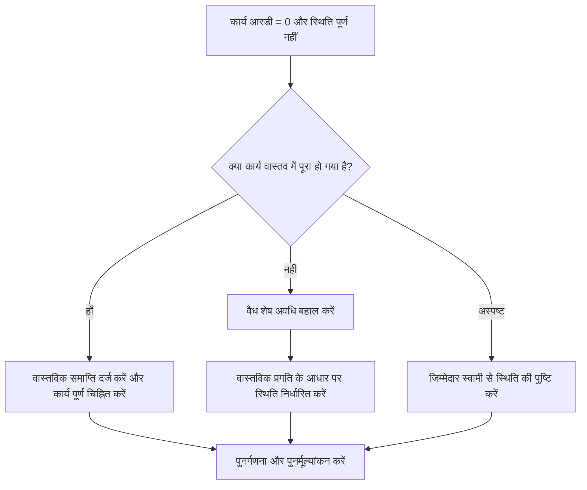

# कार्य की शेष अवधि शून्य है जबकि स्थिति पूर्ण नहीं है - सुधार मार्गदर्शिका

## उद्देश्य

यह मार्गदर्शिका शेड्यूलर्स को कार्य गतिविधियों की समीक्षा करने और उन्हें सही करने में मदद करती है जहां शेष अवधि 0 के बराबर है लेकिन कार्य की स्थिति पूर्ण नहीं है। यह शेष कार्य, वास्तविक समाप्ति और गतिविधि स्थिति को संरेखित करके स्वच्छ प्रिमावेरा पी6 अपडेट का समर्थन करता है।

## आपके शुरू करने से पहले

कार्रवाई करने से पहले निम्नलिखित जानकारी इकट्ठा करें:

- इस मीट्रिक के लिए वर्तमान मूल्यांकन परिणाम।
- शेष अवधि = 0 और स्थिति पूर्ण नहीं होने वाली कार्य गतिविधियों की सूची।
- गतिविधि आईडी, गतिविधि का नाम, डब्ल्यूबीएस, गतिविधि का प्रकार, गतिविधि की स्थिति, वास्तविक शुरुआत, वास्तविक समाप्ति, मूल अवधि, शेष अवधि और समापन की अवधि।
- प्रतिशत पूर्ण प्रकार और मुख्य प्रगति फ़ील्ड।
- डेटा दिनांक और नवीनतम अद्यतन नोट्स।
- कार्य पूरा हो गया है या अभी भी कार्य शेष है, इसकी फ़ील्ड पुष्टि।

## अपने परिणाम को समझें

एक मजबूत परिणाम शून्य कार्य गतिविधियाँ हैं जिनमें शेष अवधि = 0 और स्थिति पूर्ण नहीं है।

यह मीट्रिक कार्य गतिविधियों तक सीमित है इसलिए समीक्षा सामान्य कार्य गतिविधियों पर केंद्रित है, न कि मील के पत्थर या एलओई रिकॉर्ड पर। शून्य शेष अवधि वाले कार्य की सामान्यतः पूर्ण स्थिति और वास्तविक समापन होना चाहिए।

कमजोर परिणाम का मतलब है कि शेड्यूल में ऐसे कार्य शामिल हैं जिनका समय शेष है और पूरा होने की स्थिति मेल नहीं खाती है।

## सुधार लक्ष्य

लक्ष्य 0 अनसुलझे कार्य गतिविधियाँ हैं जिनकी शेष अवधि = 0 है और स्थिति पूर्ण नहीं है।

लक्ष्य यह पुष्टि करना है कि क्या प्रत्येक कार्य पूरा हो गया है और बंद कर दिया जाना चाहिए, या अधूरा है और वैध शेष अवधि बहाल होनी चाहिए।

## कार्य योजना

### चरण 1: मुख्य मुद्दे की पहचान करें

एक P6 लेआउट या रिपोर्ट बनाएं जो कार्य गतिविधियों के लिए फ़िल्टर करता है जहां शेष अवधि 0 के बराबर है और गतिविधि स्थिति पूर्ण नहीं है। गतिविधि आईडी, गतिविधि नाम, डब्ल्यूबीएस, गतिविधि प्रकार, गतिविधि स्थिति, वास्तविक प्रारंभ, वास्तविक समाप्ति, मूल अवधि, शेष अवधि, प्रतिशत पूर्ण प्रकार, गतिविधि प्रतिशत पूर्ण, प्रारंभ, समाप्ति और कुल फ़्लोट शामिल करें।

प्रत्येक कार्य की समीक्षा करें और पूछें:

- क्या कार्य वास्तव में पूरा हो गया है?
- यदि पूर्ण है, तो स्थिति पूर्ण क्यों नहीं है?
- क्या वास्तविक समाप्ति गायब है?
- यदि कार्य पूर्ण नहीं है तो शेष अवधि 0 क्यों है?
- क्या स्थिति मैन्युअल रूप से आयात या अपडेट की गई थी?
- क्या प्रतिशत पूर्ण विधि किए गए अद्यतन से मेल खाती है?

### चरण 2: अनुशंसित सुधार लागू करें

यदि कार्य पूरा हो गया है, तो गतिविधि को पूर्ण के रूप में अपडेट करें। वास्तविक समापन दर्ज करें, पुष्टि करें कि शेष अवधि 0 है, और पुष्टि करें कि प्रगति मान परियोजना अद्यतन प्रक्रिया के साथ संरेखित हैं।

यदि कार्य पूरा नहीं हुआ है, तो उचित शेष अवधि बहाल करें। जिम्मेदार स्वामी के साथ शेष कार्य की पुष्टि करें और वास्तविक प्रगति के आधार पर कार्य की स्थिति को प्रगति पर या प्रारंभ नहीं के रूप में रखें।

यदि समस्या आयातित प्रगति डेटा से आती है, तो आयात मैपिंग की समीक्षा करें और वर्कफ़्लो अपडेट करें। अद्यतन प्रक्रिया में कार्य गतिविधियों को शून्य शेष समय के साथ अपूर्ण स्थिति में नहीं छोड़ा जाना चाहिए।

### चरण 3: सामान्य अवरोधक हटाएँ

सामान्य अवरोधकों में गुम वास्तविक समाप्ति तिथियां, अपूर्ण फ़ील्ड पुष्टिकरण, आयातित अद्यतन डेटा और अवधि स्थिति और गतिविधि स्थिति के बीच भ्रम शामिल हैं।

एक अन्य अवरोधक कार्य को औपचारिक रूप से पूरा किए बिना प्रगति दिखाने के लिए शेष अवधि को घटाकर 0 कर रहा है। शेष अवधि और गतिविधि स्थिति को वही कहानी बतानी चाहिए कि क्या काम बचा है।

### चरण 4: परिवर्तनों को मान्य करें

सुधार के बाद शेड्यूल की पुनर्गणना करें। मीट्रिक को दोबारा चलाएँ और पुष्टि करें कि प्रत्येक शेष आइटम को सही कर दिया गया है या अनुवर्ती कार्रवाई के लिए असाइन कर दिया गया है।

यह पुष्टि करने के लिए कि सुधार ने नई विसंगतियां पैदा नहीं की हैं, पूर्ण कार्य सूचियों, वास्तविक समापन तिथियों, प्रगति रिपोर्ट, अर्जित मूल्य आउटपुट और लुकहेड रिपोर्ट की समीक्षा करें।

## सुधार अनुसूची

### दिन 1: समीक्षा करें और निदान करें

मेट्रिक चलाएँ, डेटा दिनांक की पुष्टि करें, और पूर्ण कार्यों में पूर्ण स्थिति, शून्य शेष अवधि के साथ अपूर्ण कार्य, और आयात या वर्कफ़्लो समस्याओं के निष्कर्षों को अलग करें।

### दिन 2-3: प्राथमिकता वाले कार्यों को लागू करें

सबसे पहले रिपोर्टिंग में उपयोग किए जाने वाले सही कार्य। वास्तविक समाप्ति दर्ज करें, कार्यों को पूर्ण चिह्नित करें, या आवश्यकतानुसार शेष अवधि बहाल करें।

### दिन 4-5: प्रारंभिक परिणामों की निगरानी करें

शेड्यूल की पुनर्गणना करें और पूर्ण कार्य रिपोर्ट, प्रगति रिपोर्ट, अर्जित मूल्य आउटपुट और लुकहेड रिपोर्ट की समीक्षा करें।

### दिन 6: अंतिम समायोजन

जिम्मेदार अनुशासन, फील्ड लीड, या प्रोजेक्ट नियंत्रण लीड के साथ शेष अनिश्चित वस्तुओं का समाधान करें।

### दिन 7: पुनर्मूल्यांकन करें और तुलना करें

मूल्यांकन फिर से चलाएँ और लक्ष्य सीमा के विरुद्ध परिणाम की तुलना करें।

## प्रगति पर नज़र रखना

सुधार और अनुमोदन प्रबंधित करने के लिए एक सरल ट्रैकर का उपयोग करें।

| तारीख | कार्रवाई की | अपेक्षित प्रभाव | परिणाम/अवलोकन | अगला कदम |
| --- | --- | --- | --- | --- |
| [तारीख] | समीक्षित कार्य आरडी 0 और स्थिति पूर्ण नहीं | कार्य स्थिति असंगति को पहचानें | [देखा गया परिणाम] | मालिक को नियुक्त करें |
| [तारीख] | वास्तविक समाप्ति दर्ज की गई और पूर्ण चिह्नित किया गया | पूर्ण स्थिति को संरेखित करें | [देखा गया परिणाम] | शेड्यूल की पुनर्गणना करें |
| [तारीख] | शेष अवधि बहाल | अपूर्ण कार्य की स्थिति ठीक करें | [देखा गया परिणाम] | मीट्रिक का पुनर्मूल्यांकन करें |

## यदि परिणाम में सुधार नहीं होता है

यदि परिणाम में सुधार नहीं होता है, तो जांचें कि क्या प्रगति अद्यतन आयात किए गए हैं, कॉपी किए गए हैं, या मैन्युअल रूप से असंगत रूप से संपादित किए गए हैं। समीक्षा करें कि क्या अपडेट वर्कफ़्लो से वास्तविक समाप्ति तिथियाँ गायब हैं या क्या उपयोगकर्ता कार्यों को पूरा किए बिना शेष अवधि को 0 पर सेट कर रहे हैं।

जब अनसुलझे आइटम महत्वपूर्ण, निकट-महत्वपूर्ण, अर्जित मूल्य, ग्राहक रिपोर्टिंग, भुगतान, या हैंडओवर-संबंधी कार्य को प्रभावित करते हैं तो उन्हें बढ़ाएँ।

## रखरखाव

रिपोर्ट जारी करने से पहले प्रत्येक अद्यतन चक्र के दौरान इस मीट्रिक की समीक्षा करें। यह वास्तविक तिथियों, शेष अवधि, पूर्ण प्रतिशत और गतिविधि स्थिति जांच के साथ-साथ मानक कार्य स्थिति सत्यापन का हिस्सा होना चाहिए।

## सारांश चेकलिस्ट

- [ ] वर्तमान परिणाम की समीक्षा की गई
- [ ] लक्ष्य सीमा की पुष्टि की गई
- [ ] डेटा दिनांक की पुष्टि की गई
- [ ] केवल-कार्य फ़िल्टर की पुष्टि की गई
- [ ] मुख्य मुद्दा पहचाना गया
- [ ] पूर्ण किए गए कार्य सही ढंग से चिह्नित किए गए
- [ ] जहां आवश्यक हो वहां वास्तविक समाप्ति तिथियां दर्ज की गईं
- [ ] जहां काम अधूरा है वहां शेष अवधि बहाल कर दी गई है
- [ ] वर्कफ़्लो आयात या अद्यतन करें की जाँच की गई
- [ ] शेड्यूल की पुनर्गणना की गई
- [ ] मूल्यांकन दोहराया गया
- [ ] अगले चरणों का दस्तावेजीकरण किया गया
## संबंधित सामग्री
- [कार्य की शेष अवधि शून्य है जबकि स्थिति पूर्ण नहीं है - अवलोकन](01_overview_template.md)
- [कार्य की शेष अवधि शून्य है जबकि स्थिति पूर्ण नहीं है](03_blog_template.md)
- [शेड्यूल क्या है](../../05_blogs_hi/01_WHAT%20A%20SCHEDULE%20IS/01_blog.md)
- [मजबूत तर्क](../../05_blogs_hi/02_ROBUST%20LOGIC/02_ROBUST%20LOGIC.md)
