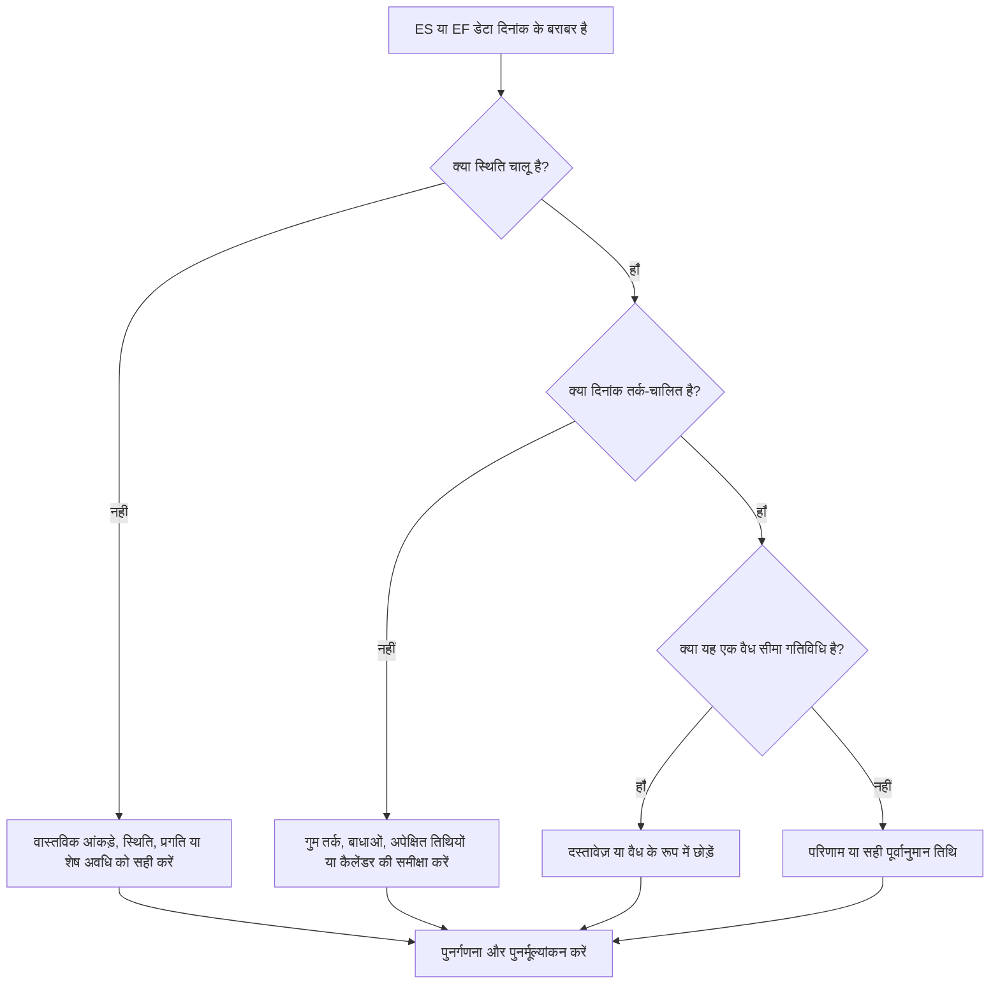

# डेटा तिथि पर गतिविधियाँ - सुधार मार्गदर्शिका

## उद्देश्य

यह मार्गदर्शिका शेड्यूलर्स को उन गतिविधियों की समीक्षा करने में मदद करती है जिनकी प्रारंभिक शुरुआत या प्रारंभिक समाप्ति बिल्कुल प्राइमेरा पी6 डेटा तिथि पर होती है। यह वास्तविक प्रदर्शन और पूर्वानुमान कार्य के बीच की सीमा पर कार्य कहां एकत्र हो रहा है, यह दिखाकर अद्यतन-चक्र जांच का समर्थन करता है।

## आपके शुरू करने से पहले

कार्रवाई करने से पहले निम्नलिखित जानकारी इकट्ठा करें:

- इस मीट्रिक के लिए वर्तमान मूल्यांकन परिणाम।
- नवीनतम शेड्यूल गणना में उपयोग की गई प्रोजेक्ट डेटा तिथि।
- उन गतिविधियों की सूची जहां प्रारंभिक शुरुआत = डेटा तिथि।
- गतिविधियों की सूची जहां प्रारंभिक समाप्ति = डेटा तिथि।
- गतिविधि की स्थिति, वास्तविक प्रारंभ, वास्तविक समाप्ति, शेष अवधि, प्रारंभ, समाप्ति, कुल फ़्लोट और कैलेंडर।
- पूर्ववर्ती और उत्तराधिकारी संबंध विवरण।
- बाधाएँ, अपेक्षित तिथियाँ और अद्यतन नोट्स।

## अपने परिणाम को समझें

एक मजबूत परिणाम डेटा तिथि पर प्रारंभिक शुरुआत या प्रारंभिक समाप्ति के साथ शून्य अस्पष्टीकृत गतिविधियां है।

कुछ गतिविधियाँ वैध रूप से डेटा तिथि पर बैठ सकती हैं, विशेष रूप से निकट अवधि के कार्य जो आगे बढ़ने के लिए तैयार हैं या अद्यतन सीमा पर काम पूरा कर रहे हैं। मुद्दा केवल तारीख का नहीं है; मुद्दा यह है कि क्या तारीख को वैध स्थिति, तर्क और अद्यतन जानकारी द्वारा समझाया गया है।

कमजोर परिणाम का मतलब है कि कई गतिविधियाँ बिना किसी स्पष्ट अनुसूची कारण के डेटा तिथि पर एकत्र हो रही हैं।

## सुधार लक्ष्य

लक्ष्य ईएस = डेटा तिथि या ईएफ = डेटा तिथि के साथ 0 अस्पष्टीकृत गतिविधियां है।

लक्ष्य यह पुष्टि करना है कि क्या प्रत्येक गतिविधि सही ढंग से स्थित है, तार्किक रूप से संचालित है, और सही अद्यतन सीमा से पूर्वानुमानित है।

## कार्य योजना

### चरण 1: मुख्य मुद्दे की पहचान करें

एक P6 लेआउट या रिपोर्ट बनाएं जो उन गतिविधियों के लिए फ़िल्टर करता है जहां प्रारंभिक शुरुआत डेटा तिथि के बराबर होती है या प्रारंभिक समाप्ति डेटा तिथि के बराबर होती है। गतिविधि आईडी, गतिविधि का नाम, डब्ल्यूबीएस, गतिविधि की स्थिति, प्रारंभिक शुरुआत, प्रारंभिक समाप्ति, प्रारंभ, समाप्ति, वास्तविक शुरुआत, वास्तविक समाप्ति, शेष अवधि, कुल फ्लोट, कैलेंडर, बाधाएं, पूर्ववर्ती और उत्तराधिकारी शामिल करें।

प्रत्येक गतिविधि की समीक्षा करें और पूछें:

- क्या गतिविधि पूरी हो गई है, प्रगति पर है या शुरू नहीं हुई है?
- क्या वास्तविक प्रारंभ या वास्तविक समापन गायब है?
- क्या गतिविधि तार्किक रूप से डेटा तिथि पर संचालित है?
- क्या कोई बाधा, अपेक्षित तिथि या कैलेंडर गतिविधि को डेटा तिथि पर धकेल रहा है?
- क्या गतिविधि ओपन-एंडेड है या कमजोर रूप से जुड़ी हुई है?
- क्या अद्यतन अवधि के लिए डेटा दिनांक सही है?

### चरण 2: अनुशंसित सुधार लागू करें

यदि स्थिति अधूरी है, तो तर्क बदलने से पहले वास्तविक प्रारंभ, वास्तविक समाप्ति, शेष अवधि, प्रतिशत पूर्ण और गतिविधि स्थिति को सही करें।

यदि कोई गतिविधि डेटा दिनांक पर शुरू हो रही है क्योंकि पूर्ववर्ती तर्क गायब है या गैर-ड्राइविंग है, तो ऐसे रिश्ते जोड़ें या सही करें जो वास्तविक कार्य अनुक्रम का प्रतिनिधित्व करते हैं।

यदि कोई गतिविधि डेटा दिनांक पर समाप्त हो रही है क्योंकि प्रगति अद्यतन नहीं की गई थी, तो पुष्टि करें कि कार्य अद्यतन सीमा तक समाप्त हो गया है या नहीं। यदि पूरा हो जाए तो वास्तविक समाप्ति दर्ज करें, या यदि कार्य शेष है तो शेष अवधि और पूर्वानुमान समाप्ति को अपडेट करें।

यदि बाधाएँ या अपेक्षित तिथियाँ गतिविधियों को डेटा तिथि पर धकेल रही हैं, तो परियोजना नियंत्रण प्रक्रिया के अनुसार उन्हें हटाएँ, संशोधित करें या दस्तावेज़ित करें।

### चरण 3: सामान्य अवरोधक हटाएँ

सामान्य अवरोधकों में अपूर्ण वास्तविकता, खुली शुरुआत, खुली समाप्ति, तर्क के विकल्प के रूप में उपयोग की जाने वाली बाधाएं और पर्याप्त स्थिति समीक्षा के बिना डेटा दिनांक आंदोलन शामिल हैं।

एक अन्य अवरोधक यह मान रहा है कि डेटा तिथि पर गतिविधियाँ हानिरहित हैं। अद्यतन सीमा पर एक बड़ा क्लस्टर लापता अनुक्रमण को छिपा सकता है या निकट अवधि के पूर्वानुमान को उससे अधिक साफ-सुथरा बना सकता है।

### चरण 4: परिवर्तनों को मान्य करें

सुधार के बाद शेड्यूल की पुनर्गणना करें। मीट्रिक को दोबारा चलाएँ और पुष्टि करें कि डेटा दिनांक पर प्रत्येक शेष गतिविधि को वर्तमान स्थिति, वैध तर्क या स्वीकृत अपवाद द्वारा समझाया गया है।

सुधार की पुष्टि करने के लिए कुल फ्लोट, महत्वपूर्ण या सबसे लंबे पथ, मील के पत्थर की तारीखों और निकट-अवधि की लुकहेड रिपोर्ट की समीक्षा करें, जिससे नई विसंगतियां पैदा नहीं हुईं।

## सुधार अनुसूची

### दिन 1: समीक्षा करें और निदान करें

मेट्रिक चलाएँ, डेटा दिनांक की पुष्टि करें, और डेटा दिनांक पर ES, डेटा दिनांक पर EF, स्थिति संबंधी समस्याएँ, तर्क संबंधी समस्याएँ, बाधाएँ और वैध सीमा गतिविधियाँ अलग-अलग निष्कर्षों को देखें।

### दिन 2-3: प्राथमिकता वाले कार्यों को लागू करें

पहले आलोचनात्मक, निकट-महत्वपूर्ण और निकट-अवधि की गतिविधियों को ठीक करें। स्थिति अपडेट करें, तर्क जोड़ें या सही करें और बाधाओं की समीक्षा करें।

### दिन 4-5: प्रारंभिक परिणामों की निगरानी करें

शेड्यूल की पुनर्गणना करें और डेटा दिनांक पर अभी भी मौजूद लुकहेड आउटपुट, फ़्लोट परिवर्तन, माइलस्टोन मूवमेंट और गतिविधियों की समीक्षा करें।

### दिन 6: अंतिम समायोजन

जिम्मेदार अनुशासन, फील्ड लीड, या प्रोजेक्ट नियंत्रण लीड के साथ शेष अनिश्चित वस्तुओं का समाधान करें।

### दिन 7: पुनर्मूल्यांकन करें और तुलना करें

मूल्यांकन फिर से चलाएँ और लक्ष्य सीमा के विरुद्ध परिणाम की तुलना करें।

## प्रगति पर नज़र रखना

सुधार और अनुमोदन प्रबंधित करने के लिए एक सरल ट्रैकर का उपयोग करें।

| तारीख | कार्रवाई की | अपेक्षित प्रभाव | परिणाम/अवलोकन | अगला कदम |
| --- | --- | --- | --- | --- |
| [तारीख] | डेटा तिथि पर ईएस/ईएफ की समीक्षा की गई | सीमा क्लस्टरिंग को पहचानें | [देखा गया परिणाम] | मालिक को नियुक्त करें |
| [तारीख] | सही स्थिति या वास्तविक तिथियाँ | कार्य स्थिति को अद्यतन सीमा के साथ संरेखित करें | [देखा गया परिणाम] | शेड्यूल की पुनर्गणना करें |
| [तारीख] | सही तर्क या बाधाएँ | अस्पष्टीकृत डेटा दिनांक क्लस्टरिंग को कम करें | [देखा गया परिणाम] | मीट्रिक का पुनर्मूल्यांकन करें |

## यदि परिणाम में सुधार नहीं होता है

यदि परिणाम में सुधार नहीं होता है, तो जांचें कि क्या गतिविधियों को बार-बार तर्क, बाधाओं, पुरानी अपेक्षित तिथियों, या अपूर्ण अद्यतन प्रक्रियाओं के कारण डेटा तिथि पर खींचा जा रहा है।

जब अनसुलझे आइटम महत्वपूर्ण, निकट-महत्वपूर्ण, ग्राहक रिपोर्टिंग, हैंडओवर, भुगतान, या निकट अवधि के निष्पादन कार्य को प्रभावित करते हैं तो उन्हें बढ़ाएँ।

## रखरखाव

रिपोर्ट जारी करने से पहले प्रत्येक अद्यतन चक्र के दौरान इस मीट्रिक की समीक्षा करें। यह डेटा दिनांक को स्थानांतरित करने, प्रगति आयात करने, कार्य को पुन: अनुक्रमित करने, या प्रमुख स्थिति परिवर्तनों के बाद पुनर्गणना करने के बाद विशेष रूप से उपयोगी है।

## सारांश चेकलिस्ट

- [ ] वर्तमान परिणाम की समीक्षा की गई
- [ ] लक्ष्य सीमा की पुष्टि की गई
- [ ] डेटा दिनांक की पुष्टि की गई
- [ ] ईएस = डेटा दिनांक गतिविधियों की समीक्षा की गई
- [ ] ईएफ = डेटा दिनांक गतिविधियों की समीक्षा की गई
- [ ] स्थिति और वास्तविक तिथियों की जाँच की गई
- [ ] शेष अवधि की जाँच की गई
- [ ] तर्क और बाधाओं की समीक्षा की गई
- [ ] वैध सीमा गतिविधियाँ प्रलेखित
- [ ] शेड्यूल की पुनर्गणना की गई
- [ ] मूल्यांकन दोहराया गया
- [ ] अगले चरणों का दस्तावेजीकरण किया गया
## संबंधित सामग्री
- [डेटा तिथि पर गतिविधियाँ: प्रिमावेरा पी6 में प्रारंभिक शुरुआत और प्रारंभिक समाप्ति जाँच - अवलोकन](01_overview_template.md)
- [डेटा तिथि पर गतिविधियाँ: प्रिमावेरा पी6 में प्रारंभिक शुरुआत और प्रारंभिक समाप्ति जाँच](03_blog_template.md)
- [शेड्यूल क्या है](../../05_blogs_hi/01_WHAT%20A%20SCHEDULE%20IS/01_blog.md)
- [मजबूत तर्क](../../05_blogs_hi/02_ROBUST%20LOGIC/02_ROBUST%20LOGIC.md)
