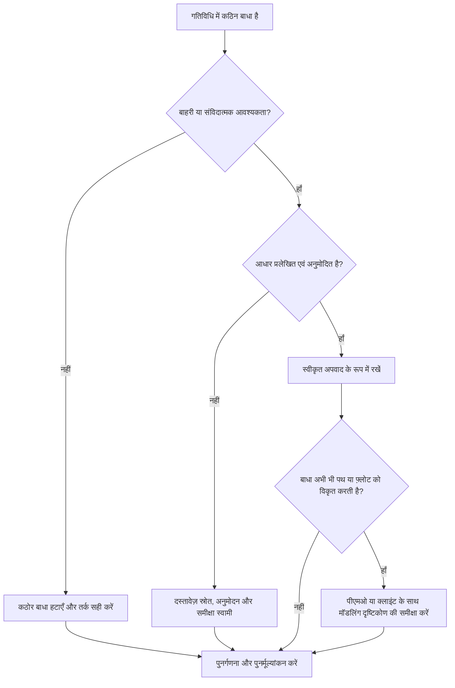

# प्रिमावेरा पी6 में कठिन बाधाएँ - सुधार मार्गदर्शिका

## उद्देश्य

यह मार्गदर्शिका शेड्यूलर्स को प्रिमावेरा पी6 में कठिन बाधाओं की समीक्षा करने और उन्हें कम करने में मदद करती है। यह उन बाधाओं पर ध्यान केंद्रित करता है जो गतिविधि की तारीखों को दृढ़ता से नियंत्रित करते हैं, विशेष रूप से अनिवार्य शुरुआत और अनिवार्य समाप्ति।

## आपके शुरू करने से पहले

कार्रवाई करने से पहले निम्नलिखित जानकारी इकट्ठा करें:

- इस मीट्रिक के लिए वर्तमान मूल्यांकन परिणाम।
- कठिन बाधाओं वाली गतिविधियों की सूची.
- प्रत्येक गतिविधि के लिए बाधा प्रकार और बाधा तिथि।
- गतिविधि आईडी, गतिविधि का नाम, डब्लूबीएस, गतिविधि स्थिति, प्रारंभ, समाप्ति, कुल फ़्लोट, और महत्वपूर्ण या सबसे लंबे पथ की स्थिति।
- पूर्ववर्ती और उत्तराधिकारी संबंध विवरण।
- किसी भी आवश्यक बाधा के लिए अनुबंध, ग्राहक, परमिट, पहुंच, नियामक, या हैंडओवर आधार।
- बेसलाइन या पूर्व अद्यतन तुलना यह दर्शाती है कि बाधा कब जोड़ी गई थी।

## अपने परिणाम को समझें

एक मजबूत परिणाम शून्य अस्पष्टीकृत कठिन बाधाएं हैं।

कठोर बाधाएँ सामान्य सीपीएम गणना को ओवरराइड या भारी रूप से प्रतिबंधित कर सकती हैं। वे अनुबंध की तारीखों, एक्सेस विंडो, परमिट रिलीज़, नियामक होल्ड पॉइंट या मालिक-निर्देशित आवश्यकताओं के लिए मान्य हो सकते हैं, लेकिन उन्हें लापता तर्क के विकल्प के रूप में उपयोग नहीं किया जाना चाहिए।

कमजोर परिणाम का मतलब है कि शेड्यूल में थोपी गई तारीखें शामिल हैं जो नेटवर्क तर्क के बजाय पूर्वानुमान को नियंत्रित कर सकती हैं।

## सुधार लक्ष्य

लक्ष्य 0 अस्पष्टीकृत कठिन बाधाएँ हैं।

लक्ष्य अनावश्यक कठिन बाधाओं को दूर करना और किसी भी बाधा का दस्तावेजीकरण करना है जो वास्तव में आवश्यक है।

## कार्य योजना

### चरण 1: मुख्य मुद्दे की पहचान करें

एक P6 लेआउट या रिपोर्ट बनाएं जो कठिन बाधा प्रकारों वाली गतिविधियों के लिए फ़िल्टर करता है। गतिविधि आईडी, गतिविधि नाम, डब्लूबीएस, गतिविधि स्थिति, प्रारंभ, समाप्ति, बाधा प्रकार, बाधा तिथि, कुल फ़्लोट, महत्वपूर्ण या सबसे लंबे पथ की स्थिति, पूर्ववर्ती और उत्तराधिकारी शामिल करें।

प्रत्येक प्रतिबंधित गतिविधि की समीक्षा करें और पूछें:

- कठिन बाधा का स्रोत क्या है?
- क्या यह संविदात्मक रूप से या बाह्य रूप से आवश्यक है?
- क्या यह लापता पूर्ववर्ती या उत्तराधिकारी तर्क की जगह ले रहा है?
- क्या यह एक लक्ष्य तिथि को बाध्य कर रहा है जिसका पूर्वानुमान अनुसूची के अनुसार लगाया जाना चाहिए?
- क्या यह कुल फ़्लोट, महत्वपूर्ण पथ, या मील का पत्थर रिपोर्टिंग को प्रभावित करता है?
- क्या कारण प्रलेखित एवं स्वीकृत है?

### चरण 2: अनुशंसित सुधार लागू करें

यदि कठोर बाधा की बाह्य रूप से आवश्यकता नहीं है, तो इसे हटा दें और CPM तर्क जोड़ें या सही करें। कार्य को मॉडल करने के लिए तिथियों को बाध्य करने के बजाय संबंध, गतिविधि अनुक्रमण, कैलेंडर और यथार्थवादी अवधि का उपयोग करें।

यदि कठोर बाधा की आवश्यकता है, तो आधार का दस्तावेजीकरण करें। स्रोत, अनुमोदन, दिनांक, जिम्मेदार स्वामी और कारण को कैप्चर करें जिसे इसे सामान्य तर्क के साथ मॉडल नहीं किया जा सकता है।

यदि बाधा का उपयोग लक्ष्य तिथि को संरक्षित करने के लिए किया जा रहा है, तो समीक्षा करें कि क्या एक नरम बाधा, मील का पत्थर, समय सीमा, या रिपोर्टिंग नोट अधिक उपयुक्त होगा।

### चरण 3: सामान्य अवरोधक हटाएँ

सामान्य अवरोधकों में पुरानी बेसलाइन से विरासत में मिली बाधाएँ, अनिवार्य तिथियों के रूप में दर्ज की गई ग्राहक लक्ष्य तिथियाँ, अस्थायी बाधाओं को पीछे छोड़ने वाली पुनर्प्राप्ति योजनाएँ और अनुपलब्ध इंटरफ़ेस तर्क शामिल हैं।

एक अन्य अवरोधक यह मान रहा है कि एक कठिन बाधा स्वीकार्य है क्योंकि तारीख महत्वपूर्ण है। महत्वपूर्ण तिथियां दिखाई देनी चाहिए, लेकिन शेड्यूल में अभी भी स्पष्ट होना चाहिए कि कार्य उन तक कैसे पहुंचता है।

### चरण 4: परिवर्तनों को मान्य करें

सुधार के बाद शेड्यूल की पुनर्गणना करें। मीट्रिक को दोबारा चलाएँ और पुष्टि करें कि शेष कठिन बाधाएँ स्वीकृत और प्रलेखित हैं।

सुधार की पुष्टि करने के लिए कुल फ़्लोट, महत्वपूर्ण या सबसे लंबे पथ, मील के पत्थर की तारीखों और शेड्यूल तुलना आउटपुट की समीक्षा करें, जिससे अप्रत्याशित हलचल पैदा न हो।

## सुधार अनुसूची

### दिन 1: समीक्षा करें और निदान करें

मीट्रिक और समूह निष्कर्षों को WBS, बाधा प्रकार, गंभीरता और दस्तावेजी आधार पर चलाएँ।

### दिन 2-3: प्राथमिकता वाले कार्यों को लागू करें

पहले महत्वपूर्ण, निकट-महत्वपूर्ण, संविदात्मक और निकट-अवधि की गतिविधियों से अनावश्यक कठोर बाधाओं को हटा दें। जहां आवश्यक हो वहां लुप्त तर्क जोड़ें।

### दिन 4-5: प्रारंभिक परिणामों की निगरानी करें

शेड्यूल की पुनर्गणना करें और फ़्लोट मूवमेंट, महत्वपूर्ण पथ परिवर्तन और मील के पत्थर के प्रभावों की समीक्षा करें।

### दिन 6: अंतिम समायोजन

शेष अपवादों को शेड्यूलर, प्रोजेक्ट नियंत्रण लीड, पीएमओ समीक्षक, या ग्राहक प्रतिनिधि के साथ हल करें।

### दिन 7: पुनर्मूल्यांकन करें और तुलना करें

मूल्यांकन फिर से चलाएँ और लक्ष्य सीमा के विरुद्ध परिणाम की तुलना करें।

## प्रगति पर नज़र रखना

सुधार और अनुमोदन प्रबंधित करने के लिए एक सरल ट्रैकर का उपयोग करें।

| तारीख | कार्रवाई की | अपेक्षित प्रभाव | परिणाम/अवलोकन | अगला कदम |
| --- | --- | --- | --- | --- |
| [तारीख] | कठिन बाधाओं की समीक्षा की | लगाए गए दिनांक नियंत्रणों को पहचानें | [देखा गया परिणाम] | मालिक को नियुक्त करें |
| [तारीख] | अनावश्यक कठिन बाधा हटा दी गई | तर्क-संचालित गणना पुनर्स्थापित करें | [देखा गया परिणाम] | शेड्यूल की पुनर्गणना करें |
| [तारीख] | प्रलेखित अनुमोदित कठिन बाधा | उचित अपवाद को सुरक्षित रखें | [देखा गया परिणाम] | मीट्रिक का पुनर्मूल्यांकन करें |

## यदि परिणाम में सुधार नहीं होता है

यदि परिणाम में सुधार नहीं होता है, तो जांचें कि क्या आयात, कॉपी किए गए फ्रैग्नेट्स, बेसलाइन अपडेट या पुनर्प्राप्ति शेड्यूल परिवर्तनों के माध्यम से कठिन बाधाओं को फिर से लागू किया जा रहा है।

जब अनसुलझे आइटम महत्वपूर्ण पथ, संविदात्मक मील के पत्थर, ग्राहक रिपोर्टिंग, विलंब विश्लेषण, भुगतान घटनाओं या हैंडओवर तिथियों को प्रभावित करते हैं तो उन्हें बढ़ाएँ।

## रखरखाव

प्रत्येक अद्यतन चक्र के दौरान और आधारभूत अनुमोदन से पहले इस मीट्रिक की समीक्षा करें। कठोर बाधाएँ मानक अनुसूची स्वास्थ्य जांच का हिस्सा होनी चाहिए, विशेष रूप से प्रमुख पुनर्अनुक्रमण, पुनर्प्राप्ति योजना और ग्राहक सबमिशन तैयारी के बाद।

## सारांश चेकलिस्ट

- [ ] वर्तमान परिणाम की समीक्षा की गई
- [ ] लक्ष्य सीमा की पुष्टि की गई
- [ ] कठिन बाधा सूची तैयार की गई
- [ ] बाधा प्रकार और दिनांक की जाँच की गई
- [ ] बाहरी आधार की पुष्टि की गई
- [ ] अनावश्यक कठिन बाधाएँ हटा दी गईं
- [ ] गुम तर्क को ठीक किया गया
- [ ] स्वीकृत अपवादों का दस्तावेजीकरण किया गया
- [ ] शेड्यूल की पुनर्गणना की गई
- [ ] फ़्लोट और क्रिटिकल पथ की समीक्षा की गई
- [ ] मूल्यांकन दोहराया गया
- [ ] अगले चरणों का दस्तावेजीकरण किया गया
## संबंधित सामग्री
- [प्रिमावेरा पी6 में कठिन बाधाएँ - अवलोकन](01_overview_template.md)
- [प्रिमावेरा पी6 में कठिन बाधाएँ](03_blog_template.md)
- [शेड्यूल क्या है](../../05_blogs_hi/01_WHAT%20A%20SCHEDULE%20IS/01_blog.md)
- [मजबूत तर्क](../../05_blogs_hi/02_ROBUST%20LOGIC/02_ROBUST%20LOGIC.md)
