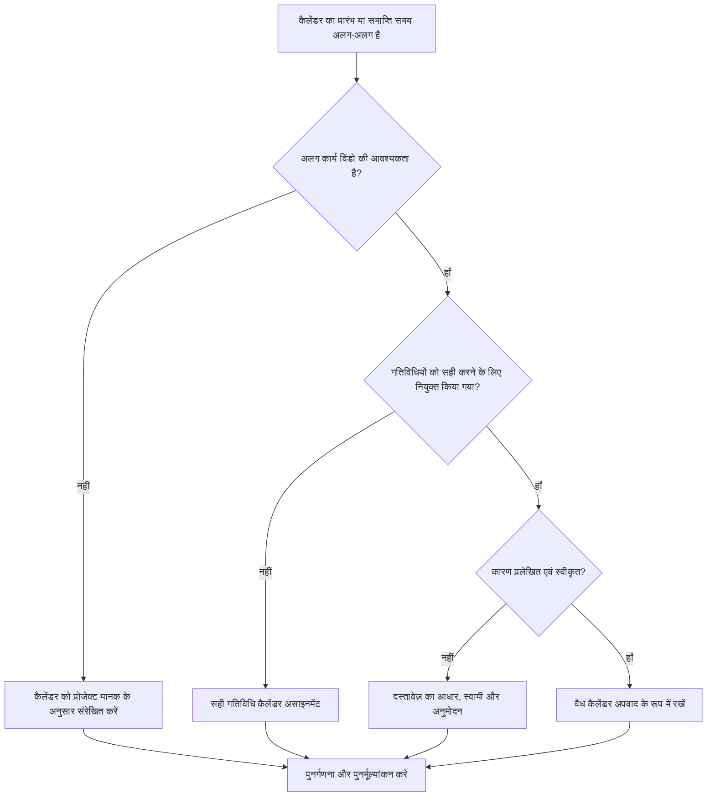

## उद्देश्य

यह मार्गदर्शिका शेड्यूलर्स को प्राइमेरा पी6 कैलेंडर की समीक्षा करने में मदद करती है जो विभिन्न कार्यदिवस प्रारंभ या समाप्ति समय का उपयोग करते हैं। यह पुष्टि करके शेड्यूल गुणवत्ता जांच का समर्थन करता है कि कैलेंडर समय अंतर जानबूझकर, स्वीकृत और समझा गया है।

## आपके शुरू करने से पहले

कार्रवाई करने से पहले निम्नलिखित जानकारी इकट्ठा करें:

- इस मीट्रिक के लिए वर्तमान मूल्यांकन परिणाम।
- स्वीकृत प्रोजेक्ट कैलेंडर मानक और सामान्य दैनिक कार्य विंडो।
- अलग-अलग प्रारंभ समय, समाप्ति समय, शिफ्ट विंडो या आंशिक-दिन पैटर्न वाले कैलेंडर की सूची।
- प्रत्येक प्रभावित कैलेंडर को गतिविधियाँ सौंपी गईं।
- कैलेंडर प्रकार, जैसे वैश्विक, प्रोजेक्ट, या संसाधन कैलेंडर।
- प्रभावित कैलेंडर का उपयोग करके महत्वपूर्ण या निकट-महत्वपूर्ण गतिविधियाँ।
- प्रत्येक गैर-मानक कैलेंडर का कारण, जैसे रात्रि पाली, आउटेज कार्य, प्रतिबंधित पहुंच, या विशेष क्रू शेड्यूल।

## अपने परिणाम को समझें

एक मजबूत परिणाम अलग-अलग प्रारंभ या समाप्ति समय के साथ शून्य अस्पष्टीकृत कैलेंडर है।

कैलेंडर अंतर तब मान्य हो सकते हैं जब काम वास्तव में अलग-अलग शिफ्ट, एक्सेस विंडो या संसाधन उपलब्धता का पालन करता है। चिंता तब होती है जब कैलेंडर बिना किसी स्पष्ट कारण के दिन के समय के अनुसार भिन्न होते हैं।

कमजोर परिणाम का मतलब है कि शेड्यूल में छिपी हुई कैलेंडर धारणाएं हो सकती हैं जो तिथियों, फ़्लोट और तर्क व्यवहार को प्रभावित करती हैं।

## सुधार लक्ष्य

लक्ष्य अलग-अलग प्रारंभ या समाप्ति समय के साथ 0 अस्पष्टीकृत कैलेंडर है।

लक्ष्य यह पुष्टि करना है कि क्या प्रत्येक अलग-अलग कार्य विंडो की आवश्यकता है, दस्तावेजीकरण किया गया है और केवल सही गतिविधियों को सौंपा गया है।

## कार्य योजना

### चरण 1: मुख्य मुद्दे की पहचान करें

P6 से एक कैलेंडर समीक्षा निर्यात बनाएं या एक शेड्यूल मूल्यांकन टूल बनाएं जो प्रत्येक कैलेंडर, उसके सामान्य कार्यदिवस प्रारंभ समय, समाप्ति समय, दैनिक घंटे, अपवाद और निर्दिष्ट गतिविधियों को सूचीबद्ध करता है।

प्रत्येक गैर-मानक कैलेंडर की समीक्षा करें और पूछें:

- परियोजना के लिए स्वीकृत मानक कार्यदिवस क्या है?
- कौन से कैलेंडर अलग-अलग प्रारंभ या समाप्ति समय का उपयोग करते हैं?
- क्या मतभेद जानबूझकर या आकस्मिक हैं?
- कौन सी गतिविधियाँ प्रत्येक कैलेंडर का उपयोग करती हैं?
- क्या महत्वपूर्ण या निकट-महत्वपूर्ण गतिविधियाँ प्रभावित हैं?
- क्या कैलेंडर अंतर प्रलेखित और स्वीकृत है?

### चरण 2: अनुशंसित सुधार लागू करें

यदि कैलेंडर में अंतर आकस्मिक है, तो प्रारंभ समय, समाप्ति समय और दैनिक कार्य अवधि को अनुमोदित परियोजना मानक के साथ संरेखित करें।

यदि कैलेंडर अंतर वैध है, तो कारण का दस्तावेजीकरण करें। सामान्य वैध मामलों में रात्रि पाली, सप्ताहांत कार्य, शटडाउन खिड़कियां, मालिक पहुंच प्रतिबंध, पर्यावरण प्रतिबंध, या संसाधन-विशिष्ट कार्य अवधि शामिल हैं।

यदि गतिविधियाँ गलत कैलेंडर को सौंपी गई हैं, तो कैलेंडर बदलने से पहले गतिविधि कैलेंडर असाइनमेंट को ठीक करें। एक वैध विशेष कैलेंडर अभी भी समस्याएँ पैदा कर सकता है यदि इसे बहुत व्यापक रूप से निर्दिष्ट किया गया हो।

### चरण 3: सामान्य अवरोधक हटाएँ

सामान्य अवरोधकों में पुराने शेड्यूल से कॉपी किए गए कैलेंडर, छिपी हुई समय सेटिंग्स के साथ आयातित कैलेंडर, गतिविधि कैलेंडर के रूप में उपयोग किए जाने वाले संसाधन कैलेंडर और छोटे समय के अंतर शामिल हैं जो मानक दिनांक लेआउट में दिखाई नहीं देते हैं।

एक अन्य अवरोधक समय के बिना केवल तारीख की समीक्षा कर रहा है। पी6 में, दिन का समय गतिविधि प्लेसमेंट, फ़्लोट, संबंध व्यवहार और स्पष्ट एक दिवसीय दिनांक गतिविधि को प्रभावित कर सकता है।

### चरण 4: परिवर्तनों को मान्य करें

कैलेंडर सुधार के बाद शेड्यूल की पुनर्गणना करें। मीट्रिक को दोबारा चलाएँ और पुष्टि करें कि शेष कैलेंडर अंतर वैध और दस्तावेज़ीकृत हैं।

यह पुष्टि करने के लिए कि सुधार ने अप्रत्याशित हलचल पैदा नहीं की है, प्रभावित गतिविधि तिथियों, कुल फ्लोट, महत्वपूर्ण या सबसे लंबे पथ, संबंध संबंधों और निकट अवधि की लुकहेड रिपोर्ट की समीक्षा करें।

## सुधार अनुसूची

### दिन 1: समीक्षा करें और निदान करें

कैलेंडर, कार्य विंडो, कैलेंडर प्रकार, निर्दिष्ट गतिविधियों और गंभीरता के आधार पर मीट्रिक और समूह निष्कर्ष चलाएं।

### दिन 2-3: प्राथमिकता वाले कार्यों को लागू करें

पहले महत्वपूर्ण, निकट-महत्वपूर्ण और निकट-अवधि की गतिविधियों पर आकस्मिक कैलेंडर समय अंतर और गलत गतिविधि कैलेंडर असाइनमेंट को ठीक करें।

### दिन 4-5: प्रारंभिक परिणामों की निगरानी करें

शेड्यूल की पुनर्गणना करें और फ़्लोट मूवमेंट, दिनांक परिवर्तन, मील के पत्थर के प्रभाव और भविष्य में होने वाले परिवर्तनों की समीक्षा करें।

### दिन 6: अंतिम समायोजन

शेष कैलेंडर अपवादों को शेड्यूलर, अनुशासन स्वामी, प्रोजेक्ट नियंत्रण लीड, या पीएमओ समीक्षक के साथ हल करें।

### दिन 7: पुनर्मूल्यांकन करें और तुलना करें

मूल्यांकन फिर से चलाएँ और लक्ष्य सीमा के विरुद्ध परिणाम की तुलना करें।

## प्रगति पर नज़र रखना

सुधार और अनुमोदन प्रबंधित करने के लिए एक सरल ट्रैकर का उपयोग करें।

| तारीख | कार्रवाई की | अपेक्षित प्रभाव | परिणाम/अवलोकन | अगला कदम |
| --- | --- | --- | --- | --- |
| [तारीख] | कैलेंडर के प्रारंभ और समाप्ति समय की समीक्षा की गई | गैर-मानक कार्य विंडो की पहचान करें | [देखा गया परिणाम] | मालिक को नियुक्त करें |
| [तारीख] | प्रोजेक्ट मानक के अनुरूप कैलेंडर | आकस्मिक समय अंतर को दूर करें | [देखा गया परिणाम] | शेड्यूल की पुनर्गणना करें |
| [तारीख] | दस्तावेज़ीकृत वैध कैलेंडर अपवाद | उचित कार्य विंडो को सुरक्षित रखें | [देखा गया परिणाम] | मीट्रिक का पुनर्मूल्यांकन करें |

## यदि परिणाम में सुधार नहीं होता है

यदि परिणाम में सुधार नहीं होता है, तो जांचें कि क्या गैर-मानक कैलेंडर आयात, कॉपी किए गए शेड्यूल, संसाधन असाइनमेंट या बेसलाइन अपडेट के माध्यम से पुन: प्रस्तुत किए जा रहे हैं।

अनसुलझे कैलेंडर अंतर तब बढ़ जाते हैं जब वे महत्वपूर्ण पथ, ग्राहक रिपोर्टिंग, भुगतान मील के पत्थर, आउटेज कार्य, हैंडओवर तिथियां, या निकट-अवधि निष्पादन को प्रभावित करते हैं।

## रखरखाव

बेसलाइन विकास, शेड्यूल आयात और प्रत्येक प्रमुख अद्यतन चक्र के दौरान इस मीट्रिक की समीक्षा करें। रिपोर्ट जारी होने से पहले कैलेंडर समय सेटिंग मानक शेड्यूल स्वास्थ्य जांच का हिस्सा होना चाहिए।

## सारांश चेकलिस्ट

- [ ] वर्तमान परिणाम की समीक्षा की गई
- [ ] लक्ष्य सीमा की पुष्टि की गई
- [ ] प्रोजेक्ट कैलेंडर मानक की पुष्टि की गई
- [ ] गैर-मानक कैलेंडर समय की पहचान की गई
- [ ] सौंपी गई गतिविधियों की समीक्षा की गई
- [ ] गंभीर और निकट-महत्वपूर्ण प्रभावों की जाँच की गई
- [ ] आकस्मिक कैलेंडर मतभेदों को ठीक किया गया
- [ ] वैध कैलेंडर अपवाद प्रलेखित
- [ ] शेड्यूल की पुनर्गणना की गई
- [ ] दिनांक और फ़्लोट परिवर्तनों की समीक्षा की गई
- [ ] मूल्यांकन दोहराया गया
- [ ] अगले चरणों का दस्तावेजीकरण किया गया
## संबंधित सामग्री
- [प्रिमावेरा पी6 में अलग-अलग प्रारंभ और समाप्ति समय वाले कैलेंडर](03_blog_template.md)
- [शेड्यूल क्या है](../../05_blogs_hi/01_WHAT%20A%20SCHEDULE%20IS/01_blog.md)
- [मजबूत तर्क](../../05_blogs_hi/02_ROBUST%20LOGIC/02_ROBUST%20LOGIC.md)
