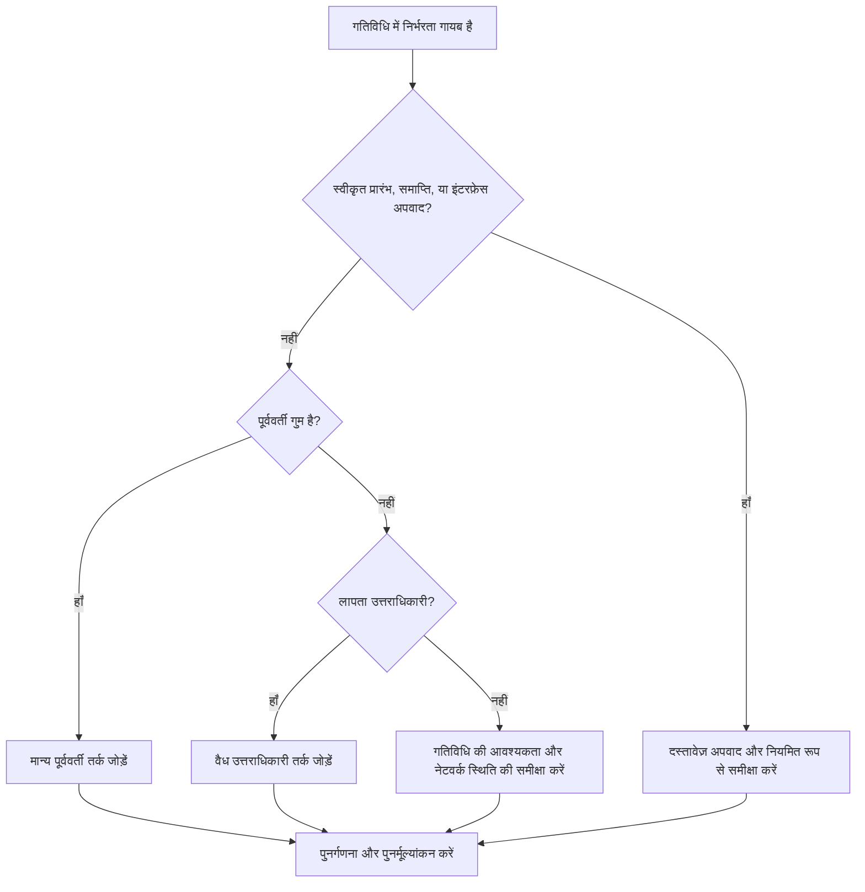

# प्रिमावेरा पी6 में गुम निर्भरताएँ - सुधार मार्गदर्शिका

## उद्देश्य

यह मार्गदर्शिका शेड्यूलर्स को प्रिमावेरा पी6 में गुम पूर्ववर्ती या उत्तराधिकारी तर्क को पहचानने और सही करने में मदद करती है। यह सीपीएम नेटवर्क की पूर्णता में सुधार करके शेड्यूल गुणवत्ता का समर्थन करता है।

## आपके शुरू करने से पहले

कार्रवाई करने से पहले निम्नलिखित जानकारी इकट्ठा करें:

- इस मीट्रिक के लिए वर्तमान मूल्यांकन परिणाम।
- बिना किसी पूर्ववर्तियों वाली गतिविधियों की सूची.
- बिना किसी उत्तराधिकारी वाली गतिविधियों की सूची.
- न तो पूर्ववर्ती और न ही उत्तराधिकारी तर्क वाली गतिविधियों की सूची।
- गतिविधि आईडी, गतिविधि का नाम, डब्ल्यूबीएस, गतिविधि प्रकार, गतिविधि स्थिति, प्रारंभ, समाप्ति, कुल फ़्लोट और कैलेंडर।
- स्वीकृत परियोजना प्रारंभ, परियोजना समापन, बाहरी इंटरफ़ेस और संविदात्मक अपवाद सूची।
- नवीनतम अद्यतन नोट्स और जिम्मेदार अनुशासन या पैकेज स्वामी।

## अपने परिणाम को समझें

एक मजबूत परिणाम गायब निर्भरता तर्क के साथ शून्य अनसुलझे गतिविधियाँ हैं।

कुछ गतिविधियों का वैध रूप से कोई पूर्ववर्ती या कोई उत्तराधिकारी नहीं हो सकता है, जैसे अनुमोदित परियोजना प्रारंभ मील का पत्थर, अंतिम समापन मील का पत्थर, या अनुमोदित बाहरी इंटरफ़ेस मील का पत्थर। इन्हें सीमित और प्रलेखित किया जाना चाहिए।

कमजोर परिणाम का मतलब है कि शेड्यूल में ऐसी गतिविधियाँ शामिल हैं जो सीपीएम नेटवर्क से ठीक से जुड़ी नहीं हैं।

## सुधार लक्ष्य

लक्ष्य 0 अनसुलझी गतिविधियाँ हैं जिनमें निर्भरताएँ गायब हैं।

लक्ष्य प्रत्येक गतिविधि को वैध पूर्ववर्ती और उत्तराधिकारी तर्क से जोड़ना है, या अनुमोदित कारण का दस्तावेजीकरण करना है कि यह अपवाद क्यों है।

## कार्य योजना

### चरण 1: मुख्य मुद्दे की पहचान करें

एक P6 लेआउट या रिपोर्ट बनाएं जो बिना किसी पूर्ववर्तियों, बिना किसी उत्तराधिकारी या न ही वाली गतिविधियों के लिए फ़िल्टर करता है। गतिविधि आईडी, गतिविधि नाम, डब्ल्यूबीएस, गतिविधि प्रकार, गतिविधि स्थिति, प्रारंभ, समाप्ति, कुल फ़्लोट, कैलेंडर, बाधाएं, पूर्ववर्ती और उत्तराधिकारी शामिल करें।

प्रत्येक गतिविधि की समीक्षा करें और पूछें:

- क्या यह गतिविधि एक अनुमोदित परियोजना प्रारंभ या परियोजना समाप्ति आइटम है?
- क्या यह कोई बाहरी इंटरफ़ेस, स्वामी-नियंत्रित दिनांक या संविदात्मक अपवाद है?
- इस गतिविधि को शुरू करने से पहले क्या कार्य होना चाहिए?
- इस गतिविधि को ख़त्म करना या शुरू करना किस कार्य पर निर्भर करता है?
- क्या गतिविधि अप्रचलित, दोहराई गई या गलत स्थिति में है?
- कौन सा मालिक वास्तविक निर्भरता की पुष्टि कर सकता है?

### चरण 2: अनुशंसित सुधार लागू करें

खुली शुरुआत के लिए, पूर्ववर्ती तर्क जोड़ें जो गतिविधि शुरू होने से पहले आवश्यक वास्तविक स्थिति का प्रतिनिधित्व करता है। इसमें पूर्व कार्य, अनुमोदन, पहुंच, खरीद, डिज़ाइन जारी करना, निरीक्षण या हैंडओवर शामिल हो सकता है।

खुली समाप्ति के लिए, उत्तराधिकारी तर्क जोड़ें जो दर्शाता है कि गतिविधि पर क्या निर्भर करता है। इसमें फॉलो-ऑन कार्य, परीक्षण, कमीशनिंग, टर्नओवर, क्लोजआउट या समापन मील का पत्थर शामिल हो सकता है।

बिना किसी पूर्ववर्तियों और बिना किसी उत्तराधिकारी वाली पृथक गतिविधियों के लिए, पुष्टि करें कि क्या गतिविधि की अभी भी आवश्यकता है। यदि यह वैध कार्य है, तो इसे नेटवर्क से कनेक्ट करें। यदि यह अप्रचलित है, तो प्रोजेक्ट नियंत्रण प्रक्रिया के अनुसार इसे हटा दें या बंद कर दें।

### चरण 3: सामान्य अवरोधक हटाएँ

सामान्य अवरोधकों में कॉपी की गई गतिविधियाँ, अपूर्ण फ़्रैगनेट, विषयों के बीच अस्पष्ट हैंडऑफ़, गायब इंटरफ़ेस जानकारी और अनुक्रमण ज्ञात होने से पहले गतिविधियों को लोड करने का दबाव शामिल हैं।

एक अन्य अवरोधक केवल मीट्रिक पास करने के लिए प्लेसहोल्डर संबंध जोड़ रहा है। रिश्तों को वास्तविक निर्भरता का प्रतिनिधित्व करना चाहिए, न कि कृत्रिम संबंधों का।

### चरण 4: परिवर्तनों को मान्य करें

सुधार के बाद शेड्यूल की पुनर्गणना करें। मीट्रिक को दोबारा चलाएँ और पुष्टि करें कि प्रत्येक शेष गतिविधि या तो जुड़ी हुई है या स्वीकृत अपवाद के रूप में प्रलेखित है।

यह पुष्टि करने के लिए कुल फ़्लोट, महत्वपूर्ण या सबसे लंबा पथ, मील का पत्थर तिथियां और निकट-अवधि की लुकहेड रिपोर्ट की समीक्षा करें कि जोड़े गए तर्क ने अप्रत्याशित आंदोलन नहीं बनाया है।

## सुधार अनुसूची

### दिन 1: समीक्षा करें और निदान करें

मीट्रिक और समूह निष्कर्षों को लापता पूर्ववर्तियों, लापता उत्तराधिकारियों, पृथक गतिविधियों, वैध अपवादों और अप्रचलित गतिविधियों में चलाएं।

### दिन 2-3: प्राथमिकता वाले कार्यों को लागू करें

पहले महत्वपूर्ण, निकट-महत्वपूर्ण, संविदात्मक और निकट-अवधि की गतिविधियों को ठीक करें। वैध तर्क जोड़ें और जहां उपयुक्त हो अप्रचलित गतिविधियों को हटा दें।

### दिन 4-5: प्रारंभिक परिणामों की निगरानी करें

शेड्यूल की पुनर्गणना करें और फ़्लोट, महत्वपूर्ण पथ, अग्रिम तिथियों और मील के पत्थर प्रभावों की समीक्षा करें।

### दिन 6: अंतिम समायोजन

अनुशासन नेतृत्वकर्ताओं, पैकेज मालिकों, निर्माण प्रबंधकों, या परियोजना नियंत्रण नेतृत्व के साथ शेष निर्भरता प्रश्नों को हल करें।

### दिन 7: पुनर्मूल्यांकन करें और तुलना करें

मूल्यांकन फिर से चलाएँ और लक्ष्य सीमा के विरुद्ध परिणाम की तुलना करें।

## प्रगति पर नज़र रखना

सुधार और अनुमोदन प्रबंधित करने के लिए एक सरल ट्रैकर का उपयोग करें।

| तारीख | कार्रवाई की | अपेक्षित प्रभाव | परिणाम/अवलोकन | अगला कदम |
| --- | --- | --- | --- | --- |
| [तारीख] | लुप्त निर्भरताओं की समीक्षा की गई | खुली शुरुआत और खुली समाप्ति को पहचानें | [देखा गया परिणाम] | मालिक को नियुक्त करें |
| [तारीख] | पूर्ववर्ती तर्क जोड़ा गया | गतिविधि प्रारंभ तर्क में सुधार करें | [देखा गया परिणाम] | शेड्यूल की पुनर्गणना करें |
| [तारीख] | उत्तराधिकारी तर्क जोड़ा गया | गतिविधि समाप्ति निरंतरता में सुधार करें | [देखा गया परिणाम] | मीट्रिक का पुनर्मूल्यांकन करें |

## यदि परिणाम में सुधार नहीं होता है

यदि परिणाम में सुधार नहीं होता है, तो जांचें कि क्या नई गतिविधियाँ बिना तर्क के जोड़ी जा रही हैं, आयातित फ्रैग्नेट अधूरे हैं, या अपवाद नियम बहुत ढीले हैं।

जब अनसुलझे आइटम महत्वपूर्ण पथ, ग्राहक रिपोर्टिंग, भुगतान मील के पत्थर, हैंडओवर, खरीद, या निकट अवधि के निष्पादन को प्रभावित करते हैं तो उन्हें बढ़ाएँ।

## रखरखाव

प्रत्येक अद्यतन चक्र के दौरान, शेड्यूल आयात के बाद और आधारभूत अनुमोदन से पहले इस मीट्रिक की समीक्षा करें। छूटी हुई निर्भरताएं मानक अनुसूची स्वास्थ्य जांच का हिस्सा होनी चाहिए।

## सारांश चेकलिस्ट

- [ ] वर्तमान परिणाम की समीक्षा की गई
- [ ] लक्ष्य सीमा की पुष्टि की गई
- [ ] ओपन प्रारंभ की समीक्षा की गई
- [ ] ओपन फ़िनिश की समीक्षा की गई
- [ ] पृथक गतिविधियों की समीक्षा की गई
- [ ] वैध अपवादों का दस्तावेजीकरण किया गया
- [ ] गुम पूर्ववर्ती तर्क जोड़ा गया
- [ ] अनुपलब्ध उत्तराधिकारी तर्क जोड़ा गया
- [ ] अप्रचलित गतिविधियों का समाधान किया गया
- [ ] शेड्यूल की पुनर्गणना की गई
- [ ] मूल्यांकन दोहराया गया
- [ ] अगले चरणों का दस्तावेजीकरण किया गया
## संबंधित सामग्री
- [प्रिमावेरा पी6 में गुम निर्भरताएँ - अवलोकन](01_overview_template.md)
- [प्रिमावेरा पी6 में गुम निर्भरताएँ](03_blog_template.md)
- [शेड्यूल क्या है](../../05_blogs_hi/01_WHAT%20A%20SCHEDULE%20IS/01_blog.md)
- [मजबूत तर्क](../../05_blogs_hi/02_ROBUST%20LOGIC/02_ROBUST%20LOGIC.md)
