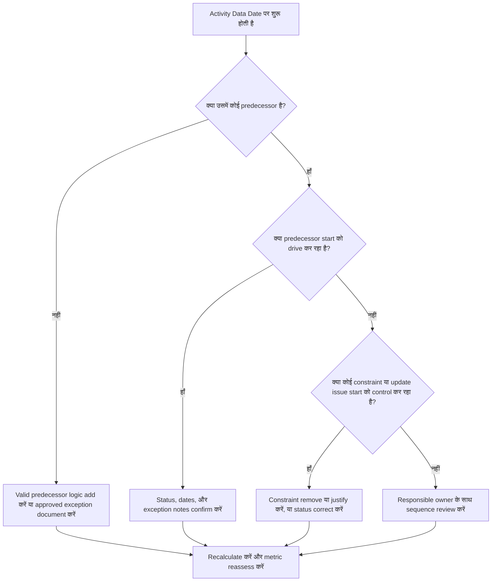

## उद्देश्य

यह guide schedulers और project controls teams को उन activities को reduce या eliminate करने में मदद करती है जो Primavera P6 Data Date पर valid predecessor logic के बिना शुरू होने के लिए scheduled हैं। यह schedule quality reviews, PMO health checks, और update-cycle validation पर apply होती है।

उद्देश्य यह confirm करना है कि near-term काम clear CPM logic से supported है और activities Data Date पर केवल इसलिए शुरू नहीं हो रहीं क्योंकि missing relationships, constraints, manual dates, या incomplete progress updates हैं।

## शुरू करने से पहले

Action लेने से पहले निम्नलिखित जानकारी इकट्ठा करें:

- इस metric के लिए current assessment result।
- Latest schedule calculation में उपयोग की गई Project Data Date।
- Data Date के बराबर start date वाली open या not-started activities की list।
- हर activity के लिए Predecessor और successor relationship details।
- Constraints, expected dates, actual dates, और calendar assignments।
- Update के लिए उपयोग किए गए P6 scheduling options, जिसमें retained logic या progress override settings शामिल हैं जहाँ relevant हों।
- कोई भी approved exceptions, जैसे project start activities, external interface milestones, या owner-directed starts।

## अपना Result समझें

एक strong result है zero unresolved activities जो Data Date पर driving predecessor logic के बिना शुरू हो रही हों। इसका मतलब है कि current और near-term काम schedule network से connected है और Data Date missing sequencing को hide नहीं कर रहा।

एक acceptable result में documented exceptions की एक small number शामिल हो सकती है। इन्हें reviewed और approved होना चाहिए, ignored नहीं। उदाहरण के लिए, एक notice-to-proceed milestone या एक externally authorized activity को normal predecessor की ज़रूरत नहीं हो सकती, लेकिन कारण reviewers को visible होना चाहिए।

एक weak result का मतलब है कि multiple activities Data Date पर clear logical driver के बिना शुरू हो रही हैं। यह open starts, missing predecessor relationships, excessive constraints, incomplete progress updates, या latest update के बाद properly resequence नहीं की गई activities indicate कर सकता है।

## Improvement Goal

Target है 0 unresolved activities जो Data Date पर valid driving logic के बिना शुरू हो रही हों।

Improvement goal केवल count reduce करना नहीं है। Deeper goal यह सुनिश्चित करना है कि Data Date के पास हर activity के forecast start के लिए एक defensible reason हो। Correction के बाद, हर affected activity में या तो appropriate predecessor logic होनी चाहिए, एक documented exception होना चाहिए, या एक corrected status/date condition होनी चाहिए।

## Action Plan

### Step 1: Main Issue Identify करें

एक P6 layout या report बनाएं जो Data Date के बराबर start date वाली open या not-started activities को filter करे। Activity ID, Activity Name, WBS, Start, Finish, Status, Total Float, Calendar, Primary Constraint, Predecessors, Successors, और Driving Relationship indicators (अगर उपलब्ध हों) के columns include करें।

हर activity की समीक्षा करें और पूछें:

- क्या activity में कोई predecessors हैं?
- अगर predecessors exist हैं, तो क्या वे actually start को drive कर रहे हैं?
- क्या activity किसी constraint से hold या move हो रही है?
- क्या activity में actual start या progress update missing है?
- क्या activity एक valid exception है, जैसे project start milestone?
- क्या activity किसी WBS area से belong करती है जहाँ logic generally weak है?

Findings को practical causes में group करें: missing predecessors, non-driving predecessors, constraints या expected dates, update/status errors, या approved exceptions।

### Step 2: Recommended Fixes Apply करें

Missing या weak logic से शुरू करें। Valid predecessor relationships add करें जो काम के real sequence को represent करें, जैसे finish-to-start, start-to-start, या finish-to-finish relationships जहाँ appropriate हों। केवल metric satisfy करने के लिए relationships add न करें; हर relationship एक real construction, engineering, procurement, access, approval, या handover dependency को reflect करनी चाहिए।

Constraints की अगली समीक्षा करें। अगर कोई activity start constraint के कारण Data Date पर शुरू हो रही है, तो confirm करें कि constraint contractually या operationally justified है। Unnecessary constraints remove करें और activity को logic से drive होने दें। अगर constraint valid है, तो कारण document करें और confirm करें कि यह critical path को distort नहीं करता।

Progress status check करें। अगर काम पहले ही शुरू हो चुका है, तो actual start और remaining duration correctly update करें। अगर काम शुरू नहीं हुआ, तो confirm करें कि forecast start Data Date पर रहना चाहिए। कोई activity केवल इसलिए शुरू होने के लिए ready नहीं दिखनी चाहिए क्योंकि update cycle ने उसे current date पर pull कर दिया।

Changes करने के बाद, schedule recalculate करें और affected activities को फिर से review करें। Confirm करें कि start date अब logic से driven है, correctly statused है, या approved exception के रूप में documented है।

### Step 3: Common Blockers Remove करें

Common blockers में unclear field feedback, missing interface information, और near-term काम को ready दिखाने का pressure शामिल हैं। Discipline leads, construction managers, procurement owners, या package managers के साथ affected activities review करके इन्हें resolve करें।

एक और common blocker है logic के substitute के रूप में constraints का misuse। Constraints कुछ cases में ज़रूरी हो सकते हैं, लेकिन उन्हें schedule network replace नहीं करना चाहिए। अगर constraint retain किया जाता है, तो document करें कि यह क्यों exist करता है और यह float और longest path को कैसे affect करता है।

यह भी check करें कि क्या issue schedule calculation settings या update practices के कारण है। अगर progress override, retained logic, out-of-sequence progress, या incomplete actualization result को affect कर रहा है, तो metric reassess करने से पहले update method को project controls procedure के साथ align करें।

### Step 4: Changes Validate करें

Next assessment से पहले corrected schedule validate करें। Data Date पर driving logic के बिना शुरू होने वाली open या not-started activities के लिए filter re-run करें। Confirm करें कि हर remaining item या तो corrected है या approved exception के रूप में documented है।

Recalculation के बाद total float, longest path, और near-term lookahead activities review करें। Logic correction critical path बदल सकती है या additional sequencing issues reveal कर सकती है। अगर schedule movement significant है, तो project controls lead या PMO reviewer को impact communicate करें।

## Improvement Schedule

### Day 1: Review और Diagnose करें

Metric run करें, Data Date confirm करें, और activity list produce करें। Results को missing logic, non-driving logic, constraints, status errors, और potential exceptions में अलग करें।

### Days 2-3: Priority Actions Implement करें

Highest-impact activities पहले correct करें, विशेष रूप से critical या near-critical activities। Valid predecessor logic add करें, unnecessary constraints remove करें, incorrect status update करें, और exceptions document करें।

### Days 4-5: Early Results Monitor करें

Schedule recalculate करें और review करें कि affected activities अब logic-driven हैं या नहीं। Total float, longest path, और milestone dates में unexpected changes check करें।

### Day 6: Final Adjustments करें

Responsible discipline या package owner के साथ remaining blockers resolve करें। Confirm करें कि retained exceptions justified हैं और clearly documented हैं।

### Day 7: Reassess और Compare करें

Assessment फिर से run करें और new result को previous result और target threshold के साथ compare करें। Confirm करें कि metric अब zero unresolved activities पर है या क्या further action required है।

## Progress Track करना

Corrections और approvals manage करने के लिए एक simple tracker उपयोग करें।

| दिनांक | Action लिया गया | Expected Impact | Result / Observation | Next Step |
| --- | --- | --- | --- | --- |
| [Date] | Data Date पर बिना driving logic के शुरू होने वाली activities की समीक्षा की | Missing या weak logic identify करें | [Observed result] | Corrections responsible owner को assign करें |
| [Date] | Valid predecessor relationships add किए | CPM sequencing improve करें | [Observed result] | Recalculate करें और float impact review करें |
| [Date] | Constraints remove या justify किए | Artificial starts reduce करें | [Observed result] | Remaining exceptions confirm करें |
| [Date] | Incorrect activity status update किया | Update accuracy improve करें | [Observed result] | Assessment re-run करें |

## अगर Results Improve नहीं हों

अगर result improve नहीं होता, तो review करें कि क्या same activities अभी भी fail हो रही हैं या क्या नई activities Data Date पर आ रही हैं। Repeated failures एक broader schedule development issue indicate कर सकती हैं, जैसे किसी WBS area में incomplete logic, weak update discipline, या constraints का inconsistent use।

Persistent issues को project controls lead, planning manager, या PMO reviewer तक escalate करें। Major schedules के लिए, affected work packages के लिए एक focused logic review workshop consider करें। अगर schedule contractual reporting, delay analysis, या earned value forecasting के लिए उपयोग की जाती है, तो unresolved items को एक quality concern के रूप में treat करना चाहिए।

## Maintenance

Schedule issue करने से पहले हर update cycle के दौरान इस metric को review करें। Check schedule health review के standard हिस्से का हिस्सा होनी चाहिए, विशेष रूप से progress updates, resequencing, major scope changes, या recovery planning के बाद।

Good maintenance habits में P6 layouts में predecessor और successor columns visible रखना, हर submission से पहले open starts review करना, approved exceptions document करना, और यह check करना शामिल है कि Data Date movement undriven activities का कोई नया group नहीं बनाता।

## Summary Checklist

- [ ] Current result reviewed
- [ ] Target threshold confirmed
- [ ] Data Date confirmed
- [ ] Data Date पर शुरू होने वाली activities identified
- [ ] Main issue identified
- [ ] Missing या weak logic corrected
- [ ] Constraints reviewed और justified या removed
- [ ] Status dates checked
- [ ] Approved exceptions documented
- [ ] Schedule recalculated
- [ ] Results monitored
- [ ] Assessment repeated
- [ ] Next steps documented
