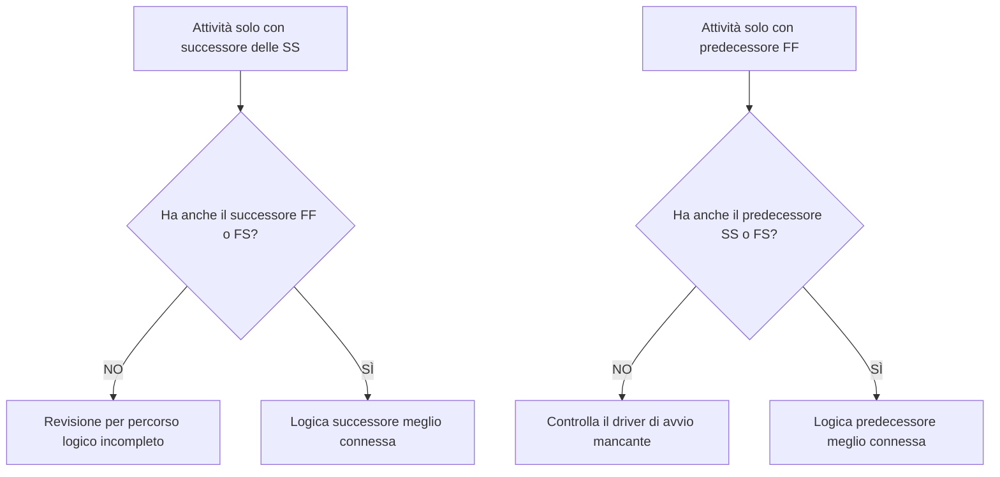

# Logica robusta

La logica è la rappresentazione matematica della sequenza e delle dipendenze all'interno della pianificazione di un progetto. Spiega cosa deve accadere prima di cosa, quali attività possono svolgersi contemporaneamente e come il team di progetto intende passare dalla prima attività al completamento finale.

In un buon palinsesto Primavera P6, la logica non è decorazione. È il motore che consente alla pianificazione di calcolare date, fluttuazione, percorso critico e previsione del movimento. Racconta la storia dell'esecuzione in un modo che può essere rivisto, messo in discussione e migliorato.

Se il cronoprogramma dice "gettare le fondamenta, poi costruire i muri, poi costruire il tetto", la logica è ciò che trasforma quella sequenza in una rete calcolabile. Il pianificatore non sta solo disegnando una sequenza temporale. Il pianificatore sta definendo il percorso di consegna.

## La logica racconta la storia dell'opera

Ogni team di progetto ha un modo previsto per eseguire il progetto. L'ingegneria può rilasciare il progetto per area. L'approvvigionamento può consegnare le apparecchiature tramite pacco. I lavori civili possono preparare l'accesso prima che inizino i lavori strutturali. Potrebbe essere necessario il completamento meccanico prima dell'inizio della messa in servizio.

I collegamenti logici sono l'espressione matematica di quel piano.

Questo semplice diagramma non è solo una sequenza. È un modello decisionale. Se le fondamenta sono in ritardo, i muri potrebbero essere in ritardo. Se i muri sono in ritardo, il tetto potrebbe essere in ritardo. Se il tetto è in ritardo, i lavori interni potrebbero risentirne. La pianificazione può mostrare tale impatto solo se la logica è presente.

Una logica solida significa che il cronoprogramma può spiegare perché le attività iniziano, perché finiscono e cosa succede quando una parte del piano si sposta.

## Perché una logica solida è importante alla data di aggiornamento

La metrica "Attività che iniziano alla data di aggiornamento senza logica determinante" è un test importante per la qualità del cronoprogramma.

La Data Data è il confine tra le prestazioni effettive e il lavoro previsto. Quando un'attività inizia esattamente alla Data Data, il revisore dovrebbe porre una semplice domanda: cosa determina questo inizio?

Se l'attività ha una logica precedente valida, la pianificazione può spiegare l'inizio. Forse un'area è stata liberata. Forse è stata completata una consegna di materiale. Forse l'attività precedente è terminata e ha consentito all'equipaggio successivo di iniziare.

Se l'attività non ha una logica guida, l'avvio è più debole. L'attività potrebbe trovarsi sulla data di aggiornamento perché non ha un predecessore, perché la logica è incompleta, perché un vincolo la sta forzando o perché lo stato dell'aggiornamento non è stato completo.

Ecco perché la logica solida è importante. Una pianificazione non dovrebbe consentire che il lavoro appaia pronto solo perché la data di aggiornamento è spostata. Dovrebbe mostrare la condizione reale che consente l'inizio dei lavori.

## L’equilibrio: logica sufficiente, non logica ridondante

La buona logica è equilibrata. La pianificazione necessita di relazioni sufficienti per collegare correttamente le attività ai predecessori e ai successori. Allo stesso tempo, dovrebbe evitare la logica ridondante che ripete la stessa dipendenza in modi non necessari.

Troppa poca logica crea inizi aperti, finali aperti, fluttuazione inaffidabile e risultati deboli del percorso critico. Troppa logica può rendere difficile la revisione della rete e può nascondere il vero motore di un’attività.

L’obiettivo non è massimizzare il numero di relazioni. L'obiettivo è rappresentare chiaramente le dipendenze obbligatorie e richieste.

Per ogni attività, lo schedulatore dovrebbe essere in grado di rispondere:

- Cosa permette l'avvio di questa attività?
- Cosa consente questa attività in seguito?
- Quale relazione sta veramente guidando l’attività?
- Qualche relazione è duplicata o non necessaria?
- Un revisore capirebbe la sequenza prevista?

Questo equilibrio è fondamentale per le revisioni della pianificazione del PMO. Una rete fitta non è automaticamente una rete forte. Una rete leggera non è automaticamente una rete pulita. La rete giusta spiega il piano di esecuzione senza confusione.

## Ogni attività necessita di un driver di avvio

Una logica robusta significa che ogni attività ha un predecessore che ne consente o ne attiva l'avvio, ad eccezione di eccezioni di avvio di progetto valide o autorizzate esternamente.

Per un'attività di costruzione, il fattore iniziale può essere l'accesso all'area, il completamento precedente, la disponibilità dei materiali, il rilascio del progetto, l'approvazione del permesso o il precedente completamento dell'attività commerciale. Per un'attività di approvvigionamento, può trattarsi dell'approvazione del progetto o del rilascio dell'ordine di acquisto. Per la messa in servizio, può trattarsi del completamento meccanico, della disponibilità del pacchetto di test o del ricambio del sistema.

Quando manca questo driver iniziale, l'attività può spostarsi in una posizione artificiale nella pianificazione. Durante gli aggiornamenti, potrebbe apparire alla Data di aggiornamento. Ciò crea un falso senso di preparazione.

Considera un'attività chiamata "Installa pompe". Se inizia alla Data Data ma non ha precedenti per il completamento delle fondazioni, la consegna delle pompe o la consegna dell'area, il cronoprogramma non spiega il motivo per cui l'installazione può iniziare. L'attività può essere pianificata, ma la logica non è solida.

## SS e FF sono relazioni a metà

Le relazioni Inizio-Inizio e Fine-Fine sono utili, ma devono essere utilizzate con attenzione. In molte revisioni della pianificazione, è meglio intenderle come "mezze" relazioni perché da sole non inseriscono completamente l'attività in un percorso logico completo.

Una relazione SS può spiegare quando un'attività può iniziare, ma potrebbe non spiegare quando l'attività deve terminare o cosa consegna. Una relazione FF può spiegare l'allineamento finale, ma potrebbe non spiegare quando è consentito iniziare l'attività.

Ciò non rende SS o FF sbagliati. Il lavoro sovrapposto è comune e spesso realistico. Il problema è se l’attività è completamente connessa.

Per esempio:

- Un'attività con un successore SS dovrebbe solitamente avere anche un successore FF o FS.
- Un'attività con un predecessore FF solitamente dovrebbe avere anche un predecessore SS o FS.

Ciò aiuta a evitare che le attività vengano collegate solo a un lato della loro durata. Il cronoprogramma dovrebbe spiegare sia come inizia il lavoro sia come lo completa.

## Logica robusta nella pratica

Una revisione logica pratica dovrebbe iniziare con le attività vicine alla data di aggiornamento, il lavoro critico e quasi critico e i principali percorsi di passaggio di consegne. Queste aree hanno il maggiore impatto sul processo decisionale attuale.

In P6, le colonne di revisione utili includono ID attività, Nome attività, WBS, Inizio, Fine, Stato attività, Margine totale, predecessori, successori, tipo di relazione, ritardo, vincoli, calendario e indicatori di relazione determinante, se disponibili.

Per ogni attività che inizia alla data di aggiornamento, chiedere:

- L’attività è davvero pronta per iniziare?
- Quale predecessore consente l'avvio?
- Il predecessore è completo, in corso o previsto?
- La relazione è trainante?
- Un vincolo o una data prevista sostituiscono la logica?
- L'attività ha anche una logica successiva valida?

Se la risposta non è chiara, l'attività dovrebbe essere esaminata con il proprietario responsabile. La correzione potrebbe essere l'aggiunta di un predecessore mancante, la modifica del tipo di relazione, la rimozione di un vincolo, l'aggiornamento degli effettivi o la documentazione di un'eccezione valida.

## Evitare la logica artificiale

Un errore è aggiungere relazioni solo per passare una metrica. Ciò non crea una logica solida. Crea una logica artificiale.

Le relazioni dovrebbero rappresentare dipendenze reali. Se un collegamento non riflette la sequenza di costruzione, il rilascio della progettazione, le esigenze di approvvigionamento, l'accesso, l'approvazione, il test, la messa in servizio o la consegna, potrebbe non appartenere alla rete.

Un altro errore è abbandonare la logica ridondante perché sembra più sicura. Se la stessa dipendenza è già rappresentata da una relazione più chiara, collegamenti aggiuntivi potrebbero confondere il percorso critico e rendere la rete più difficile da controllare.

La logica solida è chiara, propositiva e difendibile.

## Conclusione

La logica è la storia matematica di come verrà eseguito il progetto. Definisce cosa deve accadere prima, cosa può accadere insieme e cosa segue dopo.

Una logica robusta non significa aggiungere il maggior numero possibile di collegamenti. Significa aggiungere i collegamenti giusti: sufficienti per collegare ogni attività ai reali predecessori e successori, ma non così tanti da rendere la rete ridondante o fuorviante.

Quando le attività iniziano alla Data Data senza alcuna logica guida, la pianificazione mette in luce un punto debole di quella storia. L'attività potrebbe essere mostrata come pronta, ma la rete non spiega il motivo.

Un cronoprogramma affidabile dovrebbe rispondere chiaramente a questa domanda. Cosa consente l’avvio di questo lavoro? Cosa abilita dopo? Se il cronoprogramma può rispondere ad entrambi, la logica sta diventando solida. In caso contrario, il team di progetto avrà più lavoro di sequenziamento da svolgere prima che la previsione possa essere considerata attendibile.
## Contenuti correlati
- [Dipendenze mancanti in Primavera P6 - Panoramica](../../metrics/21_missing_dependencies/02_guide_template.md)
- [Logica ridondante negli orari Primavera P6 - Panoramica](../../metrics/06_redundant_logic/02_guide_template.md)
- [Cos'è un cronoprogramma](../01_WHAT%20A%20SCHEDULE%20IS/01_blog.md)
- [Percorso critico](../03_CRITICAL%20PATH/03_CRITICAL%20PATH.md)
