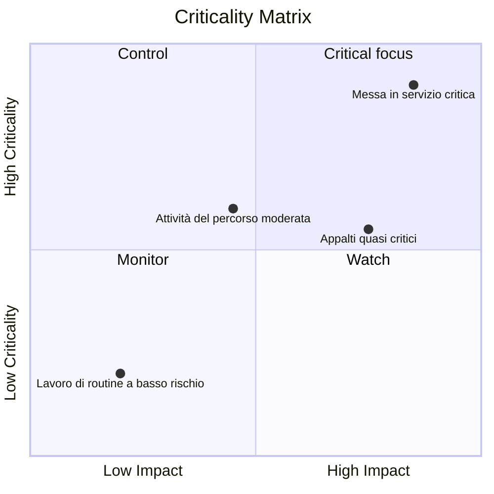

# Matrice di criticità

Una matrice di criticità è un metodo visivo o analitico utilizzato per classificare e dare priorità alle attività del progetto in base alla loro criticità per il completamento del progetto. In un contesto Primavera P6, aiuta i responsabili di progetto, i pianificatori e i revisori del PMO a identificare quali attività creano il maggior rischio di pianificazione.

Il percorso critico racconta l'attuale storia deterministica della pianificazione. Una matrice di criticità fa un ulteriore passo avanti. Aiuta il team a capire quali attività sono già critiche, quali sono prossime a diventarlo e quali causerebbero un grave impatto se scivolassero.

Ciò è importante perché l’attività critica oggi non è sempre l’unica attività che merita attenzione. Un'attività quasi critica con un elevato impatto ritardato potrebbe diventare il problema di domani. Un’attività di approvvigionamento di lunga durata potrebbe non trovarsi sull’attuale percorso critico, ma potrebbe comportare rischi sufficienti da giustificare uno stretto controllo.

## Cosa significa criticità in P6

In Primavera P6, la criticità si riferisce solitamente alla possibilità che un'attività possa influenzare la data di fine del progetto se viene ritardata. Tradizionalmente, P6 identifica le attività critiche utilizzando le impostazioni del margine totale o del percorso più lungo.

La definizione deterministica comune è semplice:

- Le attività critiche sono attività con margine pari a zero o negativo.
- Queste attività si trovano sul percorso critico o sono strettamente legate ad esso.
- Se vengono ritardati, è probabile che la data di fine del progetto venga ritardata.

Questa definizione è utile, ma non è completa. Si basa su una condizione di pianificazione calcolata. Non spiega completamente l’incertezza, la probabilità o l’entità dell’impatto se un’attività dovesse slittare.

Una matrice di criticità espande la discussione da "questa attività è critica oggi?" a "quanto è probabile che questa attività diventi critica e quanti danni potrebbe causare?"

## Cosa combina una matrice di criticità

Una matrice di criticità normalmente combina due dimensioni.

La prima dimensione è la sensibilità o probabilità della pianificazione. Ciò può essere misurato dalla frequenza con cui un'attività diventa critica durante la simulazione Monte Carlo o da quanto è vicina alla critica in base al margine totale o alle soglie quasi critiche.

La seconda dimensione è l’impatto. Ciò significa la gravità del ritardo se l'attività slitta. L'impatto può essere basato sulla durata dell'attività, sull'effetto di ritardo sulla conclusione del progetto, sull'indice di sensibilità, sull'esposizione ai costi, sull'impatto delle tappe contrattuali o sul giudizio del gestione.

Insieme, queste dimensioni aiutano il team a stabilire le priorità delle attività.

Questo tipo di visualizzazione è utile perché separa le attività che compaiono semplicemente nel filtro critico dalle attività che meritano un'attenzione da parte del gestione attivo.

## Una struttura a matrice semplice

Una matrice di criticità di base può essere rappresentata come una griglia:

| Criticità/Impatto | Basso impatto | Impatto medio | Alto impatto |
| --- | --- | --- | --- |
| Bassa criticità | Monitorare | Monitorare | Orologio |
| Criticità media | Revisione | Controllare | Alta priorità |
| Alta criticità | Controllare | Alta priorità | Focus critico |

Le etichette esatte possono cambiare a seconda dell'organizzazione, ma l'idea rimane la stessa. È possibile monitorare le attività a bassa criticità e a basso impatto. Le attività ad alta criticità e ad alto impatto richiedono un controllo mirato.

## P6 Dati utilizzati nella matrice

Primavera P6 solitamente non fornisce una visualizzazione della matrice di criticità incorporata per impostazione predefinita. La matrice viene comunemente costruita utilizzando i dati sull'attività P6 combinati con analisi esterne.

I campi utili P6 includono:

- Margine totale.
- Flottazione libera.
- Durata dell'attività.
- Durata rimanente.
- Stato dell'attività.
- Date di inizio e fine.
- Vincoli.
- Logica delle relazioni.
- Calendario.
- WBS o codici attività.
- Indicatori del percorso critico o più lungo.

Questi dati forniscono la visualizzazione deterministica della pianificazione. Mostra il percorso calcolato corrente, il lavoro quasi critico, le attività limitate e le attività con esposizione rimanente a lungo.

## Input di analisi del rischio

Per rendere la matrice più potente, il team può aggiungere dati probabilistici sul rischio di pianificazione provenienti dall'analisi Monte Carlo. Ciò può provenire da strumenti come Primavera Risk Analysis o altre piattaforme di simulazione del rischio.

Importanti parametri di rischio includono l'indice di criticità, il margine totale, l'indice di sensibilità della pianificazione e la durata o il valore di impatto.

L'indice di criticità, spesso chiamato CI, mostra la percentuale di simulazioni in cui un'attività appare sul percorso critico. Ad esempio, se un'attività ha CI = 80%, sarebbe stata critica nell'80% degli scenari simulati.

margine totale mostra quanto un'attività è vicina a influenzare la fine del progetto nella pianificazione deterministica. Il margine vicino allo zero è un segnale di avvertimento.

L'indice di sensibilità della pianificazione combina criticità e impatto. Aiuta a mostrare non solo se l'attività diventa critica, ma anche se influisce in modo significativo sul risultato.

La durata o il valore dell'impatto aiutano a stimare la gravità. Un’attività più lunga, un pacchetto di appalti ad alto rischio o un compito connesso a un traguardo contrattuale possono avere un impatto maggiore se ritardati.

## Esempio

Considera il seguente insieme di attività semplificato:

| Attività | Galleggiante | Indice di criticità | Durata | Risultato della matrice |
| --- | ---: | ---: | ---: | --- |
| UN | 0 giorni | 95% | 20 giorni | Focus critico |
| B | 5 giorni | 60% | 15 giorni | Alta priorità |
| C | 20 giorni | 15% | 10 giorni | Monitorare |

L'attività A appartiene all'area ad alta criticità e ad alto impatto. Non ha fluttuazione, appare critico nella maggior parte delle simulazioni e ha una lunga durata. Merita un controllo mirato.

L’attività B potrebbe non essere urgente come l’attività A, ma merita comunque attenzione. Ha un margine limitato e una significativa probabilità di diventare critico.

L'attività C ha più margine e minore criticità. Non dovrebbe essere ignorato, ma non richiede lo stesso livello di attenzione da parte del gestione.

## Perché è utile

Una matrice di criticità aiuta il team di progetto a evitare di fare affidamento solo sul singolo percorso critico deterministico. Il percorso deterministico è importante, ma è solo una visione della pianificazione.

La matrice aiuta i team:

- Dai la priorità a cosa monitorare da vicino.
- Concentrare la mitigazione sulle principali attività di rischio.
- Identificare le attività quasi critiche prima che diventino critiche.
- Comprendere il rischio di pianificazione probabilistica.
- Confronta probabilità e impatto in un'unica visualizzazione.
- Comunicare più chiaramente il rischio di pianificazione al gestione.

Per il reporting PMO, ciò è particolarmente utile perché traduce la complessità della pianificazione in un quadro decisionale. Invece di presentare centinaia di attività, il team può mostrare quali attività si trovano nelle zone "focus critico", "alta priorità", "controllo" o "monitoraggio".

## Un modo semplice per costruirne uno

Inizia esportando i dati delle attività da P6. Include ID attività, Nome attività, WBS, Margine totale, Durata rimanente, Inizio, Fine, Calendario, vincoli e indicatori di percorso critico o più lungo.

Quindi aggiungi campi facoltativi di analisi del rischio, come Indice di criticità e Indice di sensibilità della pianificazione. Se i dati della simulazione non sono disponibili, utilizzare soglie pratiche basate sul margine e sulla durata. Ad esempio, una criticità elevata potrebbe significare un margine totale inferiore o uguale a 0 giorni o un CI superiore al 70%. La criticità media potrebbe significare un margine quasi critico o un CI compreso tra il 40% e il 70%.

Definire le soglie di impatto. Un'attività ad alto impatto può essere di lunga durata, legata a un traguardo contrattuale, parte di un pacchetto ad alto rischio o mostrata dalla simulazione come in grado di influenzare la conclusione del progetto.

Infine, traccia le attività in Excel, Power BI o un altro strumento di reporting. Il risultato non deve essere complicato. Il valore deriva dal rendere visibile la priorità.

## Usa il giudizio

Una matrice di criticità è uno strumento di supporto alle decisioni, non una risposta automatica. Le soglie dovrebbero essere riviste dal team di controllo di progetto e adattate al tipo di progetto, alla sensibilità del contratto e alla scadenza della pianificazione.

Ricorda inoltre che la matrice dipende dalla qualità del cronoprogramma. Se il cronoprogramma P6 presenta una logica mancante, durate non realistiche, vincoli rigidi, calendari inadeguati o aggiornamenti di stato deboli, la matrice erediterà tali punti deboli.

Il miglior utilizzo della matrice è combinare l'output analitico con il giudizio di pianificazione professionale.

## Conclusione

Una matrice di criticità classifica le attività del progetto in base alla probabilità che diventino critiche e all’impatto che avrebbero se ritardate. Utilizza dati P6 come margine totale, durata, vincoli e logica e può essere rafforzato con risultati Monte Carlo come l'indice di criticità e l'indice di sensibilità della pianificazione.

Per i responsabili di progetto e i revisori del PMO, la matrice trasforma il rischio di pianificazione in una conversazione gestionale più chiara. Aiuta il team a concentrarsi sulle attività che contano di più, non solo sulle attività che appaiono nel filtro critico di oggi.

Se utilizzata correttamente, una matrice di criticità aiuta il team di progetto a passare dal reporting reattivo al controllo proattivo della pianificazione.
## Contenuti correlati
- [Percorso critico o percorso del margine che inizia con un vincolo - Panoramica](../../metrics/09_cp_or_float_path_starting_with_constraint/02_guide_template.md)
- [Percorso critico](../03_CRITICAL%20PATH/03_CRITICAL%20PATH.md)
- [Tipi di attività in P6](../05_ACTIVITY%20TYPES%20IN%20P6/05_ACTIVITY%20TYPES%20IN%20P6.md)
