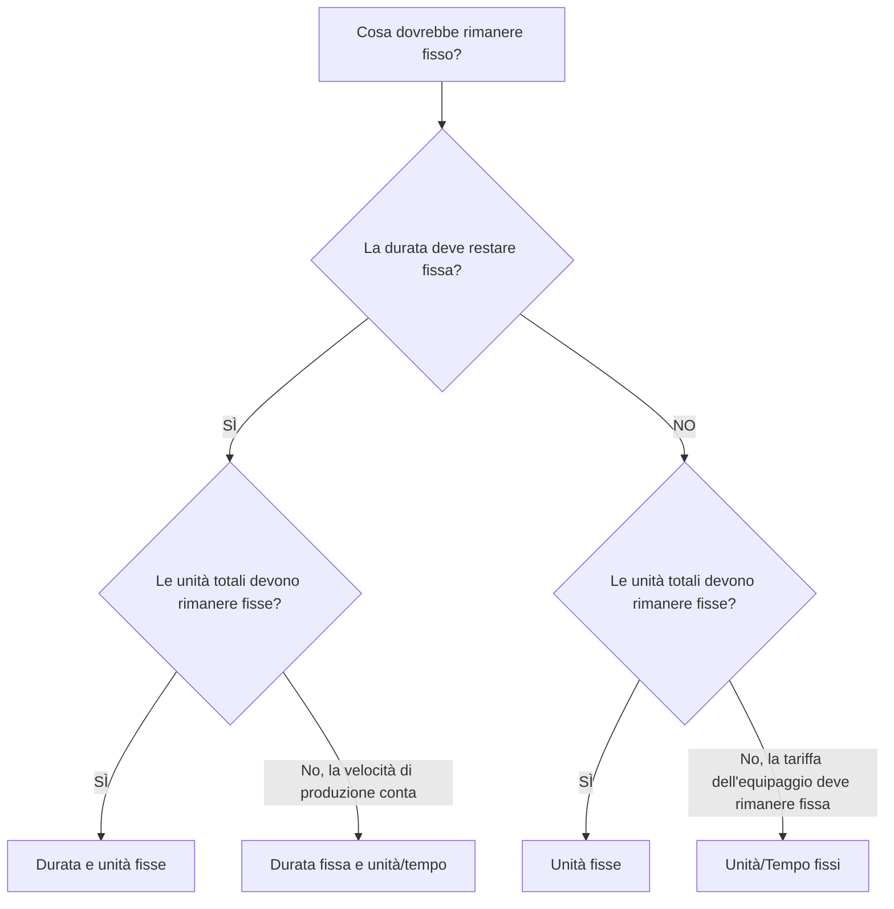

Tipo di durata è uno dei campi di Primavera P6 che controlla il comportamento di un'attività quando cambiano durata, unità e produttività delle risorse. È facile trascurarlo, ma può influire sulle date di pianificazione, sul caricamento delle risorse, sulle previsioni dei costi, sul valore maturato e sul comportamento degli aggiornamenti.

Molti pianificatori considerano la durata solo come un numero di giorni. In P6 la durata è più di un numero. Un'attività può anche contenere unità di manodopera, unità non di manodopera, unità per tempo, calendari delle risorse, calendari delle attività e lavoro rimanente. Il Tipo di Durata indica a P6 cosa dovrebbe rimanere fisso quando la pianificazione viene ricalcolata o quando il pianificatore modifica risorse e durate.

Questo blog spiega i principali tipi di durata disponibili per le attività in P6, come differiscono, a cosa serve ciascuno e quando utilizzarne uno anziché un altro.

## Il tipo di durata non è uguale al campo Durata

Prima di esaminare i tipi, è utile separare due idee.

I campi Durata sono valori come Durata originale, Durata rimanente, Durata effettiva e Durata al completamento. Questi descrivono il tempo.

Il tipo di durata è un'impostazione di calcolo. Indica a P6 come bilanciare la durata, le unità totali e le unità per volta quando qualcosa cambia.

Ad esempio, se aggiungi più risorse a un'attività, l'attività dovrebbe terminare prima? Oppure la durata dovrebbe rimanere la stessa e lo sforzo totale aumentare? La risposta dipende dal tipo di durata.

## I principali tipi di durata

I tipi di durata P6 comuni sono:

- Durata e unità fisse.
- Durata fissa e unità/tempo.
- Unità fisse.
- Unità/Tempo fissi.

I nomi possono sembrare tecnici a prima vista, ma ognuno risponde a una domanda pratica: quale parte dell’attività dovrebbe proteggere P6 quando qualcosa cambia?

## Durata e unità fisse

Durata e unità fisse mantiene fissa la durata dell'attività e le unità totali. Se le unità per tempo cambiano, P6 regola la velocità anziché modificare la durata o lo sforzo totale.

Questa tipologia è utile quando si intende che sia la finestra temporale pianificata che l'impegno totale rimangano stabili.

Esempio:

È prevista un'attività di 10 giorni con 400 ore di manodopera. Il team di pianificazione desidera che la durata rimanga di 10 giorni e che l'impegno totale preventivato rimanga di 400 ore. Se i dettagli dell'assegnazione delle risorse cambiano, la durata pianificata e le unità totali non dovrebbero spostarsi automaticamente.

Utilizza durata e unità fisse quando:

- L'attività ha una finestra di lavoro fissa.
- Lo sforzo totale è già concordato.
- Le modifiche alla tariffa delle risorse non dovrebbero modificare automaticamente la durata dell'attività.
- La pianificazione viene utilizzata per il controllo dei costi stabili o del valore maturato.

Ciò è spesso utile per i pacchetti di lavoro gestiti in cui sono controllati sia la durata della pianificazione che l'impegno preventivato.

## Durata fissa e unità/tempo

Durata fissa e unità/tempo mantiene fissa la durata e la tariffa delle risorse. Se le risorse vengono aggiunte o rimosse, P6 può modificare le unità totali.

Questo tipo è utile quando l'attività deve verificarsi durante un intervallo di tempo fisso e la velocità di caricamento delle risorse deve rimanere coerente.

Esempio:

Un'attività di supporto alla gestione del progetto dura 20 giorni. Il team assegna un ingegnere di progetto a 8 ore al giorno. La durata dovrebbe rimanere di 20 giorni e la tariffa giornaliera dovrebbe rimanere di 8 ore al giorno. Le unità totali sono il risultato della finestra temporale e della tariffa.

Utilizza durata fissa e unità/ora quando:

- La durata dell'attività è fissa.
- La tariffa giornaliera o oraria delle risorse è importante.
- Le unità totali devono essere calcolate in base alla durata e alla tariffa.
- L'attività rappresenta un supporto continuo o un periodo di lavoro fisso.

Ciò può essere utile per la supervisione, la gestione, il supporto all'ispezione o le attività di supporto basate sul tempo.

## Unità fisse

Unità fisse mantiene fisse le unità totali. Se il tasso delle risorse cambia, P6 può modificare la durata.

Questa tipologia è utile quando la quantità di lavoro è fissa, ma la durata dipende dalla produttività o dalla disponibilità delle risorse.

Esempio:

Un'attività richiede 800 ore di lavoro. Se la squadra assegna più capacità all'equipaggio, l'attività potrebbe terminare prima. Se è disponibile una capacità inferiore dell'equipaggio, l'attività potrebbe richiedere più tempo. Il lavoro totale rimane 800 ore.

Utilizza le unità fisse quando:

- La quantità di lavoro o sforzo totale è fissa.
- La durata dovrebbe rispondere alla disponibilità delle risorse o alla produttività.
- Le dimensioni dell'equipaggio possono modificare il tempo necessario per completare l'attività.
- La pianificazione delle risorse è attiva e mantenuta.

Ciò può essere utile per il lavoro in stile produzione in cui si conosce lo sforzo totale e si prevede che la durata risponda al carico dell'equipaggio.

## Unità/Tempo fissi

Unità/Tempo fisse mantiene fissa la tariffa delle risorse. Se la durata cambia, le unità totali cambiano con essa.

Questo tipo è utile quando un equipaggio o una risorsa lavora a ritmo fisso per tutta la durata dell'attività.

Esempio:

Un'attività di supervisione del sito utilizza un supervisore per 8 ore al giorno. Se la durata dell'attività aumenta da 10 giorni a 15 giorni, le unità totali dovrebbero aumentare perché il supervisore è necessario per più giorni. La tariffa giornaliera rimane fissa.

Utilizza unità/ora fisse quando:

- La tariffa dell'equipaggio o delle risorse è fissa.
- Le unità totali dovrebbero aumentare o diminuire al variare della durata.
- L'attività rappresenta uno sforzo basato sul tempo.
- La risorsa viene assegnata per l'intera durata dell'attività.

Ciò è spesso utile per attività di supporto, supervisione, ispezione e gestione in cui il tempo determina l'impegno totale.

## Come scegliere il giusto tipo di durata

Il tipo di durata migliore dipende da cosa rappresenta l'attività e da come il team di controllo di progetto si aspetta che P6 calcoli le modifiche.

Un modo semplice per scegliere è chiedere:

- La durata è fissata dal piano, dal contratto, dalla finestra o dall'accesso?
- L'impegno totale è fissato in base alla quantità, al budget o alla stima?
- La tariffa delle risorse è fissata dal piano dell'equipaggio o dal piano del personale?
- L'aggiunta di risorse dovrebbe abbreviare l'attività?
- L'estensione dell'attività dovrebbe aumentare le unità totali?

Se la durata e le unità totali devono rimanere fisse, utilizzare Durata fissa e unità.

Se la durata e il tasso di produzione devono rimanere fissi, utilizzare Durata fissa e Unità/Tempo.

Se il lavoro totale deve rimanere fisso e la durata deve rispondere al caricamento delle risorse, utilizzare Unità fisse.

Se la tariffa delle risorse deve rimanere fissa e le unità devono cambiare con la durata, utilizzare Unità/tempo fisse.

## Esempi pratici

Per un getto di calcestruzzo pianificato come operazione fissa di 1 giorno con un budget di personale e costi definito, Durata fissa e unità potrebbero essere appropriate.

Per il supporto alla gestione del progetto assegnato a una tariffa giornaliera costante per un periodo di reporting fisso, Durata fissa e unità/tempo o Unità fissa/tempo può essere appropriato a seconda che le unità totali o le modifiche alla durata debbano guidare la previsione.

Per un'attività di installazione con una quantità totale di lavoro nota in cui le dimensioni della squadra influiscono sui tempi di completamento, le unità fisse possono essere appropriate.

Per la supervisione del sito che continua per tutta la durata del periodo di costruzione, può essere appropriato utilizzare unità/tempo fissi.

Il punto importante è che la scelta dovrebbe riflettere il metodo di controllo di progetto, non l’abitudine.

## Errori comuni

Un errore comune è lasciare il Tipo di durata predefinito su ogni attività senza verificare se corrisponde allo scopo dell'attività.

Un altro errore è l'utilizzo del comportamento di durata basato sulle risorse quando il progetto non gestisce attentamente le assegnazioni delle risorse. Se i dati sulle risorse sono deboli, il calcolo basato sulle risorse può creare risultati inaffidabili.

Un terzo errore è modificare la durata durante gli aggiornamenti senza capire come P6 ricalcolerà le unità o le tariffe. Ciò può influire sul caricamento dei costi, sul valore maturato e sugli istogrammi delle risorse.

Infine, evita di considerare il tipo di durata come un'impostazione puramente tecnica. Influisce sul comportamento della pianificazione quando il piano cambia.

## Tipo di durata e qualità del cronoprogramma

Il tipo di durata fa parte della qualità del cronoprogramma perché influisce sulla credibilità della previsione. Se la durata, le unità e la tariffa delle risorse di un'attività non si comportano come previsto, la pianificazione potrebbe mostrare date o richieste di risorse fuorvianti.

Per le revisioni PMO, è utile verificare se i tipi di durata sono coerenti tra gruppi di attività simili. Le attività di ingegneria, le attività di approvvigionamento, le attività di costruzione, le attività LOE e le attività di supporto possono richiedere regole diverse, ma le scelte dovrebbero essere intenzionali.

Se la pianificazione è ricca di risorse, il Tipo di durata diventa ancora più importante. Aiuta a determinare se le modifiche alle risorse influiscono sulla durata, sulle unità totali o sulle unità per volta.

## Conclusione

I tipi di durata in P6 definiscono il modo in cui le attività rispondono quando cambiano la durata, le unità totali e le tariffe delle risorse. Non sono solo impostazioni dello sfondo.

Durata fissa e unità protegge sia il tempo che l'impegno totale. La durata fissa e le unità/tempo proteggono il tempo e la tariffa. Le Unità fisse proteggono lo sforzo totale. Unità/tempo fisse protegge la tariffa delle risorse.

La scelta del tipo di durata corretto aiuta a calcolare la pianificazione in modo che corrisponda al piano del progetto. Inoltre, semplifica la comprensione e la difesa del caricamento delle risorse, degli aggiornamenti sui progressi, delle previsioni dei costi e dei report di pianificazione.
## Contenuti correlati
- [Attività che iniziano alla data di aggiornamento senza alcuna logica guida: perché questa metrica di pianificazione è importante - Panoramica](../../metrics/01_activities_starting_in_dd_with_no_logic_driving/02_guide_template.md)
- [Tipi di attività in P6](../05_ACTIVITY%20TYPES%20IN%20P6/05_ACTIVITY%20TYPES%20IN%20P6.md)
- [Date in P6](../07_DATES%20IN%20P6/07_DATES%20IN%20P6.md)
