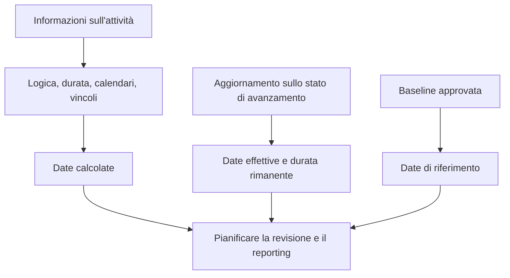

# Date in P6

Le date in Primavera P6 possono creare confusione perché un'attività non ha solo una data di inizio e una data di fine. Può contenere date pianificate, date di pianificazione correnti, date iniziali, date finali, date effettive, date di base, date di vincolo, date previste e talvolta date esterne o relative alla previsione a seconda del layout e delle impostazioni del progetto.

Queste date non significano tutte la stessa cosa. Alcuni sono calcolati secondo la logica CPM. Alcuni vengono inseriti durante gli aggiornamenti sullo stato di avanzamento. Alcuni sono usati per il confronto. Alcuni vengono utilizzati per controllare o limitare la pianificazione. Comprendere la differenza è essenziale per la qualità del cronoprogramma, il reporting PMO, la disponibilità dell'analisi dei ritardi e il controllo di base del progetto.

La domanda più importante è semplice: cosa mi dice questa data e da dove viene?

## Perché P6 ha così tante date

P6 non è solo un elenco di date. È un modello di calcolo. Il software calcola le date dalla durata delle attività, dai calendari, dalle relazioni, dai vincoli, dalle risorse, dallo stato di avanzamento e dalla data di aggiornamento.

Esistono diversi campi data perché i pianificatori devono rispondere a domande diverse:

- Qual era il piano originale?
- Qual è la previsione attuale?
- Cosa è successo realmente?
- Quanto prima l'attività può iniziare o terminare?
- Qual è l'ultima cosa che può iniziare o finire senza influenzare il progetto?
- Un vincolo forza l’attività?
- Come si confronta il piano attuale con quello di base?

Il problema inizia quando questi tipi di data vengono mescolati insieme senza comprenderne lo scopo.

## Data di aggiornamento

La data di aggiornamento non è una data di attività, ma controlla il modo in cui devono essere interpretate tutte le date di attività.

La Data Data è il confine tra le prestazioni effettive e il lavoro previsto. Il lavoro prima della data di aggiornamento dovrebbe essere attualizzato o classificato. Dovrebbe essere previsto il lavoro successivo alla data di aggiornamento.

Se un'attività ha date effettive successive alla data di aggiornamento, in genere si tratta di un errore di stato. Se un'attività aperta inizia esattamente alla data di aggiornamento senza alcuna logica determinante, ciò potrebbe indicare la mancanza di sequenziamento. Se la fine prevista è precedente alla data di aggiornamento, ciò potrebbe indicare informazioni di aggiornamento obsolete.

Prima di rivedere qualsiasi data di attività, confermare la data di aggiornamento.

## Inizio e fine

Inizio e Fine sono le date di pianificazione principali che la maggior parte degli utenti vede nei layout P6. Rappresentano le date correnti calcolate o pianificate per l'attività in base ai dati di pianificazione.

Per le attività non iniziate, Inizio e Fine sono date previste. Per le attività in corso, possono combinare lo stato attuale e le previsioni rimanenti. Per le attività completate, dovrebbero essere allineate alle date effettive.

Queste sono solitamente le date utilizzate nei report, nelle pianificazioni anticipate e nelle discussioni di gestione. Tuttavia, non dovrebbero essere accettati senza verificarne la logica e lo stato.

Utilizza Inizio e Fine per rispondere: quando è attualmente programmato l'inizio e la fine dell'attività?

## Inizio anticipato e fine anticipata

Inizio anticipato e Fine anticipata sono date di calcolo del CPM. Mostrano le prime date in cui un'attività può iniziare e finire in base alla logica precedente, ai calendari, ai vincoli e alle condizioni di pianificazione correnti.

Le prime date sono importanti perché aiutano a spiegare il passaggio successivo del calcolo della pianificazione. Mostrano come il lavoro può spostarsi attraverso la rete non appena la logica lo consente.

Se molte attività hanno un inizio anticipato alla data di aggiornamento, il revisore deve verificare se sono veramente pronte o se si tratta di inizi aperti, attività vincolate o attività debolmente collegate.

Utilizza Inizio anticipato e Fine anticipata per rispondere: quanto prima questa attività può avvenire in base alla rete attuale?

## Inizio ritardato e Fine ritardata

Inizio posticipato e Fine posticipata mostrano le ultime date in cui un'attività può iniziare o finire senza ritardare la fine del progetto o il punto di fine di controllo, a seconda dell'impostazione della pianificazione.

Le date tardive fanno parte del passaggio all'indietro. Sono usati per calcolare il margine. La differenza tra le date iniziali e quelle successive aiuta a mostrare quanta flessibilità ha l'attività.

Se le date tardive sembrano strane, cerca vincoli, successori mancanti, finiture aperte, calendari o impostazioni insolite di finitura del progetto.

Utilizzare Inizio posticipato e Fine posticipata per rispondere: quanto tardi può essere spostata questa attività prima che influisca sulla data di completamento di controllo?

## Inizio effettivo e Fine effettiva

Inizio effettivo e Fine effettiva sono fatti di stato. Dovrebbero rappresentare ciò che è realmente accaduto sul campo o nell'esecuzione del progetto.

Inizio effettivo significa che l'attività è effettivamente iniziata. Fine effettiva indica l'attività effettivamente completata. Queste date non devono essere utilizzate come obiettivi di pianificazione o date di previsione.

Le date effettive dovrebbero normalmente coincidere o precedere la data di aggiornamento. Se le date effettive sono successive alla data di aggiornamento, la pianificazione segnala il lavoro futuro come già iniziato o completato, il che indebolisce la credibilità dell'aggiornamento.

Utilizza Actual Start e Actual Finish per rispondere: cosa è realmente successo?

## Inizio pianificato e fine pianificata

L'inizio pianificato e la fine pianificata vengono spesso fraintesi. A seconda del modo in cui la pianificazione viene creata, aggiornata e visualizzata, questi campi potrebbero non comportarsi come una previsione formale approvata.

Alcuni utenti si aspettano che le date pianificate mostrino il piano originale per sempre. Questo non è sempre un presupposto sicuro. Per il reporting formale degli scostamenti, una baseline assegnata è solitamente più affidabile che fare affidamento casualmente sulle date pianificate.

Utilizzare Inizio pianificato e Fine pianificata solo quando la procedura di controllo di progetto definisce chiaramente come vengono mantenuti e cosa significano.

## Inizio previsto e Fine prevista

Le date di base provengono da una pianificazione di base assegnata. Vengono utilizzati per confrontare il cronoprogramma attuale con il piano approvato.

Ad esempio, Inizio BL1 e Fine BL1 possono mostrare le date di inizio e fine dell'attività dalla baseline approvata. Inizio e Fine attuali mostrano le previsioni più recenti. La differenza tra loro mostra varianza.

Le date di riferimento sono fondamentali per il reporting delle prestazioni, la variazione della pianificazione, il controllo delle modifiche e la preparazione dell'analisi dei ritardi.

Utilizzare Inizio previsto e Fine prevista per rispondere: come si confronta la pianificazione attuale con il piano approvato?

## Data vincolo

Le date di vincolo sono controlli di data imposti. Sono collegati a tipi di vincoli come Inizio il, Inizio il o dopo, Fine il, Fine il o prima, Inizio obbligatorio o Fine obbligatoria.

I vincoli non sono automaticamente sbagliati. Alcuni rappresentano date reali di contratti, restrizioni di accesso, rilasci di permessi, finestre di interruzione o requisiti del proprietario. Ma i vincoli possono anche nascondere la logica mancante o imporre date non realistiche.

I vincoli rigidi, in particolare l'inizio obbligatorio e la fine obbligatoria, dovrebbero essere rari e documentati.

Utilizza Data di vincolo per rispondere: una data imposta controlla o limita questa attività?

## Date di fine prevista e di tipo previsione

Fine prevista viene spesso utilizzata durante gli aggiornamenti per acquisire quando il team di progetto prevede il completamento di un'attività. A seconda delle impostazioni e delle procedure, le date previste possono influenzare il modo in cui P6 calcola o visualizza le date delle attività.

Finitura prevista può essere utile per il lavoro in corso quando i team sul campo forniscono un'aspettativa di finitura realistica. Ma se non viene mantenuto, può diventare obsoleto. Una fine prevista prima della data di aggiornamento è un segnale di avvertimento comune.

Alcuni progetti utilizzano anche campi data relativi alle previsioni o campi definiti dall'utente per il reporting. La chiave è definirli chiaramente in modo che il team sappia se vengono calcolati, inseriti manualmente o importati.

Utilizza le date previste o previste per rispondere: qual è l'ultima aspettativa del team ed è controllata da una procedura di aggiornamento definita?

## Date dei vincoli primari e secondari

P6 può contenere più di una condizione di vincolo su un'attività, a seconda dei campi di vincolo selezionati. Il vincolo primario è solitamente quello principale mostrato nei layout standard, ma anche un vincolo secondario può influenzare l'interpretazione.

Durante la revisione del cronoprogramma, non guardare solo all'inizio e alla fine. Aggiungere i campi del tipo di vincolo e della data del vincolo al layout. Se le date non si comportano come previsto, i vincoli sono una delle prime cose da controllare.

## Quali date dovresti usare?

Utilizza ogni data per il suo scopo:

- Utilizzare Inizio e Fine per la previsione del cronoprogramma corrente.
- Utilizza le date Inizio e Fine per comprendere il calcolo e la fluttuazione del CPM.
- Utilizzare le date effettive per il lavoro completato o iniziato.
- Utilizzare le date di riferimento per la variazione rispetto al piano approvato.
- Utilizzare le date di vincolo per identificare i controlli della data imposta.
- Utilizzare i campi Fine prevista o previsione solo quando la procedura di aggiornamento li definisce.
- Utilizzare la data di aggiornamento per separare le prestazioni effettive dal lavoro previsto.

## Errori comuni

Un errore comune è confrontare le date sbagliate. Ad esempio, il confronto tra l'inizio corrente e l'inizio pianificato potrebbe non essere significativo se le date pianificate non sono controllate dalla procedura del progetto.

Un altro errore è considerare l'inizio effettivo come una previsione. Le date effettive dovrebbero rappresentare le prestazioni reali, non le intenzioni.

Un terzo errore è ignorare l’ora del giorno. P6 memorizza le date con l'ora e le differenze di calendario possono creare apparenti spostamenti di un giorno o riservare sorprese.

Infine, evitare di nascondere le date dei vincoli. Se viene imposta una data, i revisori devono vederla.

## Conclusione

Le date in P6 sono potenti perché raccontano diverse parti della storia del cronoprogramma. Le date attuali mostrano la previsione. Le date iniziali e finali spiegano il calcolo del CPM. Le date effettive registrano ciò che è accaduto. Le date di riferimento supportano il confronto. Le date dei vincoli rivelano i controlli imposti. Le date previste possono supportare gli aggiornamenti se mantenute correttamente.

Una revisione approfondita del cronoprogramma non chiede solo "qual è la data?" Si chiede "che tipo di data è questa, da dove viene ed è credibile?"

Quando il team di progetto comprende il significato di ciascun campo data, la pianificazione diventa più facile da spiegare, più facile da controllare e più affidabile per il controllo di progetto.
## Contenuti correlati
- [Date effettive successive alla data di aggiornamento in Primavera P6 - Panoramica](../../metrics/12_actual_date_greater_than_data_date/02_guide_template.md)
- [Tipi di durata in P6](../06_DURATION%20TYPES%20IN%20P6/06_DURATION%20TYPES%20IN%20P6.md)
- [Calendari in P6](../08_CALENDARS%20IN%20P6/08_CALENDARS%20IN%20P6.md)
