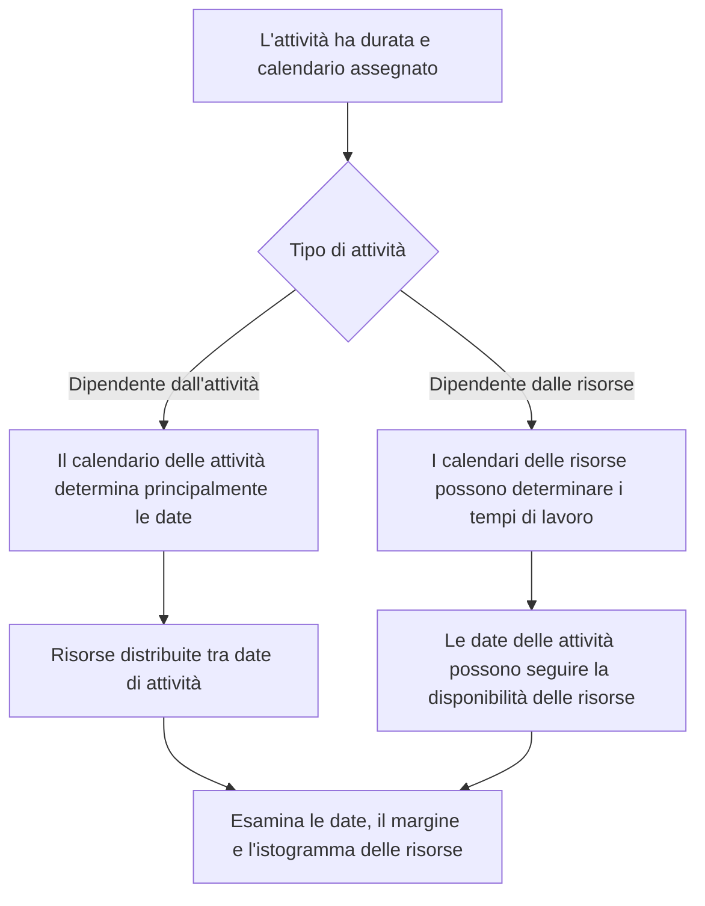

# Calendari in P6

I calendari sono una delle basi silenziose del cronoprogramma Primavera P6. Definiscono quando il lavoro può svolgersi. Dicono a P6 quali giorni sono lavorativi, quali giorni non lavorativi, quante ore sono disponibili in un giorno e a che ora del giorno inizia e finisce il lavoro.

Dato che i calendari lavorano dietro le quinte, è facile sottovalutarli. Una pianificazione può avere una logica forte e durate ragionevoli, ma se i calendari sono sbagliati o incoerenti, le date possono comunque essere fuorvianti.

Comprendere i calendari è essenziale per la qualità del cronoprogramma, la pianificazione delle risorse, la revisione del percorso critico e la disciplina dell'aggiornamento.

## Cosa fa un calendario in P6

In P6, un calendario converte la durata in date. Se un'attività ha una durata di 10 giorni lavorativi, P6 deve sapere cosa significa giorno lavorativo. È dal lunedì al venerdì? Il sabato è compreso? La giornata lavorativa è di 8 ore, 10 ore o 12 ore? Il lavoro inizia alle 7:00 o alle 8:00? Sono escluse le festività?

Il calendario risponde a queste domande.

Influenza dei calendari:

- Date di inizio e fine attività.
- Date iniziali e tardive.
- Margine totale.
- Percorso critico e percorso più lungo.
- Tempistiche di utilizzo delle risorse.
- Interpretazione del ritardo delle relazioni.
- La data cambia durante gli aggiornamenti.
- Lookahead e accuratezza del reporting.

Un calendario non è solo un elemento di configurazione amministrativa. Fa parte del calcolo del cronoprogramma.

## Perché potrebbe essere necessario più di un calendario

Molti progetti necessitano di più di un calendario perché non tutto il lavoro segue lo stesso schema lavorativo.

Gli esempi includono:

- Lavoro di ingegneria d'ufficio su un calendario di 5 giorni.
- Lavori di costruzione del sito su un calendario di 6 giorni.
- Arresto o interruzione del lavoro su un calendario di 24 ore.
- Lavoro di messa in servizio del turno di notte.
- Finestre di accesso del proprietario.
- Restrizioni ambientali.
- Attività di approvvigionamento in base ai giorni lavorativi dei fornitori.
- Calendari specifici delle risorse per ispettori, fornitori o squadre specializzate.

Usare un calendario per tutto può sembrare semplice, ma può produrre date non realistiche. Se la messa in servizio può avvenire solo di notte, un normale calendario diurno potrebbe essere errato. Se un fornitore lavora solo nei giorni feriali, un calendario di costruzione di 7 giorni potrebbe sovrastimare la disponibilità.

L'obiettivo non è creare molti calendari. L'obiettivo è creare calendari sufficienti per modellare le condizioni di lavoro reali senza rendere il cronoprogramma inutilmente complesso.

## Calendari delle attività

Il calendario delle attività è assegnato direttamente a un'attività. Definisce l'orario di lavoro utilizzato per calcolare la durata e le date dell'attività, in particolare per le attività dipendenti dall'attività.

Ad esempio, se "Installa passerella portacavi" ha un calendario di costruzione di 6 giorni, P6 calcolerà il proprio lavoro in base a tale calendario. Se sabato è un giorno lavorativo, l'attività potrebbe terminare prima rispetto a un calendario di 5 giorni.

I calendari delle attività rappresentano in genere il principale controllo del calendario per le normali attività pianificate.

Utilizzare i calendari delle attività quando il lavoro stesso segue uno schema di lavoro definito, ad esempio turno diurno, turno notturno, lavoro di chiusura o lavoro d'ufficio.

## Calendari delle risorse

I calendari delle risorse definiscono quando una risorsa è disponibile. Una risorsa può essere una persona, un equipaggio, un articolo di attrezzatura, uno specialista del fornitore o un'altra risorsa assegnata.

I calendari delle risorse diventano particolarmente importanti quando le attività dipendono dalle risorse o quando il progetto utilizza il livellamento delle risorse o una pianificazione dettagliata delle risorse.

Ad esempio, un'attività può essere assegnata a un calendario di costruzione di 6 giorni, ma l'ispettore specializzato ad essa assegnato potrebbe essere disponibile solo dal lunedì al mercoledì. Se l'attività è basata sulle risorse, P6 può calcolare le date in base al calendario delle risorse anziché solo al calendario delle attività.

I calendari delle risorse sono utili quando la disponibilità delle risorse è un vero vincolo di pianificazione. Possono anche creare confusione se vengono assegnati ma non mantenuti.

## Come si interfacciano i calendari delle attività e delle risorse

La relazione tra i calendari delle attività e i calendari delle risorse dipende dal tipo di attività, dalle impostazioni delle risorse e dal comportamento di calcolo della pianificazione.

Per le attività dipendenti da attività, il calendario delle attività rappresenta in genere la base principale per la durata dell'attività. I calendari delle risorse potrebbero comunque influenzare la distribuzione e l'utilizzo delle risorse.

Per le attività dipendenti dalle risorse, i calendari delle risorse possono influenzare il momento in cui viene eseguito il lavoro. Ciò significa che il calendario delle risorse può influenzare le date delle attività in modo più diretto.

Il punto chiave è che i calendari vanno rivisti insieme. Un calendario delle attività potrebbe indicare che il lavoro è possibile, mentre il calendario delle risorse indica che la risorsa assegnata non è disponibile. Questa mancata corrispondenza può creare desincronizzazione.

## Cosa significa desincronizzazione del calendario

La desincronizzazione del calendario si verifica quando i diversi calendari nella pianificazione non sono allineati con il modo reale in cui il progetto dovrebbe funzionare.

Esempi comuni includono:

- L'attività utilizza un calendario di 6 giorni, ma le risorse assegnate utilizzano un calendario di 5 giorni.
- L'attività utilizza un calendario con turni diurni, ma le risorse utilizzano il turno notturno.
- Due attività collegate utilizzano orari di inizio e fine diversi nel corso della giornata.
- Il ritardo viene interpretato attraverso un calendario che non corrisponde al lavoro.
- Un'attività copiata conserva un vecchio calendario di un altro progetto.
- Un calendario delle risorse presenta giorni festivi che il calendario delle attività non ha.

Il risultato può essere fonte di confusione. Le date potrebbero cambiare inaspettatamente. Potrebbe sembrare che le attività finiscano un giorno dopo. Il margine può cambiare senza una ragione logica ovvia. Gli istogrammi delle risorse potrebbero non corrispondere al piano di esecuzione. Il percorso critico potrebbe spostarsi a causa del comportamento del calendario piuttosto che della sequenza reale.

## Problemi causati dalla mancata corrispondenza del calendario

La mancata corrispondenza del calendario può creare diversi problemi di qualità del cronoprogramma.

Innanzitutto, può creare date fuorvianti. Potrebbe sembrare che un'attività richieda più tempo perché il calendario ha meno periodi di lavoro.

In secondo luogo, può distorcere il galleggiamento. Le attività su calendari diversi possono calcolare date iniziali e finali in modi difficili da spiegare.

In terzo luogo, può influenzare il percorso critico. Un percorso può diventare critico perché un calendario limita il lavoro, non perché la sequenza logica abbia veramente il controllo.

In quarto luogo, può danneggiare il reporting delle risorse. Un istogramma di risorse può mostrare la domanda di risorse in date in cui la risorsa non è effettivamente disponibile o potrebbe non vedere la domanda che dovrebbe apparire.

Infine, può creare confusione negli aggiornamenti. Quando la data di aggiornamento si sposta, le attività su calendari diversi potrebbero rispondere in modo diverso, rendendo più difficile lo stato e la revisione della pianificazione.

## Come Risolvere le Desincronizzazione

Inizia identificando lo standard del calendario del progetto. Definire la settimana lavorativa normale, gli orari di inizio e fine della giornata lavorativa, le festività, i periodi di chiusura e le finestre di lavoro speciali.

Quindi rivedi tutti i calendari nel cronoprogramma. Controllo:

- Nome e scopo del calendario.
- Giorni lavorativi.
- Orario di lavoro giornaliero.
- Orari di inizio e fine.
- Festività ed eccezioni.
- Tipo di calendario.
- Attività assegnate al calendario.
- Risorse assegnate al calendario.

Successivamente, esamina le attività in cui le date sembrano strane. Aggiungi colonne per Calendario attività, Tipo attività, Inizio, Fine, Inizio anticipato, Fine anticipata, Margine totale, risorse e calendari delle risorse, se disponibili.

Se un calendario è sbagliato, correggilo. Se l'attività è assegnata al calendario sbagliato, modificare l'assegnazione. Se il calendario della risorsa è valido ma causa risultati imprevisti, verificare se l'attività deve essere Dipendente dalla risorsa o Dipendente dall'attività.

Dopo aver apportato le correzioni, ricalcolare la pianificazione e rivedere le date interessate, il margine, il percorso critico e l'istogramma delle risorse.

## Buona governance del calendario

I calendari dovrebbero essere governati secondo logica e vincoli. Non dovrebbero moltiplicarsi senza controllo.

La buona pratica include:

- Utilizzare una convenzione di denominazione chiara.
- Conserva un numero limitato di calendari di progetto approvati.
- Documenta il motivo per cui esistono calendari speciali.
- Evita di copiare calendari inutilizzati da vecchie pianificazioni.
- Esaminare le assegnazioni del calendario delle attività prima dell'approvazione di base.
- Esaminare i calendari delle risorse se viene utilizzato il caricamento delle risorse.
- Controlla gli orari di inizio e fine del calendario, non solo i giorni lavorativi.

La governance del calendario è particolarmente importante nelle pianificazioni di grandi dimensioni in cui molti utenti possono aggiungere o copiare attività.

## Esempio pratico

Un progetto di costruzione utilizza un calendario di 6 giorni per il lavoro in cantiere. La maggior parte delle attività di costruzione si svolgono dal lunedì al sabato dalle 7:00 alle 17:00. Un team incaricato della messa in servizio lavora il turno di notte dalle 22:00 alle 6:00 perché i test possono avvenire solo quando le operazioni sono offline.

Entrambi i calendari sono validi.

Il problema si verifica quando le attività di costruzione copiate ereditano accidentalmente il calendario dei turni di notte. Le loro date iniziano a muoversi in modo strano. Alcune relazioni sembrano spingere i successori al giorno successivo. Il galleggiante cambia in un modo che il team non può spiegare.

La soluzione non è eliminare il calendario del turno notturno. La soluzione consiste nel correggere l'assegnazione del calendario delle attività, confermare quali attività necessitano veramente del calendario del turno di notte e ricalcolare il cronoprogramma.

## Conclusione

I calendari in P6 definiscono quando può svolgersi il lavoro. Influiscono sulle date delle attività, sul margine, sul percorso critico, sul caricamento delle risorse, sui ritardi e sul comportamento degli aggiornamenti.

Spesso è necessario più di un calendario perché i progetti includono diversi modelli di lavoro: lavoro in cantiere, lavoro d'ufficio, turni notturni, chiusure, lavoro dei fornitori e disponibilità delle risorse. Ma più calendari devono essere controllati attentamente.

Il rischio principale è la desincronizzazione. Quando i calendari delle attività e delle risorse non corrispondono al piano di esecuzione reale, la pianificazione può mostrare date confuse, fluttuazione fuorviante e informazioni sulle risorse inaffidabili.

Una pianificazione forte utilizza i calendari intenzionalmente. Ogni calendario ha uno scopo, ogni calendario speciale è documentato e le assegnazioni del calendario di attività e risorse vengono riviste prima che la pianificazione venga considerata attendibile.
## Contenuti correlati
- [Calendari con orari di inizio e fine diversi in Primavera P6 - Panoramica](../../11_metrics_it/20_calendars_with_different_start_finish_time_in_day/01_overview_template.md)
- [Date in P6](../07_DATES%20IN%20P6/07_DATES%20IN%20P6.md)
- [Durata in P6](../09_DURATION%20IN%20P6/09_DURATION%20IN%20P6.md)
