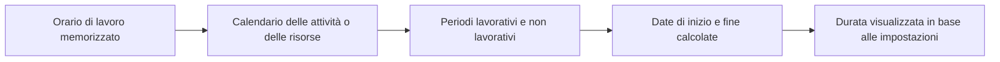

# Durata in P6

La durata in Primavera P6 sembra inizialmente semplice: un'attività richiede un certo numero di giorni. In pratica, la durata è una delle parti più importanti e più fraintese di un cronoprogramma.

La durata è collegata a calendari, tipo di attività, assegnazioni di risorse, aggiornamenti sui progressi e impostazioni di visualizzazione dell'utente. Una durata indicata come "5 giorni" potrebbe non significare la stessa cosa in ogni pianificazione, ogni calendario o layout di ogni utente. Questo è il motivo per cui i pianificatori devono capire non solo cos’è la durata, ma anche come P6 la memorizza, la calcola e la visualizza.

## Cosa significa durata

La durata è la quantità di tempo lavorativo necessaria per svolgere un'attività. Non è semplicemente il numero di giorni di calendario tra una data di inizio e una data di fine.

Ad esempio, un'attività con 5 giorni di durata può estendersi:

- 5 giorni di calendario su un calendario dal lunedì al venerdì senza interruzioni.
- 7 giorni di calendario se il fine settimana rientra nel periodo lavorativo.
- Meno di 5 giorni di calendario su un calendario di 24 ore o con turni estesi.
- Più di 5 giorni di calendario se i giorni festivi o non lavorativi interrompono il lavoro.

Questa è la prima lezione chiave: la durata è l'orario di lavoro, mentre le date di inizio e fine sono posizioni del calendario.

## Come P6 memorizza la durata

P6 memorizza la durata come tempo, generalmente a livello di ora nei dati di pianificazione sottostanti. Ciò che l'utente vede nel layout può essere mostrato in giorni, settimane, mesi o anni a seconda delle preferenze.

Ciò significa che la durata visualizzata è spesso una conversione. Se P6 memorizza un'attività come 40 ore lavorative, un utente potrebbe vederla come 5 giorni se la conversione display utilizza 8 ore al giorno. Un'altra configurazione potrebbe mostrarlo in modo diverso se la conversione del periodo di tempo o la base del calendario sono diverse.

Questo è il motivo per cui due persone possono guardare la stessa pianificazione e confondersi se le loro preferenze utente o le impostazioni del periodo di tempo amministrativo non sono allineate.

## Durata e calendari

I calendari dicono a P6 quando può svolgersi il lavoro. La durata indica a P6 quanto tempo di lavoro è richiesto. Il calendario colloca quindi l'orario di lavoro in date reali.

Se un'attività ha 40 ore di durata rimanente, il calendario determina come vengono distribuite tali 40 ore.

In un calendario di 8 ore giornaliere, 40 ore possono apparire come 5 giorni lavorativi. In un calendario di 10 ore giornaliere, le stesse 40 ore possono apparire come 4 giorni lavorativi. Su un calendario di 24 ore, potrebbe occupare molto meno tempo di calendario.

Questo è il motivo per cui gli incarichi sul calendario sono importanti. La modifica del calendario può modificare la data di fine anche se la durata lavorativa memorizzata rimane la stessa.

## Durata originale

La Durata originale è la durata pianificata dell'attività prima che venga applicato l'avanzamento. Rappresenta la stima iniziale del tempo di lavoro necessario per completare l'attività.

La Durata originale è importante durante la pianificazione e lo sviluppo della baseline. Aiuta a definire l'impegno previsto o la finestra temporale per un'attività. Viene utilizzato anche nelle discussioni sui progressi e sulle prestazioni perché fornisce un punto di riferimento per quanto tempo si prevedeva che l'attività durasse.

Utilizza la Durata originale per rispondere: quanto tempo era previsto che durasse questa attività prima degli aggiornamenti di stato?

## Durata rimanente

La Durata rimanente è la quantità di tempo di lavoro ancora necessario per completare l'attività dalla data di aggiornamento corrente.

Per un'attività non avviata, la Durata rimanente solitamente corrisponde alla Durata originale a meno che non sia stata modificata. Per un'attività in corso, la Durata rimanente dovrebbe riflettere il lavoro realistico ancora richiesto. Per un'attività completata, la Durata rimanente dovrebbe essere 0.

La Durata rimanente è uno dei campi di aggiornamento più importanti in P6. Se è sbagliata, la previsione sarà sbagliata.

Utilizza la Durata rimanente per rispondere: quanto tempo di lavoro è ancora necessario?

## Durata effettiva

La Durata effettiva rappresenta la quantità di tempo già spesa per l'attività in base al progresso effettivo. È legato all'inizio effettivo, alla fine effettiva, alla data di aggiornamento, ai calendari e al metodo di aggiornamento.

La durata effettiva dovrebbe supportare la storia dello stato. Se un'attività è iniziata, la durata effettiva dovrebbe avere senso rispetto all'inizio effettivo e alla data di aggiornamento. Se l'attività è completa, la Durata effettiva dovrebbe essere allineata al periodo lavorativo effettivo.

Utilizza la Durata effettiva per rispondere: quanto tempo di lavoro è già stato consumato?

## Alla durata del completamento

La Durata al completamento rappresenta la durata totale prevista dell'attività dopo aver combinato il lavoro effettivo e quello rimanente.

In termini semplici:

Durata effettiva + Durata rimanente = Durata al completamento

Ciò è utile perché mostra se si prevede che un'attività richieda più o meno tempo di quanto originariamente pianificato. Se la Durata originale era di 10 giorni ma la Durata al completamento è ora di 15 giorni, si prevede che l'attività richiederà più tempo del previsto.

Utilizzare Durata al completamento per rispondere: quanto tempo si prevede che questa attività durerà in totale?

## Durata e preferenze dell'utente

Le Preferenze utente controllano la modalità di visualizzazione delle unità di tempo per un singolo utente. Un utente può scegliere se le durate vengono visualizzate in ore, giorni, settimane, mesi o anni.

Ciò influisce su ciò che vede l'utente, non necessariamente sul calcolo della pianificazione sottostante. Ad esempio, la stessa durata memorizzata può essere visualizzata come ore in un layout e giorni in un altro.

Questo è utile, ma può anche creare confusione. Un pianificatore che esamina un lavoro dettagliato può preferire le ore. Un responsabili di progetto può preferire i giorni. Un rapporto sul portafoglio può mostrare mesi. Se non si comprende la base di conversione, i numeri possono apparire incoerenti.

Quando si esaminano le durate, confermare l'unità di visualizzazione. Chiedi se la durata mostrata è in ore, giorni, settimane o un'altra unità.

## Preferenze dell'amministratore e periodi di tempo

Le Preferenze amministratore includono impostazioni del periodo di tempo che definiscono il modo in cui P6 converte le ore in unità più grandi come giorni, settimane, mesi e anni. Queste impostazioni sono importanti perché influenzano il modo in cui i valori di durata vengono visualizzati e convertiti.

Ad esempio, se il sistema utilizza 8 ore al giorno, 40 ore vengono visualizzate come 5 giorni. Se il sistema utilizza 10 ore al giorno, 40 ore vengono visualizzate come 4 giorni.

Ciò non significa necessariamente che il lavoro sia cambiato. Potrebbe solo significare che la conversione è cambiata.

In alcune configurazioni P6, la visualizzazione della durata può dipendere anche dal fatto che il sistema o l'utente stiano utilizzando le ore di calendario assegnate per la conversione del periodo di tempo. Questo è il motivo per cui i team di progetto dovrebbero allineare gli standard di calendario, le preferenze dell'utente e le impostazioni del periodo di tempo dell'amministratore prima della rendicontazione formale.

## Perché la durata può sembrare diversa

La durata può apparire diversa per diversi motivi:

- Utenti diversi visualizzano l'ora in unità diverse.
- Le impostazioni del periodo di tempo dell'amministratore convertono le ore in modo diverso.
- I calendari delle attività hanno orari diversi al giorno.
- I calendari delle risorse differiscono dai calendari delle attività.
- Le attività utilizzano diversi tipi di attività.
- La durata rimanente è stata aggiornata manualmente.
- I progressi sono stati applicati in modo errato.
- L'ora del giorno è nascosta nel layout.

Questo è il motivo per cui un problema di durata non è sempre un problema di durata. A volte è un problema di calendario. A volte si tratta di un problema di impostazione del display. A volte si tratta di un problema di aggiornamento dell'avanzamento.

## Relazione con tipi di attività e tipi di durata

Il Tipo di attività determina quale base di calendario è più importante. Le attività dipendenti dall'attività in genere si basano principalmente sul calendario delle attività. Le attività dipendenti dalle risorse possono essere maggiormente influenzate dai calendari delle risorse.

Il tipo di durata influisce sul modo in cui P6 bilancia durata, unità di risorsa e unità per tempo. Ad esempio, l'aggiunta di risorse può o meno abbreviare l'attività a seconda del Tipo di durata.

Pertanto, quando una durata si comporta in modo imprevisto, controlla tre cose insieme:

- Calendario delle attività e calendario delle risorse.
- Tipo di attività.
- Tipo di durata.

Questi campi lavorano insieme. Esaminarne solo uno può portare a una conclusione sbagliata.

## Problemi comuni

Un problema comune è l'immissione di una durata in giorni senza rendersi conto che il calendario delle attività utilizza un numero di ore al giorno diverso da quello previsto.

Un altro problema è confrontare le durate tra attività che utilizzano calendari diversi. Cinque giorni su un calendario potrebbero non rappresentare la stessa quantità di orario di lavoro di cinque giorni su un altro.

Un terzo problema sono le preferenze incoerenti dell'utente. Un revisore potrebbe vedere le ore mentre un altro i giorni ed entrambi potrebbero ritenere che la pianificazione sia cambiata.

Un altro problema comune è la modifica delle preferenze dell'amministratore dopo che le pianificazioni sono già esistenti. Ciò può far sì che le durate visualizzate appaiano diverse anche quando le ore memorizzate sottostanti non sono cambiate.

## Come rivedere correttamente la durata

Quando esamini la durata in P6, non guardare solo il numero mostrato nella colonna Durata.

Controllo:

- Durata originale.
- Durata rimanente.
- Durata effettiva.
- Alla durata del completamento.
- Calendario delle attività.
- Calendario delle risorse se vengono utilizzate le risorse.
- Tipo di attività.
- Tipo di durata.
- Visualizzazione dell'unità di tempo delle preferenze dell'utente.
- Conversione del periodo di tempo delle preferenze dell'amministratore.

Se le date o le durate sembrano strane, aggiungi i campi calendario e ora al layout. Non nascondere l'ora del giorno durante la risoluzione dei problemi.

## Conclusione

La durata in P6 è l'orario di lavoro, non solo il tempo di calendario trascorso. P6 memorizza la durata come ora, applica i calendari per inserire tale ora nella pianificazione e la visualizza in base alle preferenze dell'utente e alle impostazioni amministrative del periodo di tempo.

Ciò significa che la durata deve essere rivista con il contesto. Un valore visualizzato come "5 giorni" dipende dalle ore di calendario, dalle unità di visualizzazione, dalle impostazioni di conversione, dal tipo di attività, dal tipo di durata e dallo stato dell'aggiornamento.

Un bravo pianificatore capisce che la durata non è solo un input. Fa parte del motore di calcolo. Quando durata, calendari e preferenze sono allineati, la pianificazione diventa più facile da spiegare e più affidabile per il controllo di progetto.
## Contenuti correlati
- [Attività che iniziano alla data di aggiornamento senza alcuna logica guida: perché questa metrica di pianificazione è importante - Panoramica](../../metrics/01_activities_starting_in_dd_with_no_logic_driving/02_guide_template.md)
- [Calendari in P6](../08_CALENDARS%20IN%20P6/08_CALENDARS%20IN%20P6.md)
- [Tipi di completamento percentuale in P6](../10_PERCENT%20COMPLETION%20TYPES%20IN%20P6/10_PERCENT%20COMPLETION%20TYPES%20IN%20P6.md)
