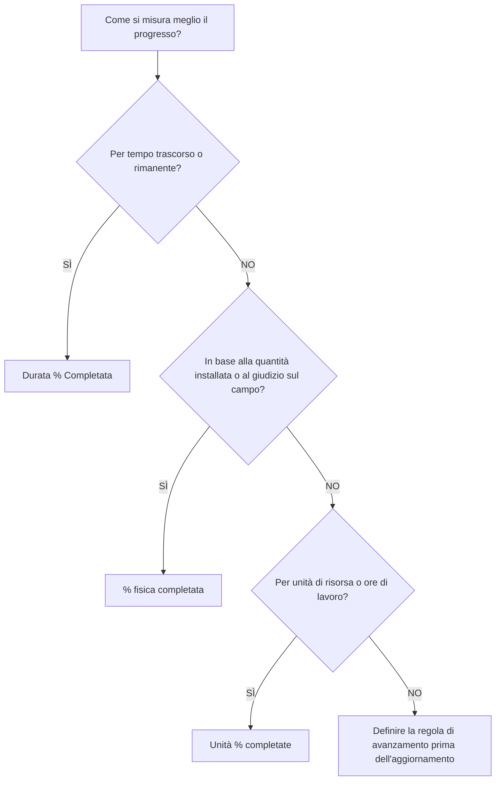

La percentuale di completamento è uno dei campi di avanzamento più visibili in Primavera P6, ma è anche uno dei più fraintesi. Un valore pari al 50% di completamento può significare cose diverse a seconda di come è configurata l'attività e di come il progetto misura l'avanzamento.

In P6, il tipo di completamento percentuale controlla il modo in cui viene calcolata o aggiornata la percentuale di completamento dell'attività. Indica a P6 se ​​il progresso dovrebbe essere basato sul tempo, sui risultati fisici o sulle unità di risorse.

I principali tipi di percentuale di completamento per le attività sono:

- Durata % Completata.
- % fisica completata.
- Unità % completate.

Scegliere quello giusto è importante perché il progresso non è solo un numero da segnalare. Influisce sulla durata rimanente, sul valore maturato, sul reporting delle risorse, sulla credibilità della pianificazione e sulla qualità di ogni ciclo di aggiornamento.

## Perché il tipo di completamento percentuale è importante

Attività diverse necessitano di modi diversi per misurare i progressi.

Per alcune attività, il tempo è un indicatore ragionevole. Se un'attività dura 10 giorni e vengono completati 5 giorni lavorativi, può essere ragionevole affermare che l'attività è completata al 50% circa.

Per altre attività il tempo non è sufficiente. Un equipaggio può dedicare 5 giorni a un compito di 10 giorni e completare solo il 20% del lavoro fisico. Un altro equipaggio può completare l'80% della quantità nella prima metà della durata. In questi casi, i progressi basati sulla durata possono fuorviare il team di progetto.

Per le pianificazioni caricate di risorse, le unità possono rappresentare la migliore base di progresso. Se un'attività è pianificata per 1.000 ore di lavoro e sono state guadagnate o consumate 600 ore di lavoro, la percentuale di completamento delle unità potrebbe riflettere meglio il progresso.

Il corretto tipo di percentuale di completamento dipende da cosa rappresenta l'attività e da come viene effettivamente misurato il progresso.

## Attività % completata

% attività completata è il valore di avanzamento generale visualizzato per l'attività. La sua origine dipende dal tipo di completamento percentuale selezionato.

Se l'attività utilizza Durata % completamento, % attività completata è guidata dalla relazione tra la durata originale, effettiva e rimanente.

Se l'attività utilizza % di completamento fisico, % di completamento attività segue il valore % di completamento fisico immesso dall'utente.

Se l'attività utilizza % di completamento unità, % di completamento attività si basa sullo stato di avanzamento delle unità di risorsa.

Questo è il motivo per cui due attività possono essere entrambe completate al 50% ma significano cose molto diverse.

## Durata % Completata

Durata % Il completamento misura l'avanzamento in base al tempo. Confronta la durata consumata rispetto alla durata totale prevista.

In termini semplici, se un'attività ha 10 giorni di durata pianificata o al completamento e sono stati consumati 5 giorni, l'attività potrebbe mostrare circa il 50% di durata% di completamento.

Durata % completamento è utile quando il progresso è ragionevolmente proporzionale al tempo.

Gli esempi includono:

- Periodi di revisione amministrativa.
- Periodi di attesa o di concia.
- Attività di supporto basate sul tempo.
- Alcune semplici attività in cui la produzione di lavoro è costante.

Durata utilizzo % Completa quando il tempo è una misura attendibile del progresso e la durata rimanente viene mantenuta attentamente.

Il rischio è che il tempo impiegato non sempre equivalga al lavoro svolto. Un'attività può consumare metà della sua durata pianificata ed essere ancora molto indietro fisicamente. Se il pianificatore si basa solo sulla durata, i rapporti sui progressi potrebbero sembrare migliori della realtà.

## % fisica completata

La percentuale di completamento fisico viene inserita o aggiornata manualmente in base al progresso fisico effettivo. Rappresenta ciò che è stato realmente realizzato nell'opera, indipendentemente dalla durata o dalle unità di risorsa.

Questa è spesso l'opzione migliore per la costruzione, i risultati finali dell'ingegneria, i lavori di installazione, i pacchetti di messa in servizio o qualsiasi attività in cui i progressi dovrebbero essere basati su risultati misurabili.

Gli esempi includono:

- 40% dei disegni emessi.
- 60% della passerella portacavi installata.
- 75% delle tubazioni saldate.
- 30% del pacchetto di test completato.
- Allineamento dell'attrezzatura terminato al 100%.

Utilizzare % di completamento fisico quando il progresso deve essere misurato in base alla quantità, allo stato dei risultati finali, alla verifica sul campo o al giudizio del proprietario responsabile.

Il vantaggio è che può riflettere la realtà meglio del tempo trascorso. Il rischio è che richieda disciplina. Il team di progetto deve definire come viene misurato il progresso fisico, chi lo approva e come vengono raccolte le prove.

## Unità % completate

Unità % Completato misura il progresso in base alle unità di risorsa. Confronta le unità effettive con le unità al completamento.

Ciò è utile quando la pianificazione è ricca di risorse e il progresso viene monitorato attraverso le ore di manodopera, le ore di attrezzatura o altre unità di risorse misurabili.

Gli esempi includono:

- Ore di lavoro effettive guadagnate rispetto alle ore di lavoro preventivate.
- Ore di attrezzatura utilizzate rispetto alle ore di attrezzatura pianificate.
- Lavoro installato legato all'avanzamento dell'unità di risorsa.
- Flussi di lavoro con valore maturato in base alle unità.

Usa unità % Completato quando le unità di risorsa sono affidabili, mantenute e fanno parte del metodo di avanzamento del progetto.

Il rischio è che il consumo di risorse non sia sempre pari al progresso fisico. Una squadra può trascorrere molte ore senza completare il lavoro previsto. Per questo motivo, la percentuale di completamento delle unità funziona meglio quando il reporting delle risorse e la misurazione dell'avanzamento sono ben controllati.

## Come scegliere la tipologia giusta

Un modo pratico per scegliere il tipo di completamento percentuale è chiedere cosa significa il progresso per l'attività.

Se il progresso indica che è trascorso del tempo, utilizzare Durata % completamento.

Se il progresso significa che è stato raggiunto il lavoro fisico, utilizzare % completamento fisico.

Se il progresso significa che le unità di risorsa sono state guadagnate o consumate, utilizza % di completamento unità.

La scelta dovrebbe essere coerente tra gruppi di attività simili. I risultati finali dell'ingegneria possono utilizzare la percentuale di completamento fisico. L'installazione in costruzione può utilizzare la percentuale fisica di completamento in base alle quantità. Il supporto di gestione basato sul tempo può utilizzare Durata % completamento. I pacchetti di lavoro ad alto contenuto di risorse possono utilizzare Unità % di completamento se i dati delle risorse sono affidabili.

## Rapporto con la durata residua

La percentuale di completamento e la durata rimanente dovrebbero raccontare una storia coerente.

Un'attività può essere completata fisicamente all'80% ma avere ancora 10 giorni di durata rimanente se il lavoro rimanente è difficile, ritardato o dipende da un'altra condizione. Potrebbe essere valido.

Un'attività può essere completata al 50% della Durata% perché è trascorsa metà del tempo pianificato, ma se solo il 20% del lavoro viene svolto fisicamente, la Durata rimanente dovrebbe probabilmente essere rivista.

Questo è il motivo per cui i buoni aggiornamenti richiedono sia la revisione dei progressi che quella delle previsioni. La percentuale di completamento indica quanto è stato raggiunto. La Durata rimanente indica quanto tempo è ancora necessario.

## Errori comuni

Un errore comune è utilizzare la Durata% di completamento per attività in cui il progresso fisico non è proporzionale al tempo. Ciò può far sembrare i progressi migliori o peggiori del lavoro reale.

Un altro errore è utilizzare la percentuale fisica di completamento senza una regola di misurazione. Se una disciplina riporta il progresso fisico in base alla quantità installata e un'altra in base all'opinione, il cronoprogramma diventa incoerente.

Un terzo errore è l'utilizzo della percentuale di completamento unità quando i dati delle risorse sono incompleti o inaffidabili. Se le unità effettive non vengono mantenute, il valore di avanzamento non sarà affidabile.

Un altro problema è l'aggiornamento della percentuale di completamento ignorando la durata rimanente. Un'attività può mostrare progressi e avere comunque una previsione non realistica.

## Buona pratica

Definire le regole di avanzamento prima dell'inizio del ciclo di aggiornamento. Il team di progetto deve sapere quali gruppi di attività utilizzano Durata, Fisica o % di completamento unità.

Utilizzare layout che mostrano Tipo di completamento percentuale, % attività completata, % completamento fisico, % durata, % completamento unità, Durata rimanente, Inizio effettivo, Fine effettiva e Stato attività.

Verificare la presenza di incongruenze come:

- Attività avviate con 0% di progresso.
- Durata rimanente = 0 ma stato non completo.
- Avanzamento al 100% senza fine effettiva.
- % fisica di completamento che non corrisponde alle prove sul campo.
- % unità completate in base agli aggiornamenti delle risorse mancanti.

Questi controlli aiutano a garantire che i progressi non siano solo registrati, ma credibili.

## Conclusione

Il tipo di completamento percentuale in P6 definisce il modo in cui viene misurato il progresso dell'attività. Durata % Il completamento misura il progresso basato sul tempo. La percentuale fisica di completamento misura il lavoro effettivo realizzato. Unità % di completamento misura il progresso dell'unità di risorsa.

Nessun singolo tipo è migliore per ogni attività. La scelta giusta dipende da come il lavoro viene pianificato, misurato e controllato.

Una pianificazione efficace utilizza intenzionalmente i tipi di completamento percentuale. Quando il metodo corrisponde al lavoro, gli aggiornamenti sullo stato di avanzamento diventano più chiari, la durata rimanente diventa più affidabile e il reporting del progetto diventa più facile da difendere.
## Contenuti correlati
- [Attività che iniziano alla data di aggiornamento senza alcuna logica guida: perché questa metrica di pianificazione è importante - Panoramica](../../metrics/01_activities_starting_in_dd_with_no_logic_driving/02_guide_template.md)
- [Durata in P6](../09_DURATION%20IN%20P6/09_DURATION%20IN%20P6.md)
- [Dove vivono i costi in P6](../11_WHERE%20THE%20COST%20LIVE%20IN%20P6/11_WHERE%20THE%20COST%20LIVE%20IN%20P6.md)
