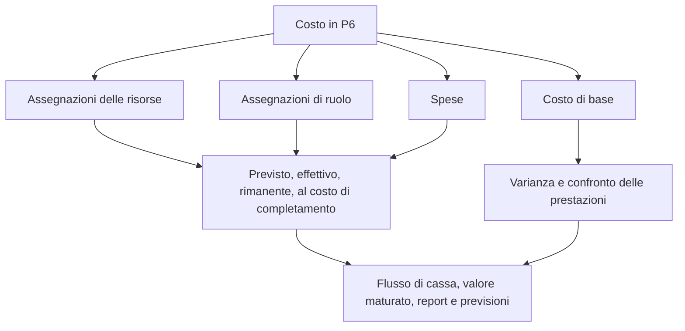

# Dove vivono i costi in P6

Il costo in Primavera P6 può vivere in diversi posti. Questo è utile, ma può anche creare confusione. Una pianificazione può mostrare il costo preventivato, il costo effettivo, il costo rimanente, il costo al completamento, il costo della risorsa, il costo del ruolo, il costo della spesa, i campi del valore maturato e il costo previsto. Questi valori sono correlati, ma non significano tutti la stessa cosa.

Per i team di controllo di progetto, la domanda chiave non è solo "qual è il costo?" La domanda migliore è: da dove viene questo costo, cosa rappresenta e come dovrebbe essere utilizzato?

Questo blog spiega i principali tipi di costi disponibili in P6, le differenze tra loro e quando ciascuno di essi è utile.

## Perché la posizione dei costi è importante

P6 è principalmente uno strumento di pianificazione, ma può anche supportare pianificazioni con costi elevati, valore maturato, flusso di cassa e reporting delle previsioni. Per farlo correttamente, il costo deve essere inserito nella parte giusta del modello di pianificazione.

Se il costo della manodopera viene inserito come spesa, gli istogrammi delle risorse potrebbero non raccontare la storia giusta. Se il costo effettivo viene immesso manualmente ma il progetto prevede che provenga dalle risorse effettive, i report potrebbero diventare incoerenti. Se manca il costo previsto, il reporting sulla variazione della pianificazione e sulla variazione dei costi perde contesto.

L'ubicazione dei costi è importante perché la fonte dei costi influisce sul modo in cui vengono raggruppati, aggiornati, previsti e report.

## Costi delle risorse

I costi delle risorse provengono dalle risorse assegnate alle attività. Una risorsa può rappresentare manodopera, attrezzature o un'altra categoria di risorse. Ogni risorsa può avere tariffe, unità e calcoli dei costi.

Ad esempio, se un'attività utilizza una squadra di tubisti per 80 ore a una tariffa oraria definita, P6 può calcolare il costo della manodopera dalle unità e dalla tariffa assegnate.

I costi delle risorse sono utili quando il progetto desidera collegare le attività schedulate alla manodopera, alle attrezzature, alla produttività e agli istogrammi delle risorse.

Utilizza i costi delle risorse quando:

- La domanda di manodopera o attrezzature è importante.
- Sono necessari gli istogrammi delle risorse.
- Il costo è legato alle ore o alle unità.
- Il valore maturato o il progresso sono basati sulle risorse.
- La pianificazione viene utilizzata per la pianificazione delle risorse.

Il rischio principale è la manutenzione. I cronoprogrammi carichi di risorse richiedono disciplina. Se le unità, le tariffe, i calendari o i valori effettivi non vengono gestiti, i report sui costi non saranno affidabili.

## Costi del ruolo

I ruoli sono funzioni lavorative generiche, ad esempio ingegnere, elettricista, pianificatore, ispettore o gruista. In P6, i ruoli possono essere assegnati alle attività prima che le risorse denominate siano note.

I costi del ruolo possono supportare la pianificazione anticipata quando il team conosce il tipo di risorsa necessaria ma non la persona o l'equipaggio specifici.

Ad esempio, durante la pianificazione ingegneristica iniziale, un'attività potrebbe richiedere 120 ore di tempo da "Ingegnere senior". La persona nominata potrebbe non essere ancora assegnata, ma il ruolo può fornire una tariffa di pianificazione e una stima dei costi.

Utilizza i costi del ruolo quando:

- Il cronoprogramma è ancora in fase di pianificazione.
- Le risorse nominate non sono ancora confermate.
- Il progetto richiede una risorsa o una stima dei costi di alto livello.
- I ruoli verranno successivamente sostituiti da risorse effettive.

I costi del ruolo sono utili per la pianificazione nella fase iniziale, ma dovrebbero essere rivisti man mano che il progetto matura. Se i ruoli rimangono dopo che le risorse effettive sono note, la pianificazione potrebbe diventare troppo generica per un controllo dettagliato.

## Costi di spesa

Le spese sono costi non legati alle risorse assegnati direttamente alle attività. Sono utili per i costi che non sono rappresentati al meglio dalle risorse di manodopera o attrezzature.

Gli esempi includono:

- Permessi.
- Viaggio.
- Somme forfettarie del venditore.
- Pacchetti di subappaltatori.
- Materiali acquistati a importo fisso.
- Commissioni per i test.
- Spese di mobilitazione.

I costi di spesa possono essere preventivati, effettivi, rimanenti o al completamento a seconda di come vengono monitorati dal progetto.

Utilizzare le spese quando:

- Il costo non è determinato dalle ore delle risorse.
- Il costo è una voce fissa o forfettaria.
- L'attività necessita di un costo diretto non legato alle risorse.
- Il progetto richiede flusso di cassa per elementi non legati alla manodopera.

Il rischio è che le spese diventino una discarica. Se tutti i costi vengono inseriti come spese, la pianificazione potrebbe perdere la capacità di spiegare separatamente manodopera, attrezzature e produttività.

## Costo preventivato

Il costo a budget è il costo pianificato assegnato all'attività. Può provenire da assegnazioni di risorse, assegnazioni di ruoli, spese o una combinazione di questi.

Il costo a budget è importante perché rappresenta il piano dei costi prima dell'esecuzione. Supporta il flusso di cassa, i costi di base, l'impostazione del valore maturato e il reporting di controllo di progetto.

Utilizza Costo preventivato per rispondere: qual era il costo pianificato di questa attività?

Se il costo a budget è mancante o incoerente, la pianificazione potrebbe comunque calcolare le date, ma non può supportare report significativi a carico dei costi.

## Costo effettivo

Il costo effettivo rappresenta il costo già sostenuto. A seconda dell'impostazione del progetto, il costo effettivo può essere calcolato dalle unità e dalle tariffe delle risorse effettive, inserito manualmente, importato dalle schede attività o caricato da un sistema di costi esterno.

Il costo effettivo è importante per la rendicontazione dei progressi e il valore maturato. Mostra quanto è stato speso o registrato finora.

Utilizza Costo effettivo per rispondere: quale costo è già stato sostenuto o registrato?

Il rischio è mescolare le fonti. Se alcuni costi effettivi vengono importati dalla contabilità e altri vengono inseriti manualmente in P6, il team ha bisogno di una regola chiara per evitare duplicazioni o lacune.

## Costo rimanente

Il costo rimanente è il costo previsto ancora necessario per completare l'attività. È legato alle unità rimanenti, ai costi delle risorse, alle spese rimanenti e alle ipotesi di aggiornamento.

Il costo rimanente è uno dei campi di previsione più importanti. Indica al team di progetto quanto costo rimane dalla data di aggiornamento corrente in poi.

Utilizza il Costo rimanente per rispondere: quanto costo è ancora previsto?

Se la Durata rimanente viene aggiornata ma il Costo rimanente no, la previsione potrebbe diventare incoerente. Lo stesso vale quando le unità di risorsa o i valori di spesa rimanenti non vengono mantenuti.

## Al costo di completamento

Il costo al completamento è il costo totale previsto dell'attività dopo aver combinato il costo effettivo e quello rimanente.

In termini semplici:

Costo effettivo + Costo rimanente = Costo al completamento

Il costo al completamento aiuta a mostrare se si prevede che un'attività finirà al di sopra, al di sotto o al di sotto del budget.

Utilizzare Costo al completamento per rispondere: qual è l'ultimo costo totale previsto?

## Costo di base

Il costo previsto deriva da una pianificazione prevista assegnata. Viene utilizzato per confrontare i valori dei costi attuali con il piano approvato.

Il costo di base è importante per il reporting della varianza. Senza una baseline, il progetto potrebbe conoscere i costi attuali previsti, ma non se tale previsione sia migliore o peggiore rispetto al piano approvato.

Utilizza Costo previsto per rispondere: come si confronta il costo attuale con il piano di costi approvato?

Il costo di base è particolarmente importante quando si utilizza P6 per il valore maturato o per il reporting PMO formale.

## Campi Costo valore maturato

P6 può supportare campi del valore maturato come valore pianificato, valore maturato, costo effettivo, varianza dei costi e varianza della pianificazione, a seconda dell'impostazione del progetto.

Il valore maturato utilizza le informazioni sulla pianificazione con carico di costo per confrontare il lavoro pianificato, il lavoro guadagnato e il costo effettivo.

Questi campi sono utili quando il progetto prevede un processo formale di creazione del valore maturato. Richiedono baseline, regole di avanzamento, metodi di completamento percentuale e caricamento dei costi coerenti.

Utilizza i campi del costo del valore maturato quando:

- Il progetto richiede la rendicontazione dei veicoli elettrici.
- Le regole di avanzamento sono definite.
- Il costo previsto è approvato.
- La fonte di costo effettiva è controllata.
- Il progresso dell'attività viene mantenuto costantemente.

Senza questi controlli, i risultati ottenuti possono sembrare precisi ma inaffidabili.

## Quale tipo di costo dovresti utilizzare?

Utilizzare i costi delle risorse per manodopera e attrezzature che dovrebbero supportare la pianificazione delle risorse, la produttività e gli istogrammi.

Utilizza i costi del ruolo per la pianificazione anticipata quando le risorse denominate non sono ancora note.

Utilizzare i costi di spesa per costi diretti non legati alle risorse, somme forfettarie, articoli del fornitore, permessi, viaggi o pacchetti di subappalto.

Utilizzare i campi Costo preventivato, Effettivo, Rimanente e Al completamento per comprendere il ciclo di vita dei costi rapportati alla scala temporale.

Utilizzare il costo previsto per il confronto con il piano approvato.

Utilizza i campi del valore maturato quando il progetto ha la governance necessaria per supportare il reporting EV.

## Problemi comuni

Un problema comune è la duplicazione dei costi. Lo stesso costo del subappaltatore può essere inserito come costo della risorsa e nuovamente come spesa.

Un altro problema è la mancanza del costo effettivo. La pianificazione potrebbe contenere un budget e un costo rimanente, ma il costo effettivo potrebbe risiedere in un sistema contabile separato e non raggiungere mai P6.

Un terzo problema è utilizzare le spese per tutto. Ciò può produrre un costo totale ma una scarsa visibilità delle risorse.

Un altro problema è il progresso incoerente. Se la percentuale di completamento, la durata rimanente e il costo rimanente non sono allineati, al completamento il costo diventa inaffidabile.

## Buona pratica

Definire la strategia di costo prima di caricare la pianificazione. Decidi dove vivranno manodopera, attrezzature, materiali, subappaltatori e costi indiretti.

Utilizza conti costi, codici attività, risorse, ruoli e categorie di spesa coerenti.

Documentare se i costi effettivi verranno inseriti in P6, importati o riportati da un altro sistema.

Esamina i campi dei costi durante ogni ciclo di aggiornamento. I costi preventivati, effettivi, rimanenti e al completamento dovrebbero raccontare una storia coerente.

## Conclusione

I costi in P6 possono risiedere nei campi risorse, ruoli, spese, baseline e valore maturato. Ogni luogo ha uno scopo diverso.

I costi delle risorse collegano i costi alla manodopera e alle attrezzature. I costi del ruolo supportano la pianificazione anticipata. I costi di spesa catturano voci dirette non legate alle risorse. I costi preventivati, effettivi, rimanenti e al completamento mostrano il ciclo di vita dei costi. I campi Baseline e Valore maturato supportano il confronto e il reporting sul rendimento.

Un cronoprogramma fortemente carico di costi non si costruisce inserendo i numeri ovunque si adattino. Viene costruito decidendo dove appartiene ciascun tipo di costo e mantenendo tale struttura attraverso ogni ciclo di aggiornamento.
## Contenuti correlati
- [Attività che iniziano alla data di aggiornamento senza alcuna logica guida: perché questa metrica di pianificazione è importante - Panoramica](../../metrics/01_activities_starting_in_dd_with_no_logic_driving/02_guide_template.md)
- [Tipi di completamento percentuale in P6](../10_PERCENT%20COMPLETION%20TYPES%20IN%20P6/10_PERCENT%20COMPLETION%20TYPES%20IN%20P6.md)
- [Tipi di risorse in P6](../12_RESOURCE%20TYPES%20IN%20P6/12_RESOURCE%20TYPES%20IN%20P6.md)
