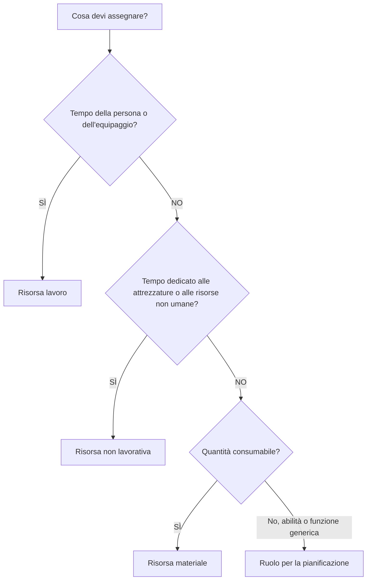

# Tipi di risorse in P6

Le risorse in Primavera P6 rappresentano le persone, le attrezzature e i materiali necessari per eseguire il lavoro. Collegano la pianificazione alla capacità, alla produttività, ai costi e alla domanda di risorse nel tempo.

Una pianificazione può esistere senza risorse, ma una pianificazione carica di risorse offre al team di progetto una visione più approfondita. Può mostrare istogrammi di manodopera, domanda di attrezzature, utilizzo di materiali, curve di costo, vincoli di risorse e possibili sovraccarichi. Per rendere utili tali informazioni, il pianificatore deve comprendere i diversi tipi di risorse disponibili in P6 e quando utilizzarli.

I principali tipi di risorse in P6 sono:

- Lavoro.
- Non lavoro.
- Materiale.

P6 utilizza anche i ruoli, che non sono esattamente la stessa cosa delle risorse ma sono strettamente correlati e molto utili durante la pianificazione.

## Perché il tipo di risorsa è importante

Il tipo di risorsa influisce sul modo in cui P6 gestisce unità, tariffe, costi, calendari e report.

Una risorsa lavoro si comporta diversamente da una risorsa materiale. Una gru non dovrebbe essere trattata allo stesso modo di un volume di cemento. Un ruolo di tecnico generico non è la stessa cosa di una risorsa di tecnico denominata. Se i tipi di risorse vengono mescolati in modo errato, gli istogrammi, i report sui costi, le revisioni della produttività e gli output del valore maturato possono diventare fuorvianti.

Il tipo di risorsa risponde a una domanda pratica: che tipo di cosa viene assegnata all'attività?

## Risorse di lavoro

Le risorse lavoro rappresentano persone o squadre. Di solito vengono misurati in ore, giorni o altre unità basate sul tempo. Le risorse manodopera possono avere tariffe, calendari, limiti di disponibilità e valori di costo.

Gli esempi includono:

- Pianificatore.
- Equipaggio civile.
- Elettricista.
- Equipaggio di saldatura.
- Ingegnere.
- Ispettore.
- Tecnico di messa in servizio.

Utilizzare le risorse di manodopera quando il cronoprogramma deve mostrare lo sforzo umano o la domanda di personale. Le risorse manodopera sono utili per gli istogrammi della manodopera, i piani del personale, l'analisi della produttività e la previsione del costo della manodopera.

Ad esempio, un'attività denominata "Installazione della passerella portacavi" potrebbe richiedere 4 elettricisti per 5 giorni. L'assegnazione delle risorse manodopera consente alla pianificazione di mostrare la domanda di elettricisti durante quel periodo.

Le risorse manodopera sono utili anche quando il progetto deve confrontare le ore di manodopera pianificate con le ore di manodopera effettive.

## Risorse non lavorative

Le risorse non legate alla manodopera rappresentano attrezzature o altri beni riutilizzabili non personali. Di solito sono basati sul tempo, come la manodopera, ma non sono risorse umane.

Gli esempi includono:

- Gru.
- Escavatore.
- Saldatrice.
- Apparecchiature di prova.
- Attrezzatura per l'equipaggio dell'impalcatura.
- Set di strumenti specializzati.
- Generatore.

Utilizzare risorse non legate alla manodopera quando la disponibilità delle attrezzature è importante o quando il costo delle attrezzature deve essere monitorato nel tempo.

Ad esempio, se un sollevamento pesante richiede una gru per due giorni, l'assegnazione di una risorsa gru che non sia manodopera aiuta il team di progetto a vedere la domanda di gru, evitare conflitti e prevedere i costi delle attrezzature.

Le risorse non legate alla manodopera sono importanti quando le attrezzature sono scarse, costose, condivise tra aree di lavoro o costituiscono un fattore determinante nella sequenza di lavoro.

## Risorse materiali

Le risorse materiali rappresentano articoli di consumo. Di solito vengono misurati in quantità piuttosto che in tempo.

Gli esempi includono:

- Metri cubi di cemento.
- Tonnellate di acciaio.
- Metri di cavi.
- Bobine di tubi.
- Valvole.
- Litri di rivestimento.
- Pannelli.

Utilizzare le risorse materiali quando la pianificazione deve tenere traccia del consumo basato sulla quantità o dei costi relativi ai materiali.

Le risorse materiali possono supportare le curve dei materiali, il monitoraggio della quantità e il caricamento dei costi. Sono particolarmente utili quando la pianificazione è collegata alle quantità installate o al valore maturato in base alle quantità.

Ad esempio, un'attività può includere 500 metri di installazione di cavi. Assegnare il cavo come risorsa materiale aiuta il team a tenere traccia della quantità installata pianificata ed effettiva nel tempo.

Le risorse materiali non devono essere utilizzate per rappresentare le ore di manodopera o il tempo impiegato per le attrezzature. Hanno uno scopo diverso.

## Ruoli

I ruoli sono funzioni lavorative generiche o categorie di competenze. Non sono la stessa cosa delle risorse, ma aiutano durante la pianificazione prima che le risorse denominate siano note.

Gli esempi includono:

- Ingegnere senior.
- Supervisore elettrico.
- Ispettore civile.
- Pianificatore.
- Responsabile della messa in servizio.
- Operatore di gru.

I ruoli sono utili nella pianificazione iniziale perché il progetto può sapere quale tipo di competenza è necessaria senza sapere esattamente chi eseguirà il lavoro.

Ad esempio, un'attività di ingegneria potrebbe richiedere 80 ore di impegno da "Ingegnere elettrico senior". Successivamente, quel ruolo può essere sostituito o integrato con una risorsa denominata.

Utilizza i ruoli quando:

- La pianificazione è ancora ad alto livello.
- Le risorse nominate non sono confermate.
- La domanda di risorse è necessaria per tipo di competenza.
- L'organizzazione vuole previsioni anticipate sul personale.

I ruoli dovrebbero essere rivisti man mano che il progetto matura. Se la pianificazione richiede un controllo dettagliato, potrebbe essere necessario sostituire i ruoli con risorse effettive.

## Calendari delle risorse

Le risorse possono avere calendari. Questo è importante perché la disponibilità delle risorse può differire dalla disponibilità dell'attività.

Ad esempio, un'attività di costruzione può utilizzare un calendario di attività di 6 giorni, ma lo specialista del fornitore assegnato potrebbe essere disponibile solo dal lunedì al venerdì. Se l'attività è Dipendente dalle risorse o viene utilizzato il livellamento delle risorse, il calendario delle risorse può influenzare la pianificazione.

Le risorse lavorative e non lavorative spesso necessitano di calendari perché le persone e le attrezzature sono disponibili solo in determinati orari. Le risorse materiali solitamente si comportano diversamente perché rappresentano quantità e non tempo di lavoro.

Quando le date delle risorse sembrano strane, controlla sia il calendario delle attività che il calendario delle risorse.

## Costi delle risorse

Le risorse possono comportare tassi di costo. Le risorse lavorative e non lavorative spesso utilizzano tariffe basate sul tempo. Le risorse materiali spesso utilizzano tariffe unitarie.

Per esempio:

- Elettricista: costo orario.
- Gru: costo orario o giornaliero.
- Calcestruzzo: costo al metro cubo.

Quando le risorse vengono assegnate alle attività, P6 può calcolare i costi preventivati, effettivi, rimanenti e al completamento.

Ciò è utile per pianificazioni con carico di costi, reporting sul valore maturato, previsioni sulle risorse e analisi del flusso di cassa. Ma funziona bene solo quando vengono mantenuti unità, tariffe, calendari e aggiornamenti sui progressi.

## Scegliere il giusto tipo di risorsa

Utilizzare Manodopera quando la risorsa è una persona, un gruppo o uno sforzo umano.

Utilizzare Non-manodopera quando la risorsa è un'attrezzatura o un bene riutilizzabile il cui tempo conta.

Utilizzare Materiale quando la risorsa è una quantità consumabile.

Utilizzare i ruoli durante la pianificazione in base alle competenze o alla funzione prima che le risorse denominate siano note.

La scelta dovrebbe riflettere il modo in cui il progetto intende pianificare, misurare e rendicontare il lavoro.

## Errori comuni

Un errore comune è utilizzare le risorse lavorative per qualsiasi cosa. Ciò può inizialmente facilitare il caricamento dei costi, ma riduce la chiarezza quando le quantità di attrezzature o materiali contano.

Un altro errore è utilizzare risorse materiali per voci che in realtà sono spese o subappaltare somme forfettarie. Se il progetto non necessita del monitoraggio della quantità, una spesa potrebbe essere più appropriata.

Un terzo errore è assegnare le risorse senza mantenere le unità effettive. Una pianificazione caricata di risorse è utile solo se gli aggiornamenti sull'avanzamento mantengono aggiornati i dati delle risorse.

Un altro problema è la confusione di ruoli e risorse. I ruoli sono utili per la pianificazione, ma le risorse denominate sono migliori quando contano assegnazioni dettagliate, calendari e dati effettivi.

## Buona pratica

Definire la strategia delle risorse prima di caricare la pianificazione.

Decidere quale lavoro utilizzerà risorse di manodopera, quale lavoro utilizzerà risorse non di manodopera, quali materiali necessitano di monitoraggio della quantità e dove invece dovrebbero essere utilizzate le spese.

Utilizzare convenzioni di denominazione e codici di risorsa coerenti. Mantieni pulito il dizionario delle risorse. Evita risorse duplicate con nomi leggermente diversi.

Esaminare le assegnazioni delle risorse durante ogni ciclo di aggiornamento. Unità, costi, calendari e valori effettivi dovrebbero rimanere allineati al processo di controllo di progetto.

## Conclusione

I tipi di risorse in P6 aiutano a definire ciò che è necessario per eseguire il lavoro. Le risorse di lavoro rappresentano le persone e gli equipaggi. Le risorse non lavorative rappresentano attrezzature e beni riutilizzabili. Le risorse materiali rappresentano quantità consumabili. I ruoli supportano la pianificazione in base alle competenze o alle funzioni prima che le risorse denominate siano note.

La scelta del tipo di risorsa corretto semplifica l'analisi della pianificazione. Migliora gli istogrammi della manodopera, la pianificazione delle attrezzature, il monitoraggio dei materiali, il caricamento dei costi, il valore maturato e il reporting delle previsioni.

Una buona pianificazione ricca di risorse non è solo una pianificazione con risorse allegate. Si tratta di una pianificazione in cui ciascun tipo di risorsa viene utilizzato intenzionalmente e mantenuto per tutta la durata del progetto.
## Contenuti correlati
- [Attività iniziate con lo 0% di progressi in Primavera P6 - Panoramica](../../11_metrics_it/13_activity_started_progress_zero/01_overview_template.md)
- [Dove vivono i costi in P6](../11_WHERE%20THE%20COST%20LIVE%20IN%20P6/11_WHERE%20THE%20COST%20LIVE%20IN%20P6.md)
- [Limiti delle risorse in P6](../13_RESOURCES%20LIMITS%20IN%20P6/13_RESOURCES%20LIMITS%20IN%20P6.md)
