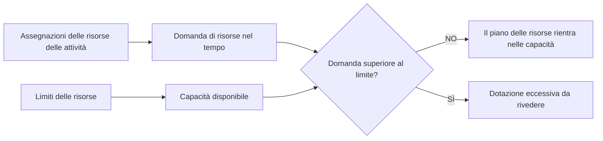

# Limiti delle risorse in P6

I limiti delle risorse in Primavera P6 definiscono la quantità di risorsa disponibile durante un periodo di tempo. Vengono utilizzati per confrontare la domanda di risorse creata dalle assegnazioni di attività con la capacità effettiva del progetto.

In termini semplici, un limite di risorse risponde alla domanda: quanta di questa risorsa può utilizzare il progetto?

Se un cronoprogramma dice che una squadra deve lavorare su cinque attività contemporaneamente, P6 può mostrare la domanda. Ma senza un limite di risorse, il cronoprogramma non può mostrare chiaramente se tale domanda sia realistica. Il limite è ciò che consente al pianificatore di vedere sovraccarichi, problemi di capacità e possibili problemi di pianificazione basati sulle risorse.

## Quali sono i limiti delle risorse

Un limite di risorse è la disponibilità massima di una risorsa. Può essere definito come unità per periodo di tempo, ad esempio ore al giorno, ore alla settimana o numero di unità disponibili durante un periodo lavorativo.

Per esempio:

- Un pianificatore disponibile 8 ore al giorno.
- Tre elettricisti disponibili 24 ore di lavoro al giorno.
- Una gru disponibile per 8 ore di attrezzatura al giorno.
- Due ispettori disponibili per 16 ore di lavoro al giorno.

Quando le attività vengono caricate come risorse, P6 calcola la domanda di risorse creata da tali assegnazioni. Il limite delle risorse fornisce la linea di capacità con cui viene confrontata la domanda.

## Perché i limiti delle risorse sono importanti

I limiti delle risorse sono importanti perché le pianificazioni sono spesso tecnicamente possibili ma praticamente impossibili.

Una rete logica può calcolare che diverse attività possano svolgersi in parallelo. Le date potrebbero sembrare accettabili. Il percorso critico può apparire ragionevole. Ma se tutte queste attività richiedono lo stesso equipaggio limitato, specialisti o attrezzature, il piano potrebbe non essere realizzabile.

I limiti delle risorse aiutano a evidenziare la differenza tra una pianificazione calcolata e una pianificazione consegnabile.

Sono utili per:

- Identificazione delle squadre di lavoro sovraccariche.
- Controllo della domanda di attrezzature.
- Supporto degli istogrammi delle risorse.
- Revisione dei piani di manodopera.
- Preparazione del livellamento delle risorse.
- Spiegare perché alcuni lavori non possono iniziare anche se la logica lo consente.
- Verificare se il piano corrisponde alla capacità disponibile.

Nei controlli di progetto, ciò è particolarmente utile quando la pianificazione viene utilizzata per il personale, il supporto all'approvvigionamento, la pianificazione della costruzione o il reporting del valore maturato.

## Limiti delle risorse di lavoro

I limiti di lavoro definiscono quante persone o ore di lavoro sono disponibili.

Ad esempio, se il progetto prevede 10 elettricisti che lavorano 8 ore al giorno, il limite di manodopera giornaliero potrebbe essere di 80 ore al giorno. Se la domanda di cronoprogramma mostra 120 ore-elettricisti nello stesso giorno, il cronoprogramma richiede più elettricisti di quanti ne richiede il progetto.

Ciò non significa automaticamente che il cronoprogramma sia sbagliato. Significa che il pianificatore deve rivedere il piano. La soluzione potrebbe essere l’aggiunta di personale, la modifica della sequenza, lo spostamento del lavoro non critico, l’utilizzo degli straordinari o l’accettazione di un picco temporaneo se realistico e approvato.

I limiti alle risorse lavorative sono utili quando la disponibilità di manodopera rappresenta un vincolo reale. Sono meno utili quando la pianificazione non viene mantenuta al livello di dettaglio necessario per supportare il controllo delle risorse.

## Limiti delle risorse non lavorative

I limiti non legati alla manodopera si applicano alle attrezzature e ad altri beni riutilizzabili.

Gli esempi includono gru, escavatori, apparecchiature di prova, strumenti specializzati, generatori o strutture temporanee. Se è disponibile una sola gru, le attività che richiedono la stessa gru non possono essere eseguite tutte contemporaneamente a meno che non venga aggiunta un'altra gru o il lavoro non venga risequenziato.

È qui che i limiti delle risorse possono essere molto pratici. Le attrezzature rappresentano spesso un vero e proprio vincolo, soprattutto quando sono costose, condivise tra aree, difficili da mobilitare o necessarie per lavori critici.

Ad esempio, due sollevamenti pesanti potrebbero essere entrambi logicamente pronti. Ma se entrambi necessitano della stessa gru, il limite delle risorse può dimostrare che il piano supera la capacità disponibile.

## Risorse materiali e limiti

Le risorse materiali si comportano diversamente dalle risorse lavoro e non lavoro. Di solito rappresentano quantità, non disponibilità giornaliera di orario di lavoro.

Un'assegnazione di materiale può mostrare il volume di calcestruzzo pianificato, la lunghezza del cavo, il tonnellaggio di acciaio o la quantità installata. Il progetto può ancora avere vincoli materiali, ma questi vengono spesso gestiti attraverso date di approvvigionamento, tappe di consegna, monitoraggio dell'inventario o vincoli nella pianificazione piuttosto che attraverso lo stesso tipo di limite di disponibilità giornaliera delle risorse utilizzato per persone o attrezzature.

Ciò non significa che i materiali non siano importanti. Ciò significa che il pianificatore dovrebbe fare attenzione a ciò che il limite dovrebbe rappresentare.

Se il problema riguarda la capacità produttiva, ad esempio il numero massimo di metri cubi di calcestruzzo che possono essere gettati al giorno, può essere utile una risorsa o un modello di produzione. Se il problema è se il materiale è arrivato, i legami logici o le tappe fondamentali dell'approvvigionamento potrebbero essere più chiari.

## Come P6 utilizza i limiti

P6 può utilizzare i limiti delle risorse nei profili delle risorse, nei fogli di calcolo, negli istogrammi e nell'analisi delle risorse. La domanda derivante dalle assegnazioni di attività può essere visualizzata rispetto al limite disponibile.

Quando viene utilizzato il livellamento delle risorse, P6 può anche utilizzare la disponibilità delle risorse per ritardare le attività in modo che la domanda rimanga entro i limiti, a seconda delle impostazioni di livellamento.

Questo è potente, ma deve essere gestito con attenzione. Il livellamento delle risorse può modificare le date di previsione. Se i limiti, i calendari, le priorità e la logica delle attività non sono ben mantenuti, il risultato livellato potrebbe sembrare matematico ma non pratico.

I limiti delle risorse dovrebbero quindi far parte di un processo di pianificazione controllato, non di un pulsante premuto alla fine di un aggiornamento.

## Quando utilizzare i limiti delle risorse

Utilizzare i limiti delle risorse quando le risorse sono veramente limitate e la pianificazione prevede risorse caricate con qualità sufficiente per supportare l'analisi.

I buoni casi d'uso includono:

- Un progetto con un numero fisso di equipaggi.
- Gru condivise o attrezzature specializzate.
- Specialisti limitati di ingegneria o messa in servizio.
- Arresti, turnaround e interruzioni.
- Piani di costruzione in cui i picchi di manodopera devono essere controllati.
- Cronoprogrammi in cui lo stesso pool di risorse supporta più progetti.

I limiti delle risorse sono utili anche durante l'analisi what-if. Il pianificatore può verificare se il piano attuale funziona con la capacità disponibile o se sono necessari ulteriori equipaggi, straordinari o risequenziamento.

## Quando fare attenzione

Fai attenzione quando i dati della risorsa sono incompleti o simbolici.

Se le risorse fossero aggiunte solo per il caricamento dei costi, le unità potrebbero non rappresentare la disponibilità reale. Se tutto il lavoro viene assegnato a risorse generiche, l'istogramma potrebbe essere troppo ampio per supportare decisioni reali. Se le unità effettive non vengono aggiornate, il piano delle risorse potrebbe rapidamente allontanarsi dalla realtà.

Fai attenzione anche ai limiti artificiali. Un limite troppo basso potrebbe creare inutili ritardi durante il livellamento. Un limite troppo elevato può nascondere reali problemi di capacità.

Il limite dovrebbe corrispondere alla vera domanda di pianificazione. Stiamo testando l’effettiva disponibilità dell’equipaggio, il personale preventivato, l’accesso alle attrezzature o un obiettivo gestionale? Ognuno potrebbe richiedere una configurazione diversa.

## Errori comuni

Un errore comune è stabilire limiti alle risorse senza concordare ciò che rappresentano. Una risorsa può indicare 80 ore al giorno, ma si tratta dell'equipaggio attuale, dell'equipaggio massimo, dell'equipaggio preventivato o dell'equipaggio promesso dall'appaltatore?

Un altro errore è utilizzare i risultati del livellamento senza esaminarli. P6 può spostare le attività in base alle regole delle risorse, ma il pianificatore deve comunque verificare se il risultato ha un senso costruttivo.

Un altro problema è ignorare i calendari. Un limite di risorse è legato alla disponibilità e la disponibilità dipende dall'orario di lavoro. Se il calendario delle risorse non corrisponde al modello di lavoro reale, il limite potrebbe produrre sovraccarichi fuorvianti o false disponibilità.

È anche comune sovraccaricare le risorse e accettare l'istogramma come se fosse solo un report. Un sovraccarico è un segnale di pianificazione. Dovrebbe innescare una revisione e non semplicemente essere ignorato.

## Buona pratica

Inizia con le risorse che contano di più. Non tutte le risorse necessitano di un limite dettagliato. Concentrati su squadre critiche, attrezzature scarse, specialisti chiave e risorse che influiscono sul completamento del progetto o sui traguardi principali.

Definire se il limite rappresenta la capacità normale, la capacità massima o la capacità di picco approvata. Mantieni coerente questa definizione.

Esaminare i profili delle risorse durante gli aggiornamenti della pianificazione. Se la previsione cambia, cambia anche la domanda di risorse. I limiti dovrebbero essere rivisti insieme alla logica, ai calendari, alle durate rimanenti e ai progressi.

Utilizzare attentamente il livellamento delle risorse e documentare le impostazioni. Confronta il risultato livellato con il cronoprogramma non livellato in modo che il team capisca cosa è cambiato e perché.

Ancora più importante, convalidare l'output con le persone che eseguono il lavoro. Un istogramma è utile solo se riflette un piano di risorse reale.

## Conclusione

I limiti delle risorse in P6 definiscono la capacità disponibile. Consentono al team di progetto di confrontare ciò che la pianificazione richiede con ciò che il progetto può realisticamente fornire.

Se ben utilizzati, i limiti delle risorse aiutano a identificare i sovraccarichi, supportare la pianificazione della manodopera, controllare la domanda di attrezzature e migliorare il realismo della pianificazione. Usati male, possono creare istogrammi fuorvianti o risultati di livellamento artificiale.

I migliori limiti delle risorse sono semplici, intenzionali e collegati a decisioni di progetto reali. Aiutano a rispondere a una domanda pratica: il progetto può eseguire questo piano con le risorse di cui effettivamente dispone?
## Contenuti correlati
- [Attività iniziate con lo 0% di progressi in Primavera P6 - Panoramica](../../metrics/13_activity_started_progress_zero/02_guide_template.md)
- [Tipi di risorse in P6](../12_RESOURCE%20TYPES%20IN%20P6/12_RESOURCE%20TYPES%20IN%20P6.md)
- [Bilanciamento delle risorse in P6](../14_RESOURCES%20BALANCING%20IN%20P6/14_RESOURCES%20BALANCING%20IN%20P6.md)
