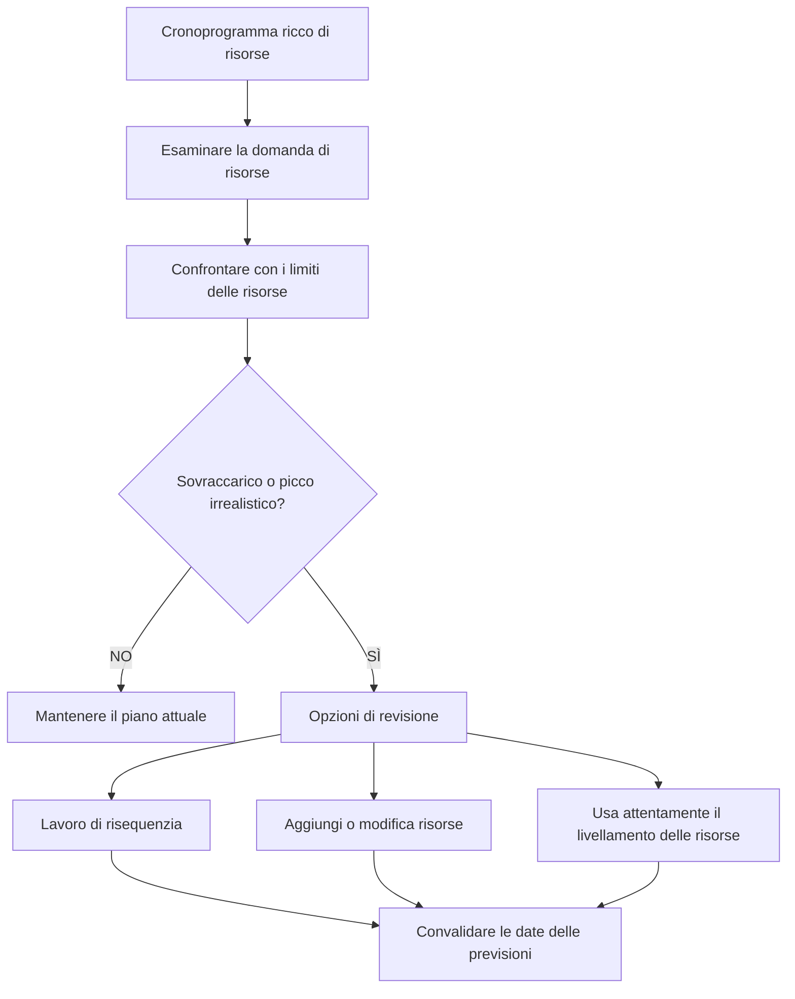

# Bilanciamento delle risorse in P6

Il bilanciamento delle risorse in Primavera P6 è il processo di revisione della domanda di risorse rispetto alla capacità disponibile e di adeguamento del piano in modo che il lavoro possa essere eseguito con le risorse disponibili. Aiuta il team di progetto a capire se la pianificazione è solo logicamente corretta o anche pratica dal punto di vista delle risorse.

Nella pianificazione quotidiana, le persone spesso usano le parole bilanciamento delle risorse e livellamento delle risorse come se significassero la stessa cosa. Sono correlati, ma non sono esattamente la stessa cosa.

Il bilanciamento delle risorse è la revisione della pianificazione più ampia. Comprende l'esame degli istogrammi, dei profili delle risorse, della disponibilità dell'equipaggio, della domanda di attrezzature, dei picchi di manodopera e del realismo del piano.

Il livellamento delle risorse è una funzionalità P6 che può spostare le attività in base alla disponibilità delle risorse e alle impostazioni di livellamento.

La funzionalità può essere utile, ma dovrebbe essere utilizzata con controllo. P6 può calcolare un risultato livellato, ma il pianificatore deve decidere se quel risultato ha senso per il progetto.

## Che cos'è il bilanciamento delle risorse

Il bilanciamento delle risorse pone una domanda pratica: il progetto può eseguire questa pianificazione con le risorse di cui effettivamente dispone?

Una pianificazione può avere una buona logica, date accettabili e un percorso critico ragionevole. Ma se è necessario che lo stesso equipaggio o le stesse attrezzature limitate lavorino in troppi posti contemporaneamente, il piano potrebbe non essere realistico.

Bilanciare le risorse significa rivedere tale domanda e decidere come gestirla.

Le azioni possibili includono:

- Spostamento di lavoro non critico.
- Aggiunta di risorse.
- Suddivisione del lavoro in diverse squadre o aree.
- Modifica della sequenza delle attività.
- Utilizzo degli straordinari o del lavoro a turni.
- Regolazione dei calendari.
- Aggiornamento dei limiti delle risorse.
- Accettare un picco temporaneo se è realistico e approvato.

L'obiettivo non è rendere l'istogramma perfettamente piatto. I progetti reali hanno picchi e valli. L'obiettivo è garantire che la domanda di risorse sia compresa, realizzabile e allineata al piano di esecuzione.

## Perché è importante

Il bilanciamento delle risorse è importante perché la pianificazione dovrebbe supportare l'esecuzione, non solo il calcolo.

Se il piano richiede 50 saldatori la prossima settimana ma l'appaltatore può fornirne solo 30, il cronoprogramma mostra una domanda che non può essere soddisfatta. Se due attività critiche richiedono la stessa gru contemporaneamente, almeno una di esse potrebbe dover essere spostata. Se tutte le attività di revisione tecnica richiedono lo stesso specialista, il collo di bottiglia potrebbe manifestarsi prima ancora che la costruzione abbia inizio.

Senza il bilanciamento delle risorse, il progetto potrebbe credere di avere più capacità di quella che in realtà ha.

Ciò può influenzare:

- Pianificazione preventiva a breve termine.
- Previsioni sulla manodopera.
- Pianificazione delle attrezzature.
- Credibilità del percorso critico.
- Previsioni sull'valore maturato.
- Curve di costo e di flusso di cassa.
- Impegni di progresso.
- Piani di recupero.

Il bilanciamento delle risorse aiuta a collegare la pianificazione CPM con la capacità reale del campo e dell'ufficio.

## Bilanciamento delle risorse e livellamento delle risorse

Il bilanciamento delle risorse è un’attività di gestione e pianificazione.

Il livellamento delle risorse è un calcolo di pianificazione.

Questa distinzione è importante. Un pianificatore può bilanciare manualmente le risorse rivedendo gli istogrammi e regolando la pianificazione in base alla conoscenza del progetto. Il livellamento delle risorse P6 può anche aiutare ritardando automaticamente le attività quando la domanda di risorse supera la disponibilità.

Entrambi gli approcci possono essere utili.

Il bilanciamento manuale è migliore quando lo schedulatore necessita di giudizio, input sul campo, revisione della costruibilità o controllo attento su quali attività si muovono.

Il livellamento delle risorse P6 è utile quando i dati delle risorse sono affidabili, i limiti delle risorse sono definiti, i calendari sono corretti e il pianificatore desidera verificare come cambia la pianificazione quando viene applicata la disponibilità delle risorse.

Il livellamento non dovrebbe sostituire il giudizio di pianificazione. Dovrebbe supportarlo.

## Di cosa ha bisogno P6 prima di livellare

Prima di utilizzare la funzionalità di livellamento delle risorse P6, la pianificazione deve essere pronta per l'analisi delle risorse.

Come minimo controlla:

- Le attività hanno assegnazioni di risorse significative.
- Le unità di risorse riflettono la domanda reale.
- I limiti delle risorse riflettono la disponibilità reale.
- I calendari delle risorse sono corretti.
- I calendari delle attività sono corretti.
- La logica è sufficientemente completa da supportare le decisioni di pianificazione.
- I vincoli sono compresi.
- Le priorità vengono definite o riviste.
- La pianificazione corrente è stata salvata in modo da poter confrontare il risultato livellato.

Se questi elementi sono deboli, il livellamento potrebbe produrre un risultato che sembra preciso ma non è utile.

Ad esempio, se tutta la manodopera di costruzione viene assegnata a una risorsa generica "squadra di costruzione", P6 potrebbe mostrare un sovraccarico di risorse, ma il risultato potrebbe non indicare al progetto se il problema è civile, di tubazioni, elettrico o meccanico. L'impostazione delle risorse deve corrispondere alla decisione di pianificazione.

## Come P6 utilizza il livellamento delle risorse

Il livellamento delle risorse P6 esamina le assegnazioni e la disponibilità delle risorse. A seconda delle impostazioni, potrebbe ritardare le attività volte a ridurre o eliminare la sovraallocazione delle risorse.

Il calcolo può prendere in considerazione i limiti delle risorse, la logica dell'attività, il margine, i calendari, le priorità e le opzioni di livellamento. Il risultato esatto dipende da come è configurato il progetto.

In termini pratici, P6 cerca situazioni in cui la domanda di risorse è superiore alla disponibilità e quindi tenta di spostare le attività in date in cui le risorse sono disponibili.

Ciò può creare una pianificazione più fattibile in termini di risorse, ma può anche modificare il percorso critico, ritardare le tappe fondamentali o spostare il lavoro in modi che necessitano di revisione.

Dopo il livellamento, il pianificatore dovrebbe confrontare il risultato con la previsione originale:

- Quali attività si sono spostate?
- Quali traguardi sono cambiati?
- Il percorso critico è cambiato?
- Il livellamento ha utilizzato il margine disponibile o ha ritardato la conclusione del progetto?
- Le nuove date sono costruibili?
- Il risultato ha risolto il problema delle risorse o ne ha creato un altro?

Il cronoprogramma livellato non dovrebbe essere accettato ciecamente.

## Quando utilizzare il bilanciamento delle risorse

Utilizzare il bilanciamento delle risorse ogni volta che la disponibilità delle risorse influisce sull'esecuzione.

È particolarmente utile in:

- Cronoprogrammi di costruzione con limitazioni dell'equipaggio.
- Arresti, turnaround e interruzioni.
- Piani di messa in servizio con specialisti limitati.
- Pianificazioni ingegneristiche con revisori condivisi.
- Progetti con attrezzature costose o condivise.
- Cronoprogrammi in cui un pool di risorse supporta più progetti.
- Piani di risanamento in cui vengono prese in considerazione risorse aggiuntive.

Il bilanciamento delle risorse è utile anche prima dell'approvazione della baseline. Una baseline che presuppone una disponibilità irrealistica di manodopera o attrezzature potrebbe diventare difficile da difendere in seguito.

Durante gli aggiornamenti, il bilanciamento delle risorse aiuta a confermare se il lavoro rimanente può ancora essere consegnato con il team e le attrezzature attuali.

## Quando fare attenzione

Fare attenzione quando i dati delle risorse non vengono mantenuti.

Se le unità effettive non vengono aggiornate, le curve delle risorse potrebbero allontanarsi dalla realtà. Se le risorse vengono assegnate solo per il caricamento dei costi, le unità potrebbero non rappresentare la capacità reale. Se i calendari sono sbagliati, anche la disponibilità delle risorse potrebbe essere sbagliata.

Prestare inoltre attenzione quando si utilizza il livellamento delle risorse in base a una pianificazione contrattuale o di base. Il livellamento può spostare le date e influenzare il margine. Il team dovrebbe capire se la pianificazione livellata è il piano ufficiale, uno scenario ipotetico o una visione di pianificazione interna.

Il livellamento può anche nascondere le debolezze logiche. Se un'attività si sposta a causa del livellamento, i revisori potrebbero non notare che la logica originale era incompleta o errata. Esamina sempre prima la logica, poi le risorse.

## Come usarlo nella pratica

Inizia identificando le risorse che contano di più. Non cercare di bilanciare ogni risorsa minore con lo stesso livello di dettaglio. Concentrarsi su squadre chiave, specialisti critici, attrezzature condivise e risorse che potrebbero influenzare i traguardi raggiunti.

Quindi rivedere il profilo o l'istogramma della risorsa in P6. Cerca picchi, sovraccarichi, lacune e cambiamenti improvvisi nella domanda.

Confrontare la domanda con i limiti delle risorse. Se la domanda supera il limite, discutere il problema con il team responsabile. La risposta potrebbe essere operativa, non solo di programmazione.

Successivamente, decidi il metodo di correzione:

- Se il limite delle risorse è errato, aggiorna il limite delle risorse.
- Se la richiesta di risorse è errata, correggere l'assegnazione.
- Se la sequenza non è realistica, modifica la logica o i tempi dell'attività.
- Se il sovraccarico è reale, decidi se aggiungere risorse, utilizzare gli straordinari, spostare il lavoro o accettare il picco.
- Se il livellamento automatico è appropriato, eseguilo come uno scenario controllato e confronta il risultato.

Conservare una copia della pianificazione non livellata prima di eseguire il livellamento delle risorse. Questo dà al team un punto di riferimento e aiuta a spiegare cosa è cambiato.

## Buona pratica

Utilizzare il bilanciamento delle risorse come parte della revisione della pianificazione, non come un esercizio di pulizia una tantum.

Esaminare le curve delle risorse durante lo sviluppo di base, le principali riprevisioni, la pianificazione del ripristino e i cicli di aggiornamento regolari.

Non livellare un cronoprogramma di scarsa qualità e aspettarti che il risultato diventi affidabile. Per prima cosa correggi la logica, i calendari, lo stato delle attività, le durate rimanenti e le assegnazioni delle risorse.

Impostazioni di livellamento del documento quando viene utilizzata la funzione P6. Il livellamento delle risorse può produrre risultati diversi a seconda delle opzioni selezionate, quindi le impostazioni fanno parte della registrazione della pianificazione.

Ancora più importante, convalidare il piano delle risorse con le persone proprietarie del lavoro. Il team di progetto dovrebbe verificare se i picchi di risorse sono raggiungibili, se la sequenza è praticabile e se sono effettivamente disponibili risorse aggiuntive.

## Conclusione

Il bilanciamento delle risorse in P6 aiuta il team di progetto a verificare se la pianificazione può essere eseguita con le risorse disponibili. Collega date e logiche con manodopera, attrezzature, disponibilità specialistica e reale capacità produttiva.

Il livellamento delle risorse P6 può supportare questa revisione spostando le attività in base alla disponibilità delle risorse, ma dovrebbe essere utilizzato con attenzione e rivisto dopo il calcolo.

Un cronoprogramma equilibrato non è necessariamente un cronoprogramma perfettamente regolare. Si tratta di una pianificazione in cui la domanda di risorse è visibile, realistica e allineata al modo in cui il progetto verrà effettivamente consegnato.
## Contenuti correlati
- [Attività iniziate con lo 0% di progressi in Primavera P6 - Panoramica](../../11_metrics_it/13_activity_started_progress_zero/01_overview_template.md)
- [Limiti delle risorse in P6](../13_RESOURCES%20LIMITS%20IN%20P6/13_RESOURCES%20LIMITS%20IN%20P6.md)
- [Relazioni SS e FF](../15_SS%20&%20FF%20RELATIONS/15_SS%20&%20FF%20RELATIONS.md)
