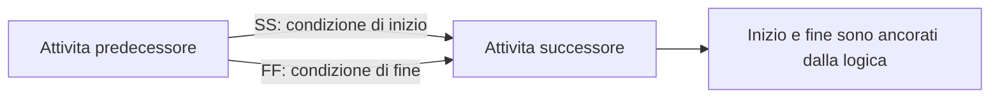

# Relazioni SS e FF

Le relazioni Start-to-Start (SS) e Finish-to-Finish (FF) sono tipi di logica validi in Primavera P6. Sono utili quando due attivita si sovrappongono e il cronoprogramma deve rappresentare questa sovrapposizione meglio di una semplice relazione Finish-to-Start.

Il problema non è SS o FF in sé. Il problema nasce quando vengono usate da sole in attività che devono essere controllate a entrambe le estremità. Una relazione SS controlla l'inizio del successore, ma non la sua fine. Una relazione FF controlla la fine del successore, ma non il suo inizio. Per questo molti pianificatori le chiamano mezze relazioni quando non sono accompagnate da logica complementare.

## Cosa Significano SS e FF

Una relazione SS indica che il successore puo iniziare quando inizia il predecessore, oppure dopo un lag definito dall'inizio del predecessore.

Una relazione FF indica che il successore puo finire quando finisce il predecessore, oppure dopo un lag definito dalla fine del predecessore.

Entrambe possono rappresentare lavoro reale. Una revisione di ingegneria puo iniziare dopo l'avvio della produzione del disegno. I test possono finire solo quando l'installazione e completata. Nella costruzione per aree, una squadra puo iniziare dopo un'altra, ma anche la fine deve essere controllata.

## Perche Una SS Singola Puo Essere Incompleta

Una SS singola ancora solo l'inizio del successore. Non spiega cosa controlla la fine del successore.

Se la durata del successore cambia, o se l'attivita si estende oltre il realistico, il cronoprogramma potrebbe non mostrare correttamente l'impatto a meno che una logica a valle lo catturi. L'inizio e collegato, ma la fine puo restare libera.

In P6 questo puo far sembrare il cronoprogramma piu connesso di quanto sia realmente.

## Perche Una FF Singola Puo Essere Incompleta

Una FF singola crea il problema opposto. Ancora la fine del successore, ma non spiega quando il successore puo iniziare.

Questo puo far calcolare l'early start troppo indietro, soprattutto in un cronoprogramma aggiornato. L'attivita puo sembrare pronta a iniziare alla data di aggiornamento, o anche prima, non perche il lavoro sia davvero pronto, ma perche la condizione di inizio non e stata definita.

Questo puo distorcere margine, percorso critico e pianificazione di breve periodo.

## La Coppia SS + FF

Quando il lavoro si sovrappone davvero, il modello piu solido e spesso una coppia SS + FF.

La SS controlla quando il successore puo iniziare. La FF controlla quando il successore puo finire. Insieme definiscono l'inviluppo logico del lavoro sovrapposto.

Questo e utile per lavori continui, costruzione per aree, cicli di progettazione e revisione, installazione e test, o sequenze ripetitive.

## Quando Una SS o FF Singola Puo Essere Accettabile

Non ogni SS o FF isolata e automaticamente sbagliata.

Una SS singola puo essere accettabile se la fine del successore e controllata da un'altra relazione valida a valle. Una FF singola puo essere accettabile se l'inizio del successore e controllato da un altro predecessore valido. La domanda chiave e se entrambe le estremita dell'attivita sono controllate da qualche parte nella rete.

Il pianificatore deve poter spiegare perché la relazione singola è sufficiente.

## Come Revisionare in P6

In P6, revisionare le attivita con predecessori SS, successori SS, predecessori FF e successori FF. Prestare particolare attenzione alle attivita il cui unico predecessore e FF o il cui unico successore e SS.

Campi utili includono ID attività, nome attività, Inizio, Fine, stato attività, margine totale, predecessori, successori, tipo di relazione, ritardo, vincoli e relazione determinante quando disponibile.

Chiedere:

- Cosa permette a questa attivita di iniziare?
- Cosa controlla la sua fine?
- La sovrapposizione e reale fisicamente o contrattualmente?
- Il lag nasconde dettaglio mancante?
- La relazione spiega il piano di esecuzione?
- Un reviewer indipendente capirebbe la logica?

## Problemi Comuni

Un problema comune e usare SS per anticipare il lavoro senza modellare la vera condizione che permette la sovrapposizione.

Un altro problema e usare FF per mantenere una data di fine lasciando aperto l'inizio.

SS e FF vengono anche usate quando il lavoro avrebbe dovuto essere scomposto in attività più piccole. Se un'attività è troppo ampia, il pianificatore può forzare il risultato con relazioni invece di modellare passaggi più chiari.

## Buone Pratiche

Usare SS e FF con intenzione. Devono rappresentare una sequenza reale, non una comodita del cronoprogramma.

Quando si usa SS, confermare che anche la fine del successore sia controllata logicamente. Quando si usa FF, confermare che anche l'inizio del successore sia controllato logicamente.

Usare coppie SS + FF per lavori sovrapposti quando inizio e fine devono essere collegati. Documentare le eccezioni quando una SS o FF singola e deliberata e difendibile.

## Conclusione

SS e FF sono strumenti utili in P6, ma richiedono disciplina. Usate da sole, possono creare logica incompleta controllando solo un'estremita dell'attivita.

Un cronoprogramma CPM affidabile deve spiegare perche il lavoro puo iniziare e cosa ne controlla la fine. Quando SS e FF aiutano a rispondere a queste domande, rafforzano il cronoprogramma. Quando lasciano aperta un'estremita, creano logica debole da revisionare.
## Contenuti correlati
- [Attività che iniziano alla data di aggiornamento senza alcuna logica guida: perché questa metrica di pianificazione è importante - Panoramica](../../metrics/01_activities_starting_in_dd_with_no_logic_driving/02_guide_template.md)
- [Bilanciamento delle risorse in P6](../14_RESOURCES%20BALANCING%20IN%20P6/14_RESOURCES%20BALANCING%20IN%20P6.md)
- [CPM (Metodo del percorso critico)](../16_CPM%20(CRITICAL%20PATH%20METHOD)/16_CPM%20(CRITICAL%20PATH%20METHOD).md)
