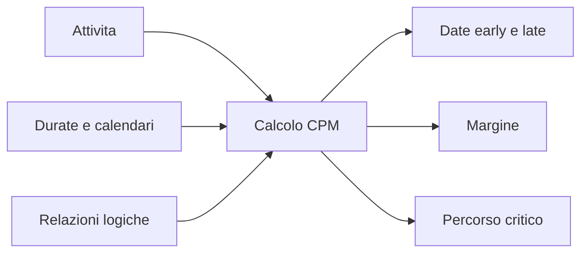

# CPM (Metodo del percorso critico)

Il Metodo del percorso critico, o CPM, è il metodo di calcolo alla base di un cronoprogramma di progetto solido. Trasforma una lista di attività in un modello guidato dalla logica che risponde a domande fondamentali: quando può finire il progetto, quali attività controllano quella data e dove il cronoprogramma ha flessibilità.

In Primavera P6, il CPM è spesso nascosto dietro il pulsante di calcolo del cronoprogramma. Il software calcola date, margine e attività critiche molto rapidamente. Ma il metodo resta importante. Se il pianificatore non capisce il CPM, il cronoprogramma può essere calcolato, ma il risultato può non significare ciò che il team pensa.

## Cosa Fa il CPM

Il CPM calcola la durata del progetto da una rete di attivita, durate, calendari e relazioni.

L'idea centrale e semplice: la durata del progetto non e la somma di tutte le attivita. E la durata del percorso collegato piu lungo di lavoro dipendente nella rete. Quel percorso e il percorso critico.

Se un'attivita su quel percorso ritarda, la fine del progetto ritarda, a meno che il team recuperi tempo sullo stesso percorso.

## Input Necessari

Il CPM dipende dalla qualita della rete del cronoprogramma.

Prima di tutto, il cronoprogramma ha bisogno di attivita che rappresentino parti chiare del lavoro. Ogni attivita deve avere scope definito, durata ragionevole e criterio chiaro di completamento.

Secondo, ogni attività richiede una durata. Nella maggior parte dei cronoprogrammi P6, questa è una stima deterministica basata su produttività, risorse, calendari e assunzioni di esecuzione.

Terzo, le attivita richiedono logica. Le relazioni definiscono cosa deve avvenire prima, cosa puo procedere in parallelo e quali condizioni permettono a un successore di iniziare o finire.

Il CPM non sa se la logica e buona. Calcola con la logica che riceve. Se la rete contiene logica mancante, vincoli deboli, lag eccessivo o relazioni SS/FF incomplete, il risultato puo essere matematicamente corretto ma poco affidabile nella pratica.

## Forward Pass e Backward Pass

Il CPM calcola il cronoprogramma con due passaggi principali.

Il forward pass va dalla data di aggiornamento verso la fine del progetto. Calcola le date piu precoci in cui ogni attivita puo iniziare e finire, in base a logica, durate, calendari e vincoli.

Queste sono Early Start e Early Finish.

Il backward pass va dalla fine del progetto verso l'inizio. Calcola le date piu tarde in cui ogni attivita puo iniziare e finire senza ritardare la conclusione del progetto o il target selezionato.

Queste sono Late Start e Late Finish.

Con date early e late, P6 calcola il margine.

## Margine

Il margine e il tempo per cui un'attivita puo muoversi prima di influenzare un obiettivo definito del cronoprogramma.

margine totale e di solito il valore principale rivisto in P6. Mostra quanto un'attivita puo ritardare prima di influenzare la fine del progetto o il percorso controllante.

margine libero e piu locale. Mostra quanto un'attivita puo ritardare senza influenzare l'early start del successore immediato.

Il margine non e tempo libero da consumare senza controllo. E flessibilita del cronoprogramma. Quando il margine viene consumato, il progetto ha meno protezione contro ritardi futuri.

## Percorso critico

Il percorso critico è il percorso collegato più lungo di attività dipendenti che controlla la conclusione del progetto. In molti cronoprogrammi, le attività critiche sono identificate da margine totale zero o negativo, ma la revisione migliore è capire il percorso più lungo e confermare se ha senso.

Un buon percorso critico deve raccontare una storia di esecuzione credibile. Deve passare attraverso attivita che controllano davvero la conclusione: rilasci di ingegneria, approvvigionamento, sequenze di costruzione, test, messa in servizio, consegna o altri driver reali.

Se il percorso critico passa da milestones strani, vincoli inutili, logica mancante o attivita che non controllano davvero la fine, il cronoprogramma puo inviare un falso segnale.

## Lavoro quasi critico

Il team non deve guardare solo le attivita con margine zero.

Le attivita quasi critico hanno poco margine e possono diventare critiche con un ritardo moderato. La soglia dipende da dimensione e sensibilita del progetto. Nei grandi progetti, attivita con meno di 10 o 20 giorni lavorativi di margine possono richiedere controllo ravvicinato.

I percorsi quasi critico contano perche il rischio raramente resta su una sola linea. Durante costruzione densa, messa in servizio o shutdown, diversi percorsi possono essere vicini alla criticita.

## CPM e Analisi del Rischio

Il CPM fornisce una risposta deterministica: se ogni attivita richiede la durata pianificata, questa e la data di fine del progetto.

L'analisi del rischio del cronoprogramma va oltre. Verifica l'incertezza applicando intervalli o distribuzioni probabilistiche alle durate ed eseguendo molte simulazioni. Aiuta a stimare la probabilità di finire entro una data obiettivo.

Ma l'analisi del rischio dipende dalla rete CPM. Se la logica e debole, anche l'output del rischio sara debole. Monte Carlo non corregge logica mancante, durate irrealistiche o cattiva struttura.

## CPM in Primavera P6

P6 rende rapido il calcolo CPM, ma questa velocita puo nascondere le assunzioni.

Quando il cronoprogramma è calcolato, P6 usa data di aggiornamento, calendari, durate, relazioni, vincoli, dati consuntivi, durate residue e opzioni di calcolo. Piccoli cambiamenti in queste impostazioni possono cambiare margine, percorso critico e date di previsione.

Per questo il pianificatore non deve solo premere F9 e accettare il risultato. Deve rivedere cosa è stato calcolato e verificare se corrisponde al piano reale di esecuzione.

## Buone Pratiche

Costruire la rete CPM dalla logica reale di esecuzione. Evitare di aggiungere relazioni solo per passare un controllo o produrre una data desiderata.

Rivedere il percorso critico dopo ogni aggiornamento. Confermare che inizio e fine abbiano senso per lo stato attuale del progetto.

Monitorare il movimento del margine nel tempo. Un progetto puo sembrare in linea mentre consuma margine silenziosamente.

Rivedere i percorsi quasi critico. Spesso mostrano dove apparira il prossimo problema di cronoprogramma.

Mantenere il cronoprogramma abbastanza pulito da supportare il CPM. Open starts, open finishes, hard vincoli, lag eccessivo e relazioni incomplete riducono il valore del calcolo.

## Conclusione

Il CPM e il motore che trasforma un cronoprogramma Primavera P6 in uno strumento di controllo di progetto. Calcola date early, date late, margine e percorso critico dalla rete di attivita.

Ma il CPM e affidabile quanto il cronoprogramma che calcola. Buone attivita, durate realistiche, calendari corretti e logica forte rendono il risultato significativo.

Il valore del CPM non e solo mostrare una data finale. Il suo vero valore e spiegare perche quella data e controllata, dove esiste flessibilita e dove deve concentrarsi l'attenzione del gestione.
## Contenuti correlati
- [Percorso critico o percorso del margine che inizia con un vincolo - Panoramica](../../metrics/09_cp_or_float_path_starting_with_constraint/02_guide_template.md)
- [Relazioni SS e FF](../15_SS%20&%20FF%20RELATIONS/15_SS%20&%20FF%20RELATIONS.md)
- [Sviluppare un Cronoprogramma di Progetto](../17_DEVELOPE%20A%20PROJECT%20SCHEDULE/17_DEVELOPE%20A%20PROJECT%20SCHEDULE.md)
