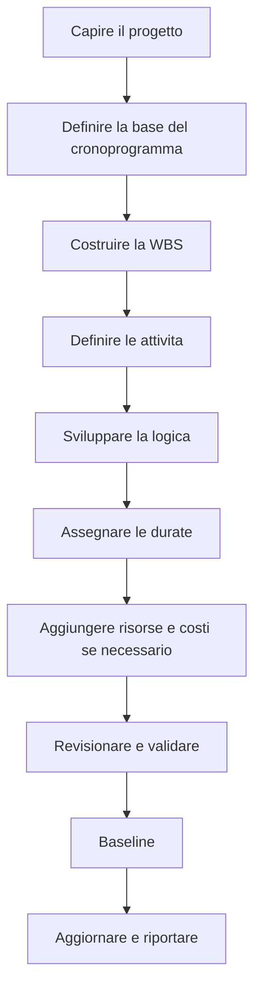

# Sviluppare un Cronoprogramma di Progetto

Sviluppare un cronoprogramma di progetto da zero non significa solo inserire attivita in Primavera P6. Significa trasformare scope, strategia di esecuzione, vincoli, risorse e impegni del progetto in un modello temporale che possa essere revisionato, approvato, aggiornato e usato per decisioni.

Un buon cronoprogramma viene costruito prima di essere calcolato. La qualita del file P6 dipende dal ragionamento fatto prima di inserire la prima attivita.

## Flusso di Sviluppo

## Capire Prima il Progetto

Non iniziare in P6 prima di capire il progetto.

Revisionare contratto, ambito dei lavori, specifiche, milestone principali, strategia di esecuzione, vincoli di approvvigionamento, permessi, accessi e requisiti di consegna. Poi parlare con gestione di progetto, ingegneria, approvvigionamento, costruzione, messa in servizio, subappaltatori e fornitori quando necessario.

Il cronoprogramma è un modello di come il team intende consegnare il progetto. Se il pianificatore non capisce questa intenzione, il cronoprogramma sarà costruito su assunzioni.

## Definire la Base del Cronoprogramma

La scheduling basis spiega come sara costruito il cronoprogramma. Deve definire WBS, calendari, codici, livello di dettaglio, regole delle relazioni, politica di lag, impostazioni P6, convenzione data di aggiornamento, reporting e approccio baseline.

Questo documento e importante perche spiega perche il cronoprogramma e costruito cosi. Fornisce anche un riferimento per revisioni di qualita e confronti futuri.

## Costruire la WBS

La Work Breakdown Structure e il quadro organizzativo del cronoprogramma. Deve riflettere come il progetto sara gestito e riportato.

La WBS puo essere organizzata per fase, area, sistema, disciplina, deliverable, pacchetto contrattuale o combinazione. Deve supportare filtri, misurazione del progresso, responsabilita e reporting.

Se la WBS non corrisponde al modo in cui il progetto e controllato, il cronoprogramma sara difficile da usare anche se le attivita sono corrette.

## Definire le Attivita

Le attivita devono rappresentare parti chiare e misurabili del lavoro. Ogni attivita deve avere scope definito, condizione chiara di inizio, condizione chiara di fine e un responsabile.

Attivita troppo grandi sono difficili da aggiornare. Attivita troppo piccole rendono il cronoprogramma difficile da mantenere. Il giusto livello di dettaglio dipende da fase, contratto, reporting e aspettative di controllo.

I nomi delle attivita contano. Un buon nome deve dire quale lavoro viene fatto, dove viene fatto e a quale oggetto, sistema o consegnabile si riferisce.

## Sviluppare la Logica

La logica e il cuore del cronoprogramma CPM. Definisce cosa deve accadere prima, cosa puo accadere in parallelo e quale condizione permette a ogni attivita di iniziare o finire.

La logica deve essere sviluppata con le persone che conoscono il lavoro. In P6, evitare di costruire la sequenza solo alla scrivania. Revisionarla con responsabili di disciplina, responsabili della costruzione, messa in servizio, approvvigionamento e subappaltatori.

Usare FS quando rappresenta meglio il lavoro. Usare SS e FF con cautela quando la sovrapposizione e reale. Evitare negative lag ed evitare SF salvo motivo chiaro e approvato. Ogni attivita normalmente deve avere predecessor e successor, eccetto milestones validi di inizio e fine progetto.

## Assegnare le Durate

Le durate devono essere realistiche, non aspirazionali. Devono basarsi su ambito, produttività, risorse, calendari, input dei fornitori, subappaltatori ed esperienza comparabile.

Una durata non e solo un numero. Assume una squadra, un tasso di produzione, un calendario, una condizione di accesso e un metodo di esecuzione. Se queste assunzioni cambiano, anche la durata puo cambiare.

Documentare le assunzioni importanti di durata. Questo aiuta revisioni, aggiornamenti, gestione delle modifiche e analisi dei ritardi.

## Aggiungere Risorse e Costi

Se il cronoprogramma sara usato per resource planning, cost loading, earned value o cash flow, risorse e costi devono essere aggiunti con cura.

Resource loading aiuta a vedere domanda di manodopera, equipment, materiali e possibili sovraccarichi. Cost loading collega il cronoprogramma a budget, previsiones e curve di pagamento o progresso.

Non aggiungere risorse solo per apparenza. Se il progetto usera quei dati, devono essere mantenuti durante gli aggiornamenti.

## Revisionare e Validare

Prima dell'approvazione baseline, il cronoprogramma deve essere revisionato tecnicamente e operativamente.

Controllare open starts, open finishes, tipi di relazione, lags, vincoli, long durations, logica mancante, distribuzione del margine e ragionevolezza del percorso critico. I controlli tipo DCMA sono utili, ma richiedono giudizio di progetto.

Percorrere il cronoprogramma con il team. Chiedere se logica, durate, risorse e milestones coincidono con il piano reale di esecuzione. Un cronoprogramma che passa le metriche ma fallisce la revisione sul campo non e pronto.

## Stabilire la Baseline

Dopo revisione e approvazione, il cronoprogramma diventa baseline. La baseline è il riferimento per misurare avanzamento, varianze, ritardi, recupero e prestazioni.

La baseline deve essere formale. Salvare la versione approvata, proteggerla da modifiche non controllate e documentare le approvazioni. Le modifiche successive devono seguire il controllo delle modifiche.

Una baseline che cambia ogni volta che il progetto ritarda non e una baseline. E un target mobile.

## Stabilire il Ciclo di Aggiornamento

Il cronoprogramma resta utile solo se viene aggiornato in modo consistente.

Definire chi fornisce l'avanzamento, quando i dati sono raccolti, quali evidenze servono, come vengono verificate le date effettive, come si revisionano le durate residue e quali report vengono emessi. Costruzione e messa in servizio attive possono richiedere aggiornamenti settimanali o bisettimanali. Le fasi iniziali possono essere mensili.

Il ciclo di aggiornamento trasforma la baseline da documento statico a strumento vivo di controllo.

## Conclusione

Sviluppare un cronoprogramma di progetto è un processo strutturato. Capire il progetto, definire la base, costruire la WBS, creare attività, sviluppare logica, assegnare durate, caricare risorse quando necessario, validare, definire la baseline e mantenere il cronoprogramma con aggiornamenti.

I migliori cronoprogrammi non nascono aprendo P6 in fretta. Nascono capendo il lavoro, sfidando le assunzioni e creando un modello di cui il team possa fidarsi.
## Contenuti correlati
- [Attività che iniziano alla data di aggiornamento senza alcuna logica guida: perché questa metrica di pianificazione è importante - Panoramica](../../metrics/01_activities_starting_in_dd_with_no_logic_driving/02_guide_template.md)
- [CPM (Metodo del percorso critico)](../16_CPM%20(CRITICAL%20PATH%20METHOD)/16_CPM%20(CRITICAL%20PATH%20METHOD).md)
- [codici attività](../18_ACTIVITY%20CODES/18_ACTIVITY%20CODES.md)
